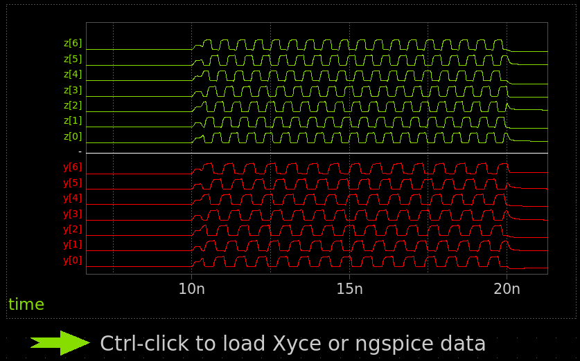

# 19 Nov 2023

| Previous journal: | Next journal: |
|-|-|
| [**0173**-2023-11-18.md](./0173-2023-11-18.md) | [**0175**-2023-11-20.md](./0175-2023-11-20.md) |

# sky130 analog simulation with xschem

Based on Stefan's Jan 2023 video "[Analog simulation with xschem and the skywater 130nm Process Development Kit (PDK)](https://www.youtube.com/watch?v=bYbkz8FXnsQ)"...

See also: [Xschem tutorials](https://xschem.sourceforge.io/stefan/xschem_man/xschem_man.html#:~:text=remote%20interface%20specification-,TUTORIALS,-Step%20by%20step): Lots of videos, etc.

I already have:

```
$ ngspice --version
ngspice compiled from ngspice revision 31

$ xschem --version
XSCHEM V3.4.5

$ magic --version
8.3.331

$ ls -l ~/.xschem/
-rw-rw-r-- 1 zerotoasic zerotoasic 22187 Nov 18 23:58 xschemrc
```

Steps:

1.  Install `xterm` and `gvim`:
    ```bash
    sudo apt install vim-gtk3 xterm
    ```
    The default terminal and editor can be specified in `~/anton/sky130_example/xschemrc`
1.  Per [this](https://xschem.sourceforge.io/stefan/xschem_man/tutorial_xschem_sky130.html#:~:text=sudo%20make%20install-,IMPORTANT!!,-You%20need%20to):
    ```bash
    mkdir ~/.xschem/simulations
    cat >>~/.xschem/simulations/.spiceinit <<EOH
    set ngbehavior=hsa
    set ng_nomodcheck
    EOH
    ```
    >   This file sets some default behavior for reading .lib files and speeds up loading pdk model files.
2.  Go into `~/anton/sky130_example` and run `xschem`
3.  From the welcome page, select `test_inv` and press `e` on the keyboard to go into it.
4.  Click the 'Netlist' button in the top-right corner (or just press the `n` key). Result:
    ```
    $ ls -l ~/.xschem/simulations/*.spice
    -rw-rw-r-- 1 zerotoasic zerotoasic 3308 Nov 19 21:27 /home/zerotoasic/.xschem/simulations/test_inv.spice
    ```
5.  Go to `Simulation => Configure simulators and tools`:
    *   For `spice` ensure `Ngspice interactive` is selected.
    *   For `spicewave` ensure `Gaw viewer` is selected.
6.  Exit the config and click `Simulate` button in top-right corner. This should pop up a window running ngspice for a while.
7.  Data is shown in the terminal. Ctrl-click the button under the graph area in xschem to load and graph the results:
    


# Next steps

*   Create [hierarchical](https://www.youtube.com/watch?v=q3ZcpSkVVuc&t=1705s) design:
    *   Voltage divider that ranges from 0.0V to 0.7V from 1.8V source: High-side resistance is 61.111%, low-side is 38.889% divided into (say) 8 steps, with 0.0V being the lowest.
        *   Example using 0.7um-wide resistors, and trying to cap to 70uA (i.e. 100uA per 1um width):
            *   1.8/7e-5 => 25.714k-ohm total resistance.
            *   High side resistance therefore is: 15714k-ohm; at 48.2 ohms per square, we need 326 squares. At 0.7um width, this is 228.21um length.
            *   Low-side total is: 10k-ohm
            *   Divide the low side by 7 resistors (~1429-ohm each): 29.647 squares each, or 20.753um
    *   Tap transistors with common output.
*   Watch other videos from [0173](./0173-2023-11-18.md)


# Notes

*   ngspice on MPW8 VM is a bit old (ngspice-31, 2019) compared with [Stefan's ngspice-38+, 2022](https://youtu.be/bYbkz8FXnsQ?t=350)
*   Incomplete, but this might help with getting a schematic going and simulating: https://github.com/bluecmd/learn-sky130/blob/main/schematic/xschem/getting-started.md
*   Other repos that might be useful:
    *   https://github.com/StefanSchippers/xschem_sky130
    *   https://github.com/westonb/sky130-analog
*   ngspice manual: https://ngspice.sourceforge.io/docs/ngspice-manual.pdf
*   `adms` package:
    >   Description: Automatic device model synthesizer for Verilog-AMS
    >    ADMS is a code generator that converts electrical compact device models
    >    specified in high-level description language into
    >    ready-to-compile c code for the API of spice simulators.  Based on
    >    transformations specified in xml language adms transforms Verilog-AMS
    >    code into other target languages.
