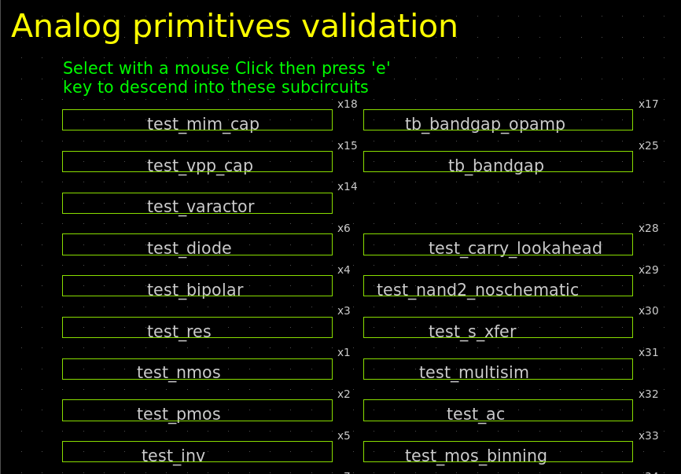
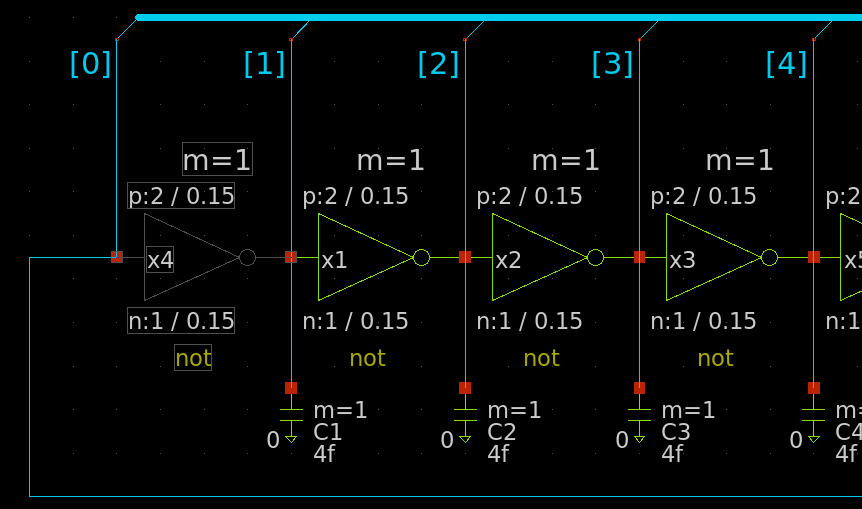
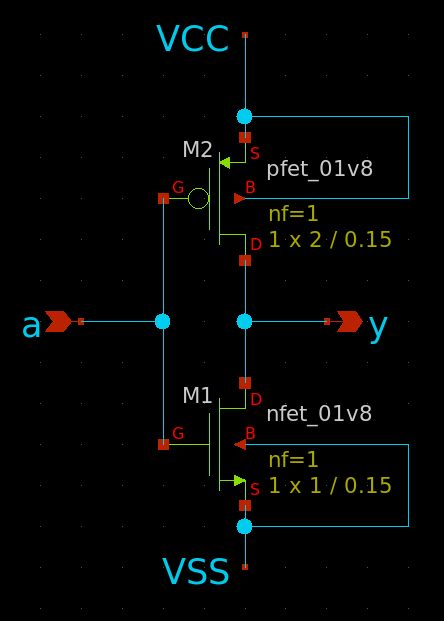
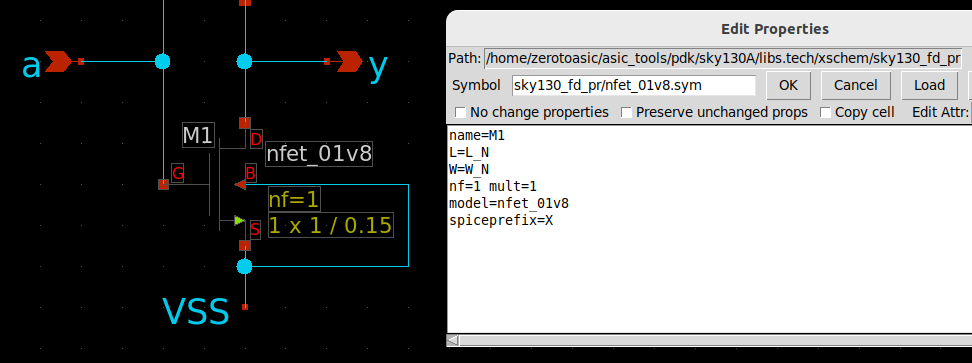
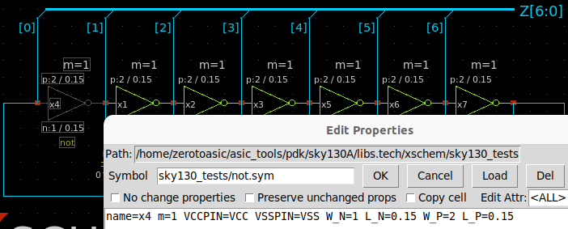
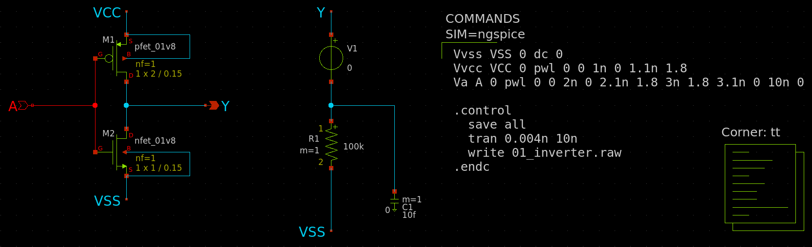
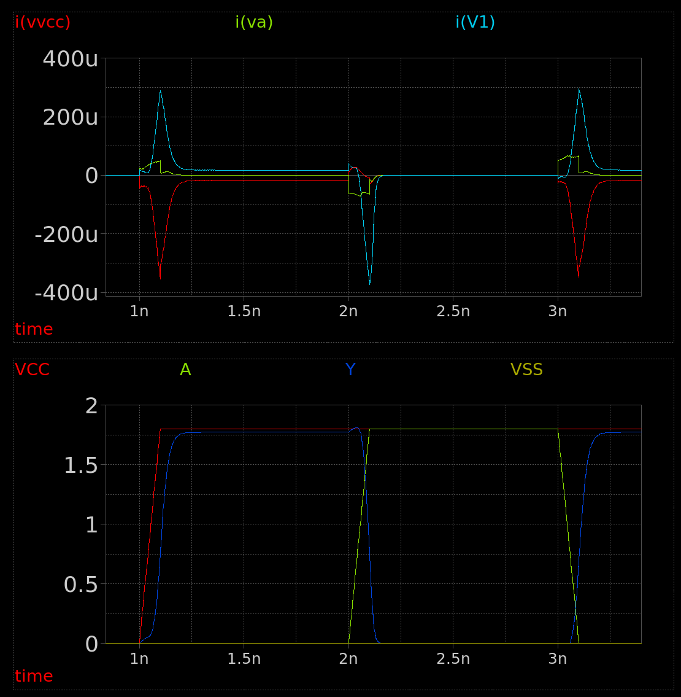

# 20 Nov 2023

| Previous journal: | Next journal: |
|-|-|
| [**0174**-2023-11-19.md](./0174-2023-11-19.md) | [**0176**-2023-11-22.md](./0176-2023-11-22.md) |

# More xschem and sky130

Setting up now on my laptop in MPW9 VM. Xschem is not yet installed.

```
$ ngspice --version
** ngspice-36 : Circuit level simulation program
** Copyright 2001-2020, The ngspice team.

$ magic --version
8.3.413
```

Did a system update, then shut down and took a snapshot before making any changes.

Did the install and xschem runs fine.


# Create voltage divider

*   3-bit: 8 steps, starting at 0.0V
*   Potential issue: Gotta get strong P/N MOSFETs right.
*   From 1.8V source, we need [0,0.7] range:
    *   61.111% of resistor length above top end.
    *   38.889% of resistor length below top, divided by 7 smaller resistors.
    *   Assuming max current target of 50uA across whole divider (allowing us approx. 0.5um width), we want: 1.8/5e-5: 36k&ohm;
    *   Nominal &ohm;/&square; for res_generic_po is 48.2&ohm; -- note that I'm using this one, for now, because [Matt is too](https://github.com/mattvenn/tt05-analog-test/commit/2bd331f227594cff1a4eb8a79beb423edc8aeb93).
    *   36k/48.2 &approx; 746.888 squares
    *   61.111% of that is &approx; 456 squares (228um) -- let's split it in thirds to make sure it's not too long to place.
    *   38.888% is 290 squares (145um)
    *   Latter part divided by 7 is 41.5 squares per resistor (20.75um each)
    *   With these divisions we would hope to get 0.1V increments for each output tap, i.e. 0.0V, 0.1V, 0.2V, up to 0.7V (8 total).

## General steps

*   In order to use sky130's `res_generic_po`, I had to uncomment it from line 153 of `libs.tech/ngspice/sky130_fd_pr__model__r+c.model.spice` -- Note that it may have issues. There are some GitHub issues about it, but it's good enough for me, for now.
*   Place `ipin` labels for VCC and VSS
*   Place `opin` labels for AOUT0..7
*   Place `lab_pin` to match each of VCC and VSS
*   Place 7 resistors upwards from VSS, making each 0.5um W and 20.75um L (~2000&ohm; each)
*   Place next 3 resistors up to VCC, making each 0.5um W and 76um L (~7326-&ohm; each)
*   NOTE: Total resistance is ~36k&ohm; but can vary a lot (+/- 12%?)
*   Place lab_pin taps for each of AOUT0..7 starting at VSS level, and ending at joiner between the 7 lower resistors and 3 upper resistors.
*   Save as `vga_res_div.sch`
*   Make symbol by pressing `a` key.
*   Make `tb_vga_res_div.sch` and place `vga_res_div.sym`
*   Go to sky130 `top.sch` page and copy (CTRL+C) `Corner: tt`, then paste it into the TB.
*   Place `simulator_commands_shown`, press Shift-Q to bring up the code editor, and give it this SPICE code:
    ```spice
    **** interactive sim
    .control
      save all

      * .tran transient analysis...
      * I think this specifies (1) the resolution and (2) timeframe to simulate:
      tran 0.004n 30n

      write vga_res_div.raw
    * exit
    .endc
    ```
*   Add power:
    *   EITHER add a `vsource`, connect it to VCC/VSS, and give it a fixed `value=1.8` or a ramp: `value="pwl 0 0 5n 0 5.1n 1.8"`
    *   OR add the following to the top of the SPICE code:
        ```spice
        * VSS remains at 0V:
        vvss VSS 0 dc 0

        * VCC start at 0V. At 5ns rise to 1.8V in 0.1ns:
        vvcc VCC 0 
        + pwl 0 0 5n 0 5.1n 1.8
        ```
*   Click 'Netlist' button. NOTE: If using voltage source in SPICE instead of via `vsource` component, it will give an error about VCC/VSS not being driven, but it will still write the spice file, and it should still run the simulation.
*   Click 'Simulate' and hopefully it should run OK.


# Progress

*   Watched all of [Webinar - Analog schematic capture & simulation with Stefan Schippers](https://www.youtube.com/watch?v=q3ZcpSkVVuc)
*   Created [vga_res_div](https://github.com/algofoogle/sandpit/tree/master/vlsi/sky130-dac-example) for a planned sky130-dac-example.


# Stuff to figure out

*   If I design an inverter:
    *   How should I size the pmos and nmos FETs?
    *   Should I use the 4-pin variants, and if so what do we connect the base to?
    *   How should I simulate/characterise them?
    *   When doing the layout, what more do I need to know?


# 01_inverter

https://github.com/algofoogle/sandpit/tree/master/vlsi/01_inverter

## Background:



Select test_inv. Then:



Select one of the `not` gates. Then:



Observations:

*   Standard 4-pin 1.8V FETs (i.e. with bias(?) B), `sky130_fd_pr/pfet_01v8.sym` and `sky130_fd_pr/nfet_01v8.sym`
*   Biases connect to their respective polarities (i.e. for pfet, B is connected to VCC)
*   pfet is twice the size of nfet
*   Sizes (L and W) are set by parameters:

    

    These are set in the hierarchical instantiation of the symbol:

    

Notes:

*   A is ipin, Y is opin
*   VCC and VSS are lab_pin with std_logic removed
*   Manually set pfet L to 2
*   Connect biases to their respective polarities

## Results:

Overall inverter design:



*   Actual inverter design is on the left. **Should it have VCC/VSS in it, with those names?**
*   Dummy load and 10fF capacitance is in the middle, with V1 as a 0V dummy voltage source, specifically for measuring current on Y.
*   NGSPICE code on the right, with sky130 TT corner.

Graphed results:



*   Bottom graph shows voltages.
*   At 1ns, power (VCC) is applied, while A is held low.
*   At 2ns, A rises to 1.8V over 0.1ns, and Y switches near 2.2ns
*   In upper graph, current spikes mostly relate to linear regions and capacitance (parasitics).


# Next steps

*   Watch Efabless [Analog layout using Magic and Klayout with Tim Edwards and Thomas Parry](https://www.youtube.com/watch?v=CSZm3q4rUBg) (builds on webinar video just watched).
*   Try [Ryan Wans' SKY130 videos](https://www.youtube.com/@ryanwans391/videos)
*   Watch bminch videos, e.g. [Xschem / Ngspice Resistive Voltage Divider VTC Monte Carlo Simulation Tutorial](https://www.youtube.com/watch?v=vXm7XV8Pf0M) (NOT sky130-specific?) and the other one on sky130 resistors. Maybe watch in this order:
    *   [CMOS Inverter VTC and Transient Simulation Tutorial Using Xschem and Ngspice](https://www.youtube.com/watch?v=bm3l21ExLOY)
    *   [Creating a Hierarchical Schematic in Xschem](https://www.youtube.com/watch?v=BpPP2hE_eK8)
    *   [Layout-Driven Schematics](https://www.youtube.com/watch?v=HQYoIbvZivc)
    *   [Creating a Hierarchical Layout in Magic Using the Sky130 PDK](https://www.youtube.com/watch?v=RPppaGdjbj0)
    *   [Layout Versus Schematic Tutorial Using Netgen](https://www.youtube.com/watch?v=NCaNF4EunYU)
    *   [Layout Versus Schematic Tutorial Using Netgen (Part 2)](https://www.youtube.com/watch?v=_xsZbaTBEEA)
    *   [Magic / Xschem / Ngspice Postlayout Simulation Tutorial](https://www.youtube.com/watch?v=8SMBSYiLbHM)
    *   [Xschem / Ngspice Tutorial Showing How to Prepare Your Installation for Monte Carlo Simulation](https://www.youtube.com/watch?v=fGxs2TnDgrU)
    *   [Xschem / Ngspice Inverter VTC Monte Carlo Simulation Tutorial](https://www.youtube.com/watch?v=fXaXTALecr8)
    *   [Xschem / Ngspice Resistive Voltage Divider VTC Monte Carlo Simulation Tutorial](https://www.youtube.com/watch?v=vXm7XV8Pf0M)
    *   [Xschem / Ngspice R-2R Ladder DAC Transfer Characteristic Monte Carlo Simulation Tutorial](https://www.youtube.com/watch?v=n5A6tJR7i30)
    *   [Survey of Simulated MOS Transistor Characteristics in the Sky130 PDK](https://www.youtube.com/watch?v=QrIG1fQEymc)
    *   [Magic / Xschem Sky130 MIM Capacitor Layout Tutorial](https://www.youtube.com/watch?v=0mF6tU6Xf0Q)
    *   [Magic / Xschem Sky130 P- Precision Poly Resistor Layout Tutorial](https://www.youtube.com/watch?v=ITel47kO-nA)
*   Try designing a proper potentiometric DAC with transistors as taps. Use res_xhigh_po?
*   Find out how to do Monte Carlo SPICE simulations (is it just a matter of using `tt_mm`?) and multiple simulation runs with varied parameters (e.g. temp). See [this](https://youtu.be/q3ZcpSkVVuc?t=2969) with more explanation [here](https://youtu.be/q3ZcpSkVVuc?t=3485)
*   Consider using a vector for AOUT instead of AOUT0, 1, etc.
*   Try Harald's guide to making custom standard cells. Could we just have cells which represent each resistor, transistor, etc?


# Notes

*   Should we use `tt` or `tt_um` lib corner?
*   xschem keys:
    *   Shift-I (or capital I) or 'Ins' key brings up 'classic' (?) symbol insert window, but Shift-Ins brings up new one with side-bar of recently used symbols, and it also allows you to just click on a symbol from the RHS browser and then start to place it while the window is still open (and even hit `q` to edit properites before placing).
    *   `c` (copy) can copy between windows/schematics.
    *   `k` will highlight nets. Each subsequent one will be a different colour/style. Shift-k will remove all highlights.
    *   CTRL-mouse-select will create a selection that can be dragged (with connected wires) using the `m` key, rather than just disconnecting. Then using `h` and `v` will constrain on horizontal/vertical axes.
*   Other xschem tips:
    *   Graphs:
        *   Double-click a graph to go into a config editor.
        *   Select a graph, then select a net, and press Alt-G to add to a graph.
        *   Mousewheel in a graph scrolls on X.
        *   Shift+wheel zooms on X, unless you are hovering over the Y axis in which case it changes Y zoom.
    *   "Disable" a component: Adding `spice_ignore=true` to the properties seems to exclude a component from an output SPICE file, so you can effectively disable it and leave it out of a simulation.
*   SPICE can include triggers for doing measurements, e.g.:
    ```spice
    *** Print a measurement of time difference (call it 'trise') when
    *** voltage of z[6] next rises from 0.1V to 1.7V after 10.5ns have elapsed:
    .measure tran trise 
    + TRIG v(z[6]) TD=10.5n VAL=0.1 RISE=1
    + TARG v(z[6]) TD=10.5n VAL=1.7 RISE=1
    ```

