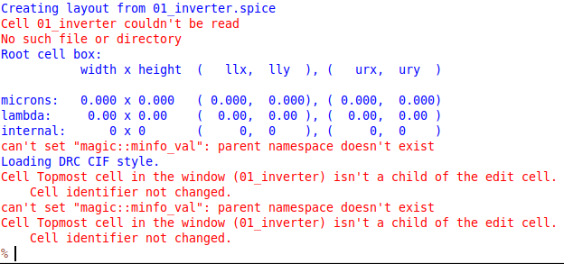

# 22 Nov 2023

| Previous journal: | Next journal: |
|-|-|
| [**0175**-2023-11-20.md](./0175-2023-11-20.md) | [**0177**-2023-11-27.md](./0177-2023-11-27.md) |


# Magic

Add this to `~/.bashrc`:

```bash
alias magicsky='magic -d OGL -rcfile $PDK_ROOT/sky130A/libs.tech/magic/sky130A.magicrc'
```

Then do: `source ~/.bashrc`


# Trying to get Magic OpenGL support working

Running `magicsky` (or just `magic -d OGL`) will probably flash it up and then it dies again. The TCL console would be displaying an error about OGL being unsupported. We need to recompile Magic with OpenGL support.

Following http://opencircuitdesign.com/magic/install.html with some help from Z2A Part 0 Manual Install...

```bash
sudo apt install mesa-common-dev libglu1-mesa-dev
cd ~/asic_tools
git clone git://opencircuitdesign.com/magic magic-ogl
cd magic-ogl
git checkout 8.3.413  # Why are we using this version from July?
./configure --with-opengl
make
sudo make install
magic --version
# 8.3.413
```

Now `magicsky` should work.

# Redo 01_inverter


# Get 01_inverter into Magic

1.  In xschem, export design as netlist...
2.  Simulation => LVS => LVS netlist: Top level is a .subckt
3.  Click 'Netlist' button. Creates: `/home/zerotoasic/.xschem/simulations/01_inverter.spice`
4.  Launch `magicsky`
5.  File => Import SPICE
6.  Select `01_inverter.spice`
7.  Shift-Z to zoom out

Shift-H adds labels to a selected symbol.

When I 'Import SPICE', I see these errors:


