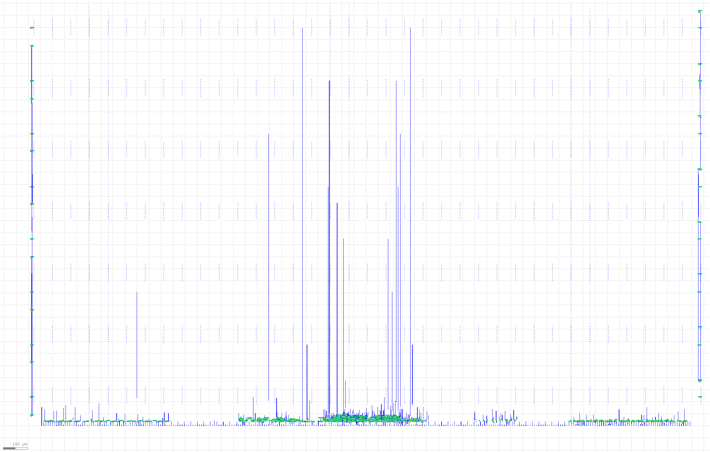
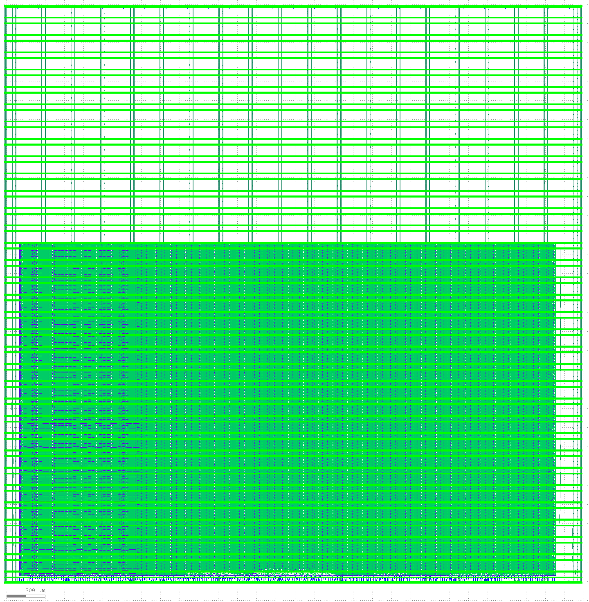
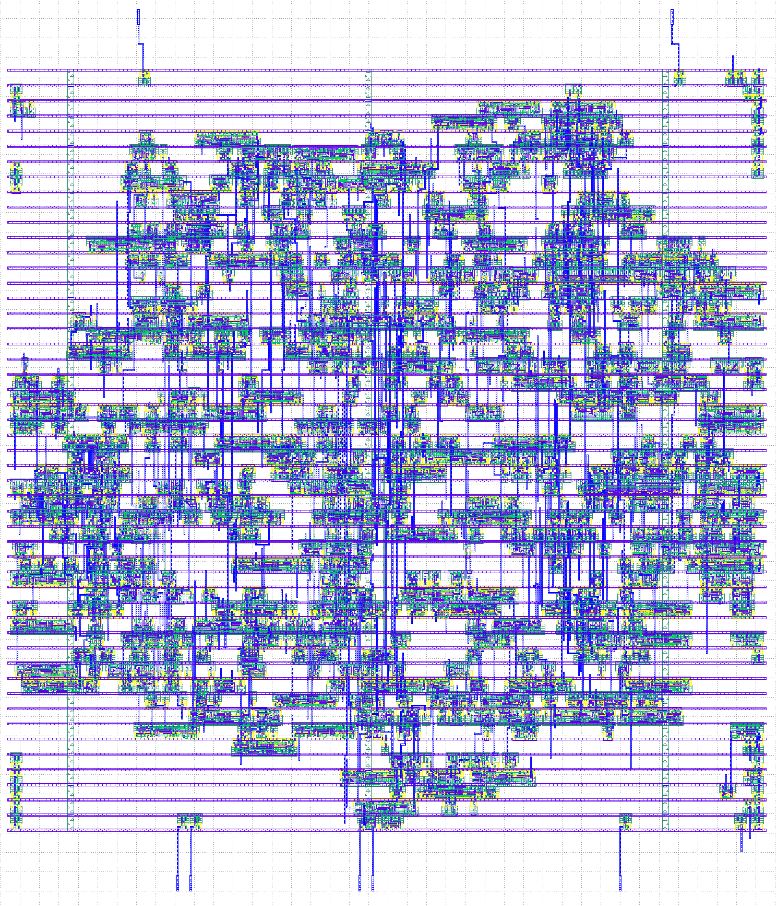
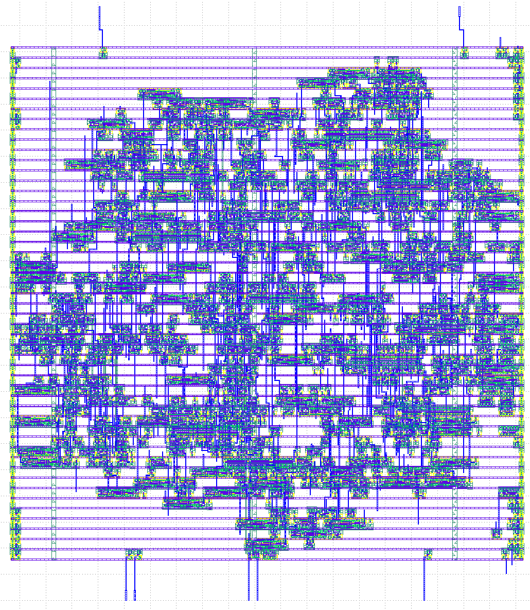
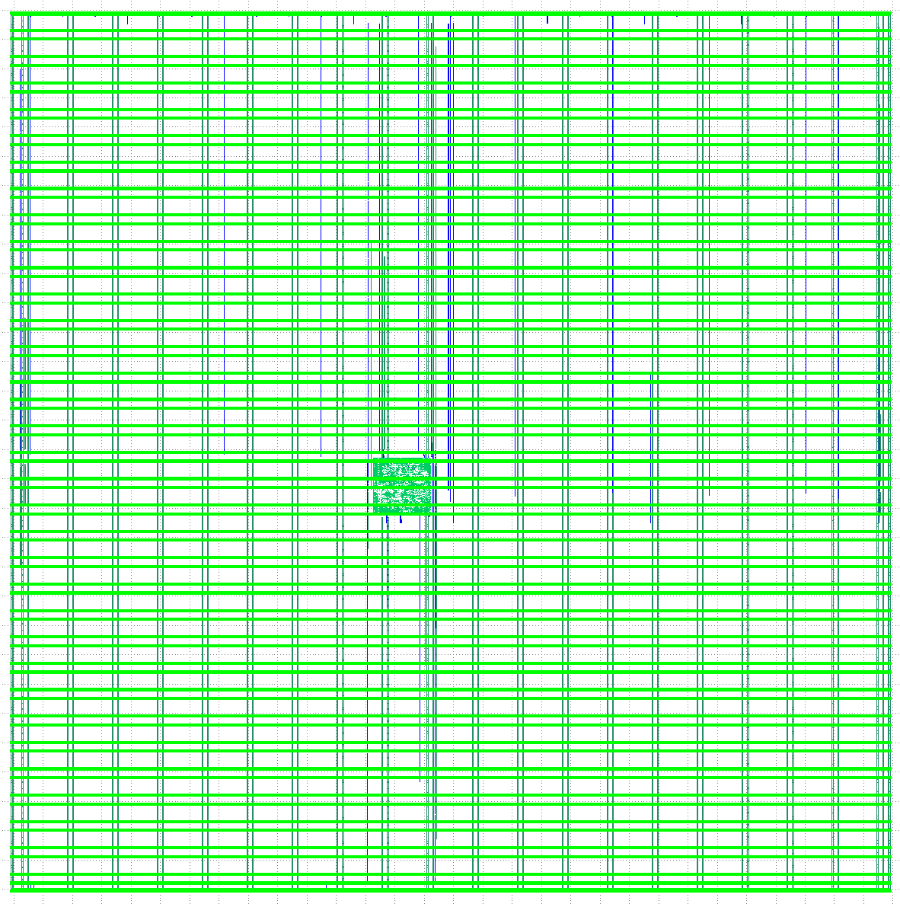

# 27 Nov 2023

| Previous journal: | Next journal: |
|-|-|
| [**0176**-2023-11-22.md](./0176-2023-11-22.md) | [**0178**-2023-11-28.md](./0178-2023-11-28.md) |

# GFMPW-1 test (gf180mcu)

See: https://efabless.com/gf-180-open-mpw-shuttle-program

I will try this with my old solo_squash rpeo.

1.  On MPW9 VM...

    ```bash
    cd ~/anton
    git clone git@github.com:algofoogle/solo_squash
    cd solo_squash
    ```

    NOTE: Just use `main` branch on this repo (others went nowhere, besides maybe `rtl-test-gpio-defaults`). Note also that tt03p5 and tt04 versions had their own *copies* of the code, not git submodules, so beware that the source might differ.
    There are no real code differences between tt03p5 and tt04 versions.

    Source in tt03p5 version is slightly better than HEAD of solo_squash, so I'll copy in tt03p5's `solo_squash.v`.
2.  Do Verilator sim test:
    ```bash
    sudo apt-get update
    sudo apt install libsdl2-dev libsdl2-ttf-dev
    make sim_random
    ```
3.  Create CUP:
    ```bash
    cd ~/anton
    git clone -b gfmpw-1c https://github.com/efabless/caravel_user_project.git solo-squash-caravel-v2
    cd solo-squash-caravel-v2
    git switch -c main-gfmpw1
    ```
4.  Create my GH repo [solo-squash-caravel-v2] then use that as remote "`anton`":
    ```bash
    git remote add anton git@github.com:algofoogle/solo-squash-caravel-v2.git
    git push -u anton main-gfmpw1
    #NOTE: Expect warnings about mag/user_project_wrapper.mag ewxceeding 50MB.
    ```
    In GH, default branch for the repo should already be `main-gfmpw1`, as this is the only one we pushed to the `anton` remote.
5.  Do test harden for example project:
    ```bash
    make user_proj_example
    ```
    Fails with:
    ```
    [INFO]: Using configuration in '../home/zerotoasic/anton/solo-squash-caravel-v2/openlane/user_proj_example/config.json'...
    [INFO]: PDK Root: /home/zerotoasic/asic_tools/pdk
    [INFO]: Process Design Kit: gf180mcuD
    [ERROR]: Standard Cell Library 'gf180mcu_fd_sc_mcu7t5v0' not found in PDK.
    ```
6.  Fix up PDK stuff. Before doing that, let's snapshot the MPW9 VM. I could use [Uri's simple advice](https://discord.com/channels/1009193568256135208/1045622178332291102/1176995613171265586) to just do `volare ls-remote --pdk gf180mcu` (so long as we have `volare` runnable per Python .venv), and if more info is needed we could've checked out how Matt set up MPW9 per the GHA build script or even just Z2A part 0 manual install. In any case, I'll instead try to use https://github.com/efabless/caravel_user_project/blob/gfmpw-1c/docs/source/index.rst as my guide...
7.  ```bash
    #NOTE: Already set:
    # OPENLANE_ROOT=/home/zerotoasic/asic_tools/openlane
    # PDK_ROOT=/home/zerotoasic/asic_tools/pdk
    export PDK=gf180mcuD
    make setup
    ```
    Oh dear, this wrecks my `~/CUP`... I guess because of one or more of these env vars:
    ```env
    CORE_VERILOG_PATH=/home/zerotoasic/asic_tools/caravel_user_project/mgmt_core_wrapper/verilog
    MGMT_AREA_ROOT=/home/zerotoasic/asic_tools/caravel_user_project/mgmt_core_wrapper
    MCW_ROOT=/home/zerotoasic/asic_tools/caravel_user_project/mgmt_core_wrapper
    DESIGNS=/home/zerotoasic/asic_tools/caravel_user_project
    TARGET_PATH=/home/zerotoasic/asic_tools/caravel_user_project
    CARAVEL_ROOT=/home/zerotoasic/asic_tools/caravel_user_project/caravel
    ```
    These appear to be set near the bottom of `~/.bashrc`. I decided to stop this, and restore the VM snapshot.
8.  To keep things simple, let's just replace asic_tools/caravel_user_project with our new repo, and see what happens.
    ```bash
    cd ~/asic_tools
    rm caravel_user_project # My existing version is a symlink so this is easy to remove.
    ln -s ../anton/solo-squash-caravel-v2 caravel_user_project
    ```
9.  Try again...
    ```bash
    cd ~/CUP
    export PDK=gf180mcuD
    make setup
    ```
    Observations, seemingly all within `~/CUP` unless otherwise noted:
    *   There is nothing in `verilog/dv`
    *   Deleted `caravel` subdir to replace it with a new gfmpw-1c clone from https://github.com/efabless/caravel-gf180mcu
    *   Using caravel's Makefile, runs `check-env` and `install_mcw`
    *   Deletes `mgmt_core_wrapper` and replaces with `mcw-litex-vexriscv`
    *   Deletes `~/asic_tools/openlane` and grabs tag 2023.10.16 -- can't remember what version WAS in there. Docker pulls in its images.
    *   Run's caravel's `make pdk-with-volare`. This does `python3 -m pip install --upgrade volare` but without venv?
    *   Downloads PDK:
        ```
        Downloading common.tar.zst… 
        Downloading gf180mcu_fd_io.tar.zst… 
        Downloading gf180mcu_fd_ip_sram.tar.zst… 
        Downloading gf180mcu_fd_pr.tar.zst… 
        Downloading gf180mcu_fd_sc_mcu7t5v0.tar.zst… 
        Downloading gf180mcu_fd_sc_mcu9t5v0.tar.zst… 
        ```
    *   Replaces `mpw_precheck` (more Docker images)
    *   Approx 13GB of disk space used up
10. Try hardening user_proj_example again with `make user_proj_example`. Observations:
    *   ```log
        [WARNING]: OpenLane may not function properly: open_pdks e0f692f46654d6c7c99fc70a0c94a080dab53571
        The version of open_pdks used in building the PDK does not match the version OpenLane was tested on (installed: e0f692f46654d6c7c99fc70a0c94a080dab53571, tested: dd7771c384ed36b91a25e9f8b314355fc26561be)
        This may introduce some issues. You may want to re-install the PDK by invoking `make pdk`.
        ```
    *   ```log
        [WARNING]: DIODE_INSERTION_STRATEGY is now deprecated; use GRT_REPAIR_ANTENNAS, DIODE_ON_PORTS and RUN_HEURISTIC_DIODE_INSERTION instead.
        [INFO]: DIODE_INSERTION_STRATEGY set to 4. Setting RUN_HEURISTIC_DIODE_INSERTION to 1
        [INFO]: DIODE_INSERTION_STRATEGY set to 4. Setting DIODE_ON_PORTS to in
        ```
    *   ```log
        [INFO]: 0 errors found by linter
        [WARNING]: 8 warnings found by linter
        ```
    *   ```log
        [WARNING]: There are max fanout violations in the design at the Typical corner. Please refer to '../home/zerotoasic/anton/solo-squash-caravel-v2/openlane/user_proj_example/runs/23_11_27_12_32/reports/signoff/34-sta-rcx_nom/multi_corner_sta.checks.rpt'.
        [INFO]: There are no hold violations in the design at the Typical corner.
        [INFO]: There are no setup violations in the design at the Typical corner.
        [SUCCESS]: Flow complete.
        ```
    *   44 steps in total, taking 06:21
11. Checking `reports/signoff/34-sta-rcx_nom/multi_corner_sta.checks.rpt` the fanouts aren't great (22/4 worst, 9/4 avg, 38 fanouts total). In `reports/signoff/44-antenna_violators.rpt` there is also one wire that is 2.23x
12. `summary.py --caravel --design user_proj_example --full-summary` -- somewhat different from sky130, but nothing I'm really worried out. Big DIEAREA of 19.712mm&sup2; though! That can't be right (unless it's counting full chip area inc. padframe) because the configured DIEAREA is only 2.8mmx1.75mm I think (~5mm&sup2;):
    
13. Now try `make user_project_wrapper`. Only 30 steps this time. Took 05:20. Also gave fanout violations, but they're `/10` and not as severe...?
    

[solo-squash-caravel-v2]: https://github.com/algofoogle/solo-squash-caravel-v2

# Adding solo_squash repo as a submodule

1.  Fix up repo (inc. removing old example stuff):
    ```bash
    git rm -rf gds/* mag/* maglef/* sdc/user_proj_example.sdc signoff/user_proj_example
    mkdir gds mag maglef
    touch gds/.keep mag/.keep maglef/.keep
    git add gds mag maglef
    cat <<EOH >>.gitignore
    caravel
    dependencies
    mgmt_core_wrapper
    EOH
    git commit -am "Remove old example stuff"
    git push
    ```
    NOTE: Not sure what to do with `sdf/`.
2.  Add solo_squash repo as submodule:
    ```bash
    cd ~/CUP/verilog/rtl
    git submodule add https://github.com/algofoogle/solo_squash solo_squash
    ```
3.  ABORT...

I got a successful harden after a few steps...



...but mucked up the repo a bit, so I'm redoing it, with steps recorded here.

1.  I cloned solo-squash-caravel-v2 again and then [deleted](https://github.com/algofoogle/solo-squash-caravel-v2/commit/1dffff9f592ea10d4582e72ec770ff14f0d640af) [more](https://github.com/algofoogle/solo-squash-caravel-v2/commit/4904dd281556bd61c39e055145a15f9208fb5dfc) [stuff](https://github.com/algofoogle/solo-squash-caravel-v2/commit/246f7e85d55192188971c78703bd00f0fc015490).
2.  Then...
    ```bash
    git submodule add git@github.com:algofoogle/solo_squash verilog/rtl/solo_squash
    ```
3.  In solo_squash submodule, commented out the timescale in src/solo_squash.v (and committed that).
4.  Edit each of `verilog/includes/*` to replace user_proj_example with solo_squash_caravel_gf180, and also include `-v $(USER_PROJECT_VERILOG)/rtl/solo_squash/src/solo_squash.v` in `includes.rtl.caravel_user_project`
5.  Create `verilog/rtl/solo_squash_caravel_gf180.v` that will be our top *macro* and which wraps `solo_squash game`
6.  Update `verilog/rtl/user_defines.v`
7.  Replace `verilog/rtl/user_project_wrapper.v` to instantiate `solo_squash_caravel_gf180`
8.  Create `openlane/solo_squash_caravel_gf180/config.json` and, if desired, `pin_order.cfg` (and reference it in `config.json`)
9.  Edit `openlane/user_project_wrapper/config.json` and `macro.cfg`
10. Update `README.md`
11. Run `make setup`

# Hardening

If cloning the repo anew, remember to do `git submodule init` and `git submodule update`.

Harden the main design:

```bash
make solo_squash_caravel_gf180
```



I got fanout warnings. Oh well, let's move on.

Now harden UPW with the macro included:

```bash
make user_project_wrapper
```



There are slew *and* fanout warnings in this one. Still, it completed.


# Next steps

*   Run pre-check
*   Try doing a submission to Efabless
*   Copy tests from old solo-squash-caravel; fix `LA[0]` in firmware and test runner, and adapt frame image capture from raybox-zero
*   Try SDC file per [this](https://course.zerotoasiccourse.com/mod/lesson/view.php?id=442&pageid=736) (at the bottom)
*   Consider top-level timing check per [this](https://course.zerotoasiccourse.com/mod/lesson/view.php?id=442&pageid=745).


# Stuff to try out using solo_squash design

*   Compare solo_squash_caravel.v to TT03p5 wrapper
*   un/registered outputs
*   reset source?
*   muxing
*   **NOTE:** Need to have simulation testbench!
*   **NOTE:** Might need to make my own SDC files, esp. to replace `user_project_wrapper.sdc`!

# Overall projects for possible combined GFMPW-1

*   vga_spi_rom
*   solo_squash
*   raybox-zero
*   lzc_fast
*   reciprocal
*   raybox-zero upgraded (speed-safer. more IO use)
*   simple analog test
*   ring osc and other directly instantiated cell chains

