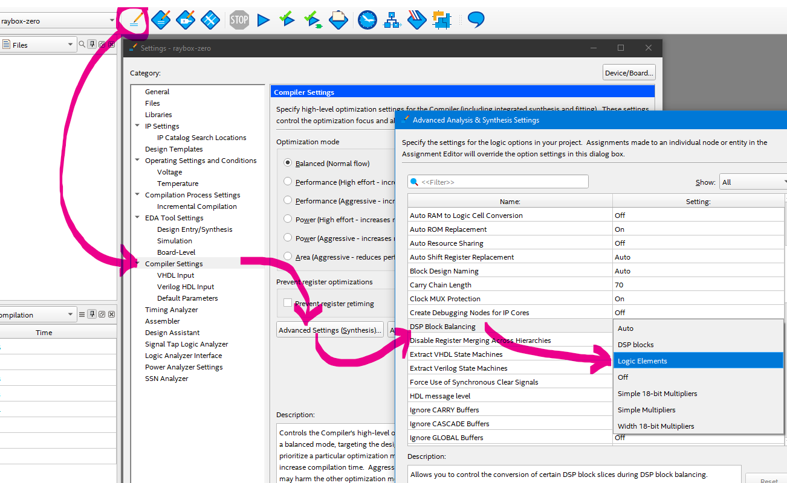
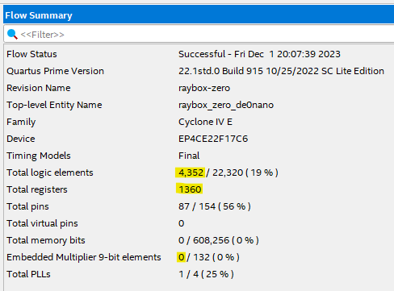

# 1 Dec 2023

| Previous journal: | Next journal: |
|-|-|
| [**0179**-2023-11-30.md](./0179-2023-11-30.md) | [**0181**-2023-12-02.md](./0181-2023-12-02.md) |

# GFMPW-1 raybox-zero hardening

*   Added `raybox-zero/test` -- VERY basic Verilog TBs for now.
*   Changed rcp (reciprocal) implementation to go via a simple FSM wrapper. This has improved the timing enough to get a successful harden at a clock period of 44ns (~22.72MHz). We can probably go further by fixing up the shmul (shared multiplier) too.

# Initial successful harden of top_ew_algofoogle

## Params

*   44ns clock period
*   35% core util
*   0.45 target density
*   4 max fanout

## Design

*   Q11.11
*   3 wait states in rcp_fsm
*   7 WS for shmul

## Results

*   Fanout: 1452
*   Fastest corner:
    *   Slack: 5.19ns
    *   Slew: 0
    *   Cap: 0
*   Slowest corner:
    *   Slack: -20.42ns
    *   Slew: 12; worst: 3.52/3.0
    *   Cap: 0
*   Typical corner:
    *   Slack: 0.50ns
    *   Slew: 0
    *   Cap: 0

# UPW hardening

*   For now, slew/cap/fanout is **terrible** for user_project_wrapper.
*   I can probably make it a bit better by moving the macro a bit more, and reordering macro pins.

# Next steps

*   Change name of top module. Instead of `top_ew_algofoogle` call it `top_raybox_zero_combo` and the next one could be called `top_raybox_zero_fsm`?
*   Try placing both the original raybox-zero macro and 'fast' macro into UPW.
*   NOTE: Be careful to add extra WS to shmul in *original* rbz?
*   Wire up more of the IO pads.
*   Put in a mux for the two macros.
*   Change area/aspect.

# Disabling FPGA hardware multipliers and other inferred DSP blocks

Per [this](https://electronics.stackexchange.com/a/363922), in Quartus Prime we can:

1.  Click the edit pencil next to the project name in the toolbar
2.  Select 'Compiler Settings'
3.  Click 'Advanced Settings (Synthesis)...'
4.  Scroll down to 'DSP Block Balancing'
5.  Change the option from 'Auto' to 'Logic Elements'

...and this appears to disable the embedded multipliers, at the cost of a bit more logic:

After making this change, I tried to push the design too far to see if I could get it to fail on the FPGA:
*   Increased clock from 25MHz to 32.5MHz (+30%)
*   Increased fixed-point precision from Q11.11 to Q15.15
*   Removed wait states from wall_tracer FSM

...but despite timing warnings that it couldn't run above about 20MHz, I still couldn't get it to fail on my FPGA.
