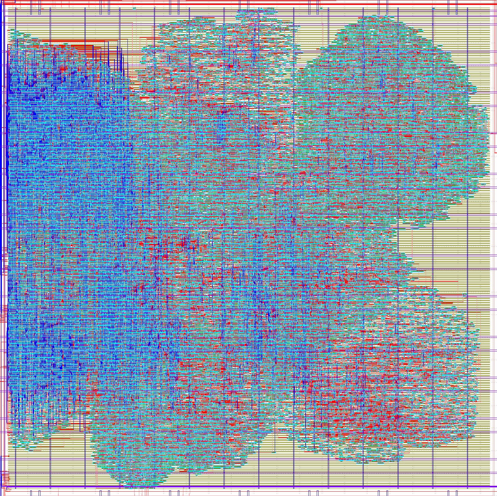
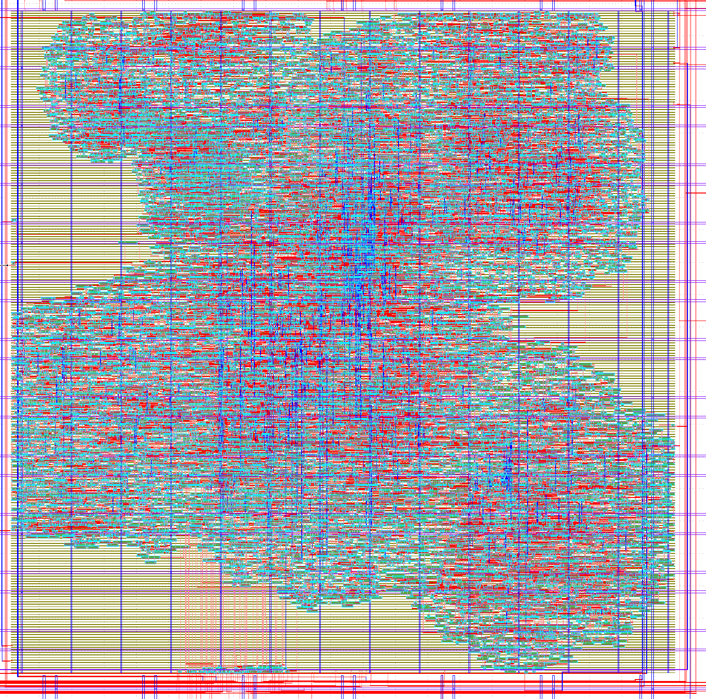

# 4 Dec 2023

| Previous journal: | Next journal: |
|-|-|
| [**0182**-2023-12-03.md](./0182-2023-12-03.md) | *Next journal TBA* |

# Continue trying to fix rbz-fsm harden for GF180


# Test 7

*   Try registering LAs to avoid hold violations.
*   Put hmax and vmax into gpout select options, or gpout alts?

Results for TEA:

*   Time: 16:30
*   GDS size: 26MB (26821532)
*   Details from `du -h results/final/gds/*.gds && du -b results/final/gds/*.gds && olsum full-summary top_raybox_zero_fsm --run`:
    *   WNS: 0
    *   TNS: 0
    *   Dimensions: 1024x1023
    *   CoreArea_um^2: 1,049,066.3232
    *   Util: 30.98%
    *   Antennas: `reports/signoff/46-antenna_violators.rpt`
        *   1: 101%
*   `reports/signoff/37-sta-rcx_nom/multi_corner_sta.checks.rpt`:
    *   **Fanout: 1586 vios, most ~8/4, but some up to 46/4 (on clkbufs)!**
    *   Fastest max: 17.29
    *   Fastest slew: 0
    *   Fastest cap: 0
    *   Slowest max: -22.57
    *   Slowest slew: 19 vios, worst 5.46/3.00
    *   Slowest cap: 0
    *   Typical max: 8.27
    *   **Typical slew: 8 vios, worst 3.13/3.00**
    *   Typical cap: 0

Results for UPW:

*   Time: 3:26
*   GDS size: 28MB (28511532)
*   Details from `du -h results/final/gds/*.gds && du -b results/final/gds/*.gds && olsum full-summary user_project_wrapper --run`:
    *   WNS: -10.73
    *   **TNS: -1666.14**
    *   Antennas: `reports/signoff/30-antenna_violators.rpt`
        *   22 pin, 22 net
        *   Worst is 343%
        *   12 exceed 210% -- **NOTE: MOST are on IOs**
*   `reports/signoff/20-sta-rcx_nom/multi_corner_sta.checks.rpt`:
    *   Fastest max: -2.53
    *   Fastest slew: 8, worst is 6.16/2.60
    *   Fastest cap: 4, worst is 0.58/0.23
    *   Slowest max: -41.42
    *   Slowest slew: 21, worst is 15.82/3.0
    *   Slowest cap: 4, worst is 0.58/0.25
    *   Typical max: -10.58
    *   Typical slew: 8, worst is 9.29/3.0
    *   Typical cap: 4, worst is 0.58/0.24
*   `reports/signoff/20-sta-rcx_nom/multi_corner_sta.min.rpt` (HOLD):
    *   **Typical min: -2.86 -- HOLD VIO**
*   **NOTE:** Hold violations at UPW stage seem to be confined to LAs:
    *   At Typical, there is exactly 1 for each of the 13 LAs.
    *   They all range from -2.57 to -2.86.
    *   Does this imply something? e.g. that the actual registering of 
    *   Can we do a test using very sparse placement of the LA/reg/gpout mux network that proves that this issue will occur even without the rest of the design logic?
    *   Is it possible to make these existing vios much WORSE to see if we can better-understand what influences them? e.g. make the reg chain much longer?
    *   What if we try registering LAs on the negedge of clk instead of pos?
    *   Is the violation *where they get registered* or is it downstream?
    *   Is the problem partly to do with wire lengths/placement/capacitance?
    *   Can the issue be fixed with deliberate delay lines? They'd probably have to be pretty long delays! But what about a simple inverter at each end?

Hold violations list at UPW (last is MET), sorted by LA index (not by slack):
```
Startpoint: la_data_in[0]   Endpoint: top_raybox_zero_fsm/_27285_  -2.57  slack (VIOLATED)
Startpoint: la_data_in[1]   Endpoint: top_raybox_zero_fsm/_27261_  -2.86  slack (VIOLATED)
Startpoint: la_data_in[2]   Endpoint: top_raybox_zero_fsm/_27263_  -2.84  slack (VIOLATED)
Startpoint: la_data_in[3]   Endpoint: top_raybox_zero_fsm/_27265_  -2.79  slack (VIOLATED)
Startpoint: la_data_in[4]   Endpoint: top_raybox_zero_fsm/_27267_  -2.84  slack (VIOLATED)
Startpoint: la_data_in[5]   Endpoint: top_raybox_zero_fsm/_27269_  -2.80  slack (VIOLATED)
Startpoint: la_data_in[6]   Endpoint: top_raybox_zero_fsm/_27271_  -2.78  slack (VIOLATED)
Startpoint: la_data_in[7]   Endpoint: top_raybox_zero_fsm/_27273_  -2.64  slack (VIOLATED)
Startpoint: la_data_in[8]   Endpoint: top_raybox_zero_fsm/_27275_  -2.79  slack (VIOLATED)
Startpoint: la_data_in[9]   Endpoint: top_raybox_zero_fsm/_27277_  -2.73  slack (VIOLATED)
Startpoint: la_data_in[10]  Endpoint: top_raybox_zero_fsm/_27279_  -2.83  slack (VIOLATED)
Startpoint: la_data_in[11]  Endpoint: top_raybox_zero_fsm/_27281_  -2.79  slack (VIOLATED)
Startpoint: la_data_in[12]  Endpoint: top_raybox_zero_fsm/_27283_  -2.81  slack (VIOLATED)
Startpoint: wb_clk_i        Endpoint: top_raybox_zero_fsm/_27257_   0.13  slack (MET)
```


# Test 8

*   Quick test to make reg chain for LAs much deeper: Go from 2 to 32. What effect will it have on hold violations?


Results for TEA:

*   Time: 17:23
*   GDS size: 27MB (28126050)
*   Details from `du -h results/final/gds/*.gds && du -b results/final/gds/*.gds && olsum full-summary top_raybox_zero_fsm --run`:
    *   WNS: 0
    *   TNS: 0
    *   Dimensions: 1064x1062
    *   CoreArea_um^2: 1,130,308.48
    *   Util: 30.96%
    *   Antennas: `reports/signoff/46-antenna_violators.rpt`
        *   None
*   `reports/signoff/37-sta-rcx_nom/multi_corner_sta.checks.rpt`:
    *   **Fanout: 1717 vios, most ~8/4, but some up to 32/4 (on clkbufs)!**
    *   Fastest max: 17.09
    *   Fastest slew: 0
    *   Fastest cap: 0
    *   Slowest max: -21.86
    *   Slowest slew: 8 vios, worst 5.47/3.00
    *   Slowest cap: 0
    *   Typical max: 8.49
    *   **Typical slew: 8 vios, worst 3.12XX/3.00**
    *   Typical cap: 0

Results for UPW:

*   Time: 3:26
*   GDS size: 28MB (28511532)
*   Details from `du -h results/final/gds/*.gds && du -b results/final/gds/*.gds && olsum full-summary user_project_wrapper --run`:
    *   WNS: -10.73 -- UNCHANGED from Test 7.
    *   **TNS: -1666.14** -- UNCHANGED from Test 7.
    *   Antennas: `reports/signoff/30-antenna_violators.rpt`
        *   22
        *   Worst is 343%
        *   12 exceed 210XX% -- Basically same as above.
*   `reports/signoff/20-sta-rcx_nom/multi_corner_sta.checks.rpt`:
    *   Fastest max: -2.53
    *   Fastest slew: 8, worst is 6.16/2.60
    *   Fastest cap: 4, worst is 0.58/0.23
    *   Slowest max: -41.42
    *   Slowest slew: 21, worst is 15.82/3.0
    *   Slowest cap: 4, worst is 0.58/0.25
    *   Typical max: -10.58
    *   Typical slew: 8, worst is 9.29/3.0
    *   Typical cap: 4, worst is 0.58/0.24
    *   **All same as Test 7**
*   `reports/signoff/20-sta-rcx_nom/multi_corner_sta.min.rpt` (HOLD):
    *   **Typical min: -2.86XX -- HOLD VIO**
*   **NOTE:** Hold violations at UPW stage seem to be confined to LAs:
    *   At Typical, there is exactly 1 for each of the 13 LAs.
    *   They all range from -2.57XX to -2.86XX.

UPW hold violations are unchanged from Test 7:

```
Startpoint: la_data_in[0]   Endpoint: top_raybox_zero_fsm/_27285_  -2.57  slack (VIOLATED)
Startpoint: la_data_in[1]   Endpoint: top_raybox_zero_fsm/_27261_  -2.86  slack (VIOLATED)
Startpoint: la_data_in[2]   Endpoint: top_raybox_zero_fsm/_27263_  -2.84  slack (VIOLATED)
Startpoint: la_data_in[3]   Endpoint: top_raybox_zero_fsm/_27265_  -2.79  slack (VIOLATED)
Startpoint: la_data_in[4]   Endpoint: top_raybox_zero_fsm/_27267_  -2.84  slack (VIOLATED)
Startpoint: la_data_in[5]   Endpoint: top_raybox_zero_fsm/_27269_  -2.80  slack (VIOLATED)
Startpoint: la_data_in[6]   Endpoint: top_raybox_zero_fsm/_27271_  -2.78  slack (VIOLATED)
Startpoint: la_data_in[7]   Endpoint: top_raybox_zero_fsm/_27273_  -2.64  slack (VIOLATED)
Startpoint: la_data_in[8]   Endpoint: top_raybox_zero_fsm/_27275_  -2.79  slack (VIOLATED)
Startpoint: la_data_in[9]   Endpoint: top_raybox_zero_fsm/_27277_  -2.73  slack (VIOLATED)
Startpoint: la_data_in[10]  Endpoint: top_raybox_zero_fsm/_27279_  -2.83  slack (VIOLATED)
Startpoint: la_data_in[11]  Endpoint: top_raybox_zero_fsm/_27281_  -2.79  slack (VIOLATED)
Startpoint: la_data_in[12]  Endpoint: top_raybox_zero_fsm/_27283_  -2.81  slack (VIOLATED)
Startpoint: wb_clk_i        Endpoint: top_raybox_zero_fsm/_27257_   0.13  slack (MET)
```


# Test 9

*   See what happens if we punch TEA's hold slack margins both up to 1.5
*   Kept reg chain at 32.

Results for TEA:

*   Time: **53:52**
*   GDS size: 33MB (34179512)
*   Details from `du -h results/final/gds/*.gds && du -b results/final/gds/*.gds && olsum full-summary top_raybox_zero_fsm --run`:
    *   WNS: 0
    *   TNS: 0
    *   Dimensions: 1064x1062
    *   CoreArea_um^2: 1,130,308.48 **unchanged**
    *   Util: 30.96%
    *   Antennas: `reports/signoff/46-antenna_violators.rpt`
        *   4; 128% is the worst.
*   `reports/signoff/37-sta-rcx_nom/multi_corner_sta.checks.rpt`:
    *   **Fanout: 1809 vios, most ~8/4, but some up to 32/4 (on clkbufs)!**
    *   Fastest max: 14.86
    *   **Fastest slew: 98 vios, worst 6.22/2.6**
    *   **Fastest cap: 26 vios, worst 0.34/0.13**
    *   Slowest max: -22.45
    *   **Slowest slew: 513 vios, worst 18.00/3.00**
    *   **Slowest cap: 23 vios, worst, 0.34/0.12**
    *   Typical max: 8.11
    *   **Typical slew: 208 vios, worst 9.97/3.00**
    *   **Typical cap: 26 vios, worst 0.34/0.12**

Results for UPW:

*   Time: 4:00
*   GDS size: 35MB (35847188)
*   Details from `du -h results/final/gds/*.gds && du -b results/final/gds/*.gds && olsum full-summary user_project_wrapper --run`:
    *   WNS: -10.89
    *   **TNS: -2684.68**
    *   Antennas: `reports/signoff/30-antenna_violators.rpt`
        *   16
        *   Worst is 337%
        *   7 exceed 210%
*   `reports/signoff/20-sta-rcx_nom/multi_corner_sta.checks.rpt`:
    *   Fastest max: -4.83
    *   Fastest slew: 106, worst is 6.22/2.60
    *   Fastest cap: 30, worst is 0.47/0.23
    *   Slowest max: -41.30
    *   Slowest slew: 514, worst is 18.00/3.0
    *   Slowest cap: 27, worst is 0.47/0.25
    *   Typical max: -10.74
    *   Typical slew: 208, worst is 9.97/3.0
    *   Typical cap: 30, worst is 0.47/0.24
*   `reports/signoff/20-sta-rcx_nom/multi_corner_sta.min.rpt` (HOLD):
    *   **Typical min: -3.82 -- HOLD VIO**
*   **NOTE:** Hold violations at UPW stage seem to be confined to LAs:
    *   At Typical, there is exactly 1 for each of the 13 LAs.
    *   They all range from -3.33 to -3.82.

Interesting: We went from 0.2/0.1 to 1.5/1.5. It sort of looks like it made LA holds worse by an average of -0.7, and the rest (non-vios) better...?

It took way longer to run!

```
Startpoint: la_data_in[0]   Endpoint: top_raybox_zero_fsm/_27687_  -3.40  slack (VIOLATED)
Startpoint: la_data_in[1]   Endpoint: top_raybox_zero_fsm/_27303_  -3.39  slack (VIOLATED)
Startpoint: la_data_in[2]   Endpoint: top_raybox_zero_fsm/_27335_  -3.44  slack (VIOLATED)
Startpoint: la_data_in[3]   Endpoint: top_raybox_zero_fsm/_27367_  -3.51  slack (VIOLATED)
Startpoint: la_data_in[4]   Endpoint: top_raybox_zero_fsm/_27399_  -3.82  slack (VIOLATED)
Startpoint: la_data_in[5]   Endpoint: top_raybox_zero_fsm/_27431_  -3.47  slack (VIOLATED)
Startpoint: la_data_in[6]   Endpoint: top_raybox_zero_fsm/_27463_  -3.33  slack (VIOLATED)
Startpoint: la_data_in[7]   Endpoint: top_raybox_zero_fsm/_27495_  -3.49  slack (VIOLATED)
Startpoint: la_data_in[8]   Endpoint: top_raybox_zero_fsm/_27527_  -3.67  slack (VIOLATED)
Startpoint: la_data_in[9]   Endpoint: top_raybox_zero_fsm/_27559_  -3.51  slack (VIOLATED)
Startpoint: la_data_in[10]  Endpoint: top_raybox_zero_fsm/_27591_  -3.36  slack (VIOLATED)
Startpoint: la_data_in[11]  Endpoint: top_raybox_zero_fsm/_27623_  -3.37  slack (VIOLATED)
Startpoint: la_data_in[12]  Endpoint: top_raybox_zero_fsm/_27655_  -3.64  slack (VIOLATED)
Startpoint: wb_clk_i        Endpoint: top_raybox_zero_fsm/_27300_   0.48  slack (MET)
```

This does seem to have gone crazy with the routing on the left:



Compare test-8:




# Test 10

*   Remove hold slack margin tweaks (inc. PL/GLB buffers).
*   Bring reg chain depth from 32 back down to 2, and clock it on negedge.

FAILED! Tiny hold violations in TEA, one in particular: `i_clk` startpoint, viol is -0.03. Maybe we could correct this with hold slack margin tweaks again?


# Test 11

*   Put hold slack margin tweaks/buffers back in, but back to 0.2/0.1.

FAILED! No change to hold violations in TEA.


# Test 12

*   Use these config adjustments:
    ```json
    "PL_RESIZER_HOLD_SLACK_MARGIN": 0.4,
    "GLB_RESIZER_HOLD_SLACK_MARGIN": 0.4,
    "PL_RESIZER_HOLD_MAX_BUFFER_PERCENT": 70,
    "GLB_RESIZER_HOLD_MAX_BUFFER_PERCENT": 70,
    ```

Succeeded in TEA, failed in UPW, but now it's just setup vios. Could be fixed by dropping UPW clock?


# Test 13

*   Remove hold slack margins again.
*   Remove reg on LA (conditional precompilation).
*   Fix up SDC stuff:
    *   Name ports according to what our design actually has.
    *   Use `set_multicycle_path` on LA-driven ports.
*   Can optionally use `"SYNTH_AUTONAME": true` to help trace vios.

Results: TBC

TEA failed with setup vios, UPW did not run. Cause seems to relate to using `reset` condition just to halt regs in `tex_sclk` block, and we can probably live without that (or give it a multicycle constraint).


# Test 14

*   Remove reset check condition from `posedge tex_sclk` block.
*   Remember to fix up Verilator!

Results: TBC

TEA: Worst setup slack is 7.80, so we could probably run our clock faster than 44ns.

UPW: 617 hold vios, again all on LAs. Ranging up to -2.02. 1x LA[3], 1x LA[8], all the others are on LA[0] (reset).


# Test 15

*   Speed up clock: CLOCK_PERIOD of 40ns
*   See what effect it has on slew, fanout, caps, hold vios in UPW.


# Test 16

*   Increase FP_CORE_UTIL and PL_TARGET_DENSITY
*   See what effect it has on slew, fanout, caps, hold vios in UPW.


# Test 17

*   Clock from user_clock2 instead of wb_clk_i


# Test 18

*   SDC: Relax constraints on LA-based pins. Do we want `-hold 2` or `-hold 1`? Put this in macro SDC, or UPW SDC? If we do the latter, then it could affect other designs...?


# Test 19

Ideas:

*   set_false_path 
*   user_clock2 for the design
*   user_clock2 just for LA regs
*   Halve the clocking of the LA regs?
*   SDC relax LAs -- besides 'reset', they don't actually change... they just get set to a constant value.
*   SDC, look into: "Multicycle Paths: Specifies exceptions where certain paths are allowed multiple cycles for setup and hold times."
*   Use edge detector on LAs??
*   Use WB instead of LA


NOTE: We don't strictly need a reliable signal on gpout_sels, just on LA-driven reset. Can we tell SDC not to care?

NOTE: Maybe registering reset_alt on negedge is bad because all the rest of the design relies on it being sync'd with clk?

NOTE: If we HAD to, we could just get rid of all the LA interface.


```
SYNTH_AUTONAME -- Add a synthesis step to generate names for instances. This results in instance names that can be very long, but may be more useful than the internal names that are six digit numbers.
Enabled = 1, Disabled = 0
(Default: 0)

SYNTH_TIMING_DERATE?
SYNTH_SIZING
SYNTH_SHARE_RESOURCES
SYNTH_ABC_LEGACY_REFACTOR
SYNTH_ABC_LEGACY_REWRITE
IO_PCT
FP_IO_MIN_DISTANCE: Try 5?
PL_SKIP_INITIAL_PLACEMENT
PL_RESIZER_MAX_WIRE_LENGTH

PL_RESIZER_MAX_SLEW_MARGIN (def 20)
PL_RESIZER_MAX_CAP_MARGIN (def 20)
PL_RESIZER_HOLD_SLACK_MARGIN (def 0.1)
PL_RESIZER_SETUP_SLACK_MARGIN (def 0.05)
PL_RESIZER_HOLD_MAX_BUFFER_PERCENT
PL_RESIZER_SETUP_MAX_BUFFER_PERCENT
PL_RESIZER_ALLOW_SETUP_VIOS
PL_WIRELENGTH_COEF (def 0.25) -- reducing will try to make shorter wires by initial cell place?

CTS_SINK_CLUSTERING_SIZE (def 25)
CTS_SINK_CLUSTERING_MAX_DIAMETER (def 50)
CTS_CLK_MAX_WIRE_LENGTH (def 0)

GLB_RESIZER_MAX_WIRE_LENGTH (def 0)
GLB_RESIZER_MAX_SLEW_MARGIN (def 10)
GLB_RESIZER_MAX_CAP_MARGIN	(def 10)
GLB_RESIZER_ALLOW_SETUP_VIOS
GRT_ANT_MARGIN  (def 10)
```


# Test 20

*   Change pin ordering
*   Change clock speed: Decrease TEA period from 44 to 


# Test 21

*   Try using user_clock2 (inc. SDC `usr_*` stuff) -- maybe user_clock2 can be used specifically for clocking LA reg, and keep wb_clk_i for main design?


# Test 22

*   Fix (or at least decide on) user_defines
*   FSM wrapper for SHMUL
*   Try 40ns CLOCK_PERIOD for TEA
*   Test on FPGA too


# Test 23

*   Run a matrix of tests. Assuming TEA takes 15:30 and UPW takes 3:30, it's 19 mins for each permutation. That's:
    *   19 runs in 6:01 hours.
    *   25 runs in 7:55 hours. Example: 3x FP_CORE_UTIL, 2x hold margins, 2x setup margins, 2x PL_TARGET_DENSITY = 24
    *   32 runs in 10:08 hours. Example: 4x FP_CORE_UTIL, 4x PL_TARGET_DENSITY, 2x allow setup vios?
*   I think there's a parameter to allow larger global placement for better timing...?


# Test 24

*   If necessary, just get rid of the LA stuff
*   Try reducing density
*   Are there any SDC constraints we can put in to help things?
*   Move macro placement


# Other notes / Next steps

*   Write a runner/aggregator for TEA/UPW run results. Beware disk space.
*   Check this Verilator lint:
    ```
    %Warning-UNUSEDSIGNAL: /home/zerotoasic/anton/algofoogle-multi-caravel/openlane/top_raybox_zero_fsm/../../verilog/rtl/raybox-zero-fsm/src/rtl/row_render.v:11:21: Bits of signal are not used: 'texu'[5]

         : ... In instance top_raybox_zero_fsm.rbzero.row_render
       11 |   input wire  [5:0] texu,
          |                     ^~~~
    ```
*   Get rid of unused states/params (inc. RCP_RDX) in wall_tracer
*   Find out about SoC user interrupts, masking, and default behaviour
*   List each Typical Corner hold vio in UPW:
    ```bash
    RPT=reports/signoff/20-sta-rcx_nom/multi_corner_sta.min.rpt
    fgrep 'Typical Corner' -A 999999 $RPT | egrep 'Startpoint|Endpoint|slack \(' | less
    ```
    NOTE: Includes all Typical Corner hold paths, not just vios.
*   Count hold vios (replace `wc -l` with `sort` to just get a list of the violated Startpoints):
    ```bash
    fgrep 'Typical Corner' -A 999999 $RPT | egrep 'Startpoint|Endpoint|slack \(' | fgrep 'VIOLATED' -B2 | fgrep Startpoint | wc -l
    ```
