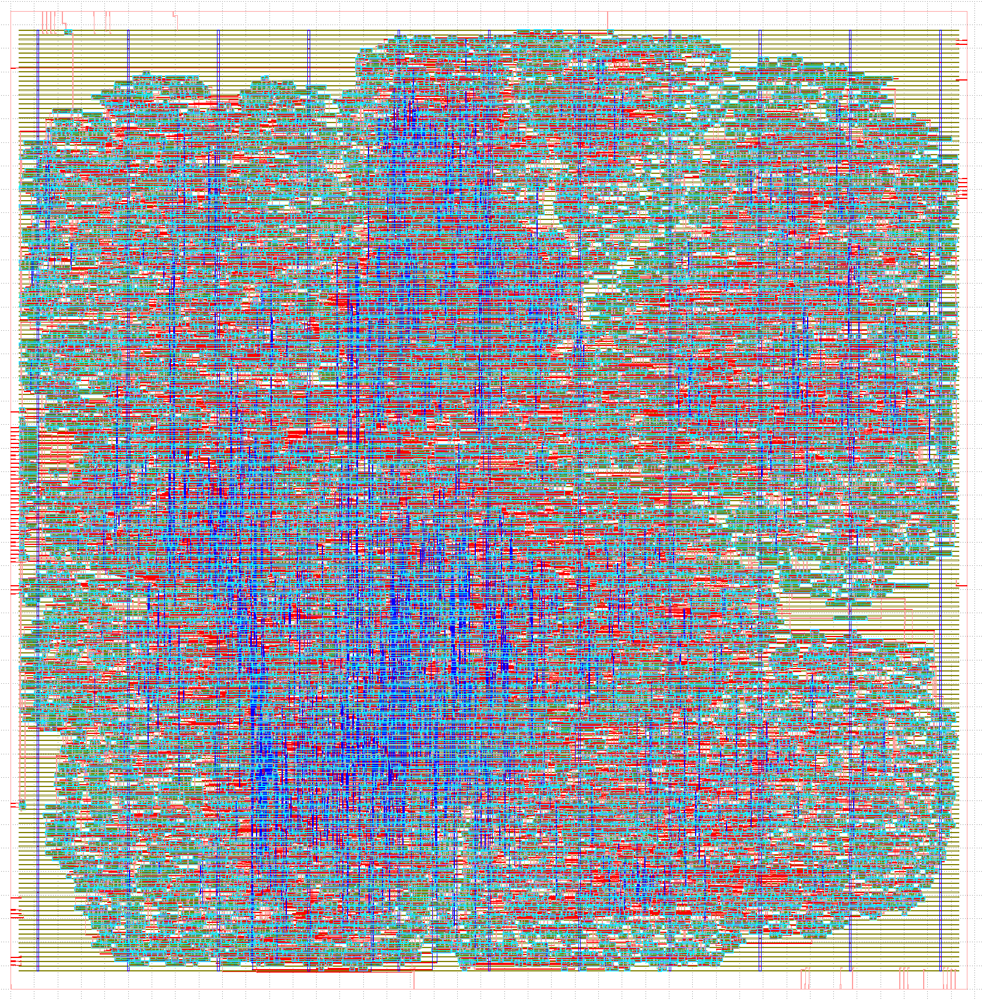

# 5 Dec 2023

| Previous journal: | Next journal: |
|-|-|
| [**0183**-2023-12-04.md](./0183-2023-12-04.md) | [**0185**-2023-12-06.md](./0185-2023-12-06.md) |


# First rough success hardening raybox-zero-fsm/UPW


# Reports to check

*   Tagging the run (symlink)
*   Completion status: metrics.csv:flow_status
*   Runtime (full-summary; metrics.csv)
*   Dimensions (Step 3: FP) and total area (full-summary; metrics.csv)
*   Render GDS
*   Summary of config
*   TRZF fanout (count and worst)
*   Typical corner stats for each of TRZF and UPW:
    *   Antennas:
        *   TRZF: reports/signoff/46-antenna_violators.rpt
        *   UPW: reports/signoff/30-antenna_violators.rpt
    *   Setup, and counts/sums/list for each of: slews; caps:
        *   TRZF: reports/signoff/37-sta-rcx_nom/multi_corner_sta.checks.rpt
        *   UPW: reports/signoff/20-sta-rcx_nom/multi_corner_sta.checks.rpt
    *   Worst hold slack (and all vios, if any):
        *   TRZF: reports/signoff/37-sta-rcx_nom/multi_corner_sta.min.rpt
        *   UPW: reports/signoff/20-sta-rcx_nom/multi_corner_sta.min.rpt


# Partial success; success-1

*   [This commit](https://github.com/algofoogle/algofoogle-multi-caravel/commit/e0519d9a03b3184cab8e9451081b58b81c64e709) gets a successful harden, if you change UPW clock period to 40ns (25MHz).
*   I've linked it as `success-1`
*   Fanouts are marginally better than other previous runs (30 max instead of 32+)
*   It has 2 cap vios, not too bad: 0.42/0.23 and 0.40/0.23
*   It has more severe slews (4 in total, max 4.40/2.60)
*   22 antenna vios, half are >200%, 3 are >300% (worst is 335%):
    *   0 in TRZF: reports/signoff/46-antenna_violators.rpt
    *   22 in UPW: reports/signoff/30-antenna_violators.rpt
*   TRZF typical worst slack is 1.74




```
SELECTED design run:  >>>  success-1  <<<  (openlane/top_raybox_zero_fsm/runs/success-1)

|          Design final GDS size |       24M (24900398) |
|        Design macro dimensions |              800x800 |
|      (summary.py temp run num) |                   31 |
|                   Flow success |                  Yes |
|                  total_runtime |               0:16:1 |
|                   FP_CORE_UTIL |                   49 |
|              PL_TARGET_DENSITY |                 0.55 |
|                    OpenDP_Util |               50.48% |
|               synth_cell_count |                14507 |
|         net_antenna_violations |                    0 |
|                            wns |                  0.0 |
|                            tns |                  0.0 |
|                  cells_pre_abc |                15694 |
|                    CoreArea_um |          639488.1024 |
|                   NonPhysCells |                15412 |
|                   CLOCK_PERIOD |                   39 |
Setup, slews, caps:   openlane/top_raybox_zero_fsm/runs/success-1/reports/signoff/37-sta-rcx_nom/multi_corner_sta.checks.rpt
Unconstrained:
    Path Type: max
                                      1.74   slack (MET)

slack_max:
    No paths found.

Slew, caps, fanout:
    max slew violations count Typical: 4
    max fanout violations count Typical: 1510
    max cap violations count Typical: 0

Max slew:
    Pin                                    Limit    Slew   Slack
    ------------------------------------------------------------
    o_tex_sclk                              3.00    3.12   -0.12 (VIOLATED)
    output44/Z                              3.00    3.12   -0.12 (VIOLATED)
    o_gpout[2]                              3.00    3.10   -0.10 (VIOLATED)
    output33/Z                              3.00    3.10   -0.10 (VIOLATED)
    
    Showing all 4
    

Fanout:
    Pin                                   Limit Fanout  Slack
    ---------------------------------------------------------
    clkbuf_5_11__f_i_clk/Z                    4     30    -26 (VIOLATED)
    clkbuf_5_1__f_i_clk/Z                     4     30    -26 (VIOLATED)
    clkbuf_5_10__f_i_clk/Z                    4     28    -24 (VIOLATED)
    clkbuf_5_2__f_i_clk/Z                     4     28    -24 (VIOLATED)
    clkbuf_5_31__f_i_clk/Z                    4     28    -24 (VIOLATED)
    clkbuf_5_6__f_i_clk/Z                     4     28    -24 (VIOLATED)
    clkbuf_5_3__f_i_clk/Z                     4     26    -22 (VIOLATED)
    clkbuf_5_9__f_i_clk/Z                     4     26    -22 (VIOLATED)
    clkbuf_5_0__f_i_clk/Z                     4     24    -20 (VIOLATED)
    clkbuf_5_7__f_i_clk/Z                     4     24    -20 (VIOLATED)
    
    Showing worst 10 out of 1510
    

Max caps:
    
    
    None
    

Hold slack:   openlane/top_raybox_zero_fsm/runs/success-1/reports/signoff/37-sta-rcx_nom/multi_corner_sta.min.rpt
    worst slack corner Typical: 0.3785

Antennas:             openlane/top_raybox_zero_fsm/runs/success-1/reports/signoff/46-antenna_violators.rpt
    
    
    None
    

Step: UPW

SELECTED UPW run:  >>>  success-1  <<<  (openlane/user_project_wrapper/runs/success-1)

|          Design final GDS size |       26M (26595866) |
|        Design macro dimensions |            2956x2952 |
|      (summary.py temp run num) |                   24 |
|                   Flow success |                  Yes |
|                  total_runtime |                0:3:2 |
|                   FP_CORE_UTIL |                   50 |
|              PL_TARGET_DENSITY |                  0.6 |
|                    OpenDP_Util |                  -1% |
|               synth_cell_count |                    1 |
|         net_antenna_violations |                   16 |
|                            wns |                  0.0 |
|                            tns |                  0.0 |
|                  cells_pre_abc |                    1 |
|                    CoreArea_um |         8724457.9968 |
|                   NonPhysCells |                    1 |
|                   CLOCK_PERIOD |                   40 |
Setup, slews, caps:   openlane/user_project_wrapper/runs/success-1/reports/signoff/20-sta-rcx_nom/multi_corner_sta.checks.rpt
Unconstrained:
    Path Type: max
                                      2.89   slack (MET)

slack_max:
    No paths found.

Slew, caps, fanout:
    max slew violations count Typical: 4
    max fanout violations count Typical: 34
    max cap violations count Typical: 2

Max slew:
    Pin                                    Limit    Slew   Slack
    ------------------------------------------------------------
    io_out[37]                              3.00    6.68   -3.68 (VIOLATED)
    top_raybox_zero_fsm/output33/Z          3.00    6.66   -3.66 (VIOLATED)
    io_out[17]                              3.00    6.42   -3.42 (VIOLATED)
    top_raybox_zero_fsm/output44/Z          3.00    6.39   -3.39 (VIOLATED)
    
    Showing all 4
    

Fanout:
    Pin                                   Limit Fanout  Slack
    ---------------------------------------------------------
    Pin                                    Limit     Cap   Slack
    ------------------------------------------------------------
    top_raybox_zero_fsm/clkbuf_5_11__f_i_clk/Z     10     30    -20 (VIOLATED)
    top_raybox_zero_fsm/clkbuf_5_1__f_i_clk/Z     10     30    -20 (VIOLATED)
    top_raybox_zero_fsm/clkbuf_5_10__f_i_clk/Z     10     28    -18 (VIOLATED)
    top_raybox_zero_fsm/clkbuf_5_2__f_i_clk/Z     10     28    -18 (VIOLATED)
    top_raybox_zero_fsm/clkbuf_5_31__f_i_clk/Z     10     28    -18 (VIOLATED)
    top_raybox_zero_fsm/clkbuf_5_6__f_i_clk/Z     10     28    -18 (VIOLATED)
    top_raybox_zero_fsm/clkbuf_5_3__f_i_clk/Z     10     26    -16 (VIOLATED)
    top_raybox_zero_fsm/clkbuf_5_9__f_i_clk/Z     10     26    -16 (VIOLATED)
    top_raybox_zero_fsm/clkbuf_5_0__f_i_clk/Z     10     24    -14 (VIOLATED)
    top_raybox_zero_fsm/clkbuf_5_7__f_i_clk/Z     10     24    -14 (VIOLATED)
    
    Showing worst 10 out of 36
    

Max caps:
    Pin                                    Limit     Cap   Slack
    ------------------------------------------------------------
    top_raybox_zero_fsm/output33/Z          0.24    0.42   -0.18 (VIOLATED)
    top_raybox_zero_fsm/output44/Z          0.24    0.40   -0.16 (VIOLATED)
    
    Showing all 2
    

Hold slack:   openlane/user_project_wrapper/runs/success-1/reports/signoff/20-sta-rcx_nom/multi_corner_sta.min.rpt
    worst slack corner Typical: 0.5285

Antennas:             openlane/user_project_wrapper/runs/success-1/reports/signoff/30-antenna_violators.rpt
    Partial/Required:  3.35, Required:    400.0, Partial:  1339.09, Net: io_in[24], Pin: top_raybox_zero_fsm/i_vec_mosi, Layer: Metal4
    Partial/Required:  3.03, Required:    400.0, Partial:  1213.67, Net: io_in[25], Pin: top_raybox_zero_fsm/i_reg_csb, Layer: Metal4
    Partial/Required:  2.98, Required:    400.0, Partial:  1191.77, Net: io_in[34], Pin: top_raybox_zero_fsm/i_mode[2], Layer: Metal3
    Partial/Required:  2.48, Required:    400.0, Partial:    992.9, Net: io_in[26], Pin: top_raybox_zero_fsm/i_reg_sclk, Layer: Metal4
    Partial/Required:  2.38, Required:    400.0, Partial:   950.31, Net: io_in[29], Pin: top_raybox_zero_fsm/i_debug_map_overlay, Layer: Metal3
    Partial/Required:  2.09, Required:    400.0, Partial:   837.22, Net: io_in[27], Pin: top_raybox_zero_fsm/i_reg_mosi, Layer: Metal4
    Partial/Required:  2.03, Required:    400.0, Partial:   812.11, Net: io_in[25], Pin: top_raybox_zero_fsm/i_reg_csb, Layer: Metal3
    Partial/Required:  2.03, Required:    400.0, Partial:   811.72, Net: io_in[33], Pin: top_raybox_zero_fsm/i_mode[1], Layer: Metal3
    Partial/Required:  2.02, Required:    400.0, Partial:   808.96, Net: io_in[24], Pin: top_raybox_zero_fsm/i_vec_mosi, Layer: Metal3
    Partial/Required:  2.01, Required:    400.0, Partial:   803.92, Net: io_in[26], Pin: top_raybox_zero_fsm/i_reg_sclk, Layer: Metal3
    
    Showing worst 10 out of 22
```


# FAILED

*   Increased FCU 49..56, PTD 55..60
*   748x745 - TRZF FAILED: setup slack: -1.58
*   Max fanout reduced: 30 => 28
*   Slew is worse: 3.61/3.00 (19)
*   No caps


# success-2

*   Drop FCU 56..29 (30 crashes), PTD 60..35 (30 too low)

```
SELECTED design run:  >>>  success-2  <<<  (openlane/top_raybox_zero_fsm/runs/success-2)

|          Design final GDS size |       26M (27038366) |
|        Design macro dimensions |            1040x1039 |
|      (summary.py temp run num) |                    7 |
|                   Flow success |                  Yes |
|                  total_runtime |              0:12:51 |
|                   FP_CORE_UTIL |                   29 |
|              PL_TARGET_DENSITY |                 0.35 |
|                    OpenDP_Util |               29.88% |
|               synth_cell_count |                14507 |
|         net_antenna_violations |                    0 |
|                            wns |                  0.0 |
|                            tns |                  0.0 |
|                  cells_pre_abc |                15694 |
|                    CoreArea_um |          1080268.896 |
|                   NonPhysCells |                15576 |
|                   CLOCK_PERIOD |                   39 |
Setup, slews, caps:   openlane/top_raybox_zero_fsm/runs/success-2/reports/signoff/37-sta-rcx_nom/multi_corner_sta.checks.rpt
Unconstrained:
    Path Type: max
                                      3.26   slack (MET)

slack_max:
    No paths found.

Slew, caps, fanout:
    max slew violations count Typical: 4
    max fanout violations count Typical: 1707
    max cap violations count Typical: 0

Max slew:
    Pin                                    Limit    Slew   Slack
    ------------------------------------------------------------
    o_tex_sclk                              3.00    3.12   -0.12 (VIOLATED)
    output44/Z                              3.00    3.12   -0.12 (VIOLATED)
    o_gpout[2]                              3.00    3.12   -0.12 (VIOLATED)
    output33/Z                              3.00    3.12   -0.12 (VIOLATED)
    
    Showing all 4
    

Fanout:
    Pin                                   Limit Fanout  Slack
    ---------------------------------------------------------
    clkbuf_5_10__f_i_clk/Z                    4     44    -40 (VIOLATED)
    clkbuf_5_11__f_i_clk/Z                    4     42    -38 (VIOLATED)
    clkbuf_5_2__f_i_clk/Z                     4     40    -36 (VIOLATED)
    clkbuf_5_7__f_i_clk/Z                     4     40    -36 (VIOLATED)
    clkbuf_5_9__f_i_clk/Z                     4     38    -34 (VIOLATED)
    clkbuf_5_1__f_i_clk/Z                     4     32    -28 (VIOLATED)
    clkbuf_5_29__f_i_clk/Z                    4     32    -28 (VIOLATED)
    clkbuf_5_6__f_i_clk/Z                     4     32    -28 (VIOLATED)
    clkbuf_5_0__f_i_clk/Z                     4     30    -26 (VIOLATED)
    clkbuf_5_26__f_i_clk/Z                    4     30    -26 (VIOLATED)
    
    Showing worst 10 out of 1707
    

Max caps:
    
    
    None
    

Hold slack:   openlane/top_raybox_zero_fsm/runs/success-2/reports/signoff/37-sta-rcx_nom/multi_corner_sta.min.rpt
    worst slack corner Typical: 0.3369

Antennas:             openlane/top_raybox_zero_fsm/runs/success-2/reports/signoff/46-antenna_violators.rpt
    
    
    None
    

Step: UPW

SELECTED UPW run:  >>>  success-2  <<<  (openlane/user_project_wrapper/runs/success-2)

|          Design final GDS size |       28M (28709882) |
|        Design macro dimensions |            2956x2952 |
|      (summary.py temp run num) |                    6 |
|                   Flow success |                  Yes |
|                  total_runtime |               0:3:35 |
|                   FP_CORE_UTIL |                   50 |
|              PL_TARGET_DENSITY |                  0.6 |
|                    OpenDP_Util |                  -1% |
|               synth_cell_count |                    1 |
|         net_antenna_violations |                   16 |
|                            wns |                  0.0 |
|                            tns |                  0.0 |
|                  cells_pre_abc |                    1 |
|                    CoreArea_um |         8724457.9968 |
|                   NonPhysCells |                    1 |
|                   CLOCK_PERIOD |                   40 |
Setup, slews, caps:   openlane/user_project_wrapper/runs/success-2/reports/signoff/20-sta-rcx_nom/multi_corner_sta.checks.rpt
Unconstrained:
    Path Type: max
                                      4.41   slack (MET)

slack_max:
    No paths found.

Slew, caps, fanout:
    max slew violations count Typical: 4
    max fanout violations count Typical: 36
    max cap violations count Typical: 2

Max slew:
    Pin                                    Limit    Slew   Slack
    ------------------------------------------------------------
    io_out[17]                              3.00    7.43   -4.43 (VIOLATED)
    top_raybox_zero_fsm/output44/Z          3.00    7.41   -4.41 (VIOLATED)
    io_out[37]                              3.00    7.36   -4.36 (VIOLATED)
    top_raybox_zero_fsm/output33/Z          3.00    7.33   -4.33 (VIOLATED)
    
    Showing all 4
    

Fanout:
    Pin                                   Limit Fanout  Slack
    ---------------------------------------------------------
    Pin                                    Limit     Cap   Slack
    ------------------------------------------------------------
    top_raybox_zero_fsm/clkbuf_5_10__f_i_clk/Z     10     44    -34 (VIOLATED)
    top_raybox_zero_fsm/clkbuf_5_11__f_i_clk/Z     10     42    -32 (VIOLATED)
    top_raybox_zero_fsm/clkbuf_5_2__f_i_clk/Z     10     40    -30 (VIOLATED)
    top_raybox_zero_fsm/clkbuf_5_7__f_i_clk/Z     10     40    -30 (VIOLATED)
    top_raybox_zero_fsm/clkbuf_5_9__f_i_clk/Z     10     38    -28 (VIOLATED)
    top_raybox_zero_fsm/clkbuf_5_1__f_i_clk/Z     10     32    -22 (VIOLATED)
    top_raybox_zero_fsm/clkbuf_5_29__f_i_clk/Z     10     32    -22 (VIOLATED)
    top_raybox_zero_fsm/clkbuf_5_6__f_i_clk/Z     10     32    -22 (VIOLATED)
    top_raybox_zero_fsm/clkbuf_5_0__f_i_clk/Z     10     30    -20 (VIOLATED)
    top_raybox_zero_fsm/clkbuf_5_26__f_i_clk/Z     10     30    -20 (VIOLATED)
    
    Showing worst 10 out of 38
    

Max caps:
    Pin                                    Limit     Cap   Slack
    ------------------------------------------------------------
    top_raybox_zero_fsm/output44/Z          0.24    0.46   -0.23 (VIOLATED)
    top_raybox_zero_fsm/output33/Z          0.24    0.46   -0.22 (VIOLATED)
    
    Showing all 2
    

Hold slack:   openlane/user_project_wrapper/runs/success-2/reports/signoff/20-sta-rcx_nom/multi_corner_sta.min.rpt
    worst slack corner Typical: 0.4867

Antennas:             openlane/user_project_wrapper/runs/success-2/reports/signoff/30-antenna_violators.rpt
    Partial/Required:  3.35, Required:    400.0, Partial:  1341.42, Net: io_in[24], Pin: top_raybox_zero_fsm/i_vec_mosi, Layer: Metal4
    Partial/Required:  3.24, Required:    400.0, Partial:  1294.99, Net: io_in[34], Pin: top_raybox_zero_fsm/i_mode[2], Layer: Metal3
    Partial/Required:  2.45, Required:    400.0, Partial:   980.11, Net: io_in[25], Pin: top_raybox_zero_fsm/i_reg_csb, Layer: Metal4
    Partial/Required:  2.41, Required:    400.0, Partial:   965.02, Net: io_in[26], Pin: top_raybox_zero_fsm/i_reg_sclk, Layer: Metal4
    Partial/Required:  2.03, Required:    400.0, Partial:   811.33, Net: io_in[33], Pin: top_raybox_zero_fsm/i_mode[1], Layer: Metal3
    Partial/Required:  2.03, Required:    400.0, Partial:   810.15, Net: io_in[29], Pin: top_raybox_zero_fsm/i_debug_map_overlay, Layer: Metal3
    Partial/Required:  2.02, Required:    400.0, Partial:   808.96, Net: io_in[24], Pin: top_raybox_zero_fsm/i_vec_mosi, Layer: Metal3
    Partial/Required:  2.01, Required:    400.0, Partial:   803.53, Net: io_in[26], Pin: top_raybox_zero_fsm/i_reg_sclk, Layer: Metal3
    Partial/Required:  2.01, Required:    400.0, Partial:   803.15, Net: io_in[27], Pin: top_raybox_zero_fsm/i_reg_mosi, Layer: Metal3
    Partial/Required:  2.00, Required:    400.0, Partial:   799.99, Net: io_in[32], Pin: top_raybox_zero_fsm/i_mode[0], Layer: Metal3
    
    Showing worst 10 out of 22
```

# success-3

*   Drop FCU 29..27
*   Drop PTD 35..30


```
SELECTED design run:  >>>  success-3  <<<  (openlane/top_raybox_zero_fsm/runs/success-3)

|          Design final GDS size |       27M (27568246) |
|        Design macro dimensions |            1077x1074 |
|      (summary.py temp run num) |                    1 |
|                   Flow success |                  Yes |
|                  total_runtime |              0:16:23 |
|                   FP_CORE_UTIL |                   27 |
|              PL_TARGET_DENSITY |                  0.3 |
|                    OpenDP_Util |                27.9% |
|               synth_cell_count |                14507 |
|         net_antenna_violations |                    0 |
|                            wns |                  0.0 |
|                            tns |                  0.0 |
|                  cells_pre_abc |                15694 |
|                    CoreArea_um |         1157256.7552 |
|                   NonPhysCells |                15682 |
|                   CLOCK_PERIOD |                   39 |
Setup, slews, caps:   openlane/top_raybox_zero_fsm/runs/success-3/reports/signoff/37-sta-rcx_nom/multi_corner_sta.checks.rpt
Unconstrained:
    Path Type: max
                                      3.20   slack (MET)

slack_max:
    No paths found.

Slew, caps, fanout:
    max slew violations count Typical: 4
    max fanout violations count Typical: 1806
    max cap violations count Typical: 0

Max slew:
    Pin                                    Limit    Slew   Slack
    ------------------------------------------------------------
    o_tex_sclk                              3.00    3.12   -0.12 (VIOLATED)
    output44/Z                              3.00    3.12   -0.12 (VIOLATED)
    o_gpout[2]                              3.00    3.11   -0.11 (VIOLATED)
    output33/Z                              3.00    3.11   -0.11 (VIOLATED)
    
    Showing all 4
    

Fanout:
    Pin                                   Limit Fanout  Slack
    ---------------------------------------------------------
    clkbuf_2_0_0_i_clk/Z                      4     32    -28 (VIOLATED)
    clkbuf_2_1_0_i_clk/Z                      4     32    -28 (VIOLATED)
    clkbuf_2_2_0_i_clk/Z                      4     32    -28 (VIOLATED)
    clkbuf_2_3_0_i_clk/Z                      4     32    -28 (VIOLATED)
    clkbuf_6_15_0_i_clk/Z                     4     26    -22 (VIOLATED)
    clkbuf_6_22_0_i_clk/Z                     4     26    -22 (VIOLATED)
    clkbuf_6_16_0_i_clk/Z                     4     24    -20 (VIOLATED)
    clkbuf_6_23_0_i_clk/Z                     4     24    -20 (VIOLATED)
    clkbuf_6_5_0_i_clk/Z                      4     24    -20 (VIOLATED)
    _15319_/Z                                 4     22    -18 (VIOLATED)
    
    Showing worst 10 out of 1806
    

Max caps:
    
    
    None
    

Hold slack:   openlane/top_raybox_zero_fsm/runs/success-3/reports/signoff/37-sta-rcx_nom/multi_corner_sta.min.rpt
    worst slack corner Typical: 0.3616

Antennas:             openlane/top_raybox_zero_fsm/runs/success-3/reports/signoff/46-antenna_violators.rpt
    
    
    None
    

Step: UPW

SELECTED UPW run:  >>>  success-3  <<<  (openlane/user_project_wrapper/runs/success-3)

|          Design final GDS size |       28M (29234706) |
|        Design macro dimensions |            2956x2952 |
|      (summary.py temp run num) |                    1 |
|                   Flow success |                  Yes |
|                  total_runtime |               0:3:45 |
|                   FP_CORE_UTIL |                   50 |
|              PL_TARGET_DENSITY |                  0.6 |
|                    OpenDP_Util |                  -1% |
|               synth_cell_count |                    1 |
|         net_antenna_violations |                   17 |
|                            wns |                  0.0 |
|                            tns |                  0.0 |
|                  cells_pre_abc |                    1 |
|                    CoreArea_um |         8724457.9968 |
|                   NonPhysCells |                    1 |
|                   CLOCK_PERIOD |                   40 |
Setup, slews, caps:   openlane/user_project_wrapper/runs/success-3/reports/signoff/20-sta-rcx_nom/multi_corner_sta.checks.rpt
Unconstrained:
    Path Type: max
                                      4.35   slack (MET)

slack_max:
    No paths found.

Slew, caps, fanout:
    max slew violations count Typical: 4
    max fanout violations count Typical: 52
    max cap violations count Typical: 2

Max slew:
    Pin                                    Limit    Slew   Slack
    ------------------------------------------------------------
    io_out[37]                              3.00    7.66   -4.66 (VIOLATED)
    top_raybox_zero_fsm/output33/Z          3.00    7.64   -4.64 (VIOLATED)
    io_out[17]                              3.00    6.76   -3.76 (VIOLATED)
    top_raybox_zero_fsm/output44/Z          3.00    6.74   -3.74 (VIOLATED)
    
    Showing all 4
    

Fanout:
    Pin                                   Limit Fanout  Slack
    ---------------------------------------------------------
    Pin                                    Limit     Cap   Slack
    ------------------------------------------------------------
    top_raybox_zero_fsm/clkbuf_2_0_0_i_clk/Z     10     32    -22 (VIOLATED)
    top_raybox_zero_fsm/clkbuf_2_1_0_i_clk/Z     10     32    -22 (VIOLATED)
    top_raybox_zero_fsm/clkbuf_2_2_0_i_clk/Z     10     32    -22 (VIOLATED)
    top_raybox_zero_fsm/clkbuf_2_3_0_i_clk/Z     10     32    -22 (VIOLATED)
    top_raybox_zero_fsm/clkbuf_6_15_0_i_clk/Z     10     26    -16 (VIOLATED)
    top_raybox_zero_fsm/clkbuf_6_22_0_i_clk/Z     10     26    -16 (VIOLATED)
    top_raybox_zero_fsm/clkbuf_6_16_0_i_clk/Z     10     24    -14 (VIOLATED)
    top_raybox_zero_fsm/clkbuf_6_23_0_i_clk/Z     10     24    -14 (VIOLATED)
    top_raybox_zero_fsm/clkbuf_6_5_0_i_clk/Z     10     24    -14 (VIOLATED)
    top_raybox_zero_fsm/_15319_/Z            10     22    -12 (VIOLATED)
    
    Showing worst 10 out of 54
    

Max caps:
    Pin                                    Limit     Cap   Slack
    ------------------------------------------------------------
    top_raybox_zero_fsm/output33/Z          0.24    0.48   -0.24 (VIOLATED)
    top_raybox_zero_fsm/output44/Z          0.24    0.42   -0.18 (VIOLATED)
    
    Showing all 2
    

Hold slack:   openlane/user_project_wrapper/runs/success-3/reports/signoff/20-sta-rcx_nom/multi_corner_sta.min.rpt
    worst slack corner Typical: 0.5116

Antennas:             openlane/user_project_wrapper/runs/success-3/reports/signoff/30-antenna_violators.rpt
    Partial/Required:  3.31, Required:    400.0, Partial:  1323.15, Net: io_in[34], Pin: top_raybox_zero_fsm/i_mode[2], Layer: Metal3
    Partial/Required:  3.10, Required:    400.0, Partial:   1238.8, Net: io_in[24], Pin: top_raybox_zero_fsm/i_vec_mosi, Layer: Metal4
    Partial/Required:  2.75, Required:    400.0, Partial:  1098.32, Net: io_in[25], Pin: top_raybox_zero_fsm/i_reg_csb, Layer: Metal4
    Partial/Required:  2.42, Required:    400.0, Partial:   967.05, Net: io_in[33], Pin: top_raybox_zero_fsm/i_mode[1], Layer: Metal3
    Partial/Required:  2.41, Required:    400.0, Partial:    964.3, Net: io_in[29], Pin: top_raybox_zero_fsm/i_debug_map_overlay, Layer: Metal3
    Partial/Required:  2.21, Required:    400.0, Partial:   885.63, Net: io_in[26], Pin: top_raybox_zero_fsm/i_reg_sclk, Layer: Metal4
    Partial/Required:  2.06, Required:    400.0, Partial:   824.43, Net: io_in[25], Pin: top_raybox_zero_fsm/i_reg_csb, Layer: Metal3
    Partial/Required:  2.06, Required:    400.0, Partial:   822.08, Net: io_in[32], Pin: top_raybox_zero_fsm/i_mode[0], Layer: Metal3
    Partial/Required:  2.04, Required:    400.0, Partial:   817.28, Net: io_in[31], Pin: top_raybox_zero_fsm/i_reg_outs_enb, Layer: Metal3
    Partial/Required:  2.04, Required:    400.0, Partial:   816.89, Net: io_in[24], Pin: top_raybox_zero_fsm/i_vec_mosi, Layer: Metal3
    
    Showing worst 10 out of 23
```

# success-4

*   Set `SYNTH_STRATEGY` to `DELAY 0`

```
Latest design run:  >>>  success-4  <<<  (openlane/top_raybox_zero_fsm/runs/success-4)

|          Design final GDS size |       37M (38426684) |
|        Design macro dimensions |            1184x1184 |
|      (summary.py temp run num) |                   38 |
|                   Flow success |                  Yes |
|                  total_runtime |              0:36:29 |
|                   FP_CORE_UTIL |                   27 |
|              PL_TARGET_DENSITY |                  0.3 |
|                    OpenDP_Util |                27.8% |
|               synth_cell_count |                18085 |
|         net_antenna_violations |                    5 |
|                            wns |                  0.0 |
|                            tns |                  0.0 |
|                  cells_pre_abc |                15694 |
|                    CoreArea_um |   1401477.1455999997 |
|                   NonPhysCells |                19495 |
|                   CLOCK_PERIOD |                   39 |
Setup, slews, caps:   openlane/top_raybox_zero_fsm/runs/success-4/reports/signoff/37-sta-rcx_nom/multi_corner_sta.checks.rpt
Unconstrained:
    Path Type: max
                                      5.08   slack (MET)

slack_max:
    No paths found.

Slew, caps, fanout:
    max slew violations count Typical: 4
    max fanout violations count Typical: 3044
    max cap violations count Typical: 0

Max slew:
    Pin                                    Limit    Slew   Slack
    ------------------------------------------------------------
    o_gpout[2]                              3.00    3.14   -0.14 (VIOLATED)
    output33/Z                              3.00    3.14   -0.14 (VIOLATED)
    o_tex_sclk                              3.00    3.10   -0.10 (VIOLATED)
    output44/Z                              3.00    3.10   -0.10 (VIOLATED)
    
    Showing all 4
    

Fanout:
    Pin                                   Limit Fanout  Slack
    ---------------------------------------------------------
    clkbuf_2_0_0_i_clk/Z                      4     32    -28 (VIOLATED)
    clkbuf_2_1_0_i_clk/Z                      4     32    -28 (VIOLATED)
    clkbuf_2_2_0_i_clk/Z                      4     32    -28 (VIOLATED)
    clkbuf_2_3_0_i_clk/Z                      4     32    -28 (VIOLATED)
    clkbuf_6_2_0_i_clk/Z                      4     30    -26 (VIOLATED)
    _20247_/Z                                 4     28    -24 (VIOLATED)
    clkbuf_6_19_0_i_clk/Z                     4     24    -20 (VIOLATED)
    clkbuf_6_59_0_i_clk/Z                     4     24    -20 (VIOLATED)
    clkbuf_6_0_0_i_clk/Z                      4     22    -18 (VIOLATED)
    clkbuf_6_16_0_i_clk/Z                     4     22    -18 (VIOLATED)
    
    Showing worst 10 out of 3044
    

Max caps:
    
    
    None
    

Hold slack:   openlane/top_raybox_zero_fsm/runs/success-4/reports/signoff/37-sta-rcx_nom/multi_corner_sta.min.rpt
    worst slack corner Typical: 0.4358

Antennas:             openlane/top_raybox_zero_fsm/runs/success-4/reports/signoff/46-antenna_violators.rpt
    Partial/Required:  1.30, Required:    400.0, Partial:   520.66, Net: _14674_, Pin: _21456_/I, Layer: Metal2
    Partial/Required:  1.26, Required:    400.0, Partial:   503.17, Net: _14635_, Pin: _21274_/I, Layer: Metal2
    Partial/Required:  1.24, Required:    400.0, Partial:   497.21, Net: _13323_, Pin: _20891_/B, Layer: Metal2
    Partial/Required:  1.23, Required:    400.0, Partial:   491.78, Net: _07597_, Pin: rebuffer227/I, Layer: Metal2
    Partial/Required:  1.00, Required:    400.0, Partial:   401.58, Net: _14754_, Pin: _21475_/I, Layer: Metal2
    
    Showing all 5
    

Step: UPW

Latest UPW run:  >>>  success-4  <<<  (openlane/user_project_wrapper/runs/success-4)

|          Design final GDS size |       39M (40076272) |
|        Design macro dimensions |            2956x2952 |
|      (summary.py temp run num) |                   34 |
|                   Flow success |                  Yes |
|                  total_runtime |               0:4:42 |
|                   FP_CORE_UTIL |                   50 |
|              PL_TARGET_DENSITY |                  0.6 |
|                    OpenDP_Util |                  -1% |
|               synth_cell_count |                    1 |
|         net_antenna_violations |                   15 |
|                            wns |                  0.0 |
|                            tns |                  0.0 |
|                  cells_pre_abc |                    1 |
|                    CoreArea_um |         8724457.9968 |
|                   NonPhysCells |                    1 |
|                   CLOCK_PERIOD |                   40 |
Setup, slews, caps:   openlane/user_project_wrapper/runs/success-4/reports/signoff/20-sta-rcx_nom/multi_corner_sta.checks.rpt
Unconstrained:
    Path Type: max
                                      6.23   slack (MET)

slack_max:
    No paths found.

Slew, caps, fanout:
    max slew violations count Typical: 4
    max fanout violations count Typical: 54
    max cap violations count Typical: 2

Max slew:
    Pin                                    Limit    Slew   Slack
    ------------------------------------------------------------
    io_out[17]                              3.00    9.46   -6.46 (VIOLATED)
    top_raybox_zero_fsm/output44/Z          3.00    9.40   -6.40 (VIOLATED)
    io_out[37]                              3.00    7.91   -4.91 (VIOLATED)
    top_raybox_zero_fsm/output33/Z          3.00    7.87   -4.87 (VIOLATED)
    
    Showing all 4
    

Fanout:
    Pin                                   Limit Fanout  Slack
    ---------------------------------------------------------
    Pin                                    Limit     Cap   Slack
    ------------------------------------------------------------
    top_raybox_zero_fsm/clkbuf_2_0_0_i_clk/Z     10     32    -22 (VIOLATED)
    top_raybox_zero_fsm/clkbuf_2_1_0_i_clk/Z     10     32    -22 (VIOLATED)
    top_raybox_zero_fsm/clkbuf_2_2_0_i_clk/Z     10     32    -22 (VIOLATED)
    top_raybox_zero_fsm/clkbuf_2_3_0_i_clk/Z     10     32    -22 (VIOLATED)
    top_raybox_zero_fsm/clkbuf_6_2_0_i_clk/Z     10     30    -20 (VIOLATED)
    top_raybox_zero_fsm/_20247_/Z            10     28    -18 (VIOLATED)
    top_raybox_zero_fsm/clkbuf_6_19_0_i_clk/Z     10     24    -14 (VIOLATED)
    top_raybox_zero_fsm/clkbuf_6_59_0_i_clk/Z     10     24    -14 (VIOLATED)
    top_raybox_zero_fsm/clkbuf_6_0_0_i_clk/Z     10     22    -12 (VIOLATED)
    top_raybox_zero_fsm/clkbuf_6_16_0_i_clk/Z     10     22    -12 (VIOLATED)
    
    Showing worst 10 out of 56
    

Max caps:
    Pin                                    Limit     Cap   Slack
    ------------------------------------------------------------
    top_raybox_zero_fsm/output44/Z          0.24    0.60   -0.36 (VIOLATED)
    top_raybox_zero_fsm/output33/Z          0.24    0.50   -0.26 (VIOLATED)
    
    Showing all 2
    

Hold slack:   openlane/user_project_wrapper/runs/success-4/reports/signoff/20-sta-rcx_nom/multi_corner_sta.min.rpt
    worst slack corner Typical: 0.5858

Antennas:             openlane/user_project_wrapper/runs/success-4/reports/signoff/30-antenna_violators.rpt
    Partial/Required:  3.51, Required:    400.0, Partial:  1402.78, Net: io_in[34], Pin: top_raybox_zero_fsm/i_mode[2], Layer: Metal3
    Partial/Required:  3.27, Required:    400.0, Partial:   1308.5, Net: io_in[24], Pin: top_raybox_zero_fsm/i_vec_mosi, Layer: Metal4
    Partial/Required:  2.38, Required:    400.0, Partial:   953.29, Net: io_in[33], Pin: top_raybox_zero_fsm/i_mode[1], Layer: Metal3
    Partial/Required:  2.38, Required:    400.0, Partial:   952.38, Net: io_in[32], Pin: top_raybox_zero_fsm/i_mode[0], Layer: Metal3
    Partial/Required:  2.06, Required:    400.0, Partial:   823.25, Net: io_in[31], Pin: top_raybox_zero_fsm/i_reg_outs_enb, Layer: Metal3
    Partial/Required:  2.02, Required:    400.0, Partial:   809.92, Net: io_in[24], Pin: top_raybox_zero_fsm/i_vec_mosi, Layer: Metal3
    Partial/Required:  2.01, Required:    400.0, Partial:   804.89, Net: io_in[26], Pin: top_raybox_zero_fsm/i_reg_sclk, Layer: Metal3
    Partial/Required:  2.01, Required:    400.0, Partial:    804.5, Net: io_in[27], Pin: top_raybox_zero_fsm/i_reg_mosi, Layer: Metal3
    Partial/Required:  1.98, Required:    400.0, Partial:   793.15, Net: wb_rst_i, Pin: top_raybox_zero_fsm/i_reset, Layer: Metal3
    Partial/Required:  1.97, Required:    400.0, Partial:   788.04, Net: io_in[26], Pin: top_raybox_zero_fsm/i_reg_sclk, Layer: Metal4
    
    Showing worst 10 out of 20
```

# success-5

*   DELAY0 => AREA1 (default was AREA0)

```
SELECTED design run:  >>>  success-5  <<<  (openlane/top_raybox_zero_fsm/runs/success-5)

|          Design final GDS size |       27M (27321096) |
|        Design macro dimensions |            1074x1070 |
|      (summary.py temp run num) |                   15 |
|                   Flow success |                  Yes |
|                  total_runtime |              0:13:33 |
|                   FP_CORE_UTIL |                   27 |
|              PL_TARGET_DENSITY |                  0.3 |
|                    OpenDP_Util |                27.9% |
|               synth_cell_count |                14422 |
|         net_antenna_violations |                    0 |
|                            wns |                  0.0 |
|                            tns |                  0.0 |
|                  cells_pre_abc |                15694 |
|                    CoreArea_um |   1148838.1631999998 |
|                   NonPhysCells |                15569 |
|                   CLOCK_PERIOD |                   39 |
Setup, slews, caps:   openlane/top_raybox_zero_fsm/runs/success-5/reports/signoff/37-sta-rcx_nom/multi_corner_sta.checks.rpt
Unconstrained:
    Path Type: max
                                      2.27   slack (MET)

slack_max:
    No paths found.

Slew, caps, fanout:
    max slew violations count Typical: 4
    max fanout violations count Typical: 1733
    max cap violations count Typical: 0

Max slew:
    Pin                                    Limit    Slew   Slack
    ------------------------------------------------------------
    o_tex_sclk                              3.00    3.12   -0.12 (VIOLATED)
    output44/Z                              3.00    3.12   -0.12 (VIOLATED)
    o_gpout[2]                              3.00    3.11   -0.11 (VIOLATED)
    output33/Z                              3.00    3.11   -0.11 (VIOLATED)
    
    Showing all 4
    

Fanout:
    Pin                                   Limit Fanout  Slack
    ---------------------------------------------------------
    clkbuf_2_0_0_i_clk/Z                      4     32    -28 (VIOLATED)
    clkbuf_2_1_0_i_clk/Z                      4     32    -28 (VIOLATED)
    clkbuf_2_2_0_i_clk/Z                      4     32    -28 (VIOLATED)
    clkbuf_2_3_0_i_clk/Z                      4     32    -28 (VIOLATED)
    clkbuf_6_20_0_i_clk/Z                     4     24    -20 (VIOLATED)
    clkbuf_6_4_0_i_clk/Z                      4     24    -20 (VIOLATED)
    clkbuf_6_5_0_i_clk/Z                      4     24    -20 (VIOLATED)
    clkbuf_6_22_0_i_clk/Z                     4     22    -18 (VIOLATED)
    clkbuf_6_2_0_i_clk/Z                      4     22    -18 (VIOLATED)
    clkbuf_6_15_0_i_clk/Z                     4     20    -16 (VIOLATED)
    
    Showing worst 10 out of 1733
    

Max caps:
    
    
    None
    

Hold slack:   openlane/top_raybox_zero_fsm/runs/success-5/reports/signoff/37-sta-rcx_nom/multi_corner_sta.min.rpt
    worst slack corner Typical: 0.3719

Antennas:             openlane/top_raybox_zero_fsm/runs/success-5/reports/signoff/46-antenna_violators.rpt
    
    
    None
    

Step: UPW

SELECTED UPW run:  >>>  success-5  <<<  (openlane/user_project_wrapper/runs/success-5)

|          Design final GDS size |       28M (28988452) |
|        Design macro dimensions |            2956x2952 |
|      (summary.py temp run num) |                   14 |
|                   Flow success |                  Yes |
|                  total_runtime |               0:3:42 |
|                   FP_CORE_UTIL |                   50 |
|              PL_TARGET_DENSITY |                  0.6 |
|                    OpenDP_Util |                  -1% |
|               synth_cell_count |                    1 |
|         net_antenna_violations |                   16 |
|                            wns |                  0.0 |
|                            tns |                  0.0 |
|                  cells_pre_abc |                    1 |
|                    CoreArea_um |         8724457.9968 |
|                   NonPhysCells |                    1 |
|                   CLOCK_PERIOD |                   40 |
Setup, slews, caps:   openlane/user_project_wrapper/runs/success-5/reports/signoff/20-sta-rcx_nom/multi_corner_sta.checks.rpt
Unconstrained:
    Path Type: max
                                      3.42   slack (MET)

slack_max:
    No paths found.

Slew, caps, fanout:
    max slew violations count Typical: 4
    max fanout violations count Typical: 49
    max cap violations count Typical: 2

Max slew:
    Pin                                    Limit    Slew   Slack
    ------------------------------------------------------------
    io_out[17]                              3.00    8.00   -5.00 (VIOLATED)
    top_raybox_zero_fsm/output44/Z          3.00    7.97   -4.97 (VIOLATED)
    io_out[37]                              3.00    7.87   -4.87 (VIOLATED)
    top_raybox_zero_fsm/output33/Z          3.00    7.83   -4.83 (VIOLATED)
    
    Showing all 4
    

Fanout:
    Pin                                   Limit Fanout  Slack
    ---------------------------------------------------------
    Pin                                    Limit     Cap   Slack
    ------------------------------------------------------------
    top_raybox_zero_fsm/clkbuf_2_0_0_i_clk/Z     10     32    -22 (VIOLATED)
    top_raybox_zero_fsm/clkbuf_2_1_0_i_clk/Z     10     32    -22 (VIOLATED)
    top_raybox_zero_fsm/clkbuf_2_2_0_i_clk/Z     10     32    -22 (VIOLATED)
    top_raybox_zero_fsm/clkbuf_2_3_0_i_clk/Z     10     32    -22 (VIOLATED)
    top_raybox_zero_fsm/clkbuf_6_20_0_i_clk/Z     10     24    -14 (VIOLATED)
    top_raybox_zero_fsm/clkbuf_6_4_0_i_clk/Z     10     24    -14 (VIOLATED)
    top_raybox_zero_fsm/clkbuf_6_5_0_i_clk/Z     10     24    -14 (VIOLATED)
    top_raybox_zero_fsm/clkbuf_6_22_0_i_clk/Z     10     22    -12 (VIOLATED)
    top_raybox_zero_fsm/clkbuf_6_2_0_i_clk/Z     10     22    -12 (VIOLATED)
    top_raybox_zero_fsm/clkbuf_6_15_0_i_clk/Z     10     20    -10 (VIOLATED)
    
    Showing worst 10 out of 51
    

Max caps:
    Pin                                    Limit     Cap   Slack
    ------------------------------------------------------------
    top_raybox_zero_fsm/output44/Z          0.24    0.50   -0.26 (VIOLATED)
    top_raybox_zero_fsm/output33/Z          0.24    0.49   -0.25 (VIOLATED)
    
    Showing all 2
    

Hold slack:   openlane/user_project_wrapper/runs/success-5/reports/signoff/20-sta-rcx_nom/multi_corner_sta.min.rpt
    worst slack corner Typical: 0.5219

Antennas:             openlane/user_project_wrapper/runs/success-5/reports/signoff/30-antenna_violators.rpt
    Partial/Required:  3.02, Required:    400.0, Partial:  1208.59, Net: io_in[24], Pin: top_raybox_zero_fsm/i_vec_mosi, Layer: Metal4
    Partial/Required:  2.69, Required:    400.0, Partial:  1077.62, Net: io_in[34], Pin: top_raybox_zero_fsm/i_mode[2], Layer: Metal3
    Partial/Required:  2.40, Required:    400.0, Partial:    958.8, Net: io_in[33], Pin: top_raybox_zero_fsm/i_mode[1], Layer: Metal3
    Partial/Required:  2.38, Required:    400.0, Partial:   951.46, Net: io_in[29], Pin: top_raybox_zero_fsm/i_debug_map_overlay, Layer: Metal3
    Partial/Required:  2.32, Required:    400.0, Partial:   929.91, Net: wb_rst_i, Pin: top_raybox_zero_fsm/i_reset, Layer: Metal3
    Partial/Required:  2.05, Required:    400.0, Partial:   821.27, Net: io_in[25], Pin: top_raybox_zero_fsm/i_reg_csb, Layer: Metal4
    Partial/Required:  2.03, Required:    400.0, Partial:   813.09, Net: io_in[32], Pin: top_raybox_zero_fsm/i_mode[0], Layer: Metal3
    Partial/Required:  2.03, Required:    400.0, Partial:   811.91, Net: io_in[28], Pin: top_raybox_zero_fsm/i_debug_vec_overlay, Layer: Metal3
    Partial/Required:  2.02, Required:    400.0, Partial:   809.92, Net: io_in[24], Pin: top_raybox_zero_fsm/i_vec_mosi, Layer: Metal3
    Partial/Required:  2.01, Required:    400.0, Partial:   804.89, Net: io_in[26], Pin: top_raybox_zero_fsm/i_reg_sclk, Layer: Metal3
    
    Showing worst 10 out of 22
```


# success-6

*   FCU 27..49
*   PTD 30..55
*   **With AREA1**
*   Compare this to success-1

```
SELECTED design run:  >>>  success-6  <<<  (openlane/top_raybox_zero_fsm/runs/success-6)

|          Design final GDS size |       24M (24550812) |
|        Design macro dimensions |              797x796 |
|      (summary.py temp run num) |                    5 |
|                   Flow success |                  Yes |
|                  total_runtime |              0:15:35 |
|                   FP_CORE_UTIL |                   49 |
|              PL_TARGET_DENSITY |                 0.55 |
|                    OpenDP_Util |               50.55% |
|               synth_cell_count |                14422 |
|         net_antenna_violations |                    0 |
|                            wns |                  0.0 |
|                            tns |                  0.0 |
|                  cells_pre_abc |                15694 |
|                    CoreArea_um |          634125.2288 |
|                   NonPhysCells |                15306 |
|                   CLOCK_PERIOD |                   39 |
Setup, slews, caps:   openlane/top_raybox_zero_fsm/runs/success-6/reports/signoff/37-sta-rcx_nom/multi_corner_sta.checks.rpt
Unconstrained:
    Path Type: max
                                      1.33   slack (MET)

slack_max:
    No paths found.

Slew, caps, fanout:
    max slew violations count Typical: 4
    max fanout violations count Typical: 1443
    max cap violations count Typical: 0

Max slew:
    Pin                                    Limit    Slew   Slack
    ------------------------------------------------------------
    o_tex_sclk                              3.00    3.12   -0.12 (VIOLATED)
    output44/Z                              3.00    3.12   -0.12 (VIOLATED)
    o_gpout[2]                              3.00    3.11   -0.11 (VIOLATED)
    output33/Z                              3.00    3.11   -0.11 (VIOLATED)
    
    Showing all 4
    

Fanout:
    Pin                                   Limit Fanout  Slack
    ---------------------------------------------------------
    clkbuf_5_8__f_i_clk/Z                     4     32    -28 (VIOLATED)
    clkbuf_5_2__f_i_clk/Z                     4     28    -24 (VIOLATED)
    clkbuf_5_10__f_i_clk/Z                    4     26    -22 (VIOLATED)
    clkbuf_5_13__f_i_clk/Z                    4     26    -22 (VIOLATED)
    clkbuf_5_14__f_i_clk/Z                    4     26    -22 (VIOLATED)
    clkbuf_5_30__f_i_clk/Z                    4     26    -22 (VIOLATED)
    clkbuf_5_11__f_i_clk/Z                    4     24    -20 (VIOLATED)
    clkbuf_5_18__f_i_clk/Z                    4     24    -20 (VIOLATED)
    clkbuf_5_1__f_i_clk/Z                     4     24    -20 (VIOLATED)
    clkbuf_5_4__f_i_clk/Z                     4     24    -20 (VIOLATED)
    
    Showing worst 10 out of 1443
    

Max caps:
    
    
    None
    

Hold slack:   openlane/top_raybox_zero_fsm/runs/success-6/reports/signoff/37-sta-rcx_nom/multi_corner_sta.min.rpt
    worst slack corner Typical: 0.4865

Antennas:             openlane/top_raybox_zero_fsm/runs/success-6/reports/signoff/46-antenna_violators.rpt
    
    
    None
    

Step: UPW

Latest UPW run:  >>>  success-6  <<<  (openlane/user_project_wrapper/runs/success-6)

|          Design final GDS size |       26M (26248136) |
|        Design macro dimensions |            2956x2952 |
|      (summary.py temp run num) |                    7 |
|                   Flow success |                  Yes |
|                  total_runtime |               0:2:59 |
|                   FP_CORE_UTIL |                   50 |
|              PL_TARGET_DENSITY |                  0.6 |
|                    OpenDP_Util |                  -1% |
|               synth_cell_count |                    1 |
|         net_antenna_violations |                   15 |
|                            wns |                  0.0 |
|                            tns |                  0.0 |
|                  cells_pre_abc |                    1 |
|                    CoreArea_um |         8724457.9968 |
|                   NonPhysCells |                    1 |
|                   CLOCK_PERIOD |                   40 |
Setup, slews, caps:   openlane/user_project_wrapper/runs/success-6/reports/signoff/20-sta-rcx_nom/multi_corner_sta.checks.rpt
Unconstrained:
    Path Type: max
                                      2.48   slack (MET)

slack_max:
    No paths found.

Slew, caps, fanout:
    max slew violations count Typical: 4
    max fanout violations count Typical: 35
    max cap violations count Typical: 2

Max slew:
    Pin                                    Limit    Slew   Slack
    ------------------------------------------------------------
    io_out[17]                              3.00    7.66   -4.66 (VIOLATED)
    top_raybox_zero_fsm/output44/Z          3.00    7.63   -4.63 (VIOLATED)
    io_out[37]                              3.00    7.29   -4.29 (VIOLATED)
    top_raybox_zero_fsm/output33/Z          3.00    7.26   -4.26 (VIOLATED)
    
    Showing all 4
    

Fanout:
    Pin                                   Limit Fanout  Slack
    ---------------------------------------------------------
    Pin                                    Limit     Cap   Slack
    ------------------------------------------------------------
    top_raybox_zero_fsm/clkbuf_5_8__f_i_clk/Z     10     32    -22 (VIOLATED)
    top_raybox_zero_fsm/clkbuf_5_2__f_i_clk/Z     10     28    -18 (VIOLATED)
    top_raybox_zero_fsm/clkbuf_5_10__f_i_clk/Z     10     26    -16 (VIOLATED)
    top_raybox_zero_fsm/clkbuf_5_13__f_i_clk/Z     10     26    -16 (VIOLATED)
    top_raybox_zero_fsm/clkbuf_5_14__f_i_clk/Z     10     26    -16 (VIOLATED)
    top_raybox_zero_fsm/clkbuf_5_30__f_i_clk/Z     10     26    -16 (VIOLATED)
    top_raybox_zero_fsm/clkbuf_5_11__f_i_clk/Z     10     24    -14 (VIOLATED)
    top_raybox_zero_fsm/clkbuf_5_18__f_i_clk/Z     10     24    -14 (VIOLATED)
    top_raybox_zero_fsm/clkbuf_5_1__f_i_clk/Z     10     24    -14 (VIOLATED)
    top_raybox_zero_fsm/clkbuf_5_4__f_i_clk/Z     10     24    -14 (VIOLATED)
    
    Showing worst 10 out of 37
    

Max caps:
    Pin                                    Limit     Cap   Slack
    ------------------------------------------------------------
    top_raybox_zero_fsm/output44/Z          0.24    0.48   -0.24 (VIOLATED)
    top_raybox_zero_fsm/output33/Z          0.24    0.46   -0.22 (VIOLATED)
    
    Showing all 2
    

Hold slack:   openlane/user_project_wrapper/runs/success-6/reports/signoff/20-sta-rcx_nom/multi_corner_sta.min.rpt
    worst slack corner Typical: 0.6365

Antennas:             openlane/user_project_wrapper/runs/success-6/reports/signoff/30-antenna_violators.rpt
    Partial/Required:  3.29, Required:    400.0, Partial:  1315.47, Net: io_in[24], Pin: top_raybox_zero_fsm/i_vec_mosi, Layer: Metal4
    Partial/Required:  3.03, Required:    400.0, Partial:  1212.88, Net: io_in[34], Pin: top_raybox_zero_fsm/i_mode[2], Layer: Metal3
    Partial/Required:  2.36, Required:    400.0, Partial:   943.67, Net: io_in[29], Pin: top_raybox_zero_fsm/i_debug_map_overlay, Layer: Metal3
    Partial/Required:  2.35, Required:    400.0, Partial:   938.63, Net: io_in[31], Pin: top_raybox_zero_fsm/i_reg_outs_enb, Layer: Metal3
    Partial/Required:  2.31, Required:    400.0, Partial:   925.13, Net: io_in[26], Pin: top_raybox_zero_fsm/i_reg_sclk, Layer: Metal4
    Partial/Required:  2.21, Required:    400.0, Partial:   883.55, Net: io_in[25], Pin: top_raybox_zero_fsm/i_reg_csb, Layer: Metal4
    Partial/Required:  2.04, Required:    400.0, Partial:   817.78, Net: io_in[33], Pin: top_raybox_zero_fsm/i_mode[1], Layer: Metal3
    Partial/Required:  2.03, Required:    400.0, Partial:   811.91, Net: io_in[28], Pin: top_raybox_zero_fsm/i_debug_vec_overlay, Layer: Metal3
    Partial/Required:  2.02, Required:    400.0, Partial:   809.92, Net: io_in[24], Pin: top_raybox_zero_fsm/i_vec_mosi, Layer: Metal3
    Partial/Required:  2.02, Required:    400.0, Partial:   808.96, Net: io_in[27], Pin: top_raybox_zero_fsm/i_reg_mosi, Layer: Metal4
    
    Showing worst 10 out of 21
```


# success-8

*   NOTE: This appears to follow success-6, but was completed after success-7 below (running in parallel)
*   AREA1=>AREA2
*   Had to change FCU 49..50 due to Step 20 crash

```
SELECTED design run:  >>>  success-8  <<<  (openlane/top_raybox_zero_fsm/runs/success-8)

|          Design final GDS size |       24M (24387704) |
|        Design macro dimensions |              787x784 |
|      (summary.py temp run num) |                    0 |
|                   Flow success |                  Yes |
|                  total_runtime |              0:12:16 |
|                   FP_CORE_UTIL |                   50 |
|              PL_TARGET_DENSITY |                 0.55 |
|                    OpenDP_Util |               51.72% |
|               synth_cell_count |                14427 |
|         net_antenna_violations |                    1 |
|                            wns |                  0.0 |
|                            tns |                  0.0 |
|                  cells_pre_abc |                15694 |
|                    CoreArea_um |            617290.24 |
|                   NonPhysCells |                15300 |
|                   CLOCK_PERIOD |                   39 |
Setup, slews, caps:   openlane/top_raybox_zero_fsm/runs/success-8/reports/signoff/37-sta-rcx_nom/multi_corner_sta.checks.rpt
Unconstrained:
    Path Type: max
                                      2.91   slack (MET)

slack_max:
    No paths found.

Slew, caps, fanout:
    max slew violations count Typical: 4
    max fanout violations count Typical: 1440
    max cap violations count Typical: 0

Max slew:
    Pin                                    Limit    Slew   Slack
    ------------------------------------------------------------
    o_tex_sclk                              3.00    3.12   -0.12 (VIOLATED)
    output44/Z                              3.00    3.12   -0.12 (VIOLATED)
    o_gpout[2]                              3.00    3.11   -0.11 (VIOLATED)
    output33/Z                              3.00    3.11   -0.11 (VIOLATED)
    
    Showing all 4
    

Fanout:
    Pin                                   Limit Fanout  Slack
    ---------------------------------------------------------
    clkbuf_5_0__f_i_clk/Z                     4     30    -26 (VIOLATED)
    clkbuf_5_2__f_i_clk/Z                     4     30    -26 (VIOLATED)
    clkbuf_5_5__f_i_clk/Z                     4     30    -26 (VIOLATED)
    clkbuf_5_1__f_i_clk/Z                     4     28    -24 (VIOLATED)
    clkbuf_5_21__f_i_clk/Z                    4     28    -24 (VIOLATED)
    clkbuf_5_24__f_i_clk/Z                    4     26    -22 (VIOLATED)
    clkbuf_5_11__f_i_clk/Z                    4     24    -20 (VIOLATED)
    clkbuf_5_26__f_i_clk/Z                    4     24    -20 (VIOLATED)
    clkbuf_5_30__f_i_clk/Z                    4     24    -20 (VIOLATED)
    clkbuf_5_17__f_i_clk/Z                    4     22    -18 (VIOLATED)
    
    Showing worst 10 out of 1440
    

Max caps:
    
    
    None
    

Hold slack:   openlane/top_raybox_zero_fsm/runs/success-8/reports/signoff/37-sta-rcx_nom/multi_corner_sta.min.rpt
    worst slack corner Typical: 0.3327

Antennas:             openlane/top_raybox_zero_fsm/runs/success-8/reports/signoff/46-antenna_violators.rpt
    Partial/Required:  1.29, Required:    400.0, Partial:   516.31, Net: _11406_, Pin: _18757_/A1, Layer: Metal3
    
    Showing all 1
    

Step: UPW

SELECTED UPW run:  >>>  success-8  <<<  (openlane/user_project_wrapper/runs/success-8)

|          Design final GDS size |       25M (26080932) |
|        Design macro dimensions |            2956x2952 |
|      (summary.py temp run num) |                    1 |
|                   Flow success |                  Yes |
|                  total_runtime |               0:2:25 |
|                   FP_CORE_UTIL |                   50 |
|              PL_TARGET_DENSITY |                  0.6 |
|                    OpenDP_Util |                  -1% |
|               synth_cell_count |                    1 |
|         net_antenna_violations |                   16 |
|                            wns |                  0.0 |
|                            tns |                  0.0 |
|                  cells_pre_abc |                    1 |
|                    CoreArea_um |         8724457.9968 |
|                   NonPhysCells |                    1 |
|                   CLOCK_PERIOD |                   40 |
Setup, slews, caps:   openlane/user_project_wrapper/runs/success-8/reports/signoff/20-sta-rcx_nom/multi_corner_sta.checks.rpt
Unconstrained:
    Path Type: max
                                      4.06   slack (MET)

slack_max:
    No paths found.

Slew, caps, fanout:
    max slew violations count Typical: 4
    max fanout violations count Typical: 34
    max cap violations count Typical: 2

Max slew:
    Pin                                    Limit    Slew   Slack
    ------------------------------------------------------------
    io_out[17]                              3.00    7.66   -4.66 (VIOLATED)
    top_raybox_zero_fsm/output44/Z          3.00    7.63   -4.63 (VIOLATED)
    io_out[37]                              3.00    7.13   -4.13 (VIOLATED)
    top_raybox_zero_fsm/output33/Z          3.00    7.10   -4.10 (VIOLATED)
    
    Showing all 4
    

Fanout:
    Pin                                   Limit Fanout  Slack
    ---------------------------------------------------------
    Pin                                    Limit     Cap   Slack
    ------------------------------------------------------------
    top_raybox_zero_fsm/clkbuf_5_0__f_i_clk/Z     10     30    -20 (VIOLATED)
    top_raybox_zero_fsm/clkbuf_5_2__f_i_clk/Z     10     30    -20 (VIOLATED)
    top_raybox_zero_fsm/clkbuf_5_5__f_i_clk/Z     10     30    -20 (VIOLATED)
    top_raybox_zero_fsm/clkbuf_5_1__f_i_clk/Z     10     28    -18 (VIOLATED)
    top_raybox_zero_fsm/clkbuf_5_21__f_i_clk/Z     10     28    -18 (VIOLATED)
    top_raybox_zero_fsm/clkbuf_5_24__f_i_clk/Z     10     26    -16 (VIOLATED)
    top_raybox_zero_fsm/clkbuf_5_11__f_i_clk/Z     10     24    -14 (VIOLATED)
    top_raybox_zero_fsm/clkbuf_5_26__f_i_clk/Z     10     24    -14 (VIOLATED)
    top_raybox_zero_fsm/clkbuf_5_30__f_i_clk/Z     10     24    -14 (VIOLATED)
    top_raybox_zero_fsm/clkbuf_5_17__f_i_clk/Z     10     22    -12 (VIOLATED)
    
    Showing worst 10 out of 36
    

Max caps:
    Pin                                    Limit     Cap   Slack
    ------------------------------------------------------------
    top_raybox_zero_fsm/output44/Z          0.24    0.48   -0.24 (VIOLATED)
    top_raybox_zero_fsm/output33/Z          0.24    0.45   -0.21 (VIOLATED)
    
    Showing all 2
    

Hold slack:   openlane/user_project_wrapper/runs/success-8/reports/signoff/20-sta-rcx_nom/multi_corner_sta.min.rpt
    worst slack corner Typical: 0.4826

Antennas:             openlane/user_project_wrapper/runs/success-8/reports/signoff/30-antenna_violators.rpt
    Partial/Required:  3.33, Required:    400.0, Partial:  1332.18, Net: io_in[25], Pin: top_raybox_zero_fsm/i_reg_csb, Layer: Metal4
    Partial/Required:  3.32, Required:    400.0, Partial:   1329.8, Net: io_in[24], Pin: top_raybox_zero_fsm/i_vec_mosi, Layer: Metal4
    Partial/Required:  2.99, Required:    400.0, Partial:  1196.46, Net: io_in[34], Pin: top_raybox_zero_fsm/i_mode[2], Layer: Metal3
    Partial/Required:  2.41, Required:    400.0, Partial:   965.02, Net: io_in[26], Pin: top_raybox_zero_fsm/i_reg_sclk, Layer: Metal4
    Partial/Required:  2.38, Required:    400.0, Partial:   952.15, Net: io_in[25], Pin: top_raybox_zero_fsm/i_reg_csb, Layer: Metal3
    Partial/Required:  2.07, Required:    400.0, Partial:   827.93, Net: io_in[27], Pin: top_raybox_zero_fsm/i_reg_mosi, Layer: Metal4
    Partial/Required:  2.04, Required:    400.0, Partial:   816.41, Net: io_in[33], Pin: top_raybox_zero_fsm/i_mode[1], Layer: Metal3
    Partial/Required:  2.02, Required:    400.0, Partial:   808.96, Net: io_in[24], Pin: top_raybox_zero_fsm/i_vec_mosi, Layer: Metal3
    Partial/Required:  2.01, Required:    400.0, Partial:   803.92, Net: io_in[26], Pin: top_raybox_zero_fsm/i_reg_sclk, Layer: Metal3
    Partial/Required:  2.01, Required:    400.0, Partial:    803.9, Net: io_in[30], Pin: top_raybox_zero_fsm/i_debug_trace_overlay, Layer: Metal3
    
    Showing worst 10 out of 23
```


# success-7

*   AREA2=>AREA3


```
SELECTED design run:  >>>  success-7  <<<  (openlane/top_raybox_zero_fsm/runs/success-7)

|          Design final GDS size |       28M (28545446) |
|        Design macro dimensions |              815x811 |
|      (summary.py temp run num) |                   15 |
|                   Flow success |                  Yes |
|                  total_runtime |              0:19:25 |
|                   FP_CORE_UTIL |                   49 |
|              PL_TARGET_DENSITY |                 0.55 |
|                    OpenDP_Util |               50.71% |
|               synth_cell_count |                18825 |
|         net_antenna_violations |                    0 |
|                            wns |                  0.0 |
|                            tns |                  0.0 |
|                  cells_pre_abc |                15694 |
|                    CoreArea_um |           661161.312 |
|                   NonPhysCells |                19716 |
|                   CLOCK_PERIOD |                   39 |
Setup, slews, caps:   openlane/top_raybox_zero_fsm/runs/success-7/reports/signoff/37-sta-rcx_nom/multi_corner_sta.checks.rpt
Unconstrained:
    Path Type: max
                                      8.72   slack (MET)

slack_max:
    No paths found.

Slew, caps, fanout:
    max slew violations count Typical: 4
    max fanout violations count Typical: 1248
    max cap violations count Typical: 0

Max slew:
    Pin                                    Limit    Slew   Slack
    ------------------------------------------------------------
    o_gpout[2]                              3.00    3.13   -0.13 (VIOLATED)
    output33/Z                              3.00    3.13   -0.13 (VIOLATED)
    o_tex_sclk                              3.00    3.10   -0.10 (VIOLATED)
    output44/Z                              3.00    3.10   -0.10 (VIOLATED)
    
    Showing all 4
    

Fanout:
    Pin                                   Limit Fanout  Slack
    ---------------------------------------------------------
    clkbuf_5_1__f_i_clk/Z                     4     30    -26 (VIOLATED)
    clkbuf_5_0__f_i_clk/Z                     4     28    -24 (VIOLATED)
    clkbuf_5_20__f_i_clk/Z                    4     28    -24 (VIOLATED)
    clkbuf_5_2__f_i_clk/Z                     4     28    -24 (VIOLATED)
    clkbuf_5_16__f_i_clk/Z                    4     26    -22 (VIOLATED)
    clkbuf_5_17__f_i_clk/Z                    4     26    -22 (VIOLATED)
    clkbuf_5_21__f_i_clk/Z                    4     26    -22 (VIOLATED)
    clkbuf_5_5__f_i_clk/Z                     4     26    -22 (VIOLATED)
    clkbuf_5_22__f_i_clk/Z                    4     24    -20 (VIOLATED)
    clkbuf_5_3__f_i_clk/Z                     4     24    -20 (VIOLATED)
    
    Showing worst 10 out of 1248
    

Max caps:
    
    
    None
    

Hold slack:   openlane/top_raybox_zero_fsm/runs/success-7/reports/signoff/37-sta-rcx_nom/multi_corner_sta.min.rpt
    worst slack corner Typical: 0.3305

Antennas:             openlane/top_raybox_zero_fsm/runs/success-7/reports/signoff/46-antenna_violators.rpt
    
    
    None
    

Step: UPW

Latest UPW run:  >>>  success-7  <<<  (openlane/user_project_wrapper/runs/success-7)

|          Design final GDS size |       29M (30250194) |
|        Design macro dimensions |            2956x2952 |
|      (summary.py temp run num) |                   12 |
|                   Flow success |                  Yes |
|                  total_runtime |                0:3:3 |
|                   FP_CORE_UTIL |                   50 |
|              PL_TARGET_DENSITY |                  0.6 |
|                    OpenDP_Util |                  -1% |
|               synth_cell_count |                    1 |
|         net_antenna_violations |                   20 |
|                            wns |                  0.0 |
|                            tns |                  0.0 |
|                  cells_pre_abc |                    1 |
|                    CoreArea_um |         8724457.9968 |
|                   NonPhysCells |                    1 |
|                   CLOCK_PERIOD |                   40 |
Setup, slews, caps:   openlane/user_project_wrapper/runs/success-7/reports/signoff/20-sta-rcx_nom/multi_corner_sta.checks.rpt
Unconstrained:
    Path Type: max
                                      9.87   slack (MET)

slack_max:
    No paths found.

Slew, caps, fanout:
    max slew violations count Typical: 4
    max fanout violations count Typical: 33
    max cap violations count Typical: 2

Max slew:
    Pin                                    Limit    Slew   Slack
    ------------------------------------------------------------
    io_out[17]                              3.00   10.40   -7.40 (VIOLATED)
    top_raybox_zero_fsm/output44/Z          3.00   10.32   -7.32 (VIOLATED)
    io_out[37]                              3.00    5.65   -2.65 (VIOLATED)
    top_raybox_zero_fsm/output33/Z          3.00    5.63   -2.63 (VIOLATED)
    
    Showing all 4
    

Fanout:
    Pin                                   Limit Fanout  Slack
    ---------------------------------------------------------
    Pin                                    Limit     Cap   Slack
    ------------------------------------------------------------
    top_raybox_zero_fsm/clkbuf_5_1__f_i_clk/Z     10     30    -20 (VIOLATED)
    top_raybox_zero_fsm/clkbuf_5_0__f_i_clk/Z     10     28    -18 (VIOLATED)
    top_raybox_zero_fsm/clkbuf_5_20__f_i_clk/Z     10     28    -18 (VIOLATED)
    top_raybox_zero_fsm/clkbuf_5_2__f_i_clk/Z     10     28    -18 (VIOLATED)
    top_raybox_zero_fsm/clkbuf_5_16__f_i_clk/Z     10     26    -16 (VIOLATED)
    top_raybox_zero_fsm/clkbuf_5_17__f_i_clk/Z     10     26    -16 (VIOLATED)
    top_raybox_zero_fsm/clkbuf_5_21__f_i_clk/Z     10     26    -16 (VIOLATED)
    top_raybox_zero_fsm/clkbuf_5_5__f_i_clk/Z     10     26    -16 (VIOLATED)
    top_raybox_zero_fsm/clkbuf_5_22__f_i_clk/Z     10     24    -14 (VIOLATED)
    top_raybox_zero_fsm/clkbuf_5_3__f_i_clk/Z     10     24    -14 (VIOLATED)
    
    Showing worst 10 out of 35
    

Max caps:
    Pin                                    Limit     Cap   Slack
    ------------------------------------------------------------
    top_raybox_zero_fsm/output44/Z          0.24    0.65   -0.42 (VIOLATED)
    top_raybox_zero_fsm/output33/Z          0.24    0.35   -0.11 (VIOLATED)
    
    Showing all 2
    

Hold slack:   openlane/user_project_wrapper/runs/success-7/reports/signoff/20-sta-rcx_nom/multi_corner_sta.min.rpt
    worst slack corner Typical: 0.4803

Antennas:             openlane/user_project_wrapper/runs/success-7/reports/signoff/30-antenna_violators.rpt
    Partial/Required:  4.11, Required:    400.0, Partial:  1643.38, Net: io_in[18], Pin: top_raybox_zero_fsm/i_tex_in[0], Layer: Metal4
    Partial/Required:  4.08, Required:    400.0, Partial:  1631.85, Net: io_in[19], Pin: top_raybox_zero_fsm/i_tex_in[1], Layer: Metal4
    Partial/Required:  3.18, Required:    400.0, Partial:   1273.5, Net: io_in[30], Pin: top_raybox_zero_fsm/i_debug_trace_overlay, Layer: Metal3
    Partial/Required:  2.65, Required:    400.0, Partial:  1058.05, Net: io_in[31], Pin: top_raybox_zero_fsm/i_reg_outs_enb, Layer: Metal3
    Partial/Required:  2.52, Required:    400.0, Partial:  1006.06, Net: io_in[24], Pin: top_raybox_zero_fsm/i_vec_mosi, Layer: Metal3
    Partial/Required:  2.51, Required:    400.0, Partial:  1003.74, Net: io_in[26], Pin: top_raybox_zero_fsm/i_reg_sclk, Layer: Metal3
    Partial/Required:  2.51, Required:    400.0, Partial:  1002.92, Net: io_in[25], Pin: top_raybox_zero_fsm/i_reg_csb, Layer: Metal3
    Partial/Required:  2.48, Required:    400.0, Partial:   993.53, Net: wb_rst_i, Pin: top_raybox_zero_fsm/i_reset, Layer: Metal3
    Partial/Required:  2.46, Required:    400.0, Partial:   982.83, Net: io_in[27], Pin: top_raybox_zero_fsm/i_reg_mosi, Layer: Metal3
    Partial/Required:  2.45, Required:    400.0, Partial:   980.63, Net: io_in[28], Pin: top_raybox_zero_fsm/i_debug_vec_overlay, Layer: Metal3
    
    Showing worst 10 out of 21
```


# success-9

*   Change pin ordering

```
SELECTED design run:  >>>  success-9  <<<  (openlane/top_raybox_zero_fsm/runs/success-9)

|          Design final GDS size |       24M (24915574) |
|        Design macro dimensions |              800x800 |
|      (summary.py temp run num) |                   19 |
|                   Flow success |                  Yes |
|                  total_runtime |              0:13:42 |
|                   FP_CORE_UTIL |                   49 |
|              PL_TARGET_DENSITY |                 0.55 |
|                    OpenDP_Util |               50.48% |
|               synth_cell_count |                14507 |
|         net_antenna_violations |                    0 |
|                            wns |                  0.0 |
|                            tns |                  0.0 |
|                  cells_pre_abc |                15694 |
|                    CoreArea_um |          639488.1024 |
|                   NonPhysCells |                15387 |
|                   CLOCK_PERIOD |                   39 |
Setup, slews, caps:   openlane/top_raybox_zero_fsm/runs/success-9/reports/signoff/*-sta-rcx_nom/multi_corner_sta.checks.rpt
Unconstrained:
    Path Type: max
                                      1.84   slack (MET)

slack_max:
    No paths found.

Slew, caps, fanout:
    max slew violations count Typical: 4
    max fanout violations count Typical: 1510
    max cap violations count Typical: 0

Max slew:
    Pin                                    Limit    Slew   Slack
    ------------------------------------------------------------
    o_tex_sclk                              3.00    3.12   -0.12 (VIOLATED)
    output44/Z                              3.00    3.12   -0.12 (VIOLATED)
    o_gpout[2]                              3.00    3.12   -0.12 (VIOLATED)
    output33/Z                              3.00    3.12   -0.12 (VIOLATED)
    
    Showing all 4
    

Fanout:
    Pin                                   Limit Fanout  Slack
    ---------------------------------------------------------
    clkbuf_5_21__f_i_clk/Z                    4     32    -28 (VIOLATED)
    clkbuf_5_31__f_i_clk/Z                    4     32    -28 (VIOLATED)
    clkbuf_5_20__f_i_clk/Z                    4     30    -26 (VIOLATED)
    clkbuf_5_29__f_i_clk/Z                    4     28    -24 (VIOLATED)
    clkbuf_5_26__f_i_clk/Z                    4     26    -22 (VIOLATED)
    clkbuf_5_24__f_i_clk/Z                    4     24    -20 (VIOLATED)
    clkbuf_5_7__f_i_clk/Z                     4     24    -20 (VIOLATED)
    clkbuf_5_18__f_i_clk/Z                    4     22    -18 (VIOLATED)
    clkbuf_5_23__f_i_clk/Z                    4     22    -18 (VIOLATED)
    clkbuf_5_30__f_i_clk/Z                    4     22    -18 (VIOLATED)
    
    Showing worst 10 out of 1510
    

Max caps:
    
    
    None
    

Hold slack:   openlane/top_raybox_zero_fsm/runs/success-9/reports/signoff/*-sta-rcx_nom/multi_corner_sta.min.rpt
    worst slack corner Typical: 0.3895

Antennas:             openlane/top_raybox_zero_fsm/runs/success-9/reports/signoff/*-antenna_violators.rpt
    
    
    None
    

Step: UPW

SELECTED UPW run:  >>>  success-9  <<<  (openlane/user_project_wrapper/runs/success-9)

|          Design final GDS size |       26M (26608290) |
|        Design macro dimensions |            2956x2952 |
|      (summary.py temp run num) |                   17 |
|                   Flow success |                  Yes |
|                  total_runtime |               0:2:49 |
|                   FP_CORE_UTIL |                   50 |
|              PL_TARGET_DENSITY |                  0.6 |
|                    OpenDP_Util |                  -1% |
|               synth_cell_count |                    1 |
|         net_antenna_violations |                   19 |
|                            wns |                  0.0 |
|                            tns |                  0.0 |
|                  cells_pre_abc |                    1 |
|                    CoreArea_um |         8724457.9968 |
|                   NonPhysCells |                    1 |
|                   CLOCK_PERIOD |                   40 |
Setup, slews, caps:   openlane/user_project_wrapper/runs/success-9/reports/signoff/*-sta-rcx_nom/multi_corner_sta.checks.rpt
Unconstrained:
    Path Type: max
                                      2.99   slack (MET)

slack_max:
    No paths found.

Slew, caps, fanout:
    max slew violations count Typical: 4
    max fanout violations count Typical: 36
    max cap violations count Typical: 2

Max slew:
    Pin                                    Limit    Slew   Slack
    ------------------------------------------------------------
    io_out[37]                              3.00    7.64   -4.64 (VIOLATED)
    top_raybox_zero_fsm/output33/Z          3.00    7.58   -4.58 (VIOLATED)
    io_out[17]                              3.00    6.35   -3.35 (VIOLATED)
    top_raybox_zero_fsm/output44/Z          3.00    6.33   -3.33 (VIOLATED)
    
    Showing all 4
    

Fanout:
    Pin                                   Limit Fanout  Slack
    ---------------------------------------------------------
    Pin                                    Limit     Cap   Slack
    ------------------------------------------------------------
    top_raybox_zero_fsm/clkbuf_5_21__f_i_clk/Z     10     32    -22 (VIOLATED)
    top_raybox_zero_fsm/clkbuf_5_31__f_i_clk/Z     10     32    -22 (VIOLATED)
    top_raybox_zero_fsm/clkbuf_5_20__f_i_clk/Z     10     30    -20 (VIOLATED)
    top_raybox_zero_fsm/clkbuf_5_29__f_i_clk/Z     10     28    -18 (VIOLATED)
    top_raybox_zero_fsm/clkbuf_5_26__f_i_clk/Z     10     26    -16 (VIOLATED)
    top_raybox_zero_fsm/clkbuf_5_24__f_i_clk/Z     10     24    -14 (VIOLATED)
    top_raybox_zero_fsm/clkbuf_5_7__f_i_clk/Z     10     24    -14 (VIOLATED)
    top_raybox_zero_fsm/clkbuf_5_18__f_i_clk/Z     10     22    -12 (VIOLATED)
    top_raybox_zero_fsm/clkbuf_5_23__f_i_clk/Z     10     22    -12 (VIOLATED)
    top_raybox_zero_fsm/clkbuf_5_30__f_i_clk/Z     10     22    -12 (VIOLATED)
    
    Showing worst 10 out of 38
    

Max caps:
    Pin                                    Limit     Cap   Slack
    ------------------------------------------------------------
    top_raybox_zero_fsm/output33/Z          0.24    0.48   -0.24 (VIOLATED)
    top_raybox_zero_fsm/output44/Z          0.24    0.40   -0.16 (VIOLATED)
    
    Showing all 2
    

Hold slack:   openlane/user_project_wrapper/runs/success-9/reports/signoff/*-sta-rcx_nom/multi_corner_sta.min.rpt
    worst slack corner Typical: 0.5395

Antennas:             openlane/user_project_wrapper/runs/success-9/reports/signoff/*-antenna_violators.rpt
    Partial/Required:  2.74, Required:    400.0, Partial:  1097.12, Net: io_in[34], Pin: top_raybox_zero_fsm/i_mode[2], Layer: Metal3
    Partial/Required:  2.68, Required:    400.0, Partial:  1071.64, Net: io_in[30], Pin: top_raybox_zero_fsm/i_debug_trace_overlay, Layer: Metal3
    Partial/Required:  2.66, Required:    400.0, Partial:  1065.35, Net: io_in[29], Pin: top_raybox_zero_fsm/i_debug_map_overlay, Layer: Metal3
    Partial/Required:  2.65, Required:    400.0, Partial:  1059.38, Net: io_in[28], Pin: top_raybox_zero_fsm/i_debug_vec_overlay, Layer: Metal3
    Partial/Required:  2.59, Required:    400.0, Partial:  1034.36, Net: io_in[31], Pin: top_raybox_zero_fsm/i_reg_outs_enb, Layer: Metal3
    Partial/Required:  2.58, Required:    400.0, Partial:   1033.9, Net: io_in[24], Pin: top_raybox_zero_fsm/i_vec_mosi, Layer: Metal3
    Partial/Required:  2.53, Required:    400.0, Partial:  1010.21, Net: io_in[27], Pin: top_raybox_zero_fsm/i_reg_mosi, Layer: Metal3
    Partial/Required:  2.51, Required:    400.0, Partial:  1004.18, Net: io_in[26], Pin: top_raybox_zero_fsm/i_reg_sclk, Layer: Metal3
    Partial/Required:  2.11, Required:    400.0, Partial:   845.49, Net: io_in[24], Pin: top_raybox_zero_fsm/i_vec_mosi, Layer: Metal2
    Partial/Required:  2.10, Required:    400.0, Partial:   838.47, Net: io_in[23], Pin: top_raybox_zero_fsm/i_vec_sclk, Layer: Metal3
    
    Showing worst 10 out of 24
```

NOTE: Despite no doubt changing the placement/routing a lot, this doesn't seem to make much difference, though it does bring down the worst antenna a little.

In a combined design, I will probably benefit from having a mux macro: It can shorten UPW wires, route things differently, and maybe offer extra buffering?


# COMPARISONS OF TONIGHT'S RESULTS

*   success-3 vs success-2
	*   TRZF
        *   ~same setup slack (slightly worse)
        *   More fanout vios but less severe (32/44)
        *   Slew is ~same
        *   Hold slack slightly better
	*   UPW
	    *   ~same setup slack (slightly worse)
	    *   Slew is slightly worse on 2, a bit better on 2
	    *   ~same for caps
	    *   Hold slack is slightly better
	    *   Antennas ~same
*   success-4 vs success-3
	*   TRZF
	    *   Area increases a bit
	    *   Better setup slack
	    *   DOUBLES fanout vios count. Still at 32 max
	    *   Slew ~same
	    *   4 antennas now. Worst is 130%
	    *   Hold slack slightly better
	*   UPW
	    *   Better setup slack
	    *   Slew is notably worse (9.46/7.66)
	    *   2 caps are now a bit worse
	    *   Hold slack is a little better
	    *   Antennas about the same (slightly worse at top end, 351/331) but fewer of them
*   success-1 vs success-2!!
	*   TRZF
	    *   Much smaller area
	    *   Worse setup slack
	    *   Caps ~same
	    *   Less fanout (1510/1707), less severe (30/44)
	    *   Slight better hold slack
	*   UPW
	    *   Worse setup slack
	    *   Slightly better slew
	    *   Slightly better caps
	    *   Slightly better hold slack
	    *   Antennas ~same
*   So far success-1 seems the best!
*   success-6 vs success-1
	*   TRZF
	    *   Area ~same
	    *   Setup slack a little worse
	    *   Fewer fanouts; about the same severity
	    *   Slew is same
	    *   Better hold slack
	*   UPW
	    *   Setup slack a little worse
	    *   Slew is worse
	    *   Caps a little worse
	    *   Better hold slack
	    *   Slightly better antennas
*   success-7 vs success-1
	*   TRZF
	    *   Slightly larger area
	    *   MUCH better setup slack
	    *   Fewer fanouts (1248/1510), about the same severity
	    *   Slew ~same
	*   UPW
	    *   MUCH better setup slack
	    *   io_out[17] has much worse slew (10.40/6.42), but the others are a bit better (5.65/6.42)
	    *   caps are a bit worse
	    *   Worse hold slack, but still good
	    *   Antennas are generally worse (411/335)


# testA (/success-1)

*   CP 39=>40
*   FCU 50..54
*   PTD 55..57

# testB (/success-1)

*   CP 39=>40
*   FCU 50..48
*   PTD 55..53
*   PL_RESIZER_OVERBUFFER=1, MAX_WIRE_LENGTH=300

# Script to run testA/B via symlinks

```bash
echo "=== testA ==="; pushd openlane/top_raybox_zero_fsm && rm config.json; ln -s testA-config.json config.json && popd && makeallrbz; \
echo "=== testB ==="; pushd openlane/top_raybox_zero_fsm && rm config.json; ln -s testB-config.json config.json && popd && makeallrbz
```

# Next

*   Insert buffers on long wires (reduce cap/slew?)
    *   Also:
        > However, you can enable that by setting PL_RESIZER_OVERBUFFER to 1 and then determine the maximum wire length by setting this value MAX_WIRE_LENGTH.
*   Minor iterations. For each, use slack change as guide:
    *   Increase density
    *   Rearrange pin order
*   Change wrappers a bit so we have one that uses the proper caravel port names. Should simplify SDCs a bit.
*   Write a TIP that is a checklist inc. links. Later we'll turn this into a script.
*   Fix this:
    ```
    Warning: There are 17 input ports missing set_input_delay.
      i_debug_map_overlay
      i_debug_trace_overlay
      i_debug_vec_overlay
    ...
    ```
    ...and this:
    ```
    Warning: There are 52 unconstrained endpoints.
      o_gpout[0]
      o_gpout[1]
      o_gpout[2]
    ...
    ```

# Try out

*   Pat's article on synthesis: https://inductive-kickback.com/2023/03/top-to-transistors-verilog-to-asic/
*   Review this person's flow exploration notes: https://hackmd.io/@TonyHo/HJsADjdMp
*   SYNTH_STRATEGY and exploration: https://github.com/The-OpenROAD-Project/OpenLane/discussions/959#discussioncomment-3902862


# Things to check with other contributors

*   Might need to make UPW use a 25MHz (40ns) clock target, to suit my designs. Harden yours at 25ns first.
*   Need to decide how to select designs. Use LA both for 'select' and separately for reset lines?
*   How should we mux? Simple mux or tri-state bus?

# Other stuff to think about

*   If I want to run rbz-combo at a much slower clock speed (in order to be able to just drop it in) I might need to have separate SDC config for its clock, or just make the whole UPW clock target a lot slower. Distinction between `base_` and `signoff` SDCs?


# Next steps

*   Well, the design hardens, despite bad caps/slews...
*   Create the efabless combo repo, and copy in the main files. Document what gets copied, and how.
*   Run precheck, push to efabless, do necessary steps, and start submission.
*   Then...
*   Rename outer pins for direct connection; update SDC accordingly.
*   Create mux block.
*   Copy in another of my designs, e.g. solo_squash.

