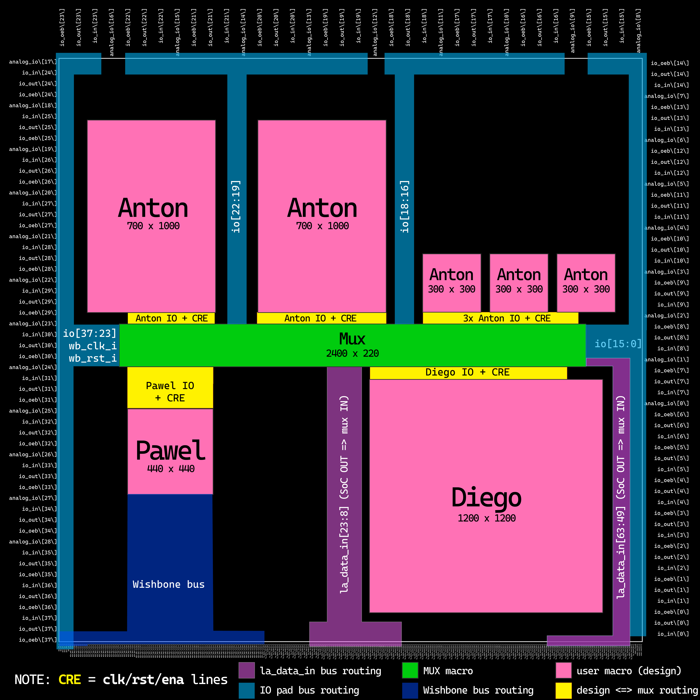

# 9 Dec 2023

| Previous journal: | Next journal: |
|-|-|
| [**0186**-2023-12-08.md](./0186-2023-12-08.md) | *Next journal TBA* |

# GFMPW-1 mux and group plan

# Proposed die layout

# Spec for GFMPW-1 mux

*   Anton's designs need 13 LA inputs.
*   Pawel's design needs 16 LAs. Are these all inputs, outputs, or bidir? How many pins total?
*   Pawel's design also needs WB, and can probably have it exclusively.
*   Diego's design doesn't need LA or WB...?
*   Make sure no mux state can lead to contention or lockup.
*   Keep repeating io_in to all designs, always.
*   Keep repeating clock input (wb_clk_i) to all designs, always.
    *   Why? 
     -- but OR it with other reset logic
*   LA control signals:
    *   Design select: 4 inputs from LA, 1-of-16 selection.
    *   Reset mode, e.g. use wb_rst_i or not -- i.e. optionally OR it with other reset logic. Why? So we can control whether a wb_rst_i resets all designs, or just resets the SoC. Failsafe.
    *   Reset lines -- why? Want SoC to be able to control reset for individual designs.
*   Control signals from LA to be 2xDFF-buffered, with no reset (or optional reset via io[0]).
    *   i.e. assert desired signal on LA pins, then pulse another LA pin twice to register (i.e. to clock it in).
    *   Why no reset? Want to be able to persist configured state between wb_rst_i resets.
    *   Why 2xDFF? In case asserting wb_rst_i causes an LA glitch.
*   **NOTE:** Individual reset lines might NOT 
*   Offer to each design:
    *   clk
    *   rst
    *   ena -- doesn't have to be used, but asserted when the design is the one currently selected.

# Using LA pins to control the mux

## Summary of LA-to-mux-control mapping

| `la_data_in[]` | Mux control signal input | Registering                    |
|---------------:|--------------------------|--------------------------------|
|             49 | `i_mux_sel[0]`           | 2x `mux_conf_clk` rising edges |
|             50 | `i_mux_sel[1]`           | 2x `mux_conf_clk` rising edges |
|             51 | `i_mux_sel[2]`           | 2x `mux_conf_clk` rising edges |
|             52 | `i_mux_sel[3]`           | 2x `mux_conf_clk` rising edges |
|             53 | `i_mux_sys_reset_enb`    | 2x `mux_conf_clk` rising edges |
|             54 | `i_mux_auto_reset_enb`   | 2x `mux_conf_clk` rising edges |
|             55 | `i_design_reset[0]`      | Unregistered                   |
|             56 | `i_design_reset[1]`      | Unregistered                   |
|             57 | `i_design_reset[2]`      | Unregistered                   |
|             58 | `i_design_reset[3]`      | Unregistered                   |
|             59 | `i_design_reset[4]`      | Unregistered                   |
|             60 | `i_design_reset[5]`      | Unregistered                   |
|             61 | `i_design_reset[6]`      | Unregistered                   |
|             62 | `i_design_reset[7]`      | Unregistered                   |
|             63 | `mux_conf_clk`           | Unregistered (clock for others above) |

## Details

*   The mux has control signal inputs that all come from pins of the LA. They are as follows...
*   There are 8 incoming active-high reset lines, one for each design. On the mux side, these are ***un***registered, thus:
    *   Firmware can directly assert reset for any (or all) designs via LA.
    *   These reset lines connect to each respective design via combinatorial logic, and will always pass a `1` (i.e. they are OR-ed with any other reset logic in the mux).
    *   Thus, while other reset logic *may also* be configured to assert reset, these 8 reset lines cannot be masked out when asserted.
*   There are internal mux control registers:
    *   select the active design; and
    *   specify additional reset behaviour affecting all designs.
*   There is a `mux_conf_clk` line for loading the internal mux control registers. As with all the other control signals, this is driven by an LA pin.
*   The internal registers are each implemented as 2xDFF:
    *   Thus, in order for an update to the internal mux control registers to take effect, the desired register state must be asserted on the respective LA pins for **two** rising edges of `mux_conf_clk`.
    *   It is designed this way so that *if* there are any spurious signals/glitches on the LA lines (say, during a system-wide `wb_rst_i`), then the internal state of the mux registers is far less likely to be corrupted (and hence a selected design can remain selected and active even across system resets).
    *   **NOTE:** To support this objective, **no reset** is provided for the internal mux control registers. Thus, assume the registers will start up in a random state.
        *   **Addendum:** I MIGHT LATER include an **async reset** that can be driven via (say) `GPIO[5]`. It could thus be configured (via `user_defaults`) to default to a `USER_INPUT` (and is a `MGMT_INPUT` input anyway, i.e. `ser_rx` when used by the SoC).
*   The actual internal mux control registers are:
    *   `mux_sel[3:0]`: 1-of-16, select the active design (i.e. the single design that is connected to chip outputs). Note that only IDs 0..7 are for selecting user designs. The others 8..15 are for different mux tests and proof-of-life logic.
    *   `mux_sys_reset_enb`: 0=enable (wb_rst_i will reset all designs); 1=disable (wb_rst_i is detached from all designs).
    *   `mux_auto_reset_enb`: 0=enable (unselected designs are held in reset); 1=disable (unselected designs can be free-running).

Notes:
*   Put `mux_conf_clk` on LA[63] so it has shortest path (fastest slew), then make all the others part of LA[62:49], plugged into RHS of mux. This allows Pawel and Anton to use LA bank 0 (shared?) (perhaps [23:8] nearest the middle, for a total of 16) for their design signals, and reserve LA blank 1 for system stuff... simplifies firmware.
*   A future design could modify the mux to use SPI, such that it only requires a small number of pins, and more-naturally gets 'glitch tolerance'... since it would be an 8-bit load before it is considered valid, and an aborted load (i.e. `/CS` being released early) would be discarded.
*   Need to provide example firmware.
*   By default should reset lines be active-LOW? i.e. assuming the LAs are all low after reset, is this a safer way to ensure NO designs are running at power-on (and hence we have maximum stability for the SoC)?
*   `wb_rst_i` could cause LAs to glitch in a way that resets a design that was meant to remain active *through* a system reset... but do we care? Anton was trying to avoid this for his own design, but it might not matter.
*   Do I need an extra/special reset for raybox? Could THAT come from IO[0], and just be OR-ed down the chain? Would anyone else need it? It could be enabled/disabled with an extra register: `mux_ext_reset_enb`?

## Example of controlling the mux via firmware

TBC.

# What I need now

*   Consider whether we will be able to include scorbetta.
*   Get link to Pawel's repo/branch.
*   Get link to the correct branch of Diego's repo; make sure WB/LA are not used in this design.
*   Share final layout and mux design with everyone, allowing them enough time to make adjustments.
*   Make changes to pin placement for designs, esp. Diego's
*   Work out ideal mapping of ports to pins for each person's design -- this can be done within the mux.
*   Update my OWN designs.
*   Create tests esp. for flowing thru mux.
*   Check SDC for port names in mux, etc.

# Other goals

*   user_clock2?

# Notes for everyone

*   Because all user_defines specify INPUTs by default, we shouldn't have a problem with power-on leading to bus contention. Firmware will be allowed as much time as it wants to select the desired design, register it and its reset config, assert individual reset lines as desired, configure GPIOs, then change reset lines.
*   Things that could go wrong:
    *   No CTS for mux_conf_clk... or should there be?

# Group video call

*   Without Meechy's design, WB is freely available to Pawel...?
*   Is it necessary to include the code for all macros actually within the submitted repo?
*   Confirm: Does Pawel need: full WB; some IOs inc. bidir; 16 LAs INTO design (or OUT FROM too??)
*   Unlikely we'll get selected, but certainly not the worst odds.
*   I might need to modify pin placement (or ask you to, if it's important to be under your own control) to better align with the mux.
*   There's an option for direct INPUTs into some design edges, but also instead via a common bus in the mux.
*   Explain the mux and why.
*   Mux CLOCK_PERIOD is slow, because actual `mux_conf_clk` change rate is slow over LA. Is this OK? It can also be slowed down (i.e. firmware delays) if needed.
*   My goal is to push the repo to efabless about 24 hours from now, then if you want to check your own respective part of the wiring, you can let me know if I've made a mistake, or just go ahead and fix it yourself.
*   Hardening issues for Diego: Where are you up to with your design?
*   What would happen if I turned the bus routing regions into actual macros, to help confine them but also pin-space them? Buffers would be inserted, and I could possibly force this to be increased.
*   Any final requests? Add them to the shared Google Sheet, and ping me to let me know.

# Changes

*   Got rid of i_reset_alt from trzf design. After that, we'd need only 12 LAs.

# TODO

*   Check the Google Sheet for any updates.
*   Update SDCs esp. for mux. HOLD VIOLATIONS! Why only on LA[55]? Maybe because it's the only one connected? No, so is LA[56]...? 55 is most distant. Does the problem only emerge during *changing*?
*   Offer Pawel a reset IO to strap. Same as Diego.
*   Only Anton needs LA now.
*   Consider adding buffers to long wires in mux.
