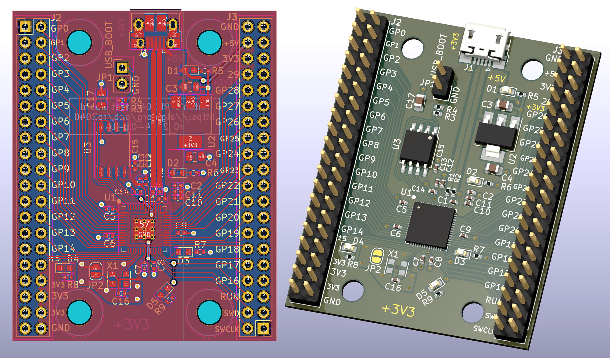
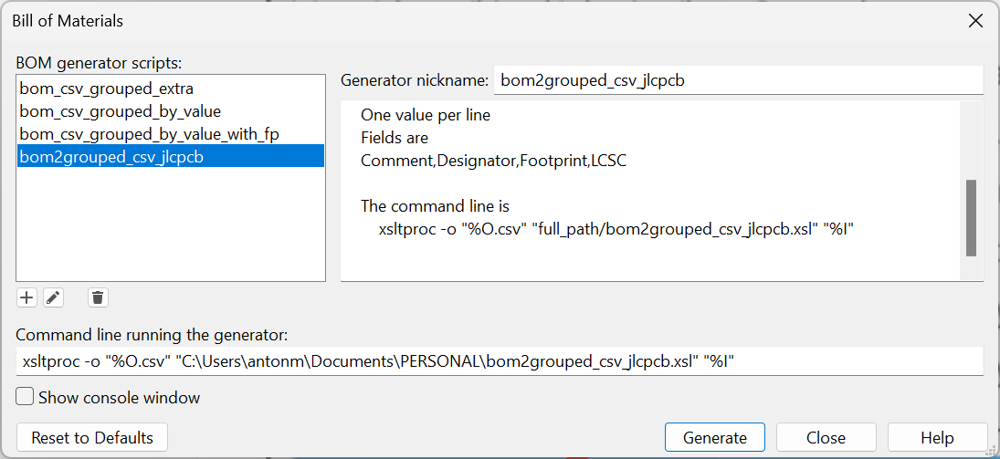
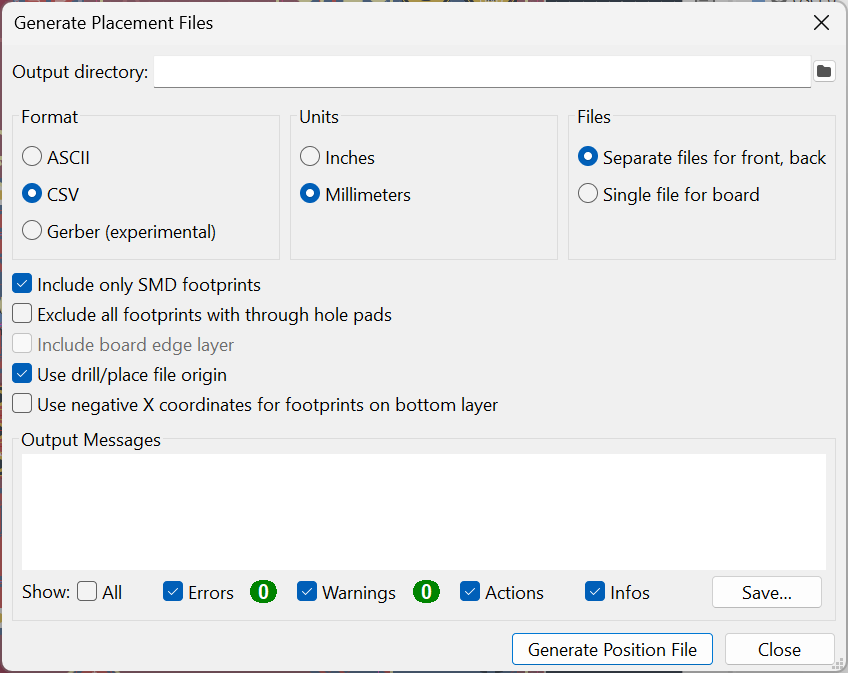

# 17 Jan 2024

| Previous journal: | Next journal: |
|-|-|
| [**0189**-2023-12-11.md](./0189-2023-12-11.md) | *Next journal TBA* |

It's been 4 weeks since my last update. From that time I have some things I need to come back and document, including:
*   QFN breakout board design
*   Pawel's fixed test for HyperRAM
*   Prep for TT03p5 bring-up
*   GFMPW-0 chips coming from Tholin

# PCB assembly with JLC PCB

I've been working on a simple RP2040 board to get experience in JLCPCB's PCBA (PCB Assembly) service.

Board design is informed by the [RP2040 hardware design guide](https://datasheets.raspberrypi.com/rp2040/hardware-design-with-rp2040.pdf).



The board is a little untidy but hopefully electrically valid. Some of the untidiness is because this is just a test anyway, and I also wanted to try out a few things to see what would happenw ith JLCPCB.

Reminders about some things that I needed to do:
*   While JLCPCB's parts business is LCSC.com, you need to use https://jlcpcb.com/parts to search for parts that are actually available for the assembly service.
*   'Basic' parts have no setup fee, while 'Extended' parts do. Prefer basic parts where possible.
*   Needed to set the origin for drills and placement. I put this in the middle of the RP2040 (as did the reference design). Would the board corner be better?
*   USB-Micro-B mounting I used is a through-hole variant, which may incur extra cost. This is good for strength, but would a fully-SMD version be cheaper?
*   I had to alter the KiCad 7 QFN-56 default footprint assigned to RP2040 to make it more suitable: EP (External Pad) needed an array of 9 vias, and thus solder paste rectanges needed adjusting.
*   There were 3 remaining DRC warnings about thermal relief spokes, but I think this is just because the zones themselves didn't have enough spokes, while extra traces I added should make up for this (as the reference design did).
*   Not sure if the signal traces are OK for the SPI ROM: one side are long, and all are tightly-packed. Possible coupling issue?
*   While the reference design used a crystal with the RP2040's internal oscillator, I opted for an actual XO. This was for the sake of being different, but also because the 27pF caps are a JLCPCB Extended part, so there is not much of a price benefit to just using an XTAL.
*   1mm board thickness has been selected for impedance matching of the USB data lines. This might be more expensive with JLCPCB though... I might risk it with 1.2mm instead.
*   I had an issue with some footprints using 3D models that were outdated: They referred to KiCad 6 paths, and the respective model files no longer existed. I found alternatives for 2 of the 3 parts affected.
*   Using the Schematic Editor's table (bulk edit) for component properties sped up a lot of stuff.

This is the JLCPCB guide I'll try using to generate the BOM and placement (CPL aka Centroid) files: [How to generate the BOM and Centroid file from KiCAD](https://jlcpcb.com/help/article/81-How-to-generate-the-BOM-and-Centroid-file-from-KiCAD)

My guide:
*   Make sure the origin is placed somewhere. I went with the middle of the RP2040 chip.
*   [Add tooling holes](https://jlcpcb.com/help/article/47-How-to-add-tooling-holes-for-PCB-assembly-order)
*   Optionally tick 'Exclude from bill of materials' in the Symbol Properites for components that won't be assembled, e.g. R3 (DNF) and large through-hole stuff like pin headers.
*   Main articles for preparing assembly files:
    *   [How to generate the BOM and Centroid file from KiCAD][JLC BOM guide]
    *   [Bill of Materials(BOM) File for PCB Assembly](https://jlcpcb.com/help/article/45-bill-of-materials-for-pcb-assembly)
    *   [Pick & Place File for PCB Assembly](https://jlcpcb.com/help/article/46-pick-place-file-for-pcb-assembly)
*   Diode orientation: "DFM ANALYSE" looking for `+/-` markings and IC dots? JLC [recommend](https://jlcpcb.com/help/article/39-pcb-assembly-faqs-part-2#:~:text=How%20do%20we%20judge%20the%20polarity%20for%20the%20components) silkscreen markings, but are these irrelevant given a CPL?
*   With the PCB layout ready to go, and following the [JLC guide][JLC BOM guide]:
    1.  I've already added the `LCSC` property for all parts that require assembly.
    2.  Let's try different methods to generate BOM and CPL...
        *   JLC's BOM method:
            1.  Download the ZIP of [Arturo's XSL for doing the export](https://gist.github.com/arturo182/a8c4a4b96907cfccf616a1edb59d0389). Note that this was last revised on 2020-07-06.
            4.  Extract the one `bom2grouped_csv_jlcpcb.xsl` file and put it somewhere more permanent (e.g. `Documents`?)
            5.  Go into KiCad => Schematic Editor => Tools => Generate BOM...
            6.  Click the `+` button to add a new generator, select `bom2grouped_csv_jlcpcb.xsl`, and let it keep the default nickname.
            7.  Details should be populated automatically:
                
            8.  Tick 'Show console window' and click 'Generate' (though it will possibly not stay on-screen anyway).
            9.  There will hopefully be a success message in the BOM window:
                ```
                xsltproc -o "C:/Users/antonm/Documents/PERSONAL/projects/sandpit/pcb/kicad/RP2040/rp2040_pcba_test/rp2040_pcba_test.csv" "C:\Users\antonm\Documents\PERSONAL\bom2grouped_csv_jlcpcb.xsl" "C:\Users\antonm\Documents\PERSONAL\projects\sandpit\pcb\kicad\RP2040\rp2040_pcba_test\rp2040_pcba_test.xml"
                Success.
                ```
                Generated file in this case is: `C:/Users/antonm/Documents/PERSONAL/projects/sandpit/pcb/kicad/RP2040/rp2040_pcba_test/rp2040_pcba_test.csv` -- it is made from the `.xml` input file.
            10. Resulting CSV file details:
                *   Probably need to delete any lines that don't have an LCSC part number, i.e. that should not be assembled.
                *   'Comment' (value) might need to be improved.
                *   'Footprint' might be unacceptable: Doesn't match LCSC at all.
        *   JLC's CPL method:
            1.  Go to PCB Editor => File => Fabrication Outputs => Component Placement (.pos)
            2.  Use the following settings (where I decided to go with 'Include only SMD footprints' because this should exclude only the header pins):
                
            3.  Click 'Generate Position File'
            4.  Expect no errors/warnings. For me, the component count was 36.
            5.  Resulting CSV file is: `C:\Users\antonm\Documents\PERSONAL\projects\sandpit\pcb\kicad\RP2040\rp2040_pcba_test\rp2040_pcba_test-top-pos.csv` -- also `...-bottom.csv` but verify this is empty.
            6.  Edit that CSV to rename columns as follows:
                ```
                Ref  => Designator
                PosX => Mid X
                PosY => Mid Y
                Rot  => Rotation
                Side => Layer
                ```
            7.  Delete parts that shouldn't be assembled, e.g. R3 (set to `DNF`, "do not fit").
            8.  NOTE: This file uses KiCad footprint suffix as 'Package', and is reflected in JLCPCB's example screenshots, but not sure if this is good.
        *   ['Fabrication Toolkit' plugin](https://github.com/bennymeg/JLC-Plugin-for-KiCad) (from comments on [Arturo's script](https://gist.github.com/arturo182/a8c4a4b96907cfccf616a1edb59d0389)):
            1.  NOTE: Updated quite recently, supposedly supported by KiCad 7.x OK.
            2.  Go to KiCad main project screen => Plugin and Content Manager
            3.  Filter for `jlc`
            4.  Select 'Fabrication Toolkit' and click 'Install'
            5.  Then click 'Apply Pending Changes' in bottom-right to ACTUALLY install it.
            6.  NOTE: Avoid using `User_1` layer because I think the plugin uses this for V-Cuts.
            7.  NOTE: Don't follow the part of the instructions where it recommends ticking 'Exclude from board' for any parts that should be excluded from production files.
                *   The tooltip for this option exlpains this would exclude it from the PCB Editor, and certainly after doing an update with this ticked I found that it created DRC errors for already-placed footprints that are DNF.
                *   When I tried to reverse this, noting that both before and after I had saved the schematic and updated/saved the PCB, it then caused the components to be placed again with new internal references, so I had to delete the original ones and place the new ones. Such a pain!
            8.  Go to PCB Editor and update it from schematic (to make sure all updates in Schematic editor are populated in PCB properties too).
            9.  Run DRC, just to be safe.
            10. For footprints that should not be populated, in PCB Editor select the respective part footprints, go to edit properties, and tick both 'Exclude from BOM' and 'Exclude from opsition files'.
            11. NOTE: For components that need rotation correction with respect to JLC parts, either `rotations.cf` defines this already, or add a `JLCPCB Rotation Offset` field to symbols and enter extra rotation in degrees (where negative numbers are clockwise). **NOTE:** This is done in the schematic *Symbol* properties, which must then be saved, and updated into the PCB layout, and then that must be saved. **Likewise** positional offsets can also be applied: `JLCPCB Position Offset` is the field, and the coordinates are a comma-separated string, e.g. `-2.54,0.5`. There's also `JLCPCB Layer Override` which can be set to `top`/`t` or `bottom`/`b`
            12. To export production files now, the PCB Editor should have a new toolbar button at the end called 'Fabrication Toolkit'. Click it, and it should spit out a folder of the format `./production/PROJECTNAME_YYYY-MM-DD_HH-mm-ss`. In there:
                ```
                bom.csv                 - BOM, with SOME footprints converted to JLCPCB format, but not all.
                designators.csv         - Unsure: Lists each designator with `:1` on the end. Includes 'excluded' refs. Maybe just for checking counts?
                netlist.ipc             - IPC-356 netlist file for electrical testing?
                positions.csv           - Component placements
                rp2040_pcba_test.zip    - Gerbers, all with .gbr and .drl extensions (despite JLCPCB's recommendations)
                ```
            13. I don't think there's an override for footprints, so for the ones that didn't convert automatically I guess I need to put them into `bom.csv` manually. These are the ones I had to do:
                ```
                X1: Oscillator_SMD_EuroQuartz_XO32-4Pin_3.2x2.5mm   => SMD3225-4P
                U3: SOIC-8_5.23x5.23mm_P1.27mm                      => SOIC-8-208mil
                U2: SOT-223-3_TabPin2                               => SOT-223-3
                U1: QFN-56-RP2040-Anton                             => LQFN-56(7x7)
                J1: USB_Micro-B_Amphenol_10103594-0001LF_Horizontal => JLC JUST CALLS IT 'SMD'
                ```
            14. Rotation fixes:
                *   U3 90CW
                *   U2 180
                *   X1 90CW
        *   Uri's combo method:
            1.  Not yet tested. I ended up being happy with the results of the Fabrication Toolkit above.
            2.  Uri's [wokwi/kicad-jlcpcb-bom-plugin](https://github.com/wokwi/kicad-jlcpcb-bom-plugin), but might be outdated: Last updated April 2023, but that was the first time in years, and README still refers to KiCad 5.x.
*   Things to consider in BOM:
    *   'Comment' column providing a formal 'value' for each component in order to help JLC/LCSC do matching, e.g. `0.1uF`, `4K7`, `330R`.
    *   'Designator': String, comma-separated, listing each component reference (e.g. `R1,R3,R4`) of that respective 'Comment' value. Probably very important for PCBA.
    *   'Footprint': e.g. `0402`, or maybe other footprint values from JLCPCB's references, such as `SMD3225-4P` for [this XO](https://jlcpcb.com/partdetail/Yxc-OT2EL89CJI_111YLC12M/C5280582). Note that this typically does *not* match KiCad.
    *   'LCSC part Number' or just 'LCSC'? e.g. `C5280582` -- probably the best way to identify an exact component/footprint.

Things to beware:
*   Proper footprint matching
*   Confirm all components to place
*   Correct orientation esp. with 'dot'
*   Check [minimum component spacing](https://jlcpcb.com/help/article/41-SMD-Components-Minimum-Spacing)
*   Check coupons!
*   JLCPCB [list of basic parts and extended parts that do not incur extra cost in 'Economy' assembly service](https://jlcpcb.com/parts/basic_parts)

Notes:
*   [List of basic *and PREFERRED Extended* parts for JLC PCBA](https://jlcpcb.com/parts/basic_parts) -- 'Preferred' extended parts don't have any additional loading fee when used with the *Economy* PCBA service.
*   KiCad PCB editor => File => Fabrication Outputs => BOM... generates a file that is less useful.
*   [KiJLC](https://github.com/fullyautomated/KiJLC) is a plug-in to generate BOM/CPL, with instructions on correct property naming for footprints and LCSC part numbers, but note:
    *   Not updated since May 2021.
    *   Relies on python3
    *   > Right now KiCad footprint specifiers are not being converted to JLC ones, but this could be implemented in the future.
*   Updates 2024-01-18:
    *   Improve part 'values' (e.g. `1u` => `1uF`)
    *   Flag 'Exclude from BOM' on relevant parts
*   Try the [Round Tracks plugin](https://github.com/mitxela/kicad-round-tracks)?

[JLC BOM guide]: https://jlcpcb.com/help/article/81-How-to-generate-the-BOM-and-Centroid-file-from-KiCAD
