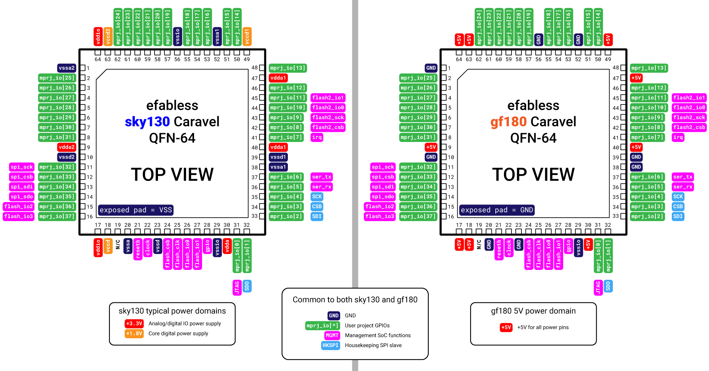
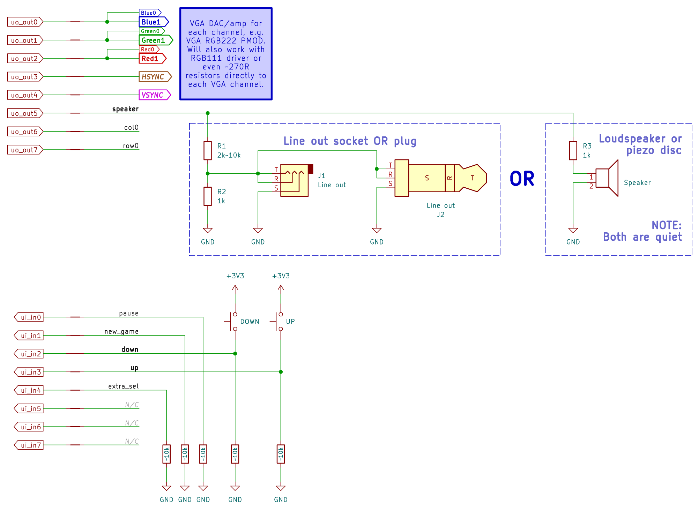

# 31 Jan 2024

| Previous journal: | Next journal: |
|-|-|
| [**0190**-2024-01-17.md](./0190-2024-01-17.md) | *Next journal TBA* |

It's been another couple of weeks since my last udpate, but I am still busy with other happenings and a number of hardware projects.

So far, these are just rough notes of things I need to document (or work out) of late.

# Soldering QFNs and GFMPW0 bring-up

TBC:
*   QFN breakout boards
*   RP2040 QFN56 0.4mm
*   RP2040 test boards assembled by JLCPCB
*   Soldering steps for GFMPW0 QFN64 0.5mm
*   Tigard
*   GFMPW1 acceptance
*   GFMPW0 chips from Tholin
*   Guides/tips for GFMPW0 bring-up
*   TT3p5 testing guide and upython code

# GFMPW0

## Work out the correct pinout

References:
*   [Caravel M.2 QFN card](https://github.com/efabless/caravel_board/blob/main/hardware/breakout/caravel-M.2-card-QFN/caravel-M.2-card-QFN.pdf) -- GFMPW0 has same pinout (?) as sky130 chips, except all positive voltage pins are +5V instead of varied power domains.
*   [Caravel development board version 6B for GF180 5V](https://github.com/efabless/caravel_board/tree/main/hardware/development/caravel-dev-gf180-v6-M.2) -- used for GFMPW0 and probably also GFMPW1?
*   With the two above, we can map QFN pins to actual termination in the dev board, because I think the same M.2 QFN card is used for mounting both sky130 and gf180 chips.
*   Could [this](https://github.com/efabless/caravel_board/blob/main/hardware/footprints/Caravel_Board.pretty/QFN64_(9x9)_0.5_CL_Test_Socket.kicad_mod) be a Caravel QFN64 footprint? It says 'Test socket'
*   Not so important, but [this](https://github.com/efabless/caravel_board/blob/main/docs/64L-QFN-9X9-50P-MOD.pdf) confirms pin arrangement on the package top and bottom views.
*   [WLCSP pin descriptions for sky130](https://github.com/efabless/caravel_board/blob/main/docs/caravel_datasheet.pdf)
*   [Caravel QFN64 bond diagram showing top-view package pin descriptions](https://github.com/efabless/caravel_board/blob/main/docs/caravel_qfn_bond.pdf)
*   [The SVG file under the 'Die arrangement and pads' heading](https://caravel-harness.readthedocs.io/en/latest/supplementary-figures.html#die-arrangement-and-pads) is not correctly zoomed, but if you right-click and save that image, then open in (say) Adobe Illustrator, you can see a lot of extra info about the pins, including the secondary functions of `mprj_io[37:32]`
*   Tim Edwards [explains flash2](https://open-source-silicon.slack.com/archives/C022XAPHD9C/p1673283268113019?thread_ts=1673257042.880519&cid=C022XAPHD9C)

TODO: Check with others who have GFMPW0 chips, whether they have used them on their own PCB designs.

Here's my attempt to create a [nice diagram](./files/0191/caravel-qfn-pinouts.ai) of the Caravel QFN-64 pinouts:

# TT03p5 demo

*   Include lots of photos in guide to show what's expected of oscilloscope, etc.

*   Schematic:
    *   **Clock/reset sources**
    *   ~~ui_in buttons and pulldowns~~
    *   ~~uo_out VGA signals, inc. RGB111 and double-up for RGB222~~
    *   ~~Speaker (voice coil) vs. piezo (speaker not buzzer) vs. line-out levels~~

    Here's a draft schematic:

    

*   Audio out:
    *   Assume max 4mA for GPIO source/sink, tho TT04 board assumes 20mA. RISK: With 4mA *plus* existing hardwired LED 20mA, we're over the limit.
    *   For 8&ohm; speaker, min resistance should be 820&ohm; so 1k&ohm; is probably safest.
    *   For piezo speaker, ~560&ohm; would probably be safe. Easier just to go with 1k&ohm; anyway.
    *   For line level (i.e. line out, or 'aux'):
        *   Target is ~1.4V, and input impedance is perhaps 10k&ohm;...
        *   ...so we could go with 10k&ohm; in series to get ~1.65V or two of them (20k&ohm;) to get ~1.1V.
        *   OR better to use a low-impedance voltage divider? Say, 2x1k high side, 1k low side, or 1k:470R (~1.055V).
    *   General designs:
        *   Good: 10k&ohm;
        *   Better: 1k&ohm;:470&ohm; divider or even just a pot (no less than 1k!) => ~1.055V
        *   Best: R in series with pot and filter caps (both high- and low-pass)

*   Should be possible to hear LZC outputs?

*   Test unregistered outputs
