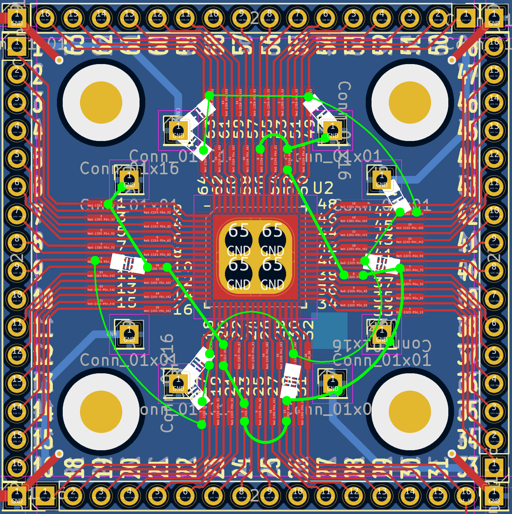

# 2 Feb 2024

| Previous journal: | Next journal: |
|-|-|
| [**0191**-2024-01-31.md](./0191-2024-01-31.md) | *Next journal TBA* |

# More GFMPW0 bringup prep and other notes

## GFMPW0/1 stuff

*   Use my GFMPW-1 final tapeout GDS file to inspect:
    *   Routing from pads (esp. power and GND).
    *   POR circuit.
    *   ROM/ID area.
    *   Details of gf180 memory blocks, e.g. `gf180mcu_fd_ip_sram__sram512x8m8wm1`
    *   Other SoC and padframe features.
*   What does the EP (QFN External Pad) connect to on sky130 and gf180 chips? Is it strictly thermal for the die, more like a ground plane (i.e. not connected but EM-significant), or actually a connected electrical base?
*   Do hand soldering layout plan for GFMPW0 breakout.
*   Learn HKSPI. Plan to read chip ID.
*   Update pinout diagrams and plan to submit to caravel doco (but make sure they actually accept updates). Check findings with Discord first?
*   Learn Tigard -- will it tolerate 5V OK for GFMPW0?

I've made a quick plan for placement of power/GND wiring and decaps on my GFMPW0 breakout board:

Overall plan for starting GFMPW0 bringup:

*   Test for any relationship between EP and other pins, esp. VSS pins: 1, 10, 20, 23, 29, 38, 39, 52, 56 (and check they short with each other)
*   Check all power pins are shorted: 9, 17, 18, 30, 40, 47, 49, 63, 64
*   Join all power pins: 9 total
*   Join all GND pins and EP (GND fill): 10 (inc. EP)
*   NOTE: For now, just try joining pins by making an "octopus" harness?
*   Binding post for each rail
*   Place incoming power region with big tank cap (1u or 10u?)
*   Header pins on (say) 17..32 and 33..48 -- maybe use 'stacking headers'?
*   100nF decaps on at least all power "islands" (7)
*   Wire up (via R?) `resetb` (pin 21) and `clock` (22) to GND.
*   Pull `CSB` (34) high with 10k
*   Before power-up, take measurements.
*   Power up, measuring single-shot:
    *   Power after tank cap.
    *   Current: Try 1&ohm; shunt resistor voltage drop. Back of envelope, with 5V and 1&ohm; vs. loads:
        *   0.1mA:  Given V=IR, 0.0001A over 1R is 0.0001V: Effectively 0, too small to measure.
        *   1mA:    1mV.
        *   10mA:   10mV.
        *   100mA:  100mV.
        *   200mA:  200mV: ~4.8V
        *   These might be too small for scope, in which case we can try a bigger shunt, but probably no more than 2.2&ohm;.
        *   NOTE: Put shunt resistor on LOW side (i.e. to GND).
    *   2 other digital signals, e.g. any two of:
        *   gpio (28)
        *   flash_csb (24)
        *   JTAG (31)
        *   SDO (32)
*   Check temperature of chip, esp. if current seems high.
*   Probe other pins using DMM -- are any presenting a voltage? Try the reverse too: Are any pulling to GND, even weakly?
*   Make next plan: Slow switching of reset, clock, HKSPI, etc... then switching by 'host' (e.g. Tigard).

## Possible VGA clock PCB revs

Ask Matt first.

*   Approach: show smaller steps in stages towards tidying up and then changing the board. Easier to follow, verify and sign off.
*   Create space and tidy up:
    *   Align/compress 3 pushbuttons on the right.
    *   Align/compress VGA signal tie-offs at the bottom.
    *   Position front silkscreens well
    *   Tidy up traces on LHS of board
    *   Move C7 to be adjacent pin 49
*   Create more space:
    *   Stagger and re-route VGA signal vias and traces
    *   Rearrange parts at top
    *   Spread things out as much as possible to help with future pad placement
*   Add test points:
    *   Add test points to schematic with special 'compact' footprint.
    *   Shove in test points on PCB
    *   Move back silkscreens around to avoid overlap, and to make it prettier

## Future revs for my QFN breakouts

*   More solderable pads (areas with no solder mask)
*   Maybe a few different planes (i.e. filled rects) that can be used for pos/neg
*   Extra header pins that are joined (or joinable) in groups for any purpose
*   Slightly smaller EP to avoid possible bridging to pins
*   Option to NOT connect EP directly to fill: Solder jumper pads?
*   Region for power, i.e. USB (or other) power in, big decaps, even possible VREG area.
*   Array of (assembled) LED test points

## Other stuff

*   I made a [template](./files/0192/qfn64-breakout-pinout-template.ai) for use with my QFN64 breakout, to help with planning bodges and wiring using its pinout and test pads.
*   Finish tt03p5-solo-squash testing notes/schematics.
*   Merge PRs: Pawel, Pat. Also check Uri's 'commander' notes.
*   Learn Tigard -- will it tolerate 5V OK for GFMPW0?
*   Go back and complete doco for [0191](./0191-2024-01-31.md)
