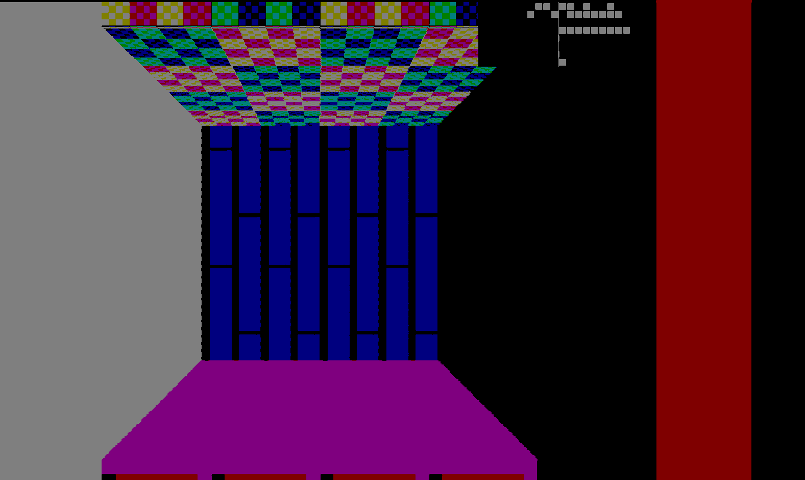
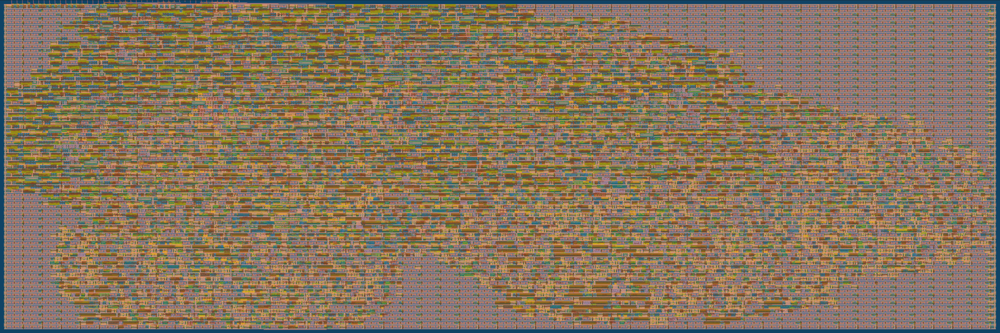

# 2 Apr 2024

| Previous journal: | Next journal: |
|-|-|
| [**0196**-2024-03-30.md](./0196-2024-03-30.md) | *Next journal TBA* |

# Diagnosing tt04-raybox-zero ASIC malfunction

## Summary

Sylvain (@tnt) has been testing the TT04 ASIC with raybox-zero 1.0 on it, and my design has some problems. This animation shows one exact, specific view, comparing how Verilator renders it and how the ASIC actually renders it:



Note the following:
*   This is taken from a raw capture at 3MHz, but it looks like the same artefacts occur at 19MHz (and maybe 24MHz).
*   Using the debug box in the top-right, the scale is *very* close between the two images, despite it looking like the glitchy one is shrunken. This suggests there is an overall coarse error in the distance calculation.
*   The colours are weird because of the specific RGB channels that Sylvain was able to capture at the time. I made some adjustments to match my Verilator version as closely as possible.
*   This version of raybox-zero (from memory?) starts the texel counter from the bottom of the wall column, rather than pre-calculating it via multiplication. It then stops rendering the texture when the texel counter overflows 1.0 (or 63?), which has led to some rendered examples showing what look like short walls, but they're actually errors (I think) in the texture scaling.

I think this generally suggests that the reciprocal is not (always) working correctly. It might have single-bit errors, but it's hard to tell so far.

The first step to trying to work out what's going on is to make sure we can regenerate the original GDS and other build/synthesis artefacts from the time I did this submission...

## tt04-raybox-zero 1.0

*   [Tag link](https://github.com/algofoogle/tt04-raybox-zero/releases/tag/1.0)
*   [Source files, commit `d6ab74c`](https://github.com/algofoogle/tt04-raybox-zero/tree/d6ab74c93b3e098356549392840495d5ada5d6fd)

### Checking the repo:

*   Linked to raybox-zero v1.0 (commit `1029ddb`)
*   There are no tests; I must've just used Verilator (the sim) the whole way thru!

### Synth:

*   I recall I was doing synth on my L7 laptop, in which case likely VM is "Zerto to ASIC Course MPW8".
*   Other possible VM is "Zero to ASIC Course MPW8" on my desktop PC. It has a snapshot called "Before TT04 OpenLane", but then "Before Analog".
*   I will go with checking on the former, first...
*   Default environment:
    *   PDK dirs were created 2022-12-29
    *   PDK (sky130A) hash is: `3af133706e554a740cfe60f21e773d9eaa41838c`
*   `~/CUP` linked to: `/home/zerotoasic/asic_tools/caravel_user_project`
*   CUP is the `ew` version
*   Final TT04 submission was around 2023-09-11, so look for journals near there.
*   `~/anton/projects/tt04-raybox-zero` is dated 2023-09-10... could be the one I'm looking for.

### Instructions for doing synth locally:

Background:
*   Journal 0126 where I attempted it in MPW8 VM: https://github.com/algofoogle/journal/blob/master/0126-2023-08-19.md
*   My own original guide: https://github.com/algofoogle/anton1-tt03#building-gds-locally
*   Official TT guide, but at the time this document might've been different (and has since been updated for TT05?): https://docs.google.com/document/d/1aUUZ1jthRpg4QURIIyzlOaPWlmQzr-jBn3wZipVUPt4/edit#heading=h.wwc5ldl01nl5
*   Tip [2308A](https://github.com/algofoogle/journal/blob/master/tips/2308A.md): Tiny Tapeout local GDS hardening (from 2023-08-22, per [0129](https://github.com/algofoogle/journal/blob/master/0129-2023-08-22.md), for TT04).
*   [`tt-gds-action` release `tt04`](https://github.com/TinyTapeout/tt-gds-action/releases/tag/tt04) - strangely, this is dated 2023-09-13, which maybe means it was reassigned because I can see that htis branch/tag was used at least as far back was 2023-06-15.

Steps:

1.  Before I muck around with anything, I'm doing a snapshot of the VM: `Before TT04 2024 reharden`
2.  Clone a new copy of tt04-raybox-zero at version 1.0:
    ```bash
    cd ~/anton
    git clone \
        -b 1.0 \
        --recurse-submodules \
        git@github.com:algofoogle/tt04-raybox-zero \
        bringup-tt04-raybox-zero
    cd bringup-tt04-raybox-zero
    ```
3.  Set up OpenLane environment to match what I originally had for my TT04 submission:
    ```bash
    export OPENLANE_ROOT=~/tt@tt04/openlane
    export PDK_ROOT=~/tt@tt04/pdk
    export PDK=sky130A
    # This OpenLane version is using the one specified
    # in tt-gds-action@tt04 from 2023-09-13 (24271d1)
    # (https://github.com/TinyTapeout/tt-gds-action/blob/24271d1a569576b6a161ee93ef04fa2aa2e641ab/action.yml#L14-L15)
    # ...which at least seems to be the same one I was using back in the day
    # (https://github.com/algofoogle/journal/blob/master/0127-2023-08-20.md)
    export OPENLANE_TAG=2023.06.26
    export OPENLANE_IMAGE_NAME=efabless/openlane:3bc9d02d0b34ad032921553e512fbe4bebf1d833
    ```
4.  Clone TT support tools (`@tt04`) into '`tt`' subdidr of `bringup-tt04-raybox-zero`, and prep its Python env:
    ```bash
    cd ~/anton/bringup-tt04-raybox-zero
    git clone -b tt04 https://github.com/TinyTapeout/tt-support-tools tt
    #NOTE: This wasn't the version I used at the time, because that tt04 branch
    # is now up to 2023-11-10. I would've used somewhere around here:
    # https://github.com/TinyTapeout/tt-support-tools/commit/dac3f4a0a4527ca7c65ce44987bdb2eaa25f5525

    python3 -m venv ~/tt@tt04/venv
    source ~/tt@tt04/venv/bin/activate
    pip install -r tt/requirements.txt
    ```
5.  Set up OpenLane to match the required version for TT04:
    ```bash
    git clone --depth=1 --branch $OPENLANE_TAG https://github.com/The-OpenROAD-Project/OpenLane.git $OPENLANE_ROOT
    cd $OPENLANE_ROOT
    make # Takes about 3 minutes and eats 2.4GB of disk space in ~/tt@tt04
    ```
6.  Do the harden:
    ```bash
    cd ~/anton/bringup-tt04-raybox-zero
    source ~/tt@tt04/venv/bin/activate
    ./tt/tt_tool.py --create-user-config
    time ./tt/tt_tool.py --harden
    # To my surprise this took only 07:48 on my VM in turtle mode.
    ```
7.  Attempt to verify:
    *   Look at the GDS: [Render GDS using Anton's updated GHA method](https://github.com/algofoogle/journal/blob/master/0127-2023-08-20.md#rendering-gds-using-antons-updated-gha-method):
        ```bash
        ./tt/tt_tool.py --create-svg
        #NOTE: The following fails with this design on Ubuntu 20.04
        # (as used by MPW8) because that uses a version of rsvg-convert that only
        # supports up to 200,000 XML elements. Either need to convert
        # on Ubuntu 22.04, or handle it on Windows?
        rsvg-convert --unlimited gds_render.svg -s <(echo 'text{display:none;}') -o gds_render_png24.png --no-keep-image-data
        ```
        ...I rendered instead in Photoshop, which took ages. It resembles the "shoe" that it was expected to look like:
        
    *   Can also view the GDS in KLayout like this:
        ```bash
        summary.py --top tt_um_algofoogle_raybox_zero --design . --run 0 --caravel --gds
        ```
    *   Run `./tt/tt_tool.py --print-stats` and thankfully I got exactly the same results as a [recent GHA re-run of 1.0](https://github.com/algofoogle/tt04-raybox-zero/actions/runs/8318550286) (but I'm not sure about the [original final run](https://github.com/algofoogle/tt04-raybox-zero/actions/runs/6145202845)):
        | Utilisation (%) | Wire length (um) |
        |-------------|------------------|
        | 47.55 | 207590 |

## Next steps

*   Create cocotb stub for RTL
*   See if GL sim is possible
*   Patch in GL sim from more recent (EW?) raybox-zero, if necessary
*   Document recent TT04 raybox-zero ASIC findings so far
*   Fix L7 VM VT-x.

## Theories about incorrect rendering

*   Could it be due to some bits not being reset correctly, esp. those out of the SPI range?
*   Fanout
