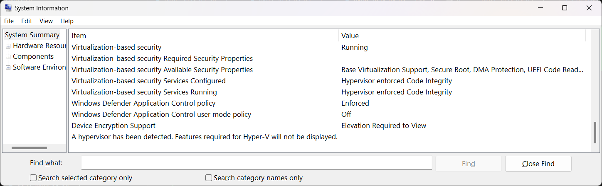
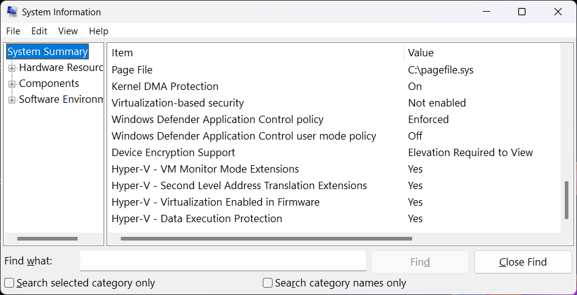

# 3 Apr 2024

| Previous journal: | Next journal: |
|-|-|
| [**0197**-2024-04-02.md](./0197-2024-04-02.md) | [**0199**-2024-04-04.md](./0199-2024-04-04.md) |

# Animation of tt04-raybox-zero glitching

Late yesterday I got the tt04-raybox-zero GL sim working and it exhibited what looks like the same error as seen in silicon. In a way, this is a good thing, because it hopefully reveals that the problem was in the final synthesised output, rather than a malfunction of the fabrication or a layout that was unstable (e.g. bad timing).

The cocotb test code is found in the [`1.0-test` branch](https://github.com/algofoogle/tt04-raybox-zero/tree/1.0-test/src/test). NOTE: Coming back to edit this journal now in late May, I've got outstanding changes in my working repo that were *probably* used to generate the results below, but at the time of writing my latest commit in the `1.0-test` branch is `653f212`. For more info and updates, see [0204](./0204-2024-05-25.md).

Here's a rendering of the first 220 frames after reset:

<video controls src="https://github.com/algofoogle/journal/assets/845120/e4f67c57-2065-4e99-b6b0-39262062d4db" title="rbz10-test-gl.mp4"></video>

This was created by:
1.  Modifying `tb.v` to disable VCD dump; otherwise it will grow to be too large after a handful of frames.
2.  Modifying `test.py` to write out a new `.ppm` file after every 525 lines.
3.  Writing a simple shell script to `convert` all `.ppm` files to `.png`.
4.  Renaming all the files to just `0000.png`, `0001.png`, etc... and then importing into Adobe Premiere Pro as an image sequence.

# Fixing VT-x on my L7 laptop for VirtualBox

Indication of what we **don't** want, as seen in `msinfo32`:



Likewise, running this in PowerShell...

```powershell
Get-CimInstance -ClassName Win32_DeviceGuard -Namespace root\Microsoft\Windows\DeviceGuard
```

...shows:

```
AvailableSecurityProperties                  : {1, 2, 3, 5...}
CodeIntegrityPolicyEnforcementStatus         : 2
InstanceIdentifier                           : 4ff40742-2649-41b8-bdd1-e80fad1cce80
RequiredSecurityProperties                   : {0}
SecurityFeaturesEnabled                      : {0}
SecurityServicesConfigured                   : {2}
SecurityServicesRunning                      : {2}
UsermodeCodeIntegrityPolicyEnforcementStatus : 0
Version                                      : 1.0
VirtualizationBasedSecurityStatus            : 2
VirtualMachineIsolation                      : False
VirtualMachineIsolationProperties            : {0}
PSComputerName                               :
```

Here's what I did by following [this guide](https://forums.virtualbox.org/viewtopic.php?f=25&t=99390):

1.  Shut down my VirtualBox VMs and quit VirtualBox.
2.  Shut down all other software except for VSCode and Google Chrome (since I'm working in both of them to do this fix).
3.  Use Windows "search button" and search for `cmd`. Right-click and select 'Run as Administrator'.
4.  In that Admin command prompt, do:
    ```bat
    bcdedit /set hypervisorlaunchtype off
    bcdedit /set vsmlaunchtype Off
    rem Doesn't work: DISM /Online /Disable-Feature:Microsoft-Hyper-V
    ```
5.  Run `regedit`, go to `HKLM\SYSTEM\CurrentControlSet\Control\DeviceGuard`, then:
    *   Create a `REG_DWORD` called `EnableVirtualizationBasedSecurity` and set it to 0.
    *   Go into `Scenarios\HypervisorEnforcedCodeIntegrity` and change `Enabled` to 0.
    *   Also add a `REG_DWORD` called `Locked` set to 0.
    *   Then go to `HKLM\SYSTEM\CurrentControlSet\Control\Lsa` and...
    *   Create `REG_DWORD` called `LsaCfgFlags` = 0.
    *   Then go to `HKLM\SOFTWARE\Policies\Microsoft\Windows` and...
    *   Create `REG_DWORD` called `DeviceGuard\LsaCfgFlags` = 0.
6.  Go to Start > Settings > Privacy & Security > Windows Security > Device security > Core isolation: Core isolation details > Memory integrity: **Turn it OFF**
7.  ```bat
    shutdown -s -t 2
    ```
8.  Power back on and press F2 key repeatedly to access Lenovo BIOS.
9.  In the BIOS:
    *   Disable: "Device Guard" (it was already off) and "Secure boot".
    *   Make sure Intel virtualisation options are turned on.
    *   Unplug the mains power, and activate the "Disable Built-in battery" option, which will power off the laptop.
10. Wait at least 20sec, then plug in mains power, and press the power button to power on.

Now `msinfo32` seems to confirm that VBS and related stuff is disabled:



Likewise, this seems to confirm also:

```
PS C:\Users\Maurovics> Get-CimInstance -ClassName Win32_DeviceGuard -Namespace root\Microsoft\Windows\DeviceGuard


AvailableSecurityProperties                  : {1, 2, 3, 5...}
CodeIntegrityPolicyEnforcementStatus         : 2
InstanceIdentifier                           : 4ff40742-2649-41b8-bdd1-e80fad1cce80
RequiredSecurityProperties                   : {0}
SecurityFeaturesEnabled                      : {0}
SecurityServicesConfigured                   : {0}
SecurityServicesRunning                      : {0}
UsermodeCodeIntegrityPolicyEnforcementStatus : 0
Version                                      : 1.0
VirtualizationBasedSecurityStatus            : 0
VirtualMachineIsolation                      : False
VirtualMachineIsolationProperties            : {0}
PSComputerName                               :
```

From what I can tell, my VirtualBox VMs now run with proper virtualisation, though I was unable to start any saved-running-state VMs ('Zero to ASIC Course MPW8' was in this state, so I had to 'Discard' the state, then boot it normally, then power it off, then turn on 'Enable Nested VT-x/AMD-V').

In future, or for someone else, these links might help too:
*   https://forums.virtualbox.org/viewtopic.php?t=110285
*   https://learn.microsoft.com/en-us/answers/questions/245071/disable-virtualization-based-security-without-disa
*   MS article on configuring Credential Guard: https://learn.microsoft.com/en-us/windows/security/identity-protection/credential-guard/configure?tabs=intune

# Analog course beta

*   I'm using my `anton-analog-alpha` VM. I set this one up manually.
*   ```bash
    echo $PDK_ROOT	
    # => /home/anton/.volare/volare/sky130/versions/bdc9412b3e468c102d01b7cf6337be06ec6e9c9a
    echo $PDK	
    # => sky130A
    ```
*   My TT06 repo is https://github.com/algofoogle/tt06-grab-bag (created from template: https://github.com/TinyTapeout/tt06-analog-template)
*   I've done a basic CMOS inverter and testbench in xschem. It also models the expected Tiny Tapeout analog output parasitics.
*   The TT parasitics make for a very weak output and long slew at 25MHz, so I increased the size of the PFET/NFET transistor widths by 4&times; from 2/1 to 8/4, and it made it somewhat acceptable.
