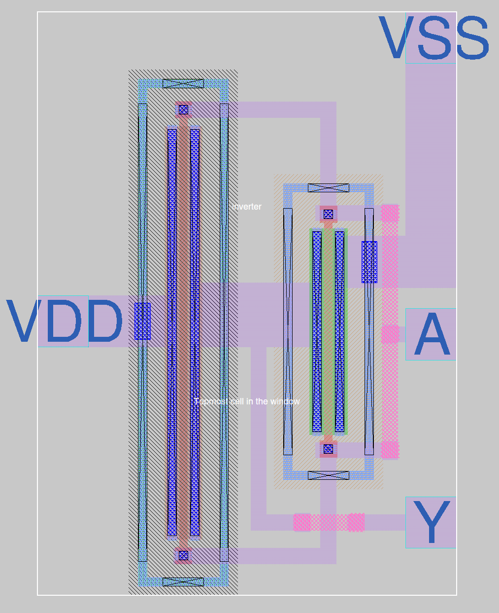

# 4 Apr 2024

| Previous journal: | Next journal: |
|-|-|
| [**0198**-2024-04-03.md](./0198-2024-04-03.md) | [**0200**-2024-05-01.md](./0200-2024-05-01.md) |

# Quick update: sky130 and Tiny Tapeout analog design

*   I've done labs 3.1 (Magic layout challenge) and 3.2 (lay out my own inverter design).
*   [`tt_um_algofoogle_tt06_grab_bag.mag`](https://github.com/algofoogle/tt06-grab-bag/blob/071a0c6bcbd7e322c2a11f76f5833e3a30ec3bf6/mag/tt_um_algofoogle_tt06_grab_bag.mag) is the overall TT 1x2 tile area.
*   [`inverter.mag`](https://github.com/algofoogle/tt06-grab-bag/blob/071a0c6bcbd7e322c2a11f76f5833e3a30ec3bf6/mag/inverter.mag) is the inverter cell layout:

    

    It is 8.15um x 11.315um.
*   I had a go at placing that cell above in the TT template, and wiring it up. It seemed to make sense. I didn't bother saving it, because it was relatively trivial and I'm sure it will come later.
*   Check out the TT 'ASW' (Analog Switch): https://github.com/TinyTapeout/tt_asw_1v8/tree/main/xschem
