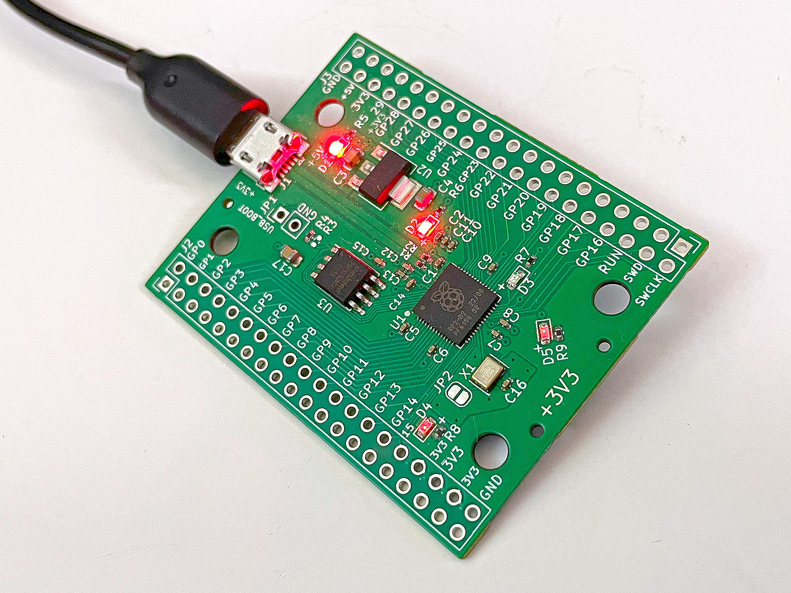
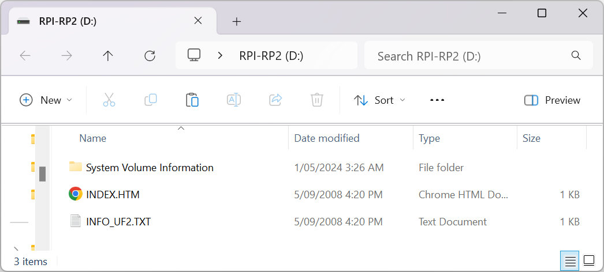
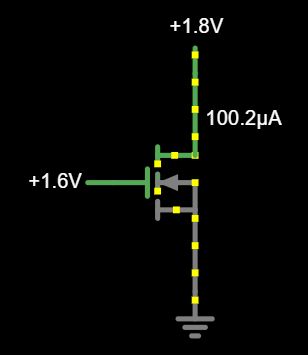
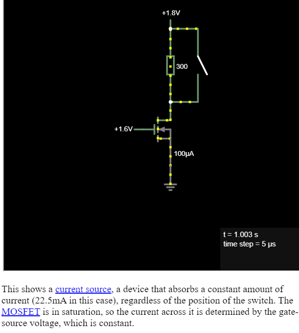

# 5 Apr 2024

| Previous journal: | Next journal: |
|-|-|
| [**0199**-2024-04-04.md](./0199-2024-04-04.md) | [**0201**-2024-05-11.md](./0201-2024-05-11.md) |

# Belated update (TT chips, and analog)

Since my last update I:

*   Started working at [Efabless](https://efabless.com), during the busy April 2024 tapeout period.
*   Completed an analog submission to TT06, called [tt06-grab-bag]
*   Started looking at a unity gain voltage buffer or other opamp solution for redoing my DACs on TT07.
*   Received my TT03 chip/board, and TT03p5 (alpha).

# Bringing up my RP2040 board

I think I forgot to document that I received the 5 RP2040 boards I designed (back in [0190](./0190-2024-01-17.md)) and they generally look good and the first one I plugged in seemed to function correctly:



When plugging in USB, it shows up on my PC as a drive:



Normally `USB_BOOT` would need to be pulled low to go into this mode, but it does this automatically if there isn't a valid firmware. If a valid firmware *were* already loaded on the onboard flash, and `RUN` were pulled high (actually it seems it works with it floating, despite [arguments](https://forums.raspberrypi.com/viewtopic.php?t=319671)), it would start executing that.

In this mode, I can download the [generic Raspberry Pi Pico MicroPython firmware UF2 file](https://micropython.org/download/rp2-pico/rp2-pico-latest.uf2) (also referenced from [the official Pi Pico doco](https://www.raspberrypi.com/documentation/microcontrollers/micropython.html)), and drag it onto the drive as it presents in Windows, and the firmware flashes to the chip. The drive should then disappear indicating that the firmware is now running.

I then downloaded [Thonny](https://thonny.org/) and did "Install only for me".

In the bottom-right corner of Thonny, click to select the interpreter, and it recognises I have an RP2040 on COM3. Select it.

`help()` in the interactive window shows the RP2040 board is alive.

I've got 3 GPIO LEDs on this board:

*   D3: GPIO17, active high.
*   D4: GPIO15, active low.
*   D5: GPIO16, active low.

D4 and D5 are illuminated, I guess because they are defaulting to being inputs, and either have weak pull-downs, or this is just the input path load.

```py
list(map(lambda e: machine.Pin(e), [17,15,16]))
# => [
# Pin(GPIO17, mode=ALT, pull=PULL_DOWN, alt=31),
# Pin(GPIO15, mode=ALT, pull=PULL_DOWN, alt=31),
# Pin(GPIO16, mode=ALT, pull=PULL_DOWN, alt=31)]
```

Set all 3 of these GPIOs to 1 (should turn on D5, turn of D3/4):

```py
for e in [15,16,17]: p = machine.Pin(e, machine.Pin.OUT); p.value(1)
```

Now turn D3 off, D5 on:

```py
machine.Pin(17).value(0); machine.Pin(16).value(0)
```

Toggle D3 using PWM:

```py
d3 = machine.PWM(17)
d3.freq(8) # This is as slow as it can go.
d3.duty_u16(32767) # 50% duty cycle.
```

Get existing system speed, then change it to 20MHz:

```py
machine.freq()
# => 125000000 or 125MHz.
machine.freq(int(20e6)) # 20MHz seems to be the lowest.
```

After replugging the USB, the MicroPython firmware starts running again.


# Voltage buffer experiments

[Basic MOSFET current source](https://www.falstad.com/circuit/circuitjs.html?ctz=CQAgjCAMB0l3BWcMBMcUHYMGZIA4UA2ATmIxAUgoqoQFMBaMMAKADMRcAWEFLq7AhS9+nYWGhIYkFCzAZh3EVUzC+VKuQmFqGqJJABxAIYAXOiABqAewA2p4wHM6LAO6chvBDsGLIPSDcPNT5g8AwdVnlFT3kfWK4AkC1oDCQpKH0kABEAJ2MASwA7KzsHZxZHMKVfMT1A60zsYSp+Ul1YOGxiSEIUDKTscEyIbBYgA):



[Ditto](https://www.falstad.com/circuit/circuitjs.html?ctz=CQAgjCAMB0l3BWcZoIQDgCwCYsOwOxjoEBsBICk41VlApgLRhgBQAZiAMz4i7ohMcPugHUUSGJGysA7oOFdImBdR7ZwrAOaruvIWqxQorAEq6WGgyHTU7C8NDHGYCObsJXh2ISYBOFmBe1D72SpDu1paCmALREfLWoTECyREAzinIVrF8vuIg7ACGADbp9GZ6Gvzc2CGiLg4opI2urEA):




# Using ngspice raw files for rendering

I want to take an ngspice `.raw` file and use it to approximately render how something would look on a VGA display.

In time this will be useful when I've got cosimulation (Verilog+SPICE) working for actual output from my VGA driver design.

For now I just want to sample an analog output at every 40ns and use that to render a pixel luminosity.

[I could use `set filetype=ascii`](https://electronics.stackexchange.com/a/551902) to generate a readable output format instead of binary. Either that or I could learn to parse the `.raw` file.

I really only need to capture `V(out)` so that should make the file more lean.

It looks like there was a [branch of ngspice for writing LXT files](https://sourceforge.net/p/ngspice/mailman/message/36727404/) ([see also](https://sourceforge.net/p/ngspice/discussion/133842/thread/59577d13/)) but I don't know much about that yet.

It may be possible to process ngspice `.raw` files with the [ltspice Python package](https://pypi.org/project/ltspice/).

# Cosimulation

## Using Matt's R2R DAC demo

1.  Install Verilator. On my relatively clean Ubuntu 22.04 system, this gives `Version: 4.038-1`:
    ```bash
    sudo apt update
    sudo apt install verilator
    ```
    NOTE: I was using 4.228 back in July 2023 (see [0110](./0110-2023-07-07.md)). Even the MPW8 VM uses 4.227.

    **Hmm,** I've found that this Verilator version is too old, and complains about this in Matt's design:
    ```
    %Error: ../verilog/rtl/r2r_dac_control.v:44:9: Unknown verilator lint message code: 'WIDTHEXPAND', in '/*verilator lint_off WIDTHEXPAND*/'
       44 |         /*verilator lint_off WIDTHEXPAND*/ 
          |         ^~~~~~~~~~~~~~~~~~~~~~~~~~~~~~~~~~
    ```
1.  Let's try installing Verilator from source:
    1.  Uninstall: `sudo apt remove verilator`
    2.  Prereqs: `sudo apt install git make autoconf g++ flex bison help2man`
    3.  Clone and pick version 4.228:
        ```bash
        cd ~
        mkdir -p JUNK
        cd JUNK
        git clone http://git.veripool.org/git/verilator # or maybe: https://github.com/verilator/verilator
        unset VERILATOR_ROOT
        cd verilator
        git pull
        git checkout v5.024 #NOTE: v4.228 is the latest version in the 4.x branch
        ```
    4.  Configure:
        ```bash
        autoconf
        ./configure
        ```
    5.  Build:
        ```bash
        make -j$(nproc)
        ```
    6.  Install:
        ```bash
        sudo make install
        #NOTE: To make this work, I had to first:
        # sudo make uninstall
        # sudo rm -rf /usr/local/share/verilator
        # sudo apt install help2man
        ```
    7.  Also:
        ```bash
        which verilator
        # => /usr/local/bin/verilator
        verilator --version # NOTE: Might need to open a new shell to avoid a cached old copy
        # => Verilator 5.024 2024-04-05 rev v5.024
        ```
1.  Clone Matt's repo: https://github.com/mattvenn/tt06-analog-r2r-dac
2.  Go into `sim` dir
3.  Run:
    ```bash
    ngspice vlnggen ../verilog/rtl/r2r_dac_control.v
    ```
4.  Edit `mixed.cir` to update the `.lib` line with your own PDK path, i.e. change it from:
    ```
    .lib /home/matt/work/asic-workshop/shuttle-2404/pdk/sky130A/libs.tech/ngspice/sky130.lib.spice tt
    ```
    ...to:
    ```
    .lib /home/anton/.volare/sky130A/libs.tech/ngspice/sky130.lib.spice tt
    ```


# Notes

*   Change xschem default terminal from `xterm` to `gnome-terminal`:
    *   In local `xschemrc`, near line 289, add: `set terminal { gnome-terminal }`
    *   Anton's 'Ngspice interactive' line *was*: `$terminal -fa 'Monospace' -fs 14 -e {ngspice -i "$N" -a || sh}`
    *   Replaced with: `$terminal --zoom=1.5 -- bash -c "ngspice -i \"$N\" -a || sh"`
    *   NOTE: Potential conflict between local `xschemrc` (setting the terminal) and the modified terminal config line (which seems to be global).
*   System-wide Magic config file: `/usr/local/lib/magic/sys/.magicrc`
*   I installed the `xuanli.spice` extension in VSCode for SPICE (`.cir`) script syntax highlighting.
*   http://www.h-renrew.de/h/ngspice/ngspicedemo.html
*   https://www.isotel.eu/mixedsim/blender/2wheel/index.html#exporting-charts-schematics-and-data
*   It looks to me like ngspice time sampling is variable depending on the precision you specify for your stimuli. For example, even if your transient analysis is set to 40ns resolution (`tran 40ns 64us`), it will be finer than that if a given voltage source has rise/fall timing which ramps at a smaller time scale...?

# TODO

*   Doco for [tt06-grab-bag]
*   Full sim of extracted tt06-grab-bag layout
*   Create a 'fork' of tt06-grab-bag and make it a generic TT project (not specific to TT06 or TT07) -- also make it a 'VGA tests' focus.
*   Prep TT07 submission
*   Install gnuplot and learn to use it in ngspice, e.g. see near [here](https://ngspice.sourceforge.io/ngspice-tutorial.html#BipAmp)
*   Find out how to determine max current that can be supported and realistically delivered by sky130 devices internally (e.g. NFETs).
*   Try voltage buffers on R2R DAC output -- bias it: DAC currently gives `[0, 1.8V]`, but ideally we want `[0, 0.7V]`.
*   Clean up VM(s)


[tt06-grab-bag]: https://github.com/algofoogle/tt06-grab-bag
