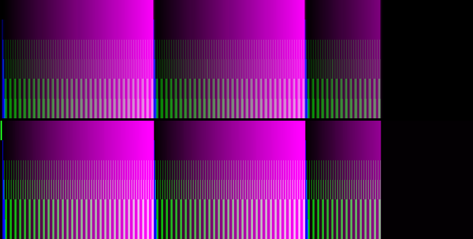

# 20 May 2024

| Previous journal: | Next journal: |
|-|-|
| [**0202**-2024-05-15.md](./0202-2024-05-15.md) | [**0204**-2024-05-25.md](./0204-2024-05-25.md) |


# ngspice full-circuit simulation results and improvements

In my last [0202](./0202-2024-05-15.md) journal I extracted and simulated my full tt06-grab-bag layout in ngspice, and got it to work (though slowly).

In my first attempt I found that it was giving weird glitches in the behaviour of the digital design:


It shows:

*   Skipped counts (?) near 8us and 37.5us
*   Initially failed reset to 0 that should happen at 25.6us (640 pixels &times; 40ns)
*   Frame length prior to blue spike (at ~35us) should be 32us, not 35us.

I can't remember what my timestep was with this simulation, but I think it was 8ns, maybe 4ns.

I made changes and got it to work correctly (it seems):

*   Replaced the `d_osc` clock with a regular V source PULSE clock.
*   This meant I could remove the `set trtol=...` line from `.spiceinit`.
*   Made a correction where I was accidentally de/asserting `rst_n` exactly on `clk` rising edges -- shifted it by -10ns to avoid possible metastability issues.
*   Changed `tran` timestep (say, from 4ns?) to 0.5ns
*   Consequently also had to remove the `optran` line from `.spiceinit`.

I increased total threads to 20 (after adjusting my VM too).

It's slow, taking 9~10 hours per VGA line, but it seems stable now:


After several days, it looks like this:


## Looking at some features

The initial blue spike should be a single blue pixel (40ns) at full intensity. In 40ns it climbs to about half (~0.9V) of its target 1.8V, before it gets turned off and sinks back down to catch up with the red graph in about 240ns (6 pixels):


Falling edge for red output from full intensity to 0 is about the same. It drops from full intensity (~1.8V) to nearly 0 in about 270ns. It doesn't reach zero (and probably levels off a bit) because within (say) 280ns, the red output *target* will already have climbed to (7/255)*1.8 = 0.05 volts, and this is about what we see:


And for future reference, here's how all 3 channels look when starting to show some life and variety:


There's some other irregular stuff like what's shown below, which I currently put down either to quirks of the layout, or the digital circuit behaviour, or more likely what appears to be different output buffer sizes from each of the RGB888 pins:


## Rendering results

Here's what I've rendered over several days (wow, so fast):


It's only 6 lines, but if we stretch it we can start to see features:


It's no so obvious but we can see the ramp irregularity at about the mid-point of each "pipe", and we can start to see the XOR texture starting to emerge as banding. We also see the blue diagonal creeping in. There is also activity on the green channel, but can't be seen because it's too dark.

Here are two images which compare: (a) top which is this output, with green enhanced; with (b) bottom which is my 'dacboost' reference:



# NOTES

*   ngspice, create specific range plots: `plot routpin boutpin xlimit 0 27us ylimit 0 1.8`


# TODO

*   More doco for [tt06-grab-bag] and PR.
*   Find out how good the sim is if we use (say) 2ns step instead of 0.5ns.
*   Digital RGB888 outputs to drive equally-sized buffers on INPUT side of DACs, for better linearity.
*   Work out the right size to use for resistors.
*   Get to learn GPIO pins and other options of OpenFrame
*   Name all the nets that we can in my layout
*   What happens if we turn on `mc_mm_switch` and `mc_pr_switch` in sim again?
*   Simulate current thru various devices:
    *   `i(vcc)` -- is there a way we can limit it?
    *   `R`s and `2R`s -- maybe provide a pin/contact or just a simple named net to allow measuring?
*   Install gnuplot and learn to use it in ngspice, e.g. see near [here](https://ngspice.sourceforge.io/ngspice-tutorial.html#BipAmp)
*   Find out how to determine max current that can be supported and realistically delivered by sky130 devices internally (e.g. NFETs).
*   Try voltage buffers on R2R DAC output -- bias it: DAC currently gives `[0, 1.8V]`, but ideally we want `[0, 0.7V]`.


# Overall TT07 submission plan

*   Design R2R DAC for less current and if possible a little less area
*   Correct lowest DAC R to be a 2R
*   Include matched digital buffers on inputs in R2R DAC
*   Label all nets that we can (to help with sim, probes, current, etc)
*   Option to switch between different PMODs (Tiny VGA PMOD, vs. ...?)
*   Rework the digital block a bit, for:
    *   More control (e.g. start line offset)
    *   Line number binary output in initial pixels
    *   Decide whether to fix async reset.
    *   Allow some modes (not 0) to take variable inputs rather than just 1-shot at reset.
    *   Implement un/registered.
    *   Implement mode 0 gating option.
*   Put Verilator sim into tt-vga-fun.
*   Figure out how to make a LEF (for pin placement)

# Verilator

*   Put it all in `sim/`
*   Use this as ref: https://github.com/algofoogle/raybox-zero/tree/main/sim -- but would it be better to use the `gf180` branch?
*   Copy `main_tb.h` -- Make sure h/vsync have the correct name/polarity.


# Pretty Worley noise generator that works in 8bw

```verilog
`include "hvsync_generator.v"

/*
A simple test pattern using the hvsync_generator module.
*/

module test_hvsync_top(clk, reset, hsync, vsync, rgb);

  input clk, reset;
  output hsync, vsync;
  output [31:0] rgb;
  wire display_on;
  wire [9:0] hpos;
  wire [9:0] vpos;

  hvsync_generator hvsync_gen(
    .clk(clk),
    .reset(0),
    .hsync(hsync),
    .vsync(vsync),
    .display_on(display_on),
    .hpos(hpos),
    .vpos(vpos)
  );

  wire r = (((hpos&7)==0) || ((vpos&7)==0));
  wire g = vpos[4];
  wire b = hpos[4];
  assign rgb = {32{display_on}} & {
    8'hff,
    (rr ^ {noise[15:8]} & aa),// & (hpos<320 ? ~hpos[9:2] : hpos[9:2]),
    gg ^ {noise[15:8]},
    bb ^ {noise[15:8]}
  };
  
  wire [15:0] noise;
  
  wire [7:0] rr,gg,bb,aa;

  reg [19:0] tm;
  reg [9:0] y_prv;
  
  always @(posedge clk) begin
    if (reset) begin
      tm <= 0;
    end else begin
      y_prv <= vpos;
      if (vpos == 0 && y_prv != vpos) begin
          tm <= tm + 1;
      end
    end
  end

  
  worley_noise_generator pattern(
    .clk(clk),
    .x(hpos),
    .y(vpos),
    .t(tm),
    .noise(noise),
    .r(rr),
    .g(gg),
    .b(bb),
    .a(aa)
  );

endmodule

module worley_noise_generator (
    input wire clk,
    input wire [9:0] x,
    input wire [9:0] y,
    input wire [19:0] t,
  output reg [15:0] noise,
  output reg [7:0] r,
  output reg [7:0] g,
  output reg [7:0] b,
  output reg [7:0] a
);

  // Define a small fixed grid of points
  reg [8:0] points_x[0:3];
  reg [8:0] points_y[0:3];


  assign points_x[0] = 9'd100 + t[8:0];
  assign points_y[0] = 9'd100 - t[8:0];
  assign points_x[1] = 9'd300 - t[9:1];
  assign points_y[1] = 9'd200 + t[9:1];
  assign points_x[2] = 9'd500 + t[9:1];
  assign points_y[2] = 9'd400 - t[12:4];
  assign points_x[3] = 9'd100 - t[11:3];
  assign points_y[3] = 9'd500 - t[10:2];
  
  wire [15:0] distance1 = ({6'b0,x} - {7'b0,points_x[0]}) * ({6'b0,x} - {7'b0,points_x[0]}) + ({6'b0,y} - {7'b0,points_y[0]}) * ({6'b0,y} - {7'b0,points_y[0]});
  wire [15:0] distance2 = ({6'b0,x} - {7'b0,points_x[1]}) * ({6'b0,x} - {7'b0,points_x[1]}) + ({6'b0,y} - {7'b0,points_y[1]}) * ({6'b0,y} - {7'b0,points_y[1]});
  wire [15:0] distance3 = ({6'b0,x} - {7'b0,points_x[2]}) * ({6'b0,x} - {7'b0,points_x[2]}) + ({6'b0,y} - {7'b0,points_y[2]}) * ({6'b0,y} - {7'b0,points_y[2]});
  wire [15:0] distance4 = ({6'b0,x} - {7'b0,points_x[3]}) * ({6'b0,x} - {7'b0,points_x[3]}) + ({6'b0,y} - {7'b0,points_y[3]}) * ({6'b0,y} - {7'b0,points_y[3]});
  wire [15:0] min_dist = 
    (distance1 < distance2) ? 
      (distance1 < distance3) ? 
        (distance1 < distance4) ? distance1 : distance4 : 
        (distance3 < distance4) ? distance3 : distance4 :
      (distance2 < distance3) ?
        (distance2 < distance4) ? distance2 : distance4 :
        (distance3 < distance4) ? distance3 : distance4;

  assign noise = ~min_dist;  // Scale down to 8-bit value
  assign r = distance1[15:8];
  assign g = distance2[15:8];
  assign b = distance3[15:8];
  assign a = distance3[15:8];
  
endmodule
```

