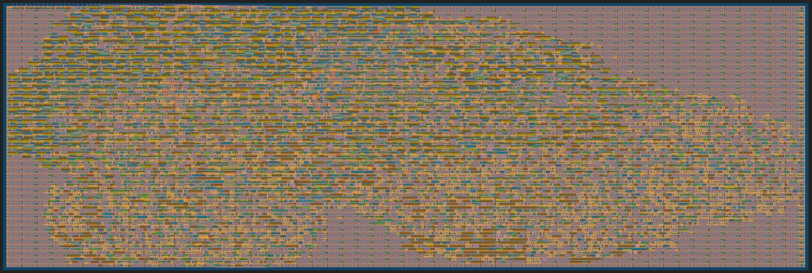
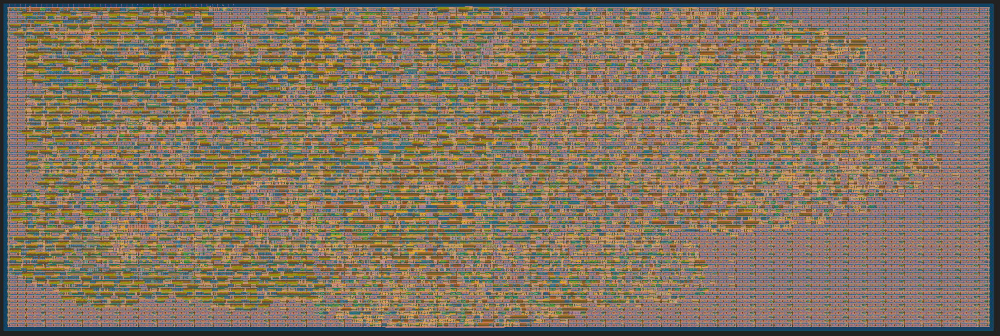

# 25 May 2024

| Previous journal: | Next journal: |
|-|-|
| [**0203**-2024-05-20.md](./0203-2024-05-20.md) | [**0205**-2024-05-30.md](./0205-2024-05-30.md) |

# Prep resubmission of TT04's raybox-zero to TT07

In TT04 I submitted my first version of raybox-zero. I will soon get the final silicon back, but @tnt and @urish have already shown that it has bugs that cause lots of calculation/rendering glitches. For example, here's a photo from Uri:


Back in [0198] I was able to recreate this bug (I think exactly), and I think I did it from the GL netlist in the repo. The same problem doesn't exist in RTL, plus it doesn't *seem* to be timing-related, so this is what led us to believe it is a failure of the synthesis.

The debug bits in the top-right corner reveal that this is the initial starting view; if it was some other POV, I would have been able to try recreating the image above using the debug bits.

Once I get back into my testing setup, I'm going to see if I can reharden this using a newer OpenLane, and try to resubmit to TT07. There might even be an opportunity to include some of the newer features, such as extra regs, and (if it will fit, though it's doubtful) the external texture memory support.

This will probably require its own branch, since the *latest* version might not fit, and I'd also like to know anyway whether the unchanged "1.0" code (as-is) will be fixed by a newer OpenLane.

## TT04 GL test environment

This is some information about my environment as I last ran the GL tests on Ubuntu Desktop 20.04.

Personal note for future reference:
> I've got a VM on my L7 laptop called "Zero to ASIC Course MPW8" and it has a snapshot (from 2024-04-09) called "TT04 GL sim video" which is around when I created the sim video shown in [0198] (2024-04-02).
> 
> On that VM, my GL tests were done in `~/anton/bringup-tt04-raybox-zero/`.
>
> `history` has *remnants* of what led to setting this up, but most of it is patchy.
>
> I'm now switching over to my `anton-analog-alpha` VM and will make sure I can recreate the environment there.

The [tt04-raybox-zero] repo, as submitted to TT04 (tag [`1.0`](https://github.com/algofoogle/tt04-raybox-zero/releases/tag/1.0)) uses the [raybox-zero] repo as a git submodule, at the [`1.0` tag (commit `1029ddb`)](https://github.com/algofoogle/raybox-zero/releases/tag/1.0). I originally used all this to branch off to [`1.0-test`](https://github.com/algofoogle/tt04-raybox-zero/tree/1.0-test), and thus used that to create the GL sim for what would've been submitted to TT04.

At the start of April 2024 I was working on the [`1.0-test` branch](https://github.com/algofoogle/tt04-raybox-zero/tree/1.0-test) and I had some uncommitted changes, namely: commenting out VCD dump; matching inc_px=0 inc_py=1 per tnt's higher quality video sample; increasing test frame generation count to 560; making a better frame dump loop; putting in `src/png.sh` for using ImageMagick to convert PPM files to PNGs.

I've now [committed those changes](https://github.com/algofoogle/tt04-raybox-zero/commit/f1b7c971a5a49066891eaecf0c0622363d2d64ed).

I rehardened this back in April; the repo wouldn't otherwise include the GL netlist. Indeed there's a `runs/wokwi` subdiretory.

Actual test Makefile is `src/Makefile` (can do just `make -B GATES=yes`) and test scripts are in `src/test`.

I also have `~/tt@tt04` which I think was created according to the [Hardening Tiny Tapeout Projects Locally](https://docs.google.com/document/d/1aUUZ1jthRpg4QURIIyzlOaPWlmQzr-jBn3wZipVUPt4/edit#heading=h.wwc5ldl01nl5) guide but adapted to use specifically the version that was in play for TT04. In there is `openlane`, `pdk`, and a `venv`.

NOTE:
*   During simulation (and probably real hardware), the first frame always renders with a slight offset, and if you let it re-render that same view with no change, the 2nd frame (which you'd expect to be the same) has that offset corrected. This is to be expected because normally the FOV-based view deflection gets reset *by VSYNC* (to a value higher than it needs to be, and then it diminishes before it gets to the *real* start of the frame), but when a system `reset` is asserted this deflection vector gets reset at the *start* of the frame. That's OK.
*   Also, I found that if I don't assert either of inc_px/py, then the 2nd frame goes to all vector bits (except a couple of MSB/LSB) being unknown (`X`).
    *   I don't also reset the vector SPI 'next state load' registers.
    *   Also, if either inc_px/py is asserted, then `ready_buffer` will NOT be used.
    *   So, if *neither* inc_px/py are used, then `ready_buffer` will be used, but only if `ready` is set... And `ready` *does* get set on every non-reset clock IF `spi_done` is true and neither inc_px/py are set. Because `spi_done` does **NOT** have reset logic, its state is unknown.
    *   This seems to explain it. I think I fixed that in newer versions of rbz.

Other environment stuff for my MPW8 (Ubuntu 20.04) VM:

```bash
echo $OPENLANE_ROOT, $PDK_ROOT, $PDK
# => /home/zerotoasic/asic_tools/openlane, /home/zerotoasic/asic_tools/pdk, sky130A
volare ls
# /home/zerotoasic/asic_tools/pdk/volare/sky130/versions
# └── 3af133706e554a740cfe60f21e773d9eaa41838c (UNKNOWN) (enabled)
volare --version            # volare, version 0.4.3
verilator --version         # Verilator 4.227 devel rev v4.226-5-gd42a2d649
iverilog -v                 # Icarus Verilog version 12.0 (devel) (s20150603-1560-g899d45923)
which iverilog              # /home/zerotoasic/asic_tools/oss-cad-suite/bin/iverilog
cocotb-config --version     # 1.7.2
python3 --version           # Python 3.8.10
pip --version               # pip 20.0.2 from /usr/lib/python3/dist-packages/pip (python 3.8)
magic -noconsole --version  # 8.3.331
ngspice --version           # ngspice compiled from ngspice revision 31
```

Compare MPW9 (Ubuntu 22.04) VM:

```bash
echo $OPENLANE_ROOT, $PDK_ROOT, $PDK
# => /home/zerotoasic/asic_tools/openlane, /home/zerotoasic/asic_tools/pdk, sky130A
volare ls
# In /home/zerotoasic/asic_tools/pdk/volare/sky130/versions:
# └── 78b7bc32ddb4b6f14f76883c2e2dc5b5de9d1cbc (2023.07.10) (enabled)
volare --version            # volare, version 0.15.2
verilator --version         # Verilator 5.017 devel rev v5.014-143-g2385ab829
iverilog -v                 # Icarus Verilog version 13.0 (devel) (s20221226-321-gd22bb3d25)
which iverilog              # /home/zerotoasic/asic_tools/oss-cad-suite/bin/iverilog
cocotb-config --version     # 1.8.0
python3 --version           # Python 3.10.12
pip --version               # pip 22.0.2 from /usr/lib/python3/dist-packages/pip (python 3.10)
magic -noconsole --version  # 8.3.413
ngspice --version           # ngspice-36 : Circuit level simulation program
```

Compare the new VM I'm doing most of my latest Ubuntu 22.04 (TT06+) work in:

```bash
echo $OPENLANE_ROOT, $PDK_ROOT, $PDK
# => , /home/anton/.volare/volare/sky130/versions/bdc9412b3e468c102d01b7cf6337be06ec6e9c9a, sky130A
#NOTE: !! PDK_ROOT may be set incorrectly! Shouldn't point to a version...?
efdemo # Just unsets PDK_ROOT, PDK, etc...
volare ls
# In /home/anton/.volare/volare/sky130/versions:
# ├── bdc9412b3e468c102d01b7cf6337be06ec6e9c9a (2024.01.10) (enabled)
# └── 78b7bc32ddb4b6f14f76883c2e2dc5b5de9d1cbc (2023.07.10)
volare --version            # volare, version 0.16.0
verilator --version         # Verilator 5.025 devel rev v5.024-34-gc99364b81
iverilog -v                 # !! NOT INSTALLED !!
cocotb-config --version     # !! Installed only in VENVs !!
python3 --version           # Python 3.10.12
pip --version               # pip 22.0.2 from /usr/lib/python3/dist-packages/pip (python 3.10)
magic -noconsole --version  # 8.3.462
ngspice --version           # ngspice-42+ : Circuit level simulation program
```


[0198]: ./0198-2024-04-03.md
[tt04-raybox-zero]: https://github.com/algofoogle/tt04-raybox-zero
[raybox-zero]: https://github.com/algofoogle/raybox-zero


## Setting up hardening/testing environment on a new system

Personal note for future reference:
> I'm now switching over to my `anton-analog-alpha` VM and will make sure I can recreate the environment there.

I'm doing this on an Ubuntu Desktop 22.04 LTS VM, on which I've already used OpenLane and the PDK, etc, but I'm going to be doing it now using a relatively clean shell environment, using the "[Hardening Tiny Tapeout Projects](https://docs.google.com/document/d/1aUUZ1jthRpg4QURIIyzlOaPWlmQzr-jBn3wZipVUPt4/edit#heading=h.wwc5ldl01nl5)" guide as a reference (with changes)...

NOTE: [0197](./0197-2024-04-02.md) has my original instructions when I last did this on the MPW8 VM in April 2024.

See also: https://github.com/algofoogle/tt04-raybox-zero/blob/1.0-test/src/test/README.md

### Install Python 3.9 from Deadsnakes PPA

Ubuntu 22.04 comes with Python 3.10 installed but it looks like Python 3.9 might be needed for TT04 hardening. I'm going to try following [this guide](https://www.makeuseof.com/install-python-ubuntu/) to install using the Deadsnakes PPA:

```bash
sudo apt install software-properties-common
sudo add-apt-repository ppa:deadsnakes/ppa
```

Note it explains:

> The packages provided here are loosely based on the debian upstream packages with some modifications to make them more usable as non-default pythons and on ubuntu.  As such, the packages follow debian's patterns and often do not include a full python distribution with just `apt install python#.#`.  Here is a list of packages that may be useful along with the default install:
> 
> - `python#.#-dev`: includes development headers for building C extensions
> - `python#.#-venv`: provides the standard library `venv` module
> - `python#.#-distutils`: provides the standard library `distutils` module
> - `python#.#-lib2to3`: provides the `2to3-#.#` utility as well as the standard library `lib2to3` module
> - `python#.#-gdbm`: provides the standard library `dbm.gnu` module
> - `python#.#-tk`: provides the standard library `tkinter` module

I might do venv, and that's about it.

```bash
sudo apt update
sudo apt install python3.9 python3.9-venv python3.9-dev
ls -al /usr/bin/python*
python3 --version
python3.9 --version
```

Should see that `python3` (default) still is symlinked to `python3.10`.


### Alternative: Install Python 3.9 from source

I found the Deadsnakes PPA very slow (~5kByte/sec download rate). This might be a viable alternative:

```bash
sudo apt update
sudo apt install build-essential zlib1g-dev libncurses5-dev libgdbm-dev libnss3-dev libssl-dev libreadline-dev libffi-dev wget
pushd ~
mkdir python3.9-src
cd python3.9-src
wget https://www.python.org/ftp/python/3.9.19/Python-3.9.19.tgz
tar xzf Python-3.9.19.tgz && rm Python-3.9.19.tgz
cd Python-3.9.19
./configure --enable-optimizations
sudo make install
```


### Setting up TT04 project for local harden

1.  Clone the repo:
    ```bash
    cd ~/projects
    git clone \
        -b 1.0-test \
        --recurse-submodules \
        git@github.com:algofoogle/tt04-raybox-zero \
        bringup-tt04-raybox-zero
    cd bringup-tt04-raybox-zero
    ```
2.  Get environment ready. This is informed by the [`tt04` tag of tt-gds-action](https://github.com/TinyTapeout/tt-gds-action/blob/tt04/action.yml):
    ```bash
    #NOTE: Make sure you are still in the bringup-tt04-raybox-zero repo dir.
    python3 --version # 3.10.12; hopefully fine for TT04 era... 3.11.x might be needed for TT07
    unset OPENLANE_IMAGE_NAME OPENLANE_RUN_TAG OPENLANE_ROOT OPENLANE_TAG PDK_ROOT PDK MCW_ROOT
    TTTOOLS=~/ttsetup@tt04
    mkdir $TTTOOLS # Will contain PDK, OpenLane, and Venv

    cat <<EOH > tt04-env.sh
    export TTTOOLS=$TTTOOLS
    export OPENLANE_ROOT=$TTTOOLS/openlane
    export PDK_ROOT=$TTTOOLS/pdk
    export PDK=sky130A
    export OPENLANE_TAG=2023.06.26
    export OPENLANE_IMAGE_NAME=efabless/openlane:3bc9d02d0b34ad032921553e512fbe4bebf1d833
    EOH

    chmod 775 tt04-env.sh
    source ./tt04-env.sh
    ```
3.  Clone tt-support-tools (tt04 branch):
    ```bash
    sudo apt install librsvg2-bin pngquant
    git clone -b tt04 https://github.com/TinyTapeout/tt-support-tools tt
    ```
4.  Set up venv and install dependencies:
    ```bash
    python3.9 -m venv --prompt tt04 $TTTOOLS/venv
    echo "source $TTTOOLS/venv/bin/activate" >> ./tt04-env.sh
    source $TTTOOLS/venv/bin/activate
    python3 --version # 3.9.19
    pip install -r tt/requirements.txt
    ```
5.  Install OpenLane:
    ```bash
    git clone --depth=1 --branch $OPENLANE_TAG https://github.com/The-OpenROAD-Project/OpenLane.git $OPENLANE_ROOT
    pushd $OPENLANE_ROOT
    make
    ```
6.  Return to the repo and prep it for hardening:
    ```bash
    popd  # Return to repo from $OPENLANE_ROOT
    #NOTE: The following assume you have already done: source ~/ttsetup@tt04/venv/bin/activate
    ./tt/tt_tool.py --create-user-config # Re-run if you change info.yaml
    ```

### Running the TT04 harden

1.  If you change `info.yaml`, run `./tt/tt_tool.py --create-user-config` again.
2.  ```bash
    time ./tt/tt_tool.py --harden
    ./tt/tt_tool.py --print-warnings
    ./tt/tt_tool.py --print-stats
    ```
    Routing stats:
    > | Utilisation (%) | Wire length (um) |
    > |-------------|------------------|
    > | 47.55 | 207590 |
    Note that this also creates:
    ```
    ./runs/wokwi/results/final/verilog/gl/tt_um_algofoogle_raybox_zero.v
    ./runs/wokwi/results/final/verilog/gl/tt_um_algofoogle_raybox_zero.nl.v
    ```
3.  Generate and view GDS (requires Ubuntu 22 version of rsvg-convert for an SVG of this complexity):
    ```bash
    ./tt/tt_tool.py --create-svg
    rsvg-convert --unlimited gds_render.svg -s <(echo 'text{display:none;}') -o gds_render_png24.png --no-keep-image-data
    xdg-open gds_render_png24.png
    ```




## Setting up for TT04 simulation tests

1.  Install iverilog 12 (13-dev is no good) from source:
    ```bash
    sudo apt install -y autoconf gperf make gcc g++ bison flex
    cd ~
    git clone https://github.com/steveicarus/iverilog.git iverilog-src
    cd iverilog-src
    git checkout v12-branch
    git log -1
    # commit 4fd5291632232fbe1ba49b2c26bb6b2bf1c6c9cf (HEAD -> v12-branch, tag: v12_0, origin/v12-branch)
    # Author: Lars-Peter Clausen <lars@metafoo.de>
    # Date:   Mon Dec 26 10:05:09 2022 -0800
    # Icarus Verilog version 12.0 (stable) (v12_0)
    sh autoconf.sh
    ./configure
    time make
    sudo make install
    iverilog -v # Icarus Verilog version 12.0 (stable) (v12_0)
    ```
2.  Ensure correct environment is loaded:
    ```bash
    cd bringup-tt04-raybox-zero
    git checkout 1.0-test
    source ./tt04-env.sh
    ```
3.  Install my repo's requirements:
    ```bash
    pip install -r requirements.txt # Hopefully installs cocotb 1.8.1
    cocotb-config --version # 1.8.1
    ```

## Running the TT04 simulation tests (RTL and GL)

1.  Ensure correct environment is loaded:
    ```bash
    cd bringup-tt04-raybox-zero
    git checkout 1.0-test
    source ./tt04-env.sh
    ```
2.  Copy GL (gate-level) Verilog from previous harden:
    ```bash
    cd src
    cp ../runs/wokwi/results/final/verilog/gl/tt_um_algofoogle_raybox_zero.v test/gate_level_netlist.v
    ```
3.  Run RTL test:
    ```bash
    cd src
    make clean
    time make -B
    ```
4.  Run GL test:
    ```bash
    make clean
    time make -B GATES=yes
    ```

To stop at any point, CTRL+C and then `$finish`.

It takes about 70sec to simulate each frame.

Frames are written to the current directory (`./src/rbz_basic_frame-???.ppm`).


## Create TT07 project wrapper for raybox-zero

For now, I will specifically use the `1.0` tag, to compare synth/simulation results with what TT04 produced. Then I will look at possible newer versions or other improvements/fixes.

1.  Generate a new repo from [tt07-verilog-template]: https://github.com/algofoogle/tt07-raybox-zero
2.  Enable option for GitHub Actions to publish to GitHub Pages.
3.  Clone the repo
4.  Add [raybox-zero] tag `1.0` (we might change it later) as a submodule:
    ```bash
    git submodule add git@github.com:algofoogle/raybox-zero src/raybox-zero
    pushd src/raybox-zero
    git checkout 1.0
    popd
    ```
4.  TBC... see https://github.com/algofoogle/tt07-raybox-zero/compare/0.0-tt07-base...1.0

[tt07-verilog-template]: https://github.com/TinyTapeout/tt07-verilog-template


## Setup for hardening using TT07 repo/flow

1.  Supposedly Python 3.11 is required, so using the Deadsnakes PPA configured above:
    ```bash
    sudo apt install python3.11 python3.11-venv python3.11-dev
    python3.11 --version # Python 3.11.9
    ```
2.  Get environment ready:
    ```bash
    cd tt07-raybox-zero
    unset OPENLANE_IMAGE_NAME OPENLANE_RUN_TAG OPENLANE_ROOT OPENLANE_TAG PDK_ROOT PDK MCW_ROOT
    TTTOOLS=~/ttsetup@tt07
    mkdir $TTTOOLS # Will contain PDK, OpenLane, and Venv

    cat <<EOH > tt07-env.sh
    export TTTOOLS=$TTTOOLS
    export OPENLANE_ROOT=$TTTOOLS/openlane
    export PDK_ROOT=$TTTOOLS/pdk
    export PDK=sky130A
    export OPENLANE_TAG=2024.04.22
    export OPENLANE_IMAGE_NAME=efabless/openlane:2024.04.22
    EOH

    chmod 775 tt07-env.sh
    source ./tt07-env.sh
    ```
3.  Clone tt-support-tools (tt07 branch):
    ```bash
    sudo apt install librsvg2-bin pngquant
    git clone -b tt07 https://github.com/TinyTapeout/tt-support-tools tt
    ```
4.  Set up venv and install dependencies:
    ```bash
    python3.11 -m venv --prompt tt07 $TTTOOLS/venv
    echo "source $TTTOOLS/venv/bin/activate" >> ./tt07-env.sh
    source $TTTOOLS/venv/bin/activate
    python3 --version # Python 3.11.9
    pip install -r tt/requirements.txt
    ```
5.  Install OpenLane:
    ```bash
    git clone --depth=1 --branch $OPENLANE_TAG https://github.com/The-OpenROAD-Project/OpenLane.git $OPENLANE_ROOT
    pushd $OPENLANE_ROOT
    make
    ```
6.  Return to the repo and prep it for hardening:
    ```bash
    popd  # Return to repo from $OPENLANE_ROOT
    #NOTE: The following assume you have already done: source ~/ttsetup@tt07/venv/bin/activate
    ./tt/tt_tool.py --create-user-config # Re-run if you change info.yaml
    ```

### Running the TT07 harden

1.  If you change `info.yaml`, run `./tt/tt_tool.py --create-user-config` again.
2.  ```bash
    time ./tt/tt_tool.py --harden
    ./tt/tt_tool.py --print-warnings
    ./tt/tt_tool.py --print-stats
    ```
    With ROUTING_CORES set to 16, this took about 5 minutes.
    
    Routing stats:
    > | Utilisation (%) | Wire length (um) |
    > |-------------|------------------|
    > | 47.12 | 204758 |
    Note that this also creates:
    ```
    ./runs/wokwi/results/final/verilog/gl/tt_um_algofoogle_raybox_zero.v
    ./runs/wokwi/results/final/verilog/gl/tt_um_algofoogle_raybox_zero.nl.v
    ```
3.  Generate and view GDS (requires Ubuntu 22 version of rsvg-convert for an SVG of this complexity):
    ```bash
    ./tt/tt_tool.py --create-svg
    rsvg-convert --unlimited gds_render.svg -s <(echo 'text{display:none;}') -o gds_render_png24.png --no-keep-image-data
    xdg-open gds_render_png24.png
    ```




## Setting up for TT07 simulation tests

Assuming all the TT04 test stuff has already been set up as above...

1.  Ensure correct environment is loaded:
    ```bash
    source ./tt07-env.sh
    ```
2.  Install test requirements:
    ```bash
    pip install -r src/test/requirements.txt # Hopefully installs cocotb 1.8.1
    cocotb-config --version # 1.8.1
    ```


## Running the TT07 simulation tests (RTL and GL)

1.  Ensure correct environment is loaded:
    ```bash
    cd tt07-raybox-zero
    source ./tt07-env.sh
    ```
2.  Copy GL (gate-level) Verilog from previous harden:
    ```bash
    cd src
    cp ../runs/wokwi/results/final/verilog/gl/tt_um_algofoogle_raybox_zero.v test/gate_level_netlist.v
    ```
3.  Run RTL test:
    ```bash
    cd src
    make clean
    time make -B
    ```
    It takes about 26sec to simulate each frame.
4.  Run GL test:
    ```bash
    make clean
    time make -B GATES=yes
    ```
    It takes about 70sec to simulate each frame.

To stop at any point, CTRL+C and then `$finish`.

Frames are written to the current directory (`./src/rbz_basic_frame-???.ppm`).


# TODO

- [x] **Complete doco on updated tests now in `test/` and not `src/test/`**
- [x] Change uo_outs to match Tiny VGA PMOD
- [ ] Optional VGA output switching inc. to match TT04, my boards, and Matt's clock version
- [ ] Document enabling GitHub Pages publishing via GHA.
- [ ] Document and store bringup information for TT04 in the original repo.
- [ ] Refer backwards/forwards to new TT07 version, but also the testing branch and other commits done since 1.0 was submitted to TT04.
- [ ] Update README in 1.0-test branch.


## iverilog 13-dev error messages when doing RTL sim

When I tried doing TT04 RTL simulation with `make`, iverlog 13 (pre-release) gives all these errors, which are maybe a linting or `-g2012` thing:

<details>
<summary>Click to expand...</summary>

<pre>
rm -f results.xml
make -f Makefile results.xml
make[1]: Entering directory '/home/anton/projects/bringup-tt04-raybox-zero/src'
mkdir -p sim_build
/usr/local/bin/iverilog -o sim_build/sim.vvp -D COCOTB_SIM=1 -s tb -I /home/anton/projects/bringup-tt04-raybox-zero/src/raybox-zero/src/rtl -f sim_build/cmds.f -g2012   /home/anton/projects/bringup-tt04-raybox-zero/src/test/tb.v /home/anton/projects/bringup-tt04-raybox-zero/src/raybox-zero/src/rtl/fixed_point_params.v /home/anton/projects/bringup-tt04-raybox-zero/src/raybox-zero/src/rtl/helpers.v /home/anton/projects/bringup-tt04-raybox-zero/src/raybox-zero/src/rtl/debug_overlay.v /home/anton/projects/bringup-tt04-raybox-zero/src/raybox-zero/src/rtl/lzc.v /home/anton/projects/bringup-tt04-raybox-zero/src/raybox-zero/src/rtl/map_overlay.v /home/anton/projects/bringup-tt04-raybox-zero/src/raybox-zero/src/rtl/map_rom.v /home/anton/projects/bringup-tt04-raybox-zero/src/raybox-zero/src/rtl/pov.v /home/anton/projects/bringup-tt04-raybox-zero/src/raybox-zero/src/rtl/reciprocal.v /home/anton/projects/bringup-tt04-raybox-zero/src/raybox-zero/src/rtl/row_render.v /home/anton/projects/bringup-tt04-raybox-zero/src/raybox-zero/src/rtl/spi_registers.v /home/anton/projects/bringup-tt04-raybox-zero/src/raybox-zero/src/rtl/vga_mux.v /home/anton/projects/bringup-tt04-raybox-zero/src/raybox-zero/src/rtl/vga_sync.v /home/anton/projects/bringup-tt04-raybox-zero/src/raybox-zero/src/rtl/wall_tracer.v /home/anton/projects/bringup-tt04-raybox-zero/src/raybox-zero/src/rtl/rbzero.v /home/anton/projects/bringup-tt04-raybox-zero/src/top.v
/home/anton/projects/bringup-tt04-raybox-zero/src/test/tb.v:28: error: Unable to bind wire/reg/memory `uo_out['sd7:'sd2]' in `tb'
/home/anton/projects/bringup-tt04-raybox-zero/src/test/tb.v:39:      : A symbol with that name was declared here. Check for declaration after use.
/home/anton/projects/bringup-tt04-raybox-zero/src/test/tb.v:28: error: Unable to elaborate r-value: uo_out['sd7:'sd2]
/home/anton/projects/bringup-tt04-raybox-zero/src/test/tb.v:32: error: Unable to bind wire/reg/memory `uo_out['sd0]' in `tb'
/home/anton/projects/bringup-tt04-raybox-zero/src/test/tb.v:39:      : A symbol with that name was declared here. Check for declaration after use.
/home/anton/projects/bringup-tt04-raybox-zero/src/test/tb.v:32: error: Unable to elaborate r-value: uo_out['sd0]
/home/anton/projects/bringup-tt04-raybox-zero/src/test/tb.v:33: error: Unable to bind wire/reg/memory `uo_out['sd1]' in `tb'
/home/anton/projects/bringup-tt04-raybox-zero/src/test/tb.v:39:      : A symbol with that name was declared here. Check for declaration after use.
/home/anton/projects/bringup-tt04-raybox-zero/src/test/tb.v:33: error: Unable to elaborate r-value: uo_out['sd1]
/home/anton/projects/bringup-tt04-raybox-zero/src/test/tb.v:34: error: Unable to bind wire/reg/memory `uio_out['sd0]' in `tb'
/home/anton/projects/bringup-tt04-raybox-zero/src/test/tb.v:41:      : A symbol with that name was declared here. Check for declaration after use.
/home/anton/projects/bringup-tt04-raybox-zero/src/test/tb.v:34: error: Unable to elaborate r-value: uio_out['sd0]
/home/anton/projects/bringup-tt04-raybox-zero/src/test/tb.v:35: error: Unable to bind wire/reg/memory `uio_out['sd1]' in `tb'
/home/anton/projects/bringup-tt04-raybox-zero/src/test/tb.v:41:      : A symbol with that name was declared here. Check for declaration after use.
/home/anton/projects/bringup-tt04-raybox-zero/src/test/tb.v:35: error: Unable to elaborate r-value: uio_out['sd1]
/home/anton/projects/bringup-tt04-raybox-zero/src/raybox-zero/src/rtl/rbzero.v:72: error: Unable to bind wire/reg/memory `traced_texVinit' in `tb.uut.rbzero'
/home/anton/projects/bringup-tt04-raybox-zero/src/raybox-zero/src/rtl/rbzero.v:209:      : A symbol with that name was declared here. Check for declaration after use.
/home/anton/projects/bringup-tt04-raybox-zero/src/raybox-zero/src/rtl/rbzero.v:72: error: Unable to elaborate r-value: (texV)+(traced_texVinit)
/home/anton/projects/bringup-tt04-raybox-zero/src/raybox-zero/src/rtl/rbzero.v:78: error: Unable to bind wire/reg/memory `traced_wall' in `tb.uut.rbzero'
/home/anton/projects/bringup-tt04-raybox-zero/src/raybox-zero/src/rtl/rbzero.v:204:      : A symbol with that name was declared here. Check for declaration after use.
/home/anton/projects/bringup-tt04-raybox-zero/src/raybox-zero/src/rtl/rbzero.v:78: error: Failed to elaborate port expression.
/home/anton/projects/bringup-tt04-raybox-zero/src/raybox-zero/src/rtl/rbzero.v:79: error: Unable to bind wire/reg/memory `traced_side' in `tb.uut.rbzero'
/home/anton/projects/bringup-tt04-raybox-zero/src/raybox-zero/src/rtl/rbzero.v:205:      : A symbol with that name was declared here. Check for declaration after use.
/home/anton/projects/bringup-tt04-raybox-zero/src/raybox-zero/src/rtl/rbzero.v:79: error: Failed to elaborate port expression.
/home/anton/projects/bringup-tt04-raybox-zero/src/raybox-zero/src/rtl/rbzero.v:80: error: Unable to bind wire/reg/memory `traced_size' in `tb.uut.rbzero'
/home/anton/projects/bringup-tt04-raybox-zero/src/raybox-zero/src/rtl/rbzero.v:206:      : A symbol with that name was declared here. Check for declaration after use.
/home/anton/projects/bringup-tt04-raybox-zero/src/raybox-zero/src/rtl/rbzero.v:80: error: Failed to elaborate port expression.
/home/anton/projects/bringup-tt04-raybox-zero/src/raybox-zero/src/rtl/rbzero.v:81: error: Unable to bind wire/reg/memory `traced_texu' in `tb.uut.rbzero'
/home/anton/projects/bringup-tt04-raybox-zero/src/raybox-zero/src/rtl/rbzero.v:207:      : A symbol with that name was declared here. Check for declaration after use.
/home/anton/projects/bringup-tt04-raybox-zero/src/raybox-zero/src/rtl/rbzero.v:81: error: Failed to elaborate port expression.
/home/anton/projects/bringup-tt04-raybox-zero/src/raybox-zero/src/rtl/rbzero.v:83: error: Unable to bind wire/reg/memory `floor_leak' in `tb.uut.rbzero'
/home/anton/projects/bringup-tt04-raybox-zero/src/raybox-zero/src/rtl/rbzero.v:136:      : A symbol with that name was declared here. Check for declaration after use.
/home/anton/projects/bringup-tt04-raybox-zero/src/raybox-zero/src/rtl/rbzero.v:83: error: Failed to elaborate port expression.
/home/anton/projects/bringup-tt04-raybox-zero/src/raybox-zero/src/rtl/pov.v:123: error: Unable to bind wire/reg/memory `ready_buffer' in `tb.uut.rbzero.pov'
/home/anton/projects/bringup-tt04-raybox-zero/src/raybox-zero/src/rtl/pov.v:181:      : A symbol with that name was declared here. Check for declaration after use.
/home/anton/projects/bringup-tt04-raybox-zero/src/raybox-zero/src/rtl/pov.v:126: error: Unable to bind wire/reg/memory `spi_done' in `tb.uut.rbzero.pov'
/home/anton/projects/bringup-tt04-raybox-zero/src/raybox-zero/src/rtl/pov.v:166:      : A symbol with that name was declared here. Check for declaration after use.
/home/anton/projects/bringup-tt04-raybox-zero/src/raybox-zero/src/rtl/pov.v:126: error: Unable to elaborate condition expression.
/home/anton/projects/bringup-tt04-raybox-zero/src/raybox-zero/src/rtl/spi_registers.v:91: error: Unable to bind wire/reg/memory `spi_counter' in `tb.uut.rbzero.spi_registers'
/home/anton/projects/bringup-tt04-raybox-zero/src/raybox-zero/src/rtl/spi_registers.v:101:      : A symbol with that name was declared here. Check for declaration after use.
/home/anton/projects/bringup-tt04-raybox-zero/src/raybox-zero/src/rtl/spi_registers.v:91: error: Unable to elaborate r-value: (spi_counter)==((SPI_CMD_BITS)-('sd1))
/home/anton/projects/bringup-tt04-raybox-zero/src/raybox-zero/src/rtl/spi_registers.v:93: error: Unable to bind wire/reg/memory `spi_counter' in `tb.uut.rbzero.spi_registers'
/home/anton/projects/bringup-tt04-raybox-zero/src/raybox-zero/src/rtl/spi_registers.v:101:      : A symbol with that name was declared here. Check for declaration after use.
/home/anton/projects/bringup-tt04-raybox-zero/src/raybox-zero/src/rtl/spi_registers.v:95: error: Unable to bind wire/reg/memory `spi_cmd' in `tb.uut.rbzero.spi_registers'
/home/anton/projects/bringup-tt04-raybox-zero/src/raybox-zero/src/rtl/spi_registers.v:100:      : A symbol with that name was declared here. Check for declaration after use.
/home/anton/projects/bringup-tt04-raybox-zero/src/raybox-zero/src/rtl/spi_registers.v:92: error: Unable to elaborate r-value: (spi_counter)==(((SPI_CMD_BITS)+(((spi_cmd)==(CMD_SKY))?(LEN_SKY):(((spi_cmd)==(CMD_FLOOR))?(LEN_FLOOR):(LEN_LEAK))))-('sd1))
/home/anton/projects/bringup-tt04-raybox-zero/src/raybox-zero/src/rtl/spi_registers.v:49: error: Unable to bind wire/reg/memory `spi_cmd' in `tb.uut.rbzero.spi_registers'
/home/anton/projects/bringup-tt04-raybox-zero/src/raybox-zero/src/rtl/spi_registers.v:100:      : A symbol with that name was declared here. Check for declaration after use.
/home/anton/projects/bringup-tt04-raybox-zero/src/raybox-zero/src/rtl/spi_registers.v:49: error: Unable to bind wire/reg/memory `CMD_SKY' in `tb.uut.rbzero.spi_registers'
/home/anton/projects/bringup-tt04-raybox-zero/src/raybox-zero/src/rtl/spi_registers.v:83:      : A symbol with that name was declared here. Check for declaration after use.
/home/anton/projects/bringup-tt04-raybox-zero/src/raybox-zero/src/rtl/spi_registers.v:49: error: Unable to elaborate condition expression.
/home/anton/projects/bringup-tt04-raybox-zero/src/raybox-zero/src/rtl/spi_registers.v:50: error: Unable to bind wire/reg/memory `spi_cmd' in `tb.uut.rbzero.spi_registers'
/home/anton/projects/bringup-tt04-raybox-zero/src/raybox-zero/src/rtl/spi_registers.v:100:      : A symbol with that name was declared here. Check for declaration after use.
/home/anton/projects/bringup-tt04-raybox-zero/src/raybox-zero/src/rtl/spi_registers.v:50: error: Unable to bind wire/reg/memory `CMD_FLOOR' in `tb.uut.rbzero.spi_registers'
/home/anton/projects/bringup-tt04-raybox-zero/src/raybox-zero/src/rtl/spi_registers.v:84:      : A symbol with that name was declared here. Check for declaration after use.
/home/anton/projects/bringup-tt04-raybox-zero/src/raybox-zero/src/rtl/spi_registers.v:50: error: Unable to elaborate condition expression.
/home/anton/projects/bringup-tt04-raybox-zero/src/raybox-zero/src/rtl/spi_registers.v:51: error: Unable to bind wire/reg/memory `spi_cmd' in `tb.uut.rbzero.spi_registers'
/home/anton/projects/bringup-tt04-raybox-zero/src/raybox-zero/src/rtl/spi_registers.v:100:      : A symbol with that name was declared here. Check for declaration after use.
/home/anton/projects/bringup-tt04-raybox-zero/src/raybox-zero/src/rtl/spi_registers.v:51: error: Unable to bind wire/reg/memory `CMD_LEAK' in `tb.uut.rbzero.spi_registers'
/home/anton/projects/bringup-tt04-raybox-zero/src/raybox-zero/src/rtl/spi_registers.v:85:      : A symbol with that name was declared here. Check for declaration after use.
/home/anton/projects/bringup-tt04-raybox-zero/src/raybox-zero/src/rtl/spi_registers.v:51: error: Unable to elaborate condition expression.
/home/anton/projects/bringup-tt04-raybox-zero/src/raybox-zero/src/rtl/spi_registers.v:52: error: Unable to bind wire/reg/memory `ss_active' in `tb.uut.rbzero.spi_registers'
/home/anton/projects/bringup-tt04-raybox-zero/src/raybox-zero/src/rtl/spi_registers.v:75:      : A symbol with that name was declared here. Check for declaration after use.
/home/anton/projects/bringup-tt04-raybox-zero/src/raybox-zero/src/rtl/spi_registers.v:52: error: Unable to bind wire/reg/memory `sclk_rise' in `tb.uut.rbzero.spi_registers'
/home/anton/projects/bringup-tt04-raybox-zero/src/raybox-zero/src/rtl/spi_registers.v:70:      : A symbol with that name was declared here. Check for declaration after use.
/home/anton/projects/bringup-tt04-raybox-zero/src/raybox-zero/src/rtl/spi_registers.v:52: error: Unable to bind wire/reg/memory `spi_frame_end' in `tb.uut.rbzero.spi_registers'
/home/anton/projects/bringup-tt04-raybox-zero/src/raybox-zero/src/rtl/spi_registers.v:92:      : A symbol with that name was declared here. Check for declaration after use.
/home/anton/projects/bringup-tt04-raybox-zero/src/raybox-zero/src/rtl/spi_registers.v:52: error: Unable to elaborate condition expression.
/home/anton/projects/bringup-tt04-raybox-zero/src/raybox-zero/src/rtl/rbzero.v:128: error: Net color_sky is not defined in this context.
/home/anton/projects/bringup-tt04-raybox-zero/src/raybox-zero/src/rtl/rbzero.v:134:      : A symbol with that name was declared here. Check for declaration after use.
/home/anton/projects/bringup-tt04-raybox-zero/src/raybox-zero/src/rtl/rbzero.v:128: error: Output port expression must support continuous assignment.
/home/anton/projects/bringup-tt04-raybox-zero/src/raybox-zero/src/rtl/rbzero.v:128:      : Port 6 (sky) of spi_registers is connected to color_sky
/home/anton/projects/bringup-tt04-raybox-zero/src/raybox-zero/src/rtl/rbzero.v:129: error: Net color_floor is not defined in this context.
/home/anton/projects/bringup-tt04-raybox-zero/src/raybox-zero/src/rtl/rbzero.v:135:      : A symbol with that name was declared here. Check for declaration after use.
/home/anton/projects/bringup-tt04-raybox-zero/src/raybox-zero/src/rtl/rbzero.v:129: error: Output port expression must support continuous assignment.
/home/anton/projects/bringup-tt04-raybox-zero/src/raybox-zero/src/rtl/rbzero.v:129:      : Port 7 (floor) of spi_registers is connected to color_floor
/home/anton/projects/bringup-tt04-raybox-zero/src/raybox-zero/src/rtl/rbzero.v:130: error: Net floor_leak is not defined in this context.
/home/anton/projects/bringup-tt04-raybox-zero/src/raybox-zero/src/rtl/rbzero.v:136:      : A symbol with that name was declared here. Check for declaration after use.
/home/anton/projects/bringup-tt04-raybox-zero/src/raybox-zero/src/rtl/rbzero.v:130: error: Output port expression must support continuous assignment.
/home/anton/projects/bringup-tt04-raybox-zero/src/raybox-zero/src/rtl/rbzero.v:130:      : Port 8 (leak) of spi_registers is connected to floor_leak
/home/anton/projects/bringup-tt04-raybox-zero/src/raybox-zero/src/rtl/wall_tracer.v:151: error: Unable to bind wire/reg/memory `mul_out[('sd10)-('sd1):-('sd10)]' in `tb.uut.rbzero.wall_tracer'
/home/anton/projects/bringup-tt04-raybox-zero/src/raybox-zero/src/rtl/wall_tracer.v:229:      : A symbol with that name was declared here. Check for declaration after use.
/home/anton/projects/bringup-tt04-raybox-zero/src/raybox-zero/src/rtl/wall_tracer.v:151: error: Unable to bind wire/reg/memory `side' in `tb.uut.rbzero.wall_tracer'
/home/anton/projects/bringup-tt04-raybox-zero/src/raybox-zero/src/rtl/wall_tracer.v:246:      : A symbol with that name was declared here. Check for declaration after use.
/home/anton/projects/bringup-tt04-raybox-zero/src/raybox-zero/src/rtl/wall_tracer.v:151: error: Unable to elaborate r-value: (mul_out[('sd10)-('sd1):-('sd10)])+((side)?(playerX):(playerY))
/home/anton/projects/bringup-tt04-raybox-zero/src/raybox-zero/src/rtl/wall_tracer.v:152: error: Unable to bind wire/reg/memory `side' in `tb.uut.rbzero.wall_tracer'
/home/anton/projects/bringup-tt04-raybox-zero/src/raybox-zero/src/rtl/wall_tracer.v:246:      : A symbol with that name was declared here. Check for declaration after use.
/home/anton/projects/bringup-tt04-raybox-zero/src/raybox-zero/src/rtl/wall_tracer.v:152: error: Unable to elaborate r-value: (side)?(ryi):(~(rxi))
/home/anton/projects/bringup-tt04-raybox-zero/src/raybox-zero/src/rtl/wall_tracer.v:219: error: Unable to bind wire/reg/memory `state' in `tb.uut.rbzero.wall_tracer'
/home/anton/projects/bringup-tt04-raybox-zero/src/raybox-zero/src/rtl/wall_tracer.v:247:      : A symbol with that name was declared here. Check for declaration after use.
/home/anton/projects/bringup-tt04-raybox-zero/src/raybox-zero/src/rtl/wall_tracer.v:218: error: Unable to elaborate r-value: ((state)==(TracePrepX))?(stepDistX):(((state)==(TracePrepY))?(stepDistY):(((state)==(CalcTexU))?((side)?(rayDirX):(rayDirY)):((rcp_out)-(HALF_SIZE_CLIP))))
/home/anton/projects/bringup-tt04-raybox-zero/src/raybox-zero/src/rtl/wall_tracer.v:225: error: Unable to bind wire/reg/memory `state' in `tb.uut.rbzero.wall_tracer'
/home/anton/projects/bringup-tt04-raybox-zero/src/raybox-zero/src/rtl/wall_tracer.v:247:      : A symbol with that name was declared here. Check for declaration after use.
/home/anton/projects/bringup-tt04-raybox-zero/src/raybox-zero/src/rtl/wall_tracer.v:224: error: Unable to elaborate r-value: ((state)==(TracePrepX))?(partialX):(((state)==(TracePrepY))?(partialY):(visualWallDist))
/home/anton/projects/bringup-tt04-raybox-zero/src/raybox-zero/src/rtl/rbzero.v:94: error: Unable to bind wire/reg/memory `traced_texa' in `tb.uut.rbzero'
/home/anton/projects/bringup-tt04-raybox-zero/src/raybox-zero/src/rtl/rbzero.v:208:      : A symbol with that name was declared here. Check for declaration after use.
59 error(s) during elaboration.
make[1]: *** [/home/anton/ttsetup@tt04/venv/lib/python3.9/site-packages/cocotb/share/makefiles/simulators/Makefile.icarus:81: sim_build/sim.vvp] Error 59
make[1]: Leaving directory '/home/anton/projects/bringup-tt04-raybox-zero/src'
make: *** [/home/anton/ttsetup@tt04/venv/lib/python3.9/site-packages/cocotb/share/makefiles/Makefile.inc:40: sim] Error 2
</pre>

</details>
