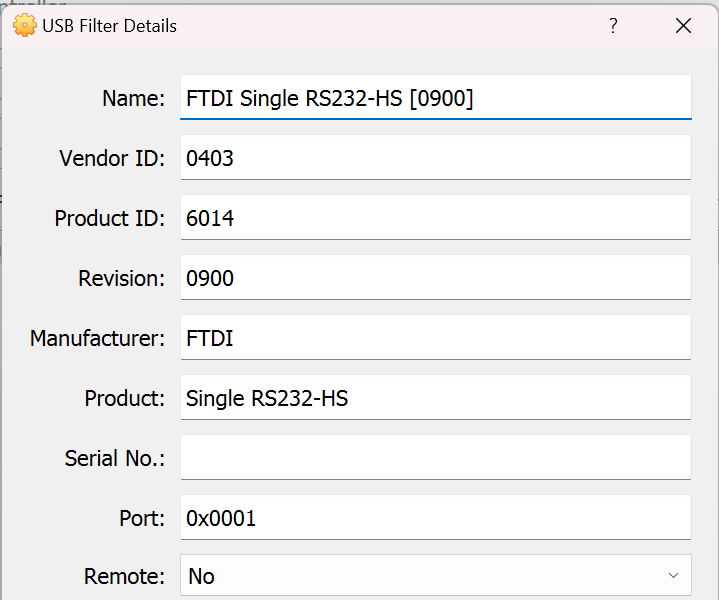

# 26 Jun 2024

| Previous journal: | Next journal: |
|-|-|
| [**0205**-2024-05-30.md](./0205-2024-05-30.md) | [**0207**-2024-06-28.md](./0207-2024-06-28.md) |

# Trying out Efabless eval board and generic Caravel chip

## Background

*   Spare 'Caravel Rev 5A' board from Efabless, with spare QFN on M.2 card: CI2304, slot E3, chip 112 -- [It appears to be a generic CUP counter example](https://github.com/jeffdi/mpw-9-test)
*   Host PC running Windows 11
*   I'll pass thru the board (FTDI USB interface) to Ubuntu 22.04 VM in VirtualBox
*   I installed minicom, screen, and picocom, that can be used to help with debugging USB serial: `sudo apt install minicom screen picocom`
*   My user is already part of the `dialout` group (as proven by `id $USER`)

## Connect eval board; proof of life

1.  Start with no M.2 card connected, just for basic test
2.  Plug in micro-USB cable:
    *   Single power LED (D4 at bottom)
    *   FTDI USB device identified by Windows:

        
3.  In VM, run `sudo dmesg -T --follow` -- Hit ENTER a couple of times for a visual break
4.  In VirtualBox, right-click the device in VirtualBox and pass it thru to the VM. After a moment, should appear in log:
    ```
    [Wed Jun 26 08:55:32 2024] usb 2-1: new high-speed USB device number 2 using ehci-pci
    [Wed Jun 26 08:55:33 2024] usb 2-1: New USB device found, idVendor=0403, idProduct=6014, bcdDevice= 9.00
    [Wed Jun 26 08:55:33 2024] usb 2-1: New USB device strings: Mfr=1, Product=2, SerialNumber=0
    [Wed Jun 26 08:55:33 2024] usb 2-1: Product: Single RS232-HS
    [Wed Jun 26 08:55:33 2024] usb 2-1: Manufacturer: FTDI
    [Wed Jun 26 08:55:33 2024] usbcore: registered new interface driver usbserial_generic
    [Wed Jun 26 08:55:33 2024] usbserial: USB Serial support registered for generic
    [Wed Jun 26 08:55:33 2024] usbcore: registered new interface driver ftdi_sio
    [Wed Jun 26 08:55:33 2024] usbserial: USB Serial support registered for FTDI USB Serial Device
    [Wed Jun 26 08:55:33 2024] ftdi_sio 2-1:1.0: FTDI USB Serial Device converter detected
    [Wed Jun 26 08:55:33 2024] usb 2-1: Detected FT232H
    [Wed Jun 26 08:55:33 2024] usb 2-1: FTDI USB Serial Device converter now attached to ttyUSB0
    ```
    If you want more info, you can do: `lsusb -v -d 0403:`
5.  Scope test `xclk` (onboard 10MHz oscillator):
    *   Trigger at 1.5V
    *   50nS timebase
    *   TP1 and TP2 on board are both GND
    *   `xclk` is producing 10MHz at about 3.3V
    *   Clock halts while J6 is shorted, as expected

## Setting up HKDebug

0.  With board plugged in and passed thru to Ubuntu VM (note; need to pass thru each time unless you make it permanent), can do:
    ```bash
    ls -al /dev/serial/by-id/usb-FTDI_Single_RS232-HS-if00-port0 # -> ../../ttyUSB0
    ls -al '/dev/serial/by-path/pci-0000:00:0b.0-usb-0:1:1.0-port0' # -> ../../ttyUSB0
    ```
1.  ```bash
    cd ~/WORK/demo
    git clone https://github.com/efabless/caravel_board # 286MB. --depth=1 makes little difference
    cd caravel_board
    ```
2.  Set up a new venv:
    ```bash
    python3 -m venv --prompt caravel_board .venv
    echo '*' >> .venv/.gitignore
    source .venv/bin/activate
    python --version # Python 3.10.12; same goes for python3 --version
    which python3 # /home/anton/WORK/demo/caravel_board/.venv/bin/python3
    pip list
    # Package    Version
    # ---------- -------
    # pip        22.0.2
    # setuptools 59.6.0
    ```
2.  ```bash
    cd firmware/chipignite/demos
    make hk_debug
    # Fails with: ModuleNotFoundError: No module named 'pyftdi'
    ```
3.  Per [this](https://github.com/efabless/caravel_board#firmware) need to do: `pip3 install pyftdi`
4.  Now `make hk_debug` fails with: `ValueError: The device has no langid (permission issue, no string descriptors supported or device error)`
    *   Running `lsusb -v -d 0403:` shows lots of data but also error message: `Couldn't open device, some information will be missing`
    *   Running it with `sudo` reveals this extra info:
        ```
              iInterface              2 Single RS232-HS 
        ...
        Device Qualifier (for other device speed):      
          bLength                10                     
          bDescriptorType         6                     
          bcdUSB               2.00                     
          bDeviceClass            0                     
          bDeviceSubClass         0                     
          bDeviceProtocol         0                     
          bMaxPacketSize0        64                     
          bNumConfigurations      1                     
        Device Status:     0x0000                       
          (Bus Powered)                                 
        ```
5.  It IS possible to connect:
    *   `picocom /dev/ttyUSB0`
    *   Exit with CTRL+A CTRL+X
    ...but there may be an extra FTDI USB layer that this is trying to access for ioctl. Using [this](https://groups.google.com/g/weewx-user/c/kol0udZNuyc/m/1WhtZF0kBAAJ) as a guide led me to do this:
    1.  `lsusb` -- get VID:PID which are 0403:6014
    2.  Create (as root) `/etc/udev/rules.d/99-ftdi-everyone.rules`:
        ```udev
        # Per https://groups.google.com/g/weewx-user/c/kol0udZNuyc/m/1WhtZF0kBAAJ
        # ...and https://github.com/algofoogle/journal/blob/master/0206-2024-06-26.md
        # ...this ensures all users get full access to the FTDI USB interface on
        # the caravel_board hardware, without having to be root:

        SUBSYSTEM=="usb", ATTR{idVendor}=="0403", ATTR{idProduct}=="6014", MODE="666"
        ```
    3.  `sudo service udev restart`
    4.  Unplug and replug the board, and pass back thru to Linux VM.
6.  `make hk_debug` now works, and as expected gives an error when trying to read the chip (which is not yet plugged in):
    ```
    $ make hk_debug 
    python3 ../util/caravel_hkdebug.py
    Success: Found one matching FTDI device at ftdi://ftdi:232h:2:4/1
    Caravel data:
       mfg        = ffff
       product    = ff
       project ID = ffffffff
    make: *** [Makefile:47: hk_debug] Error 2
    ```

## Communicating with the chip using HKDebug

1.  Unplug the board.
2.  Remove M.2 screw, insert the M.2 card (push in firmly to snap in), replace screw gently.
3.  Plug in the board and pass thru to VM again.
4.  Run `make hk_debug`:
    ```bash
    Success: Found one matching FTDI device at ftdi://ftdi:232h:2:5/1
    Caravel data:
       mfg        = 0456
       product    = 11
       project ID = 23047a49

    -----------------------------------
    ```
    Looking good. This chip is https://github.com/jeffdi/mpw-9-test (same as general CUP user_proj_example? All GPIOs configured as outputs).
5.  Use option 1: Read Caravel registers:
    ```
    reg 0x0 = b'00'
    reg 0x1 = b'04'
    reg 0x2 = b'56'
    reg 0x3 = b'11'
    reg 0x4 = b'92'
    reg 0x5 = b'5e'
    reg 0x6 = b'20'
    reg 0x7 = b'c4'
    reg 0x8 = b'02'     reg_hkspi_pll_ena       = [;1;0] = [Use manual DCO; Disable DCO]
    reg 0x9 = b'01'     reg_hkspi_pll_bypass    = [;1]   = [Use external clock]
    reg 0xa = b'00'     reg_hkspi_irq           = [;0]   = [No action]
    reg 0xb = b'00'     reg_hkspi_reset         = [;0]   = [No action]
    reg 0xc = b'00'     reg_hkspi_trap          = [;0]   = [No current trap]
    reg 0xd = b'ff'     reg_hkspi_trim[...]
    reg 0xe = b'ef'     reg_hkspi_trim[...]
    reg 0xf = b'ff'     reg_hkspi_trim[...]
    reg 0x10 = b'03'    reg_hkspi_trim[...]     = Default 0x3ffefff trim.
    reg 0x11 = b'12'    reg_hkspi_source        = [;010;010] = Divide both clocks by 2
    reg 0x12 = b'04'    reg_hkspi_divider       = [;00100] = Multiply clock by 4
    ```
    NOTE: While `reg_hkspi_pll_bypass` is in effect, registers 0x08 and 0x0d..0x12 should have no meaningful effect.
6.  Use option 5: Read Flash JEDEC codes:
    ```
    JEDEC = b'ef4016'
    ```
    Means:
    *   MFR=0xEF: Winbond
    *   Device=0x4016: 0x16 (dec 22) means 2^22 (4M addresses, thus 4MByte).
    [This checks out](https://media.digikey.com/pdf/Data%20Sheets/Winbond%20PDFs/W25Q32JV_RevI_5-4-21.pdf#page=21&zoom=100,92,401): The chip is labelled as a Winbond (W)25Q**32**JVSIQ (32Mbit, i.e. 4MByte).

## Reading ALL registers

I added an extra option 15 to `caravel_hkdebug.py`:

```py
    elif k == '15':
        data = slave.exchange([CARAVEL_STREAM_READ, 0x00], 256)
        print('   ', end='')
        for i in range(16):
            print(f'  -{i:x}', end='')
        print()
        for i in range(len(data)):
            if i%16 == 0:
                print(f'{i>>4:x}- ',end='')
            print(f'  {data[i]:02X}',end='')
            if i%16 == 15:
                print()
```

This retrieves the raw contents of all 256 register addresses:

```
     -0  -1  -2  -3  -4  -5  -6  -7  -8  -9  -a  -b  -c  -d  -e  -f
0-   00  04  56  11  92  5E  20  C4  02  01  00  01  00  FF  EF  FF

1-   03  12  04  00  00  00  00  00  00  00  09  00  00  18  03  18
2-   03  04  03  08  01  04  03  04  03  04  03  04  03  04  03  04
3-   03  04  03  04  03  04  03  04  03  04  03  04  03  04  03  04
4-   03  04  03  04  03  04  03  04  03  04  03  04  03  04  03  04
5-   03  04  03  04  03  04  03  04  03  04  03  04  03  04  03  04
6-   03  04  03  04  03  18  03  18  03  00  00  00  00  11  00  00
7-   00  00  00  00  00  00  00  00  00  00  00  00  00  00  00  00
8-   00  00  00  00  00  00  00  00  00  00  00  00  00  00  00  00
9-   00  00  00  00  00  00  00  00  00  00  00  00  00  00  00  00
a-   00  00  00  00  00  00  00  00  00  00  00  00  00  00  00  00
b-   00  00  00  00  00  00  00  00  00  00  00  00  00  00  00  00
c-   00  00  00  00  00  00  00  00  00  00  00  00  00  00  00  00
d-   00  00  00  00  00  00  00  00  00  00  00  00  00  00  00  00
e-   00  00  00  00  00  00  00  00  00  00  00  00  00  00  00  00
f-   00  00  00  00  00  00  00  00  00  00  00  00  00  00  00  00
```

Examining the rest:

```
13:         reg_mprj_xfer = 0
14..19: ?
1a:         reg_power_good = [;1;0;0;1] = [usr1_vcc ok; usr2_vcc NOT; usr1_vdd NOT; usr2_vdd ok]
1b:         reg_clk_out_dest = [;0;0;0] = No clock monitoring
1c:         reg_irq_source = 0
1d,1e:      reg_mprj_io_0 = 0x1803 = [;110;0;0;0;0;0;0;0;0;1;1]: # Same as `GPIO_MODE_USER_STD_OUT_MONITORED | MGMT`
            [
                DM      =110        # "Strong pull-up, Strong pull-down": Strong 0, Strong 1
                VTRIP   =0          # vtrip_sel=0: VIL=0.3*vddio; VIH=0.7*vddio
                SLOW    =0          # Fast edge rate
                AN_POL  =0
                AN_SEL  =0
                AN_EN   =0
                MOD_SEL =0
                INP_DIS =0          # Input buffer ENabled
                HOLDH   =0
                OEB_N   =1          # Output buffer DISabled ??? 
                MGMT_EN =1          # Management mode
            ]
1f,20:      reg_mprj_io_1  = 0x1803
21,22:      reg_mprj_io_2  = 0x0403 # GPIO_MODE_MGMT_STD_INPUT_NOPULL
23,24:      reg_mprj_io_3  = 0x0801 # GPIO_MODE_MGMT_STD_INPUT_PULLUP
25,26:      reg_mprj_io_4  = 0x0403 # GPIO_MODE_MGMT_STD_INPUT_NOPULL
...
63,64:      reg_mprj_io_35 = 0x0403 # GPIO_MODE_MGMT_STD_INPUT_NOPULL
65,66:      reg_mprj_io_36 = 0x1803
67,68:      reg_mprj_io_37 = 0x1803
```

For now I will call mode 0x1803 "GPIO_MODE_***MGMT***_STD_OUT_MONITORED" though there isn't a mode with this name.

So this config tells us that the chip's current state for each IO is:
*   0: debug    Output: 1803  GPIO_MODE_MGMT_STD_OUT_MONITORED
*   1: SDO      Output: 1803  GPIO_MODE_MGMT_STD_OUT_MONITORED
*   2: SDI      Input:  0403  GPIO_MODE_MGMT_STD_INPUT_NOPULL
*   3: CSB      Input:  0801  GPIO_MODE_MGMT_STD_INPUT_PULLUP -- pulled up to ensure no floating CSB assertions
*   4: SCK      Input:  0403  GPIO_MODE_MGMT_STD_INPUT_NOPULL
*   ...same mode for 4..35
*   36: ??      Output: 1803  GPIO_MODE_MGMT_STD_OUT_MONITORED
*   37: ??      Output: 1803  GPIO_MODE_MGMT_STD_OUT_MONITORED

NOTE: GPIOs 0..4 have their defaults set [here](https://github.com/efabless/caravel/blob/487a439614d25a71b68bb6bf7d7fa62b6dfd33cd/scripts/gen_gpio_defaults.py#L171-L180). Note that the correct `0801` default CSB pullup has only been in there [since 2022-10-06](https://github.com/efabless/caravel/commit/7276623d3cd2b909e83a79f24968b5b547fcef86#diff-23e9f52afefad3a07faa8ac631ddd77c221bdfb05fc0eb57f590d5330b7c5eaaR175).

`DM` bits per: https://skywater-pdk.readthedocs.io/en/main/contents/libraries/sky130_fd_io/docs/user_guide.html#eight-drive-strength-modes

## Clock output

1.  Attach scope probes to `GPIO[15:14]` -- no signal (0V).
2.  Read existing config for `GPIO[15:14]`:
    1.  `make hk_debug`
    2.  Read contents of registers 0x39..0x3C: 0403, 0403 (both are `GPIO_MODE_MGMT_STD_INPUT_NOPULL`)
3.  Write 0x06 to register 0x1B (enable output for both clocks)
4.  Read it back; yep, it's set. No reaction on IOs yet.
5.  Configure 39,3A and 3B,3C to both be 1809 (`GPIO_MODE_MGMT_STD_OUTPUT`)
6.  Enable GPIO config shift register update: write register 0x13 with 0x01
7.  Very stable 10MHz coming out of both clocks. `user_clock2` seems to **lead** `wb_clk_i` by about 4ns??
8.  Enable DCO: write register 8 with 3 (0b11 = [use DCO; enable DCO])
9.  Disable DLL bypass: write register 9 with 0
10. Changed clock is now visible
11. Shorting J6 (to stop external OSC) does NOT stop clock output; DCO is working
12. Set maximum trim (0x3fffffff): write 0xff 0xff 0xff 0x3f sequence starting at register 0x0d
13. Set dividers to 4: write 0b00100100 (0x24) to register 0x11
14. Clocks are now at ~7.65MHz and pretty stable. User clock now leads core by about 12ns. Implies DCO at 30.6MHz
15. Set minimum trim: write 0 0 0 0 sequence starting at register 0x0d
16. Clocks are now at ~18.66MHz and pretty stable. Implies DCO at 74.64MHz
17. NOTE: This whole time, reg_hkspi_pll_divider (0x12) is set to 4, which should have no effect.
18. Set max trim again (step 12) - Clock back to 7.65MHz (with div-4)
19. Set clock dividers (0x11) to div-3: 0b011011 (0x1B) => Clocks at 10.2MHz (*3=30.6MHz)
20. Set clock dividers (0x11) to div-2: 0b010010 (0x12) => Clocks at 15.15MHz (*2=30.3MHz)
21. Set CORE divider to 1 (STOP): 0b010001 (0x11) => CORE clock stops, user clock remains per step 20.
22. Set clock dividers (0x11) to 0 (div-1): 0 => user clock at 30.8MHz, but CORE still stopped??
