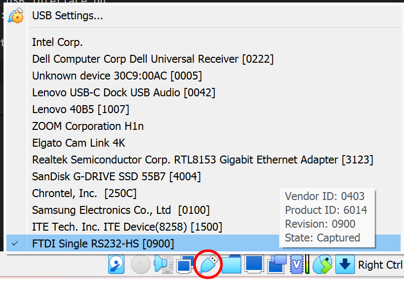
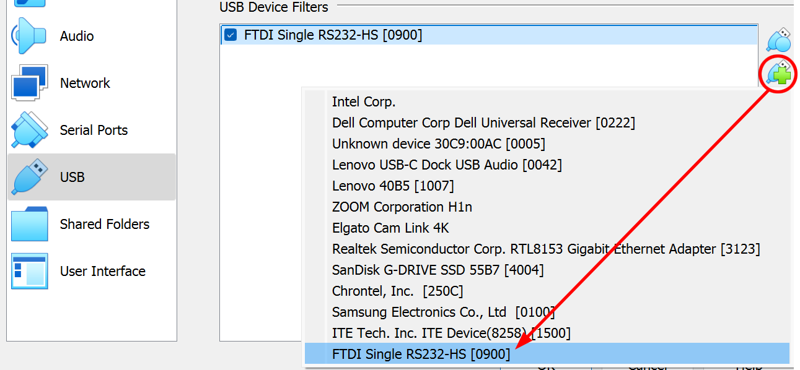

# 28 Jun 2024

| Previous journal: | Next journal: |
|-|-|
| [**0206**-2024-06-26.md](./0206-2024-06-26.md) | [**0208**-2024-07-05.md](./0208-2024-07-05.md) |

# Testing Caravel chips with HKDebug and the Efabless Eval board

This is a redo of [yesterday's efforts][0206], to present cleaner doco.


## TL;DR

These instructions assume Ubuntu Linux (native, or in a VM).

### Initial setup

1.  Make sure your user is a member of the `dialout` group. Run `sudo adduser $USER dialout` and then reboot.
2.  You need at least Python 3.6 installed.
3.  Do: `pip install pyftdi`
4.  Start **without** a chip in the eval board's M.2 slot.
5.  Plug in the eval board via USB, and [if you're using a VM, pass the USB device through](#instructions-for-passing-the-eval-board-usb-device-to-a-virtualbox-vm)
6.  Run `lsusb` and look for `ID 0403:6014 Future Technology Devices International, Ltd FT232H Single HS USB-UART/FIFO IC` or similar -- remember the VID (e.g. `0403`) and PID (e.g. `6014`).
7.  Unplug the board.
8.  Create the file `/etc/udev/rules.d/99-ftdi-everyone.rules` with these contents:
    ```udev
    SUBSYSTEM=="usb", ATTR{idVendor}=="0403", ATTR{idProduct}=="6014", MODE="666"
    ```
    ...replacing `0403` and `6014` if required.
9.  Restart udev: `sudo service udev restart`

### Using HKDebug

1.  Clone the repo and go into where the utility is found:
    ```bash
    git clone https://github.com/efabless/caravel_board
    cd caravel_board/firmware/chipignite/demos
    ```
2.  With the eval board unplugged/unpowered, remove the M.2 socket screw, plug in one of the M.2 cards, and gently secure it with the screw.
3.  Plug in the eval board.
4.  Run: `make hk_debug`
5.  Expect output resembling:
    ```
    python3 ../util/caravel_hkdebug.py
    Success: Found one matching FTDI device at ftdi://ftdi:232h:2:3/1
    Caravel data:
       mfg        = 0456
       product    = 11
       project ID = 23047a49
    
    -----------------------------------
    
    Select option:
      (1) read CARAVEL registers 
      (2) read CARAVEL project ID 
      (3) reset CARAVEL
      (4) reset Flash
      (5) read Flash JEDEC codes
      (6) start flash erase
      (7) check flash status
      (8) engage DLL
      (9) read DLL trim
     (10) disengage DLL
     (11) DCO mode
     (12) full trim
     (13) zero trim
     (14) set register value
      (q) quit
    ```
6.  Type `1` and press ENTER to read current state of HKSPI registers:
    > [!NOTE]
    > TBC!


### Turn on clock output via GPIOs

...

### Change clock to DCO mode

...test min and max, with divider...

### Change clock to DLL mode

...

### Look at Matt's other examples

...


> [!NOTE]
> **WHERE DOES lsftdi COME FROM??** Is it part of a package with other things?


## Background

*   I'm using a 'Caravel Rev 5A' chipIgnite eval board from Efabless, with a spare CI2304 QFN test chip mounted on an M.2 card.
*   The chip is CI2304 slot E3, chip 112, and [appears to be a generic `caravel_user_project` counter example](https://github.com/jeffdi/mpw-9-test)
*   My host PC is running Windows 11, but I'm primarily working in an Ubuntu Linux 22.04 VM in VirtualBox.
*   These instructions are written for Ubuntu Linux, but it should be possible to adapt this with only a little effort to work under Windows natively, with Python. One possible required change is for how the FTDI USB device is identified natively in Windows.
*   Instead of doing this natively in Windows, I'm doing USB-passthrough so the FTDI USB interface on the eval board is exposed to Linux (not Windows).


## Set up prerequisites

1.  Make sure your user is a member of the `dialout` group. Do:
    ```bash
    sudo adduser $USER dialout
    ```
    ...and then reboot. Alternatively you can run `newgrp` to load the new config (by totally reloading your current shell), but a reboot is generally better.
2.  To help later with debugging, consider also: `sudo apt install minicom picocom screen`
3.  Make sure you've got at least Python 3.6 installed. I'm typically testing with Python 3.10.
4.  Clone the [caravel_board repo]:
    ```bash
    git clone https://github.com/efabless/caravel_board
    cd caravel_board
    ```
5.  **Optionally** set up a Python venv to help keep packages/requirements for this project separate from others on your system:
    ```bash
    python3 -m venv --prompt caravel_board .venv
    echo '*' >> .venv/.gitignore # Keep .venv out of repo.
    ```
    **NOTE:** To ensure you load this Python venv now (and each time you start a new login/shell in future), you need to do:
    ```bash
    source .venv/bin/activate
    ```
    ...and it should show that this environment is now loaded by prefixing your command prompt with `(caravel_board)`
6.  Install the `pyftdi` package:
    ```bash
    pip install pyftdi
    ```

## Plugging in and enabling access to the eval board

1.  Start with:
    *   The eval board UNPLUGGED (i.e. powered off).
    *   The M.2 slot empty (i.e. no test chip inserted).
2.  Bring up a terminal window, and follow the end of the kernel log (so we'll be able to see if the board is properly detected):
    ```bash
    tail -fn 0 /var/log/kern.log
    ```
    This will just wait for new kernel messages, which will appear after the following steps...
3.  Connect the eval board to your computer via USB.
    *   The power LED (D4 near the bottom of the board) should light up immediately.
    *   If you are running Linux natively, the board should be detected fairly quickly.
    *   If you are running Linux in a VM, you will probably need to set your host to hand off the onboard FTDI USB interface to the VM. [See the instructions for how to do that in Virtualbox](#instructions-for-passing-the-eval-board-usb-device-to-a-virtualbox-vm).
4.  When the board is detected by Linux, you should see something similar to the following appear in your kernel log (from step 2):
    ```
    usb 2-1: new high-speed USB device number 3 using ehci-pci
    usb 2-1: New USB device found, idVendor=0403, idProduct=6014, bcdDevice= 9.00
    usb 2-1: New USB device strings: Mfr=1, Product=2, SerialNumber=0
    usb 2-1: Product: Single RS232-HS
    usb 2-1: Manufacturer: FTDI
    ftdi_sio 2-1:1.0: FTDI USB Serial Device converter detected
    usb 2-1: Detected FT232H
    usb 2-1: FTDI USB Serial Device converter now attached to ttyUSB0
    ```

In some Linux distributions, it is likely you will need to enable full user access to the device. In Ubuntu, you can do that as follows:

1.  Run `lsusb` and one of the output lines should look something like this:
    ```
    Bus 002 Device 003: ID 0403:6014 Future Technology Devices International, Ltd FT232H Single HS USB-UART/FIFO IC
    ```
2.  In the line above, `0403` is the USB "Vendor ID" (VID) and `6014` is the USB "Product ID" (PID). Your numbers may vary, but you will need both for the "Future Technology Devices International, Ltd FT232H Single HS" device.
3.  Create a file called `/etc/udev/rules.d/99-ftdi-everyone.rules` (you may need to do this with, say, `sudo nano /etc/udev/rules.d/99-ftdi-everyone.rules` or `sudo pico /etc/udev/rules.d/99-ftdi-everyone.rules`), and its contents should be:
    ```udev
    # Per https://groups.google.com/g/weewx-user/c/kol0udZNuyc/m/1WhtZF0kBAAJ
    # ...and https://github.com/algofoogle/journal/blob/master/0206-2024-06-26.md
    # ...this ensures all users get full access to the FTDI USB interface on
    # the caravel_board hardware, without having to be root:

    SUBSYSTEM=="usb", ATTR{idVendor}=="0403", ATTR{idProduct}=="6014", MODE="666"
    ```
    ...just make sure you replace `0403` and `6014` if required.
4.  Restart the `udev` service to load the new config:
    ```bash
    sudo service udev restart
    ```
5.  Unplug and replug the board (and if necessary on a VM, make sure you pass its USB device back through).


## Quick test of the eval board itself

1.  **Without** a chip already plugged into the eval board, make sure the eval board is plugged in.
2.  Start in the `caravel_board` repo directory.
3.  Do the following:
    ```bash
    cd firmware/chipignite/demo
    make hk_debug
    ```
4.  Expect to see this output (or very similar):
    ```
    python3 ../util/caravel_hkdebug.py
    Success: Found one matching FTDI device at ftdi://ftdi:232h:2:4/1
    Caravel data:
       mfg        = ffff
       product    = ff
       project ID = ffffffff
    make: *** [Makefile:47: hk_debug] Error 2
    ```
    This shows that it found the board, but there was no chip to read (per step 1).

You can optionally also attach an oscilloscope, frequency counter, or logic analyzer to test the onboard oscillator:
1.  TP1 and TP2 at the bottom of the board are both GND.
2.  The right-hand-side header strip includes the `xclk` pin which should be producing a stable 10MHz clock signal at 3.3V.
3.  You can optionally disable this clock (high-impedance) by shorting both pins of J6 on the board, but for normal operation leave this clock running.


## Instructions for passing the eval board USB device to a VirtualBox VM

If you want a Linux VM to be able to control a USB device (including the eval board) attached to the host computer, you need to pass through that USB device for the guest VM's control.

Here are instructions for doing this using VirtualBox:

1.  Plug in the USB device.
1.  Right-click the USB plug icon in the bottom-right corner of the main VM window.
2.  Select the "FTDI Single RS232-HS" (or similar) device:
    

After doing that, you can optionally **also make this permanent** as follows:

1.  Right-click the USB plug icon again.
2.  Select 'USB Settings...'
3.  From the window that appears, click the right-hand-side button that shows a green plus (+) symbol over a plug, select the "FTDI Single RS232-HS" device, then click OK.
    

Now, the next time you plug in the board (or cold-start your VM), it should automatically capture the USB device.


# OTHER NOTES

*   Holding internal CPU reset by HKSPI seems to revert to direct clock out rather than DLL, just for the duration of the reset pulse...?


[0206]: ./0206-2024-06-26.md
[caravel_board repo]: https://github.com/efabless/caravel_board


# CI2311 next steps

* [x] Resistors on custom digital input pins.
* [x] Custom digital input pins driven by RP2040
* [x] Change RP2040 script to do direct USB reads => UART writes
* [x] Integrate RP2040 script and new protocol into Pygame
* [ ] Rework protocol and state machine to derive states directly from upper bits, and hence reduce code?
* [ ] Try black eval board
* [ ] Use extra decoupling caps
* [ ] Watch texture SPI on scope
* [ ] RP2040 interrupt handler on UART or even on VSYNC or HSYNC (for alternating texture modes per line)
* [ ] Instead of relying on UART feedback, use another single bit (even gpio) as 'ack'/ready signal.
* [ ] Figure out how to get disassembly with inline source
* [ ] Back up existing textures and write new ones
* [ ] Experiment with texture animation
