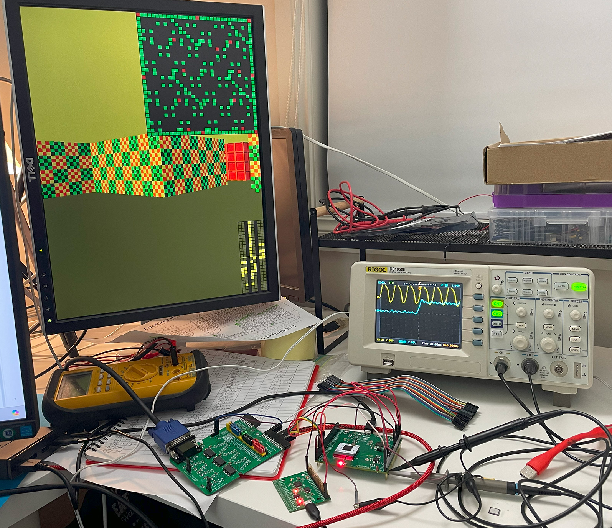

# 5 Jul 2024

| Previous journal: | Next journal: |
|-|-|
| [**0207**-2024-06-28.md](./0207-2024-06-28.md) | *Next journal TBA* |

# Trying out CI2311 chips



*   Probed pins on one chip to get expected resistances, to help check my soldering work later.
*   Compared with measurements of a chip in the Tiny Tapeout QFN socket breakout. Seems to work fine (but not tested comprehensively yet in the TT demo board).
*   Soldered a chip to an M.2 card and probed it. Seems fine: All connections made, no shorts. Didn't bother with decaps yet. Note that on cleaning up the flux paste, I left some debris (inc. masking tape glue) on the QFN pins.
*   Chip seems to work via HKSPI in green caravel_board.
*   I had a strong static discharge on my USB cable plugged into the caravel_board. HKSPI interface still seems to be working after that, but not sure if the chip has otherwise been affected.

# `user_defines.v`

This should be what's programmed onto the chip, but I need to find out how to check:

```verilog
`define USER_CONFIG_GPIO_5_INIT  `GPIO_MODE_MGMT_STD_INPUT_NOPULL   // SoC: ser_rx (In)
`define USER_CONFIG_GPIO_6_INIT  `GPIO_MODE_MGMT_STD_OUTPUT         // SoC: ser_tx (Out)
`define USER_CONFIG_GPIO_7_INIT  `GPIO_MODE_MGMT_STD_INPUT_NOPULL   // SoC: irq (In)

`define USER_CONFIG_GPIO_8_INIT  `GPIO_MODE_USER_STD_ANALOG         // Ellen: cascref (analog[1])
`define USER_CONFIG_GPIO_9_INIT  `GPIO_MODE_USER_STD_ANALOG         // Ellen: adc_in0 (analog[2])
`define USER_CONFIG_GPIO_10_INIT `GPIO_MODE_USER_STD_ANALOG         // Ellen: adc_in1 (analog[3])

`define USER_CONFIG_GPIO_11_INIT `GPIO_MODE_MGMT_STD_INPUT_NOPULL   // Anton: external clock input
`define USER_CONFIG_GPIO_12_INIT `GPIO_MODE_USER_STD_OUTPUT         // Anton: o_hsync
`define USER_CONFIG_GPIO_13_INIT `GPIO_MODE_USER_STD_OUTPUT         // Anton: o_vsync
`define USER_CONFIG_GPIO_14_INIT `GPIO_MODE_USER_STD_OUTPUT         // Anton: o_tex_csb
`define USER_CONFIG_GPIO_15_INIT `GPIO_MODE_USER_STD_OUTPUT         // Anton: o_tex_sclk
`define USER_CONFIG_GPIO_16_INIT `GPIO_MODE_USER_STD_BIDIRECTIONAL  // Anton: i_tex_in[0] (In) / o_tex_out0 (Out)
`define USER_CONFIG_GPIO_17_INIT `GPIO_MODE_USER_STD_OUTPUT         // Anton: o_gpout[0]
`define USER_CONFIG_GPIO_18_INIT `GPIO_MODE_USER_STD_OUTPUT         // Anton: o_gpout[1]
`define USER_CONFIG_GPIO_19_INIT `GPIO_MODE_USER_STD_OUTPUT         // Anton: o_gpout[2]
`define USER_CONFIG_GPIO_20_INIT `GPIO_MODE_USER_STD_OUTPUT         // Anton: o_gpout[3]

`define USER_CONFIG_GPIO_21_INIT `GPIO_MODE_USER_STD_ANALOG         // Pawel: (analog[14])
`define USER_CONFIG_GPIO_22_INIT `GPIO_MODE_USER_STD_ANALOG         // Pawel: (analog[15])
`define USER_CONFIG_GPIO_23_INIT `GPIO_MODE_USER_STD_ANALOG         // Pawel: (analog[16])
`define USER_CONFIG_GPIO_24_INIT `GPIO_MODE_USER_STD_ANALOG         // Pawel: (analog[17])
`define USER_CONFIG_GPIO_25_INIT `GPIO_MODE_USER_STD_ANALOG         // Pawel: (analog[18])
`define USER_CONFIG_GPIO_26_INIT `GPIO_MODE_USER_STD_ANALOG         // Pawel: (analog[19])

`define USER_CONFIG_GPIO_27_INIT `GPIO_MODE_USER_STD_OUTPUT         // Ellen: PWM
`define USER_CONFIG_GPIO_28_INIT `GPIO_MODE_USER_STD_OUTPUT         // Ellen: PWM
`define USER_CONFIG_GPIO_29_INIT `GPIO_MODE_USER_STD_OUTPUT         // Ellen: PWM
`define USER_CONFIG_GPIO_30_INIT `GPIO_MODE_USER_STD_OUTPUT         // Ellen: glitch_ch0_out
`define USER_CONFIG_GPIO_31_INIT `GPIO_MODE_USER_STD_INPUT_NOPULL   // Ellen: glitch_in_nCLR_pin0 (Anton share: i_tex_in[1])
`define USER_CONFIG_GPIO_32_INIT `GPIO_MODE_USER_STD_INPUT_NOPULL   // Ellen: glitch_in_pin0      (Anton share: i_tex_in[2])
`define USER_CONFIG_GPIO_33_INIT `GPIO_MODE_USER_STD_OUTPUT         // Ellen: glitch_ch1_out
`define USER_CONFIG_GPIO_34_INIT `GPIO_MODE_USER_STD_INPUT_NOPULL   // Ellen: glitch_in_nCLR_pin1 (Anton share: i_tex_in[3])
`define USER_CONFIG_GPIO_35_INIT `GPIO_MODE_USER_STD_INPUT_NOPULL   // Ellen: glitch_in_pin1      (Anton share: i_spare_1)

`define USER_CONFIG_GPIO_36_INIT `GPIO_MODE_MGMT_STD_INPUT_NOPULL   // SoC: flash_io[2] (I/O)
`define USER_CONFIG_GPIO_37_INIT `GPIO_MODE_MGMT_STD_INPUT_NOPULL   // SoC: flash_io[3] (I/O)
```

NOTE: There isn't really a way to check other than by probing, to an extent. Tim Edwards explained that the GPIO state cannot be read back.

This is what's in the HKSPI registers at POR -- note that they don't follow `user_defines.v`, and are just 'values in waiting':

```
IO  Config  Mode                        SoC function
00  1803    MGMT    Output  MONITORED?  JTAG/Debug??
01  1803    MGMT    Output  MONITORED?  HKSPI SDO
02  0403    MGMT    Input   No-pull     HKSPI SDI
03  0801    MGMT    Input   Pull-up     HKSPI CSB
04  0403    MGMT    Input   No-pull     HKSPI SCK
05  0403    MGMT    Input   No-pull
06  0403    MGMT    Input   No-pull
07  0403    MGMT    Input   No-pull
08  0403    MGMT    Input   No-pull
09  0403    MGMT    Input   No-pull
10  0403    MGMT    Input   No-pull
11  0403    MGMT    Input   No-pull
12  0403    MGMT    Input   No-pull
13  0403    MGMT    Input   No-pull
14  0403    MGMT    Input   No-pull
15  0403    MGMT    Input   No-pull
16  0403    MGMT    Input   No-pull
17  0403    MGMT    Input   No-pull
18  0403    MGMT    Input   No-pull
19  0403    MGMT    Input   No-pull
20  0403    MGMT    Input   No-pull
21  0403    MGMT    Input   No-pull
22  0403    MGMT    Input   No-pull
23  0403    MGMT    Input   No-pull
24  0403    MGMT    Input   No-pull
25  0403    MGMT    Input   No-pull
26  0403    MGMT    Input   No-pull
27  0403    MGMT    Input   No-pull
28  0403    MGMT    Input   No-pull
29  0403    MGMT    Input   No-pull
30  0403    MGMT    Input   No-pull
31  0403    MGMT    Input   No-pull
32  0403    MGMT    Input   No-pull
33  0403    MGMT    Input   No-pull
34  0403    MGMT    Input   No-pull
35  0403    MGMT    Input   No-pull
36  1803    MGMT    Output  MONITORED?
37  1803    MGMT    Output  MONITORED?
```

# Clock output

1.  14 - 0x1b - 6 -- Enable clock outputs
2.  16 - 0x39 - 0x18 0x09 0x18 0x09 - y -- Prep `GPIO[15:14]` output config
3.  14 - 0x13 - 1 -- Load GPIO config
4.  Clock output starts now, but is not very symmetrical (~62% duty cycle)

# Test DCO range

1.  14 - 0x11 - 0b111_111 -- Set divider to 7 for both clocks: 
2.  12 -- full trim
3.  11 -- DCO mode
4.  We get 4.3MHz. x7 this is 30.1MHz
5.  13 -- zero trim
6.  We get 10MHz. x7 this is 70MHz

# All registers

```
     -0  -1  -2  -3  -4  -5  -6  -7  -8  -9  -a  -b  -c  -d  -e  -f
0-   00  04  56  11  73  35  88  C4  03  00  00  00  00  00  00  00
1-   00  3F  04  60  00  00  00  00  00  00  0B  06  00  18  03  18
2-   03  04  03  08  01  04  03  04  03  04  03  04  03  04  03  04
3-   03  04  03  04  03  04  03  04  03  18  09  18  09  04  03  04
4-   03  04  03  04  03  04  03  04  03  04  03  04  03  04  03  04
5-   03  04  03  04  03  04  03  04  03  04  03  04  03  04  03  04
6-   03  04  03  04  03  18  03  18  03  00  00  00  00  11  00  00
7-   00  00  00  00  00  00  00  00  00  00  00  00  00  00  00  00
8-   00  00  00  00  00  00  00  00  00  00  00  00  00  00  00  00
9-   00  00  00  00  00  00  00  00  00  00  00  00  00  00  00  00
a-   00  00  00  00  00  00  00  00  00  00  00  00  00  00  00  00
b-   00  00  00  00  00  00  00  00  00  00  00  00  00  00  00  00
c-   00  00  00  00  00  00  00  00  00  00  00  00  00  00  00  00
d-   00  00  00  00  00  00  00  00  00  00  00  00  00  00  00  00
e-   00  00  00  00  00  00  00  00  00  00  00  00  00  00  00  00
f-   00  00  00  00  00  00  00  00  00  00  00  00  00  00  00  00
```

# Firmware

I don't want to use the [default blink firmware](https://github.com/efabless/caravel_board/blob/main/firmware/chipignite/blink/blink.c) because it sets ALL pins to be outputs, and I know some pins of this chip are analog connections, so there could be shorts.

25MHz clock target:

*   10MHz clock, multiply by 5 => 50MHz
*   Divide by 2 => 25MHz
*   14 - 0x12 - 5
*   14 - 0x11 - 0b010_010
*   14 - 0x08 - 0b01
*   14 - 0x09 - 0

This is pretty close to 25MHz on the green board, with some severe jitter, and 75%+ duty cycle.

Download: https://static.dev.sifive.com/dev-tools/freedom-tools/v2020.12/riscv64-unknown-elf-toolchain-10.2.0-2020.12.8-x86_64-linux-ubuntu14.tar.gz

Extract in `/opt` and symlink as `/opt/riscv-toolchain`

Test: `/opt/riscv-toolchain/bin/riscv64-unknown-elf-gcc --version`:
```
riscv64-unknown-elf-gcc (SiFive GCC-Metal 10.2.0-2020.12.8) 10.2.0
Copyright (C) 2020 Free Software Foundation, Inc.
This is free software; see the source for copying conditions.  There is NO
warranty; not even for MERCHANTABILITY or FITNESS FOR A PARTICULAR PURPOSE.
```


```
     -0  -1  -2  -3  -4  -5  -6  -7  -8  -9  -a  -b  -c  -d  -e  -f
0-   00  04  56  11  73  35  88  C4  02  01  00  00  00  FF  EF  FF
1-   03  12  04  00  00  00  00  00  00  00  0B  00  00  18  03  18
2-   03  04  03  08  01  04  03  04  03  04  03  04  03  04  03  04
3-   03  04  03  04  03  04  03  04  03  04  03  04  03  04  03  04
4-   03  04  03  04  03  04  03  04  03  04  03  04  03  04  03  04
5-   03  04  03  04  03  04  03  04  03  04  03  04  03  04  03  04
6-   03  04  03  04  03  18  03  18  03  00  00  00  00  10  00  00
7-   00  00  00  00  00  00  00  00  00  00  00  00  00  00  00  00
8-   00  00  00  00  00  00  00  00  00  00  00  00  00  00  00  00
9-   00  00  00  00  00  00  00  00  00  00  00  00  00  00  00  00
a-   00  00  00  00  00  00  00  00  00  00  00  00  00  00  00  00
b-   00  00  00  00  00  00  00  00  00  00  00  00  00  00  00  00
c-   00  00  00  00  00  00  00  00  00  00  00  00  00  00  00  00
d-   00  00  00  00  00  00  00  00  00  00  00  00  00  00  00  00
e-   00  00  00  00  00  00  00  00  00  00  00  00  00  00  00  00
f-   00  00  00  00  00  00  00  00  00  00  00  00  00  00  00  00
```

# Basic measurements

*   3V3 rail and vddio: 3.26V average
*   1V8 rail and vccd1: 1.62V average -- **LOW**
*   NOTE: vccd2 is not connected by default, but raybox-zero uses this for its power, so need to connect it on eval board to 1V8 rail.


# Writing firmware to test raybox-zero

Raybox-zero pins:

```verilog
`define USER_CONFIG_GPIO_11_INIT `GPIO_MODE_MGMT_STD_INPUT_NOPULL   // Anton: external clock input
`define USER_CONFIG_GPIO_12_INIT `GPIO_MODE_USER_STD_OUTPUT         // Anton: o_hsync
`define USER_CONFIG_GPIO_13_INIT `GPIO_MODE_USER_STD_OUTPUT         // Anton: o_vsync
`define USER_CONFIG_GPIO_14_INIT `GPIO_MODE_USER_STD_OUTPUT         // Anton: o_tex_csb
`define USER_CONFIG_GPIO_15_INIT `GPIO_MODE_USER_STD_OUTPUT         // Anton: o_tex_sclk
`define USER_CONFIG_GPIO_16_INIT `GPIO_MODE_USER_STD_BIDIRECTIONAL  // Anton: i_tex_in[0] (In) / o_tex_out0 (Out)
`define USER_CONFIG_GPIO_17_INIT `GPIO_MODE_USER_STD_OUTPUT         // Anton: o_gpout[0]
`define USER_CONFIG_GPIO_18_INIT `GPIO_MODE_USER_STD_OUTPUT         // Anton: o_gpout[1]
`define USER_CONFIG_GPIO_19_INIT `GPIO_MODE_USER_STD_OUTPUT         // Anton: o_gpout[2]
`define USER_CONFIG_GPIO_20_INIT `GPIO_MODE_USER_STD_OUTPUT         // Anton: o_gpout[3]

`define USER_CONFIG_GPIO_31_INIT `GPIO_MODE_USER_STD_INPUT_NOPULL   // Anton: i_tex_in[1]   (shared with Ellen)
`define USER_CONFIG_GPIO_32_INIT `GPIO_MODE_USER_STD_INPUT_NOPULL   // Anton: i_tex_in[2]   (shared with Ellen)

`define USER_CONFIG_GPIO_34_INIT `GPIO_MODE_USER_STD_INPUT_NOPULL   // Anton: i_tex_in[3]   (shared with Ellen)
`define USER_CONFIG_GPIO_35_INIT `GPIO_MODE_USER_STD_INPUT_NOPULL   // Anton: i_spare_1     (shared with Ellen)
```

LA mapping -- NOTE: Add 64 to all of these for actual LA number:

```verilog
    .i_la_invalid           (anton_la_oenb[0]),     //  64  Check any one of our LA's OENBs. Should be 0 (i.e. driven by SoC) if valid.
    .i_reset_lock_a         (anton_la_in[0]),       //  64  Hold design in reset if equal (both 0 or both 1)
    .i_reset_lock_b         (anton_la_in[1]),       //  65  Hold design in reset if equal (both 0 or both 1)
    .i_vec_csb              (anton_la_in[2]),       //  66
    .i_vec_sclk             (anton_la_in[3]),       //  67
    .i_vec_mosi             (anton_la_in[4]),       //  68
    .i_gpout0_sel           (anton_la_in[10:5]),    //  74:69
    .i_debug_vec_overlay    (anton_la_in[11]),      //  75
    .i_reg_csb              (anton_la_in[12]),      //  76
    .i_reg_sclk             (anton_la_in[13]),      //  77
    .i_reg_mosi             (anton_la_in[14]),      //  78
    .i_gpout1_sel           (anton_la_in[20:15]),   //  84:79
    .i_gpout2_sel           (anton_la_in[26:21]),   //  90:85
    .i_debug_trace_overlay  (anton_la_in[27]),      //  91
    .i_gpout3_sel           (anton_la_in[33:28]),   //  97:92
    .i_debug_map_overlay    (anton_la_in[34]),      //  98
    .i_gpout4_sel           (anton_la_in[40:35]),   // 104:99
    .i_gpout5_sel           (anton_la_in[46:41]),   // 110:105
    .i_mode                 (anton_la_in[49:47]),   // 113:111
    .i_reg_outs_enb         (anton_la_in[50]),      // 114
    .i_spare_0              (anton_la_in[51]),      // 115
```

> [!NOTE]
> All of the following firmware examples were compiled and flashed with `make clean flash` as replacements of `demos.c` in the path `firmware/chipignite/demos/` within the [`caravel_board` repo](https://github.com/efabless/caravel_board).


## `01-rbz-reset.c`

See: [`01-rbz-reset.c`](./files/0208/01-rbz-reset.c)

*   Enable `gpio` pin output.
*   Configure `GPIO[11]` as `GPIO_MODE_USER_STD_INPUT_PULLUP` (otherwise it defaults to MGMT mode).
*   `GPIO[37:36]` are unused on this chip: Can make them outputs, and optionally could feed back one of them to `GPIO[11]`. For now just make them MGMT outputs.
*   Configure all other GPIOs to be safe values, i.e. MGMT inputs, **except** use config specified above for raybox-zero pins.
*   Configure LA pins generally: `LA[115:64]` should be outputs from the CPU to RBZ (which means they are to be configured as 'inputs', i.e. from the perspective of RBZ).
*   Keep the design in reset by keeping `LA[65:64]` both at 0 (or 1).
*   `gpout0` (`GPIO[17]`) select alt mode (`LA[74:69]` = `0b000001`), which should be `rbzero_reset` -- should be 1
*   `gpout1` (`GPIO[18]`) select alt mode (`LA[84:79]` = `0b000001`), which should be `wb_clk_i`.
*   `gpout2` (`GPIO[19]`) select alt mode (`LA[90:85]` = `0b000001`), which should be `user_clock2`.
*   `gpout3` (`GPIO[20]`) select alt mode (`LA[97:92]` = `0b000001`), which should be `i_reset_lock_b` -- echo LA1, should be 0?
*   Unregistered gpouts: LA114 is 1.
*   Configure DLL for 25MHz wb_clk_i and 12.5MHz user_clock2

Test conditions:
*   vccd2 connected to 1V8. Without it, circuit appears dead.
*   IO11 (i_clk) connected to xclk (10MHz)

Observations:
```
GPIO    Signal          Measured
12      o_hsync         1
13      o_vsync         1
14      o_tex_csb       1
15      o_tex_sclk      10MHz -- either inverted delay 16~17ns, or non-inverted delay 68ns (unlikely)
17      rbzero_reset    1
18      wb_clk_i        25MHz
19      user_clock2     12.5MHz
20      i_reset_lock_b  0
```

## `02-rbz-run.c`

See: [`02-rbz-run.c`](./files/0208/02-rbz-run.c)

*   As above, except...
*   Reset is released: LA65,64 = 01.
*   Registered gpouts: LA114 is 0.
*   Use generated textures: LA113 is 1.
*   i_debug_map_overlay on: LA98 is 1.
*   i_debug_vec_overlay on: LA75 is 1.
*   gpouts are all their defaults

Observations:
```
GPIO    Signal          Measured
12      o_hsync         12.44kHz -- about right; 12.5kHz expected. 88% duty.
13      o_vsync         23.81Hz -- as expected. ~99% duty.
14      o_tex_csb       12.50kHz, 77.5% duty. Consistent with SPI ROM read cycles for each line?
15      o_tex_sclk      10MHz -- either inverted delay 16~17ns, or non-inverted delay 68ns (unlikely)
17      green[lo]       Image data
18      green[hi]       Image data
19      red[lo]         Image data
20      red[hi]         Image data
```

NOTE: gpouts above should be able to produce these outputs even without configuring GPIOs (a good test) because that's their POR state from `user_defines`.


## `03-full.c`

See: [`03-full.c`](./files/0208/03-full.c)

*   Everything working (I think) -- host PC can control the view via UART
*   Tested at 'green board' 1.6V core voltage instead of 1.8V
*   DLL used to generate 50MHz clock for Caravel SoC (over the 40MHz spec, but working)
*   Initial reset cycle and POV load via LA-based internal SPI
*   Main loop:
    *   Each iteration reads 5 input GPIOs to decide how to set the state of internal LA signals (e.g. map/vectors debug overlay)
    *   Also checks if a new character has been received via UART
    *   State machine interprets data over UART, handles internally sending vector or register data in pieces as they are received (depending on initial command)
    *   On completion of a command via UART, responds by toggling Caravel `gpio` pin and sending back `V` or `R` depending on whether a vec or reg completed -- helps ensure no buffer overrun from UART sender
*   NOTE: Each iteration of the loop seems to have an SPI XIP instruction cache refresh, which is slow, but seems to perform just well enough by running CPU at 50MHz.

Using an RP2040 for control allows a host PC (with [modified `raybox-game.py` code](./files/0208/raybox-game-ci2311.zip)) to relay game view state data via UART to the CI2311 chip, and it runs quite well.

NOTE: Because I have only 4 gpouts, I made two of them the Blue channel data, and the other 2 (I think) red channel data, and then I repeated the red channel to the green channel on my DAC board to produce a blue-yellow image (which looks good enough with the SPI textures I have by default).


# Other notes

*   Not tested:
    *   Cutting back the main loop above to fit within cache.
    *   Optimising firmware with assembly.
    *   Trying out all the other gpout selector options.
*   There's a weird error sometimes where there appears to be a shift or inversion in at least one of the blue channel bits coming from the texture memory. I haven't narrowed this down but it seems to be triggered by some EM interference. For example, it shows up sometimes the moment I lean back in my office chair! Since I've had a scope probe attached to the SPI ROM /CS pin, it hasn't happened, but there are other things that could be different in this case also.
*   We have 4 output bits; an RGB121 gives nice colour ranges, if we want to experiment with that.
*   I should have made gpouts 4 & 5 feed back to LAs, since they're otherwise unused.
*   There's lots of ringing on certain signals: Long wires and poor decoupling, I guess.
*   There's occasionally also a strange visual artefact, which I think is the monitor: It shows "frayed" edges between vertical lines. I think this happens when I glitch the pixel clock; an auto-sync on the monitor fixes it. I doubt it's the design: The fraying occurs at a resolution above that which is being sent by the design (i.e. it's not at 480p, but appears to be the monitor's native 1200p).
