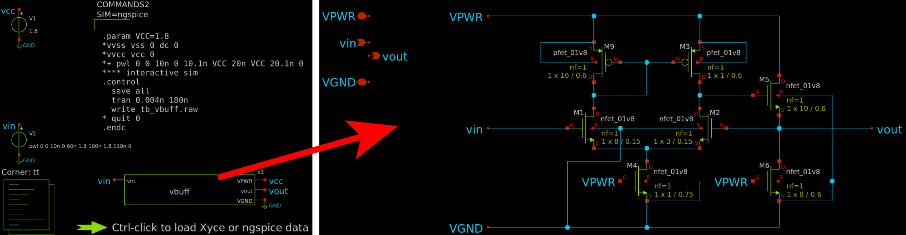
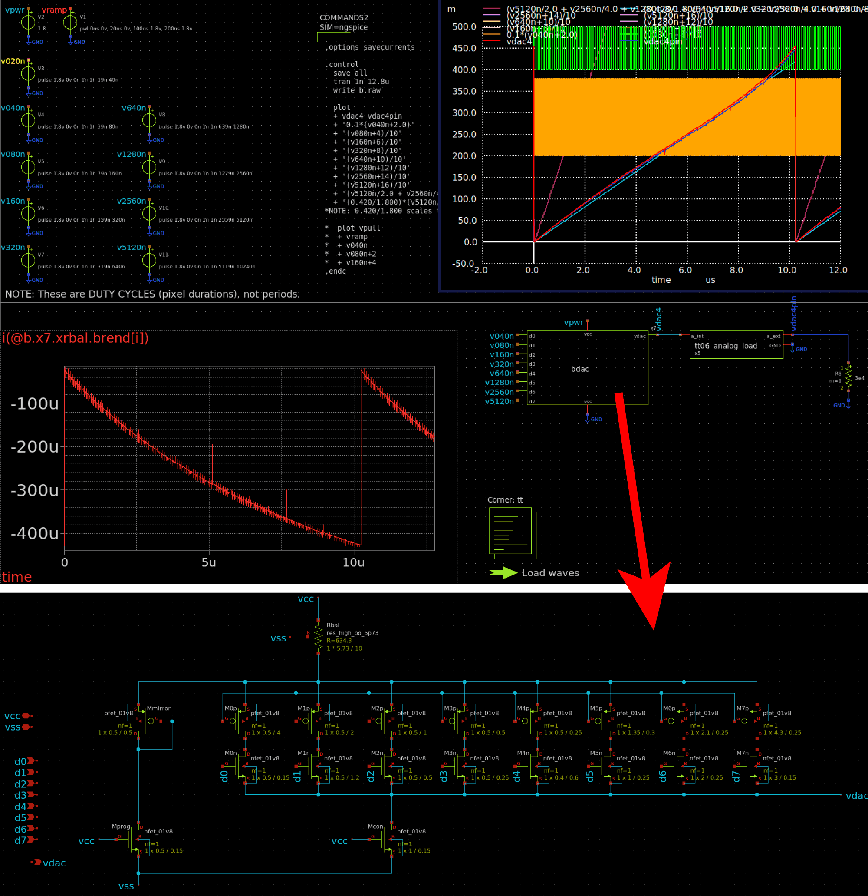
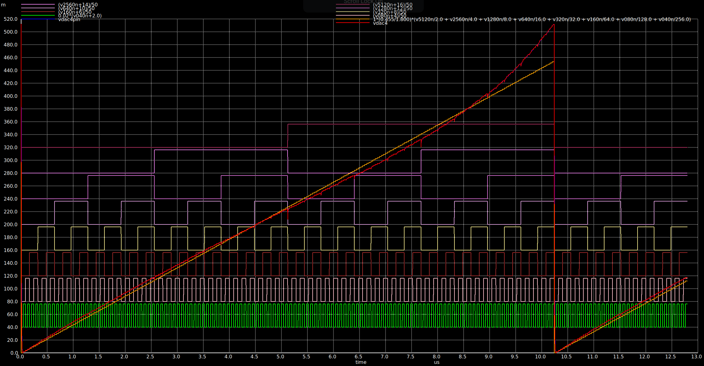
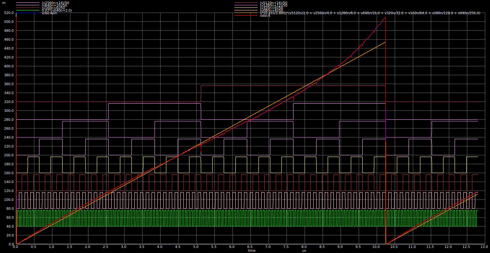
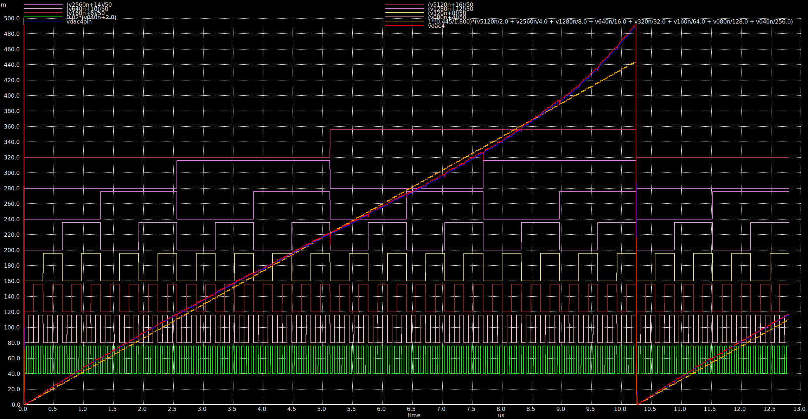
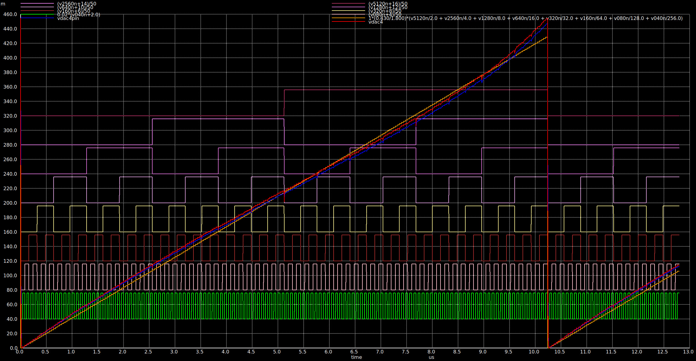
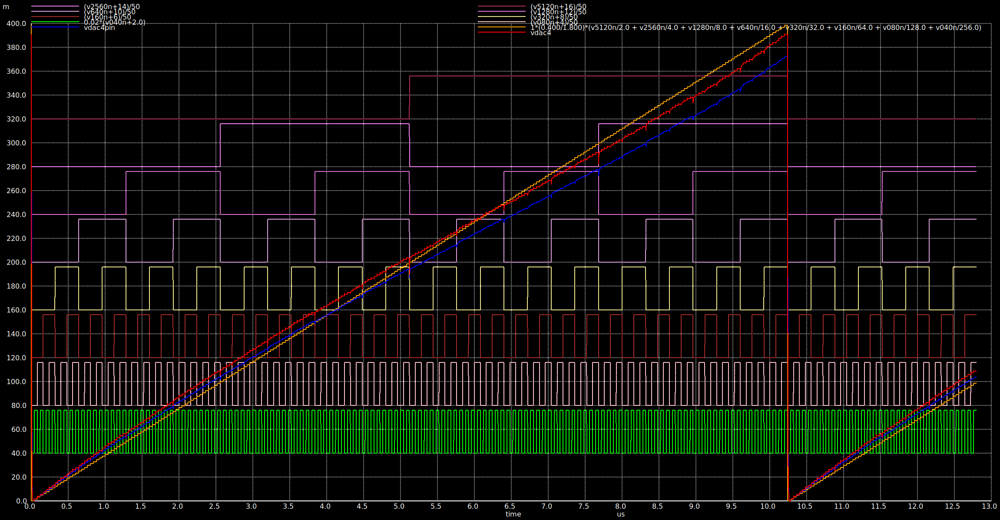
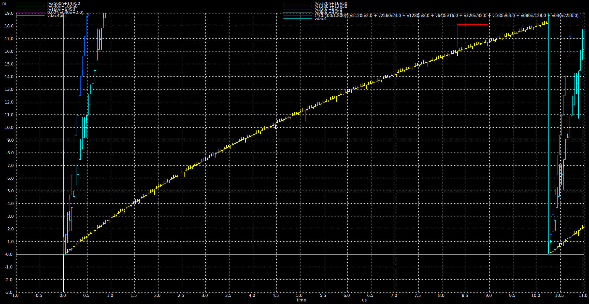

# 23 Jul 2024

| Previous journal: | Next journal: |
|-|-|
| [**0208**-2024-07-05.md](./0208-2024-07-05.md) | [**0210**-2024-08-09.md](./0210-2024-08-09.md) |

# Returning to tt-vga-fun

*   I got to a sort of working current steering DAC last time. It was using weird tarnsistor pairs, and didn't have completely linear performance, but was on the road to working well. I was able to produce a layout in a reasonable amount of area. Need to go back and work out what's where.
*   4 analog outputs:
    1.  R: RDAC + equal input buffers
    2.  G: RDAC + OpAmp
    3.  B: Current-steering DAC
    4.  One of the channels above using an alternate method? Maybe include analog switch?
*   3.3V option?
*   Find old tt-vga-fun notes:
    *   [0201](./0201-2024-05-11.md)
    *   [0202](./0202-2024-05-15.md)
    *   [0203 TT07 notes](./0203-2024-05-20.md#overall-tt07-submission-plan)
    *   [0205 tt-vga-fun notes](./0205-2024-05-30.md#tt-vga-fun-stuff) and [this](./0205-2024-05-30.md#tt-vga-fun-didnt-make-it-in-to-tt07)
*   Compare branches/commits
*   Review digital logic and make sure it's documented
*   Read current steering DAC paper
*   The digital block currently shows 'debug bits' which are the line number encoded as pixels per each line. These are at full brightness, in DAC pass-thru mode we need to ensure these don't turn on until we're ready to stress test the full circuit!
*   If we set up the DAC to be a current source (via current steering) then maybe we can handle external current-to-voltage conversion.
*   Transimpedance Amplifier might be a better way to convert current to voltage.
*   Start with a simpler 4-bit DAC and design around that.
*   V=IR, R=V/I
*   Is it possible to use a current mirror to take a small current and make it bigger?

# Looking at what I've already done

On `anton-analog-alpha` VM...

*   In `~/projects/tt-vga-fun`...
*   Branches:
    *   `main`:
        *   There's tag `tt06` ("Adding r2r_extra: just 4 bits connected to uio_in[6:3]") from 2024-04-20
        *   2 commits to 2024-05-02 on trying "j_opamp"
        *   Then lots of work on fixing simulation
        *   Finally some improvements to Verilog for digital controller, ending 2024-05-25
    *   `experiments`:
        *   Builds on `main` starting 2024-06-01
        *   Includes hardening of new digital block at 150x95um.
        *   Beginning of current steering.
    *   `maybe`: Last updated 2024-06-02 (`3819ebe`):
        *   Builds on `experiments` starting 2024-06-02
        *   Layout idea, bdac is good, kinda OK at 5bit, updates done since then to make it better. 
        *   Latest (uncommitted) was to delete from `mag`:
            *   `bdac.mag`
            *   `inverter.mag`
            *   `sky130*fet_01v8*.mag`
            *   `sky130_fd_pr__res_high_po_5p73_Y5QT6E.mag`

## Trying out the `maybe` branch, in `xschem/`...

### tb_vbuff.sch

Is this basically the j_opamp modified to be a voltage buffer? I have to check whether this works with the R2R DAC or not. The devices in it don't seem crazy but maybe the outer circuit where it is used has devices that are unrealistic (e.g. big resistors).

### bdac.sch

This is where I ultimately got to with designing a high-speed current-steering binary-weighted DAC.

Its output looks *mostly* linear (albeit in only about the range of 0-420mV). It's a bit of a hodgepodge, and probably won't perform anywhere near as well as this at corners: I've not attempted any device size matching, compensation, etc.

It is simulated to give its 'OK' output given a 30k&ohm; external load -- basically the current-to-voltage conversion resistor. Maybe a Transimpedance Amplifier (TIA) would be better? Note that with this external load, though, it couldn't possibly exceed ~60uA at output even though internally there's a resistor shown (`Rbal`) that could be as high as 425uA... but still that's across a 5.73um width, so maybe OK?

This design basically works by having binary-weighted PFETs all with the same gate voltage, and then NFETs to turn them on to sum currents at `vdac`.

NOTE: Above 30k&ohm; there's not much difference in slope shape or height... it is marginally higher but not much more flat.

In the graphs below, the orange slope is ideal (linear) and the red slope is simulated output.

Compare 10M&ohm; (455mV linear max):

1M&ohm; (455mV linear max):

100k&ohm; (445mV linear max):

30k&ohm; (430mV linear max):

10k&ohm; (400mV linear max) -- notice the much bigger divergence in external pin voltage (blue line):

Note that when I pushed the output load very high (75&ohm;) it sort of made a discontinuity more apparent, marked in red below, which is a width of 16 steps (so I guess bit `D4`?):

Overall I like the 30k&ohm; load because it is closest to flat all the way through.

I'm up to [this commit](https://github.com/algofoogle/tt-vga-fun/commit/5585b7b75e8b8540d1d00b222cb52158ea10bbf7) right now.

## Ngspice problems to solve

*   Functions to help with more complex expressions needed in plots, and optionally also better data series labels
*   Dual-Y-scale plots
*   Maybe just gnuplot?

## Other stuff

*   Need to do better pin modelling per TT08
