# 9 Aug 2024

| Previous journal: | Next journal: |
|-|-|
| [**0209**-2024-07-23.md](./0209-2024-07-23.md) | *Next journal TBA* |

# Current steering DAC experiments

I spent some time recently in the [`maybe` branch](https://github.com/algofoogle/tt-vga-fun/tree/maybe) trying to figure out a better current-steering DAC that actually uses differential (I think?) steering, i.e. pairs of FETs per bit, to 'steer' equal current in opposing directions.

[I did 15 commits](https://github.com/algofoogle/tt-vga-fun/compare/5585b7b...5e626a2b74ba02a781096ecff4136280b4635ad8) before pausing again prior to today.

## Notable experiments include...

### [03-nfet-sweep3.sch](https://github.com/algofoogle/tt-vga-fun/blob/maybe/xschem/03-nfet-sweep3.sch)

3rd of 3 tests of DC sweep of gate voltage, plus comparing different transistor sizing/ratios:

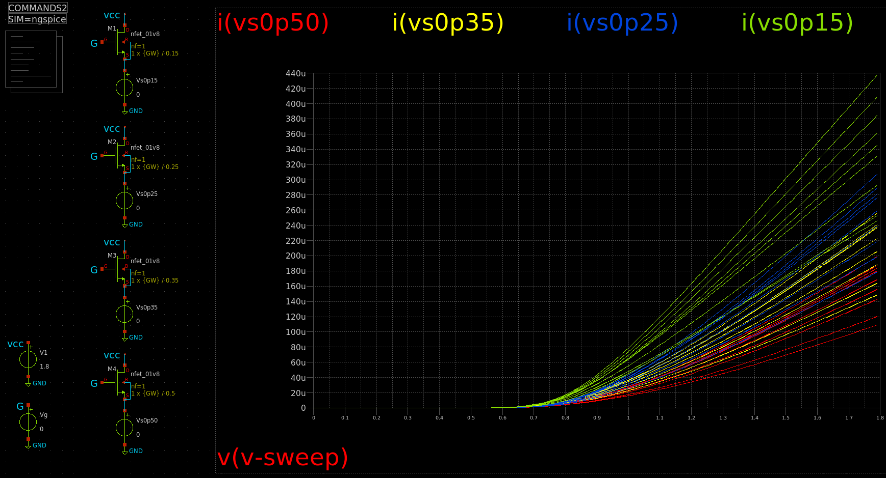

### [04-csdac1.sch](https://github.com/algofoogle/tt-vga-fun/blob/maybe/xschem/04-csdac1.sch)

Kind of a recreation of [bdac.sch as described in 0209](./0209-2024-07-23.md#bdacsch) (binary-weighted switched current DAC), except: (a) each bit is tested in turn via SPICE instead of testing the full 0..255 range; and (b) focus on measuring/balancing actual path current without conversion to voltage:

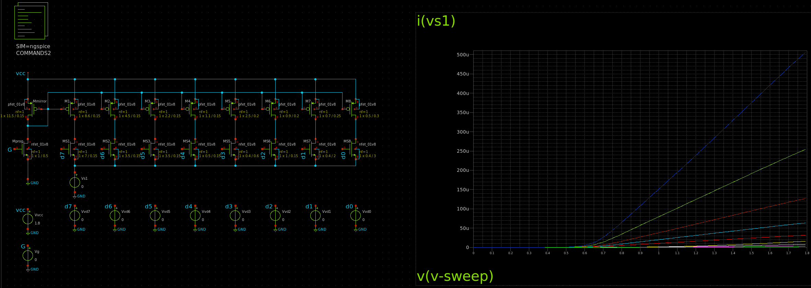

### [05-csdac2.sch](https://github.com/algofoogle/tt-vga-fun/blob/maybe/xschem/05-csdac2.sch)

Extending 04 (above) to test out full range. NOTE: Extra smoothing cap (hanging off `dacout`; not in repo) added in this screenshot, to make the lumpy ramp clearer:

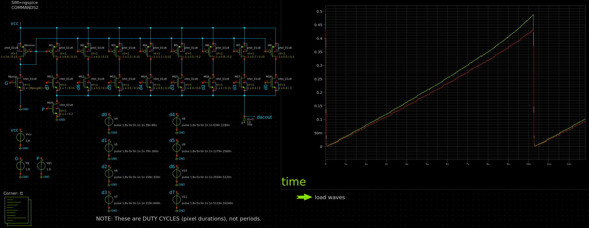

* Green: Mprog width is 1.0um.
* Red: Mprog width is 0.9um.

### [05a-adjusted.sch](https://github.com/algofoogle/tt-vga-fun/blob/maybe/xschem/05a-adjusted.sch)

Adjusting 05 (above) to try and get a better curve (tested with more sweeps):

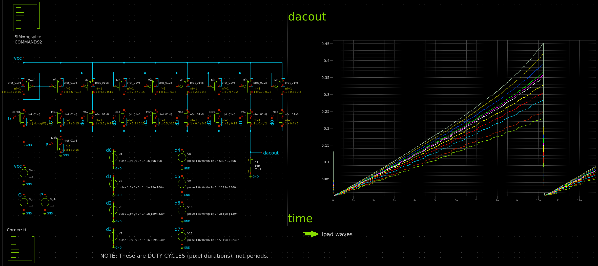

### [05b-moresweep.sch](https://github.com/algofoogle/tt-vga-fun/blob/maybe/xschem/05b-moresweep.sch)

Trying some more variations in sweeps. Looking pretty chunky:

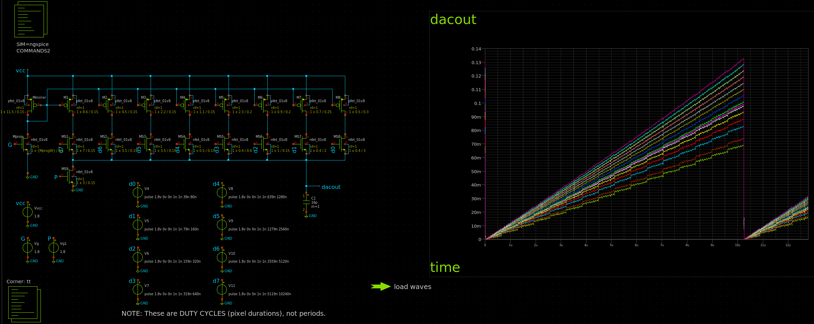

### [06a-sorta.sch](https://github.com/algofoogle/tt-vga-fun/blob/maybe/xschem/06a-sorta.sch)

Screenshot below is altered from actual repo, but shows a sort of workable curve. Big pull-down transistors though:

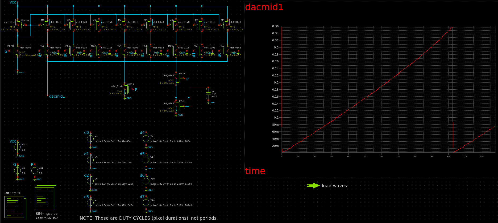

### [09-w2w.sch](https://github.com/algofoogle/tt-vga-fun/blob/maybe/xschem/09-w2w.sch)

Trying a W2W CDAC. Sort of works, but pretty ugly:

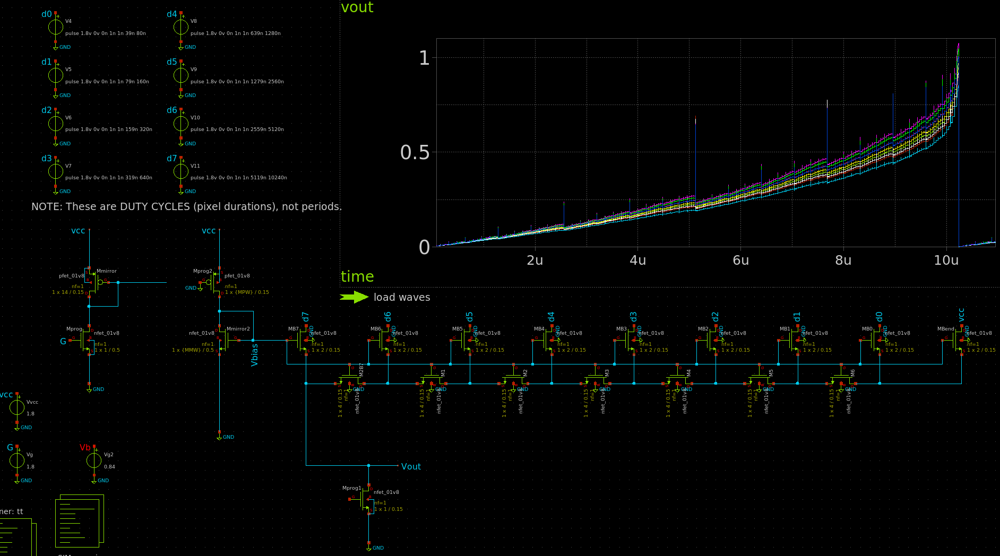

Not much better when using a pull-down resistor instead of FET; slightly more linear but terribly lumpy.

### [10-steer.sch](https://github.com/algofoogle/tt-vga-fun/blob/maybe/xschem/10-steer.sch)

First true (?) current-steering DAC, i.e. differential. Great linearity, but only because of binary clusters of equally-sized transistors. NOTE: Image below is smoothed with caps (not present in repo):

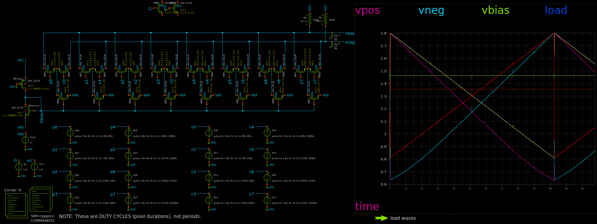

### [11-ratioed.sch](https://github.com/algofoogle/tt-vga-fun/blob/maybe/xschem/11-ratioed.sch)

Evolution of 10 (above): Attempt to use sensibly-sized transistors. Not too bad. Some bumps still, but pretty good. Current consumption is ~500uA. NOTE: I separately measured the pull-up resistor loads later; max. was about 435uA on either (needing 4.35um width?), meaning Vbias transistor pair must be drawing ~65uA. Could work with 1k resistors too, but this reduces the voltage swing from ~1.1Vpp to ~0.45Vpp.

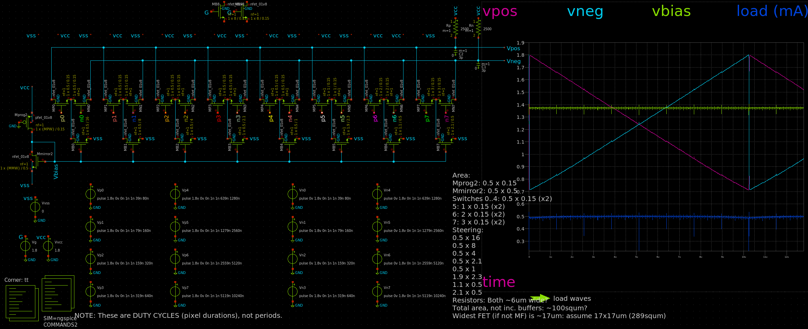

NOTE: Resistors could also be replaced with NFETs:

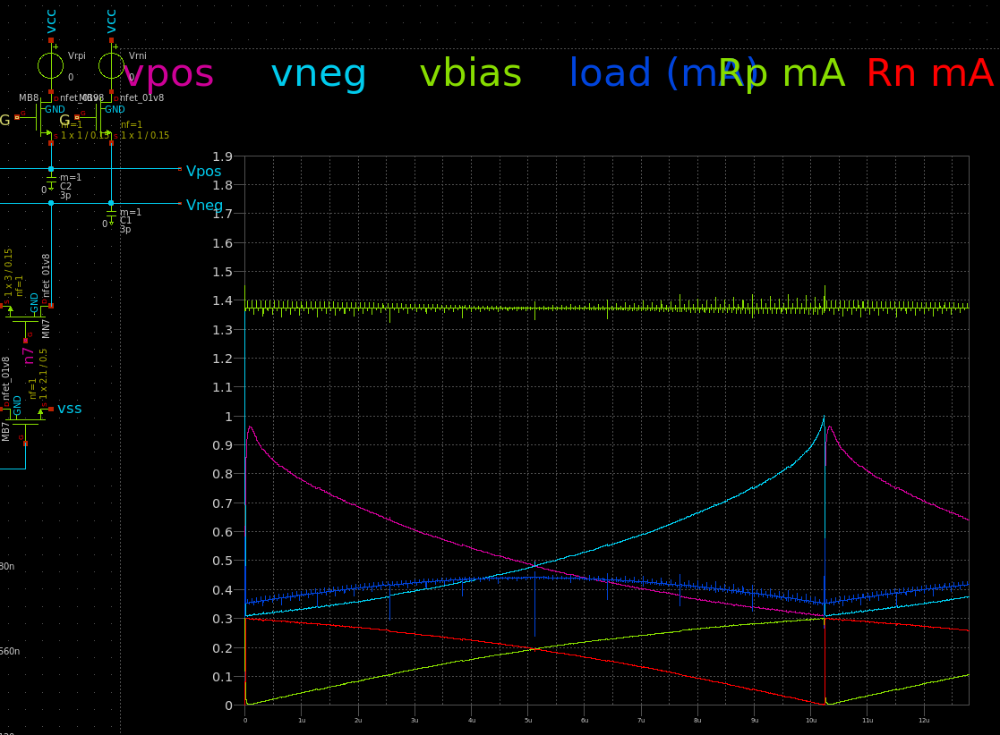

...or PFETs:

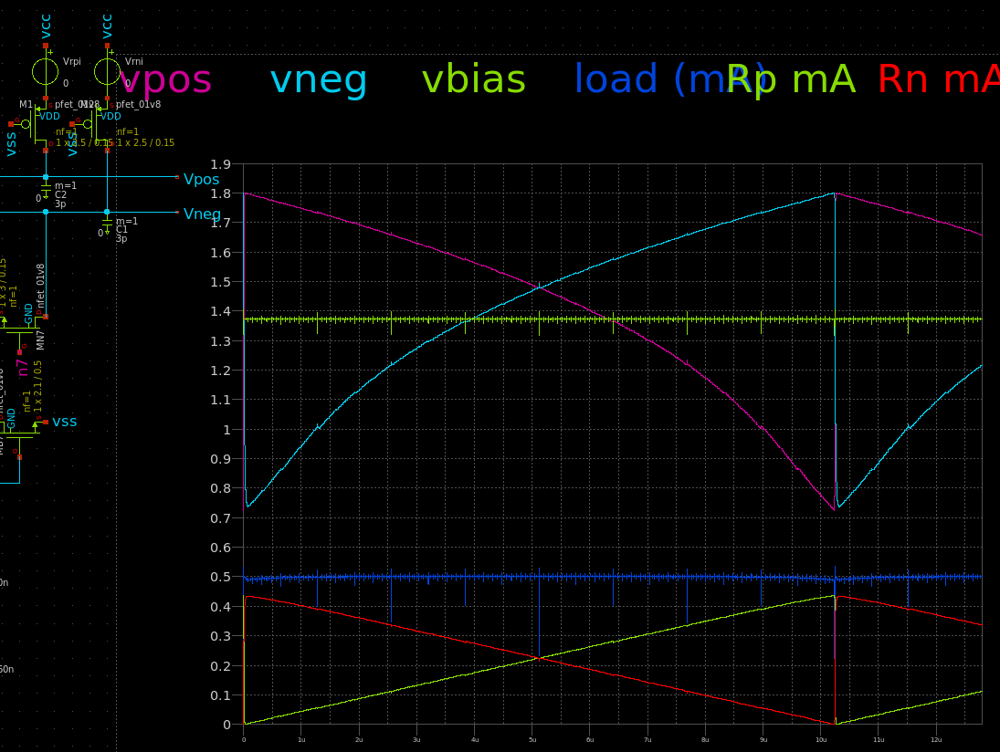

What about this (gamma correction maybe?):

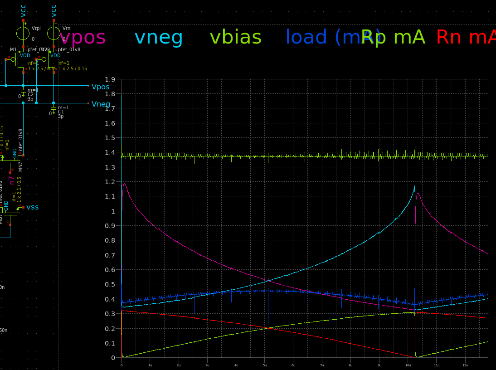

# Next steps

*   Rote exercise: Reassemble `tt-vga-fun` using simple RDACs but new digital control block (approx. at commit [`12bbe7f`](https://github.com/algofoogle/tt-vga-fun/commit/12bbe7fc066ac0bb418f734f622e503c4a6524d3)).
*   Use TT08 3v3 template for future experiments: In case we decide to try 3.3V at some point, we're already in it.
*   Try unary ('thermometer') coding for 3 MSBs. These COULD be driven just from the digital block, rather than having to implement the decoder in the DAC.
*   Would it work to do 3 levels of unary coding? i.e. 2 MSBs for 0-3 big transistors, middle 3 bits for 0-7 medium transistors, bottom 3 bits for 0-7 tiny transistors?

# DAC Papers

*   Behzad Razavi's [The Current-Steering DAC](https://www.seas.ucla.edu/brweb/papers/Journals/BRWinter18DAC.pdf)
*   https://www.analog.com/media/en/training-seminars/design-handbooks/CMOS-DAC-Application-Guide/Chapter3.pdf
*   https://keep.lib.asu.edu/system/files/c7/121290/Jankunas_asu_0010N_14295.pdf
*   https://nirmawebsite.s3.ap-south-1.amazonaws.com/wp-content/uploads/sites/22/2020/08/78-150_JJP_IJRTE.pdf
