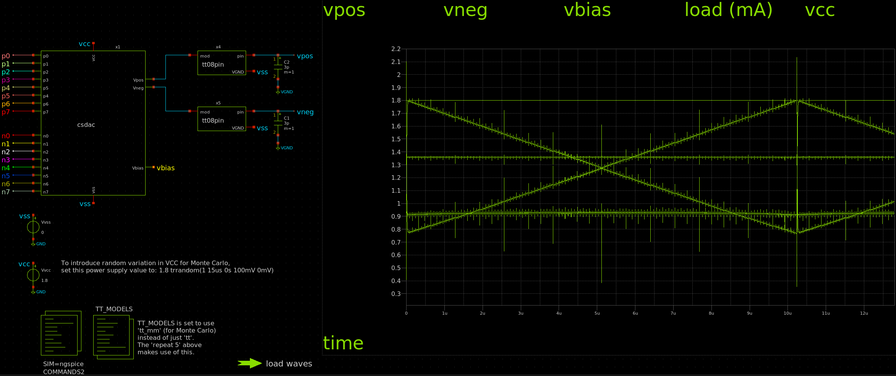

# 9 Aug 2024

| Previous journal: | Next journal: |
|-|-|
| [**0210**-2024-08-09.md](./0210-2024-08-09.md) | *Next journal TBA* |

# Start tt08-vga-fun repo

*   Read https://tinytapeout.com/specs/analog/
*   Let's start with `tt_analog_1x2_3v3.def`
*   Make my repo from the https://github.com/TinyTapeout/tt08-analog-template template
*   Done: https://github.com/algofoogle/tt08-vga-fun
*   Clone locally
*   Disable GDS `on: push` GHAs in code, update README, docs, info.yaml, and do basic (assumed) housekeeping stuff in `src/project.v`
*   Commit to repo.
*   Update `.gitignore` files
*   Create `xschem/` and go into it.
*   Copy in `xschemrc` from tt-vga-fun and create placeholder `simulation/` dir
*   Copy in tt-vga-fun's `11-ratioed.sch` as `csdac.sch`
*   Split CSDAC into device schematic, symbol, and testbench (`tb_csdac.sch`).
*   Replace pull-up resistors with proper sky130 models.
*   Add TT08 pin models, plus some extra external capacitance (3pF).
*   Add Monte Carlo and VCC variation support
*   Make CSDAC an xschem parametric symbol/model
*   Fix missing Vneg pullup resistor VSS substrate connection

## Results of `tt` analysis


## Results of `tt_mm` (Monte Carlo) analysis, 5 iterations


## Adding in VCC variation too

If `Vvcc` is defined as: `1.8 trrandom(1 15us 0s 100mV 0mV)` then Monte Carlo sim also includes stable +/- 0.1V power supply variation for each iteration too:


Another, with all iterations in the same graph colour:


Discontinuities, INL, DNL don't seem to get worse...?


## Going for faster switching

Note that we can NEARLY get to 40ns full swing at 1Vpp if we double the drive strength of the current steering transistors (i.e. by `multi=2` instead of 1). This likewise roughly doubles the total current, and also requires stronger pullups, and a different `Vbias`.

Example with 2x trans, Mprog=0.5/0.15, Mmirror=0.5/0.5, and pullups of 20L (1199R):



Zoomed:


## Parametric symbol/model

Reference; in order, the parameters are:
1.  BIASPRG_W: Vbias Mprog PFET W
2.  BIASPRG_L: Vbias Mprog PFET L
3.  BIASMIR_W: Vbias Mmirror NFET W
4.  BIASMIR_L: Vbias Mmirror NFET L
5.  RPUL: Pull-up resistors L
6.  MULTI: Drive-strength multiplier

### 0. Default

*   0.5/0.15, 0.5/0.5, 40, 1
*   Just over 1Vpp


### 1. Less pull

*   0.5/0.15, 0.5/0.5, **50**, 1
*   About 1.2Vpp with some compression on low side (OK for gamma?)


### 2. Double drive

*   0.5/0.15, 0.5/0.5, **25, 2**
*   Still about 1.2Vpp with a little more compression on low side
*   Doubles current of the whole system


# Notes

**WARNING:** While the fall time of Vneg is great, its rise time might be terrible with the analog pin capacitive loading. Need to check!

In `xschemrc`, note this part:

```
###########################################################################
#### CHANGE DEFAULT [] WITH SOME OTHER CHARACTERS FOR BUSSED SIGNALS 
#### IN SPICE NETLISTS (EXAMPLE: DATA[7] --> DATA<7>) 
###########################################################################
#### default: empty (use xschem default, [ ])
# set bus_replacement_char {<>}
#### for XSPICE: replace square brackets as the are used for XSPICE vector nodes.
# set bus_replacement_char {__} 
```

Sylvain's model of a TT07/TT08 pin: https://discord.com/channels/778248761054986292/872889375384555622/1245786291711512616

Other options:
*   Label all nets!
*   Make digital block output both pos/inverted digital bits
*   Extra drive strength switch, e.g. 2nd rung of transistors that can be activated, along with stronger pull-up resistors.
*   Tiny extra parallel bias transistors to correct minor monotonicity errors.
*   Two-way current steering (not differential) -- i.e. PFET and NFET switching of load.
*   Depletion mode super buffer

