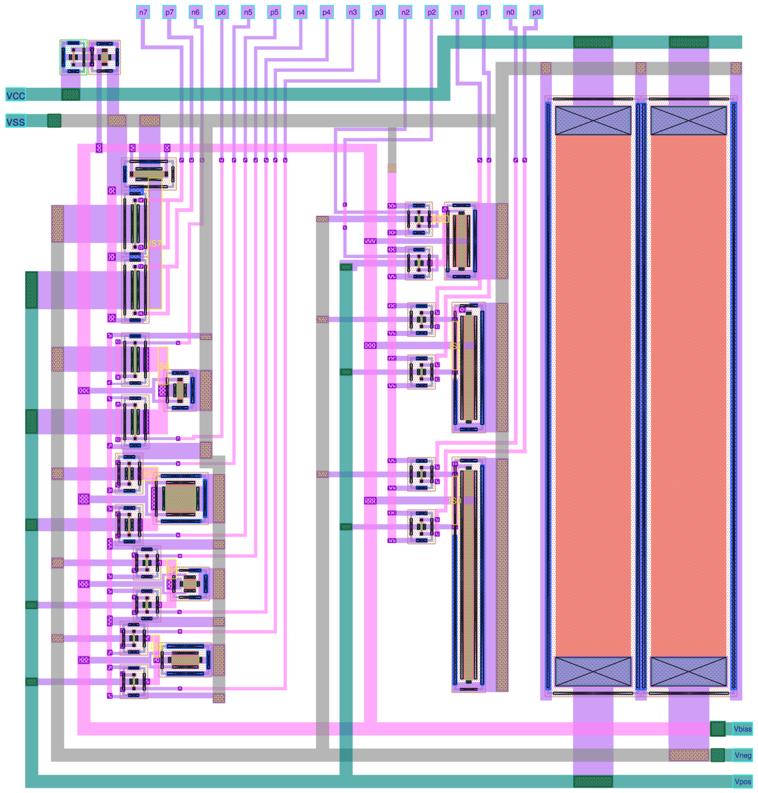

# 16 Aug 2024

| Previous journal: | Next journal: |
|-|-|
| [**0212**-2024-08-11.md](./0212-2024-08-11.md) | *Next journal TBA* |

# Completed csdac_nom initial layout for tt08-vga-fun

As of [commit 57c6665](https://github.com/algofoogle/tt08-vga-fun/commit/57c666569821acda33754b86808e2e524a1fb9dd) I've got a completed initial layout for csdac_nom:



It seems to be DRC clean and fractionally smaller than 57x60um. To my surprise, LVS passed on the first go:

```
$ PROJECT_NAME=csdac_nom make clean lvs
...
Contents of circuit 1:  Circuit: 'csdac_nom'
Circuit csdac_nom contains 28 device instances.
  Class: sky130_fd_pr__nfet_01v8 instances:  25
  Class: sky130_fd_pr__res_high_po_5p73 instances:   2
  Class: sky130_fd_pr__pfet_01v8 instances:   1
Circuit contains 29 nets.
Contents of circuit 2:  Circuit: 'csdac_nom'
Circuit csdac_nom contains 28 device instances.
  Class: sky130_fd_pr__nfet_01v8 instances:  25
  Class: sky130_fd_pr__res_high_po_5p73 instances:   2
  Class: sky130_fd_pr__pfet_01v8 instances:   1
Circuit contains 29 nets.

Circuit 1 contains 28 devices, Circuit 2 contains 28 devices.
Circuit 1 contains 29 nets,    Circuit 2 contains 29 nets.


Final result: 
Circuits match uniquely.
.
Logging to file "lvs.report" disabled
LVS Done.
LVS OK
```

Features of the layout include:
*   Positive and negative (i.e. inverted) digital inputs (8 bit pairs) across the top, on m1.
*   vcc and vss ports in the top-left, on m4. These branch out on m4 and m3, and are typically all 1um wide where they carry current -- should allow up to about 1.5mA (where we only need 0.5mA).
*   Analog output ports in the bottom-right corner. Probably only Vneg will be used but there's also its complement (Vpos) and the bias voltage (Vbias) for the current-source transistors.
*   Vbias reference generator is the pair of transistors in the top-left corner.
*   Left-hand half, from top to bottom, is triplets of transistors that steer current for bits 7, 6, 5, 4, and 3.
*   Right-hand half, from top to bottom, is the same for bits 2, 1, and 0. NOTE: Because these are very LONG transistors (as opposed to wide), they are rotated 90&deg; compared with the left-hand column, and in this case I've got the Vbias m1 strap going across the channel. Not sure if that's a bad idea.
*   Big pull-up resistors on the right for each of Vpos and Vneg. These need to be this large for current capacity, i.e. I want to keep them under the 100uA/um recommended limit, and these are 5.73um wide (thus 573uA gives enough headroom).


# Next steps

*   Extraction, and compare simulation in Xschem.

# Other possible improvements

*   Digitally switch different Vbias levels, or even make Vbias an INPUT driven by another circuit (e.g. differently-sized current reference resistors that can be switched).
*   Go back to Xschem and see if we can fix the imperfect balancing of the current transistors.
*   Option to switch different pull-up resistors (or just turn them off and do an external pull-up).
