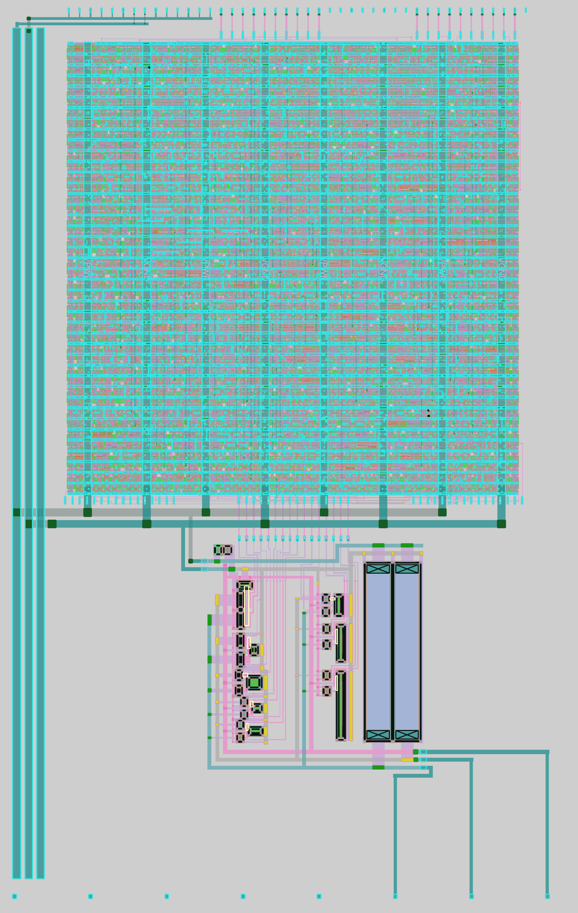

# 17 Aug 2024

| Previous journal: | Next journal: |
|-|-|
| [**0213**-2024-08-16.md](./0213-2024-08-16.md) | [**0215**-2024-08-21.md](./0215-2024-08-21.md) |

# Integrating digital and analog blocks in tt08-vga-fun

## Digital block prep

It looks like the last time I tried to harden the digital controller block (in the [tt-vga-fun](https://github.com/algofoogle/tt-vga-fun) repo) was [commit e2ff4d6](https://github.com/algofoogle/tt-vga-fun/commit/e2ff4d61024564607ff0f7316c56dc008b49d7b8). Presumably that includes the latest updates I had done to the functionality of the digital block, improving over the TT06 version.

In my last journal [0213](./0213-2024-08-16.md#digital-block-and-integration) I identified that I could probably go with a different area for the digital block; 150um would be too wide for the 3v3 template, but I potentially have more height to work with.

Prior to that, my main notes about hardening for tt-vga-fun (TT07 era) were in [0205](./0205-2024-05-30.md#hardening)

These are the notes for what I'm doing in tt08-vga-fun now:

```
### Bring in stuff from tt-vga-fun...
mkdir gds
touch gds/.keep
cd ~/projects/tt08-vga-fun
cp -R ~/projects/tt-vga-fun/{verilog,openlane,tt07-env.sh,requirements.txt,Makefile} .
rm verilog/gl/controller.v
touch verilog/gl/.keep
mv tt07-env.sh tt08-env.sh
# Add comments to tt08-env.sh just to say we're sticking with the same version
# as TT07 because this is just a digital block to be integrated into the layout
# and does not need to be compatible with the TT08 OL2 flow.

#NOTE: openlane/controller/env.sh efffectively differs from ./tt08-env.sh only
# in the version of OpenLane it uses (former: 2024.04.02, latter: 2024.04.22).

# Change openlane/controller/config.json ONLY to use different dimensions,
# i.e. 120x120um

### Create venv & prep...
python3 --version  # Python 3.10.12
python3 -m venv --prompt tt8vf .venv
echo '*' >> .venv/.gitignore
source ./tt08-env.sh
pip install -r requirements.txt

### Hardening the digital block...
#NOTE: Last time, after sourcing tt08-env.sh, I also did
# source ./openlane/controller/env.sh
# ...but I won't this time (as it selects a slightly older OL1)
# so I will see how I go as-is...

time make harden

#NOTE: Target 120x120um reduces to 114.08x114.24um floorplan,
# and takes 2 minutes with no warnings.

make update_files

# Now we have:
# gds/controller.gds
# verilog/gl/controller.v
```

I then committed all (except the harden output) to the repo: [commit 6b950d0](https://github.com/algofoogle/tt08-vga-fun/commit/6b950d0587e16769610b5a468fefe05cb6ca1677)

## Notes on digital block

*   I added the 'negative' colour channel bit outputs for all 3 (RGB) channels.
*   Harden was FAST: only 2 minutes.
*   I found that pin placement seems to quantize to a 0.46um grid, for some reason.
*   Thus I had to set the (north) TT pin spacing to 2.76um (exactly what it already is) and (south) DAC spacing to 1.84um. I used `#BUS_SORT` South-side config looks like this:
    ```
    #SR
    @min_distance=1.84
    rn?\[.*\]
    $2
    gn?\[.*\]
    $2
    bn?\[.*\]
    ```
    Note that the pattern `rn?\[.*\]` will match both `r[0]` and `rn[0]`, etc. and with `#BUS_SORT` we get this order (from RIGHT to left):
    ```
    r[0]
    rn[0]
    r[1]
    rn[1]
    ...etc...
    ```
*   To match this south spacing, I manually edited the csdac_nom layout.
*   I think I worked out that the bounding box for the 1x2 3v3 analog template is 145.36x225.76um, per this in the mag file:
    ```mag
    << properties >>
    string FIXED_BBOX 0 0 14536 22576
    ```
    ...and the template itself doesn't have all pins going all the way to the east edge, meaning we have a little more space than I thought.

## Placing the digital block

```bash
time make harden && make update_files
# Takes about 2 minutes. Builds GDS, and copies to:
# gds/controller.gds and the GL netlist: verilog/gl/controller.v

cd mag
magsky
```

Then in the console for the empty Magic window:

```tcl
gds readonly true
gds read ../gds/controller.gds
writeall force controller
```

Exit Magic; 'yes' to lose all.

```bash
magsky tt_um_algofoogle_tt08_vga_fun.mag
```

Create a boundary marker that we'll later remove:

```tcl
box 145.36um 1um 150.36um 224.76um
paint m1
```

Cell => Place Instance: select `controller.mag`. Move it to line up the top pins.

## Ideas to get a more compact fit

*   Could get width of DAC cell down to ~46um by rotating pull-ups and putting at the bottom. Max width we can get is ~134um, 135.35um or 136.55um at very most. Div-3 this is: 44.66um, 45.17um, 45.5um.
*   met4 can get as close as 300nm. Is this OK for power straps?
*   NOTE: We COULD stagger/overlap DAC cells if they had blank space in one corner.

## First version of the layout

Here's how my layout looks so far, with 1 CSDAC instance on the Green channel:



This is also LVS clean (see below).

Commit is: [5a0fd77](https://github.com/algofoogle/tt08-vga-fun/commit/5a0fd77319846863b54fcb3d1e8d2d9b5aed7ae2)


## LVS

This is what I had to do to get LVS-clean:

*   NOTE: I had originally hardened my digital block using the TT07 flow, which uses PDK version: `cd1748bb197f9b7af62a54507de6624e30363943 (2023.12.04)`
*   To configure LVS, I replaced `mag/tcl/lvs_netgen.tcl`.
    *   It was [this](https://github.com/algofoogle/tt08-vga-fun/blob/6b950d0587e16769610b5a468fefe05cb6ca1677/mag/tcl/lvs_netgen.tcl):
        ```tcl
        set layout [readnet spice $project.lvs.spice]
        set source [readnet spice /dev/null]
        readnet spice $::env(PDK_ROOT)/$::env(PDK)/libs.ref/sky130_fd_sc_hd/spice/sky130_fd_sc_hd.spice $source
        # Top-level abstract integration verilog:
        readnet verilog ../src/project.v $source
        # Add spice files of analog block(s):
        readnet spice ../xschem/simulation/$project.spice $source
        # # Add GL verilog of digital block(s) (i.e. flat file from OpenLane hardening):
        # readnet verilog ../verilog/gl/controller.v $source
        lvs "$layout $project" "$source $project" $::env(PDK_ROOT)/sky130A/libs.tech/netgen/sky130A_setup.tcl lvs.report -blackbox        
        ```
    *   It's now this:
        ```tcl
        set layout [readnet spice $project.lvs.spice]
        set source [readnet spice /dev/null]
        readnet spice $::env(PDK_ROOT)/$::env(PDK)/libs.ref/sky130_fd_sc_hd/spice/sky130_fd_sc_hd.spice $source

        # Add spice files of analog block(s):
        readnet spice ../xschem/simulation/csdac_nom.spice $source

        # Add GL verilog of digital block(s) (i.e. flat file from OpenLane hardening):
        readnet verilog ../verilog/gl/controller.v $source

        # Top-level abstract integration verilog:
        readnet verilog ../src/project.v $source

        lvs "$layout $project" "$source $project" $::env(PDK_ROOT)/sky130A/libs.tech/netgen/sky130A_setup.tcl lvs.report -blackbox
        ```
    *   I'm not clear on whether this will still work for `PROJECT_NAME=csdac_nom make clean lvs`
*   The first time I ran `cd mag/ && make clean lvs`, I got some pin/net errors (`Top level cell failed pin matching.`) because:
    *   I forgot some power port connections, e.g. on `controller`'s `VPWR` and `VGND`.
    *   I used an incorrect power net name, e.g. `VPWR` instead of `VDPWR` (new name in 3v3 template).
    *   I flipped the polarity of `uio_oe` signals in my layout -- so this one was a real layout error that it caught, and I corrected.
*   The next time I ran it, I was getting `Netlists do not match.` and `DEVICE mismatches`, e.g. because of stuff like this:
    ```
      sky130_fd_pr__special_nfet_01v8/3 = 1    |  sky130_fd_pr__nfet_01v8/(1|3) = 2        
      sky130_fd_pr__special_nfet_01v8/1 = 1    |                                           
      sky130_fd_pr__special_nfet_01v8/2 = 2    |  sky130_fd_pr__nfet_01v8/2 = 2            
      sky130_fd_pr__special_nfet_01v8/3 = 1    |  sky130_fd_pr__nfet_01v8/(1|3) = 2        
      sky130_fd_pr__special_nfet_01v8/1 = 1    |                                           
      sky130_fd_pr__special_nfet_01v8/1 = 1    |                                           
      sky130_fd_pr__special_nfet_01v8/1 = 1    |                                           
    ```
    I remember getting these errors because of `sky130_fd_pr__special_nfet_01v8` (and other `__special_` mismatches), and I'm not exactly clear on what these mean, other than:
    *   The 'special' devices [were introduced](http://www.opencircuitdesign.com/open_pdks/history.html#:~:text=sky130_fd_pr__special_nfet_01v8) to deal with transistors of a size (i.e. small enough) that they didn't have standard models?
    *   Support for detecting these may have been introduced before the PDK itself properly included them, hence why they show up as LVS errors?
    *   I was checking with PDK `cd1748bb197f9b7af62a54507de6624e30363943` (from TT07), then did `volare enable bdc9412b3e468c102d01b7cf6337be06ec6e9c9a` (per Matt's analog guide), but this too failed. Finally I installed and used a very new PDK: `volare enable 0fe599b2afb6708d281543108caf8310912f54af` (2024.08.17) -- this passed.

So now, when I run `make clean lvs`, the final result comprises:
*   ```
    Contents of circuit 1:  Circuit: 'controller'
    ...
    Circuit 1 contains 1382 devices, Circuit 2 contains 1382 devices.
    Circuit 1 contains 1387 nets,    Circuit 2 contains 1387 nets.
    ```
    Seems OK for the digital control block.

*   ```
    Contents of circuit 1:  Circuit: 'csdac_nom'
    ...
    Circuit 1 contains 28 devices, Circuit 2 contains 28 devices.
    Circuit 1 contains 29 nets,    Circuit 2 contains 29 nets.
    ```
    Seems correct for my CSDAC (separately verified).

*   ```
    Contents of circuit 1:  Circuit: 'tt_um_algofoogle_tt08_vga_fun'
    ...
    Circuit contains 73 nets, and 15 disconnected pins.

    Circuit 1 contains 2 devices, Circuit 2 contains 2 devices.
    Circuit 1 contains 73 nets,    Circuit 2 contains 73 nets.
    ```
    Makes sense: 2 cells in it, disconnected pins: `uio_in[7:0]` (8), `ena` (1), `ua[7:3]` (5), `VAPWR` (1).

*   ```
    Pins uio_oe[1] and uio_oe[0] are shorted in cell tt_um_algofoogle_tt08_vga_fun (0)
    Pins uio_oe[3] and uio_oe[2] are shorted in cell tt_um_algofoogle_tt08_vga_fun (0)
    Pins uio_oe[4] and uio_oe[2] are shorted in cell tt_um_algofoogle_tt08_vga_fun (0)
    Pins uio_oe[5] and uio_oe[2] are shorted in cell tt_um_algofoogle_tt08_vga_fun (0)
    Pins uio_oe[6] and uio_oe[2] are shorted in cell tt_um_algofoogle_tt08_vga_fun (0)
    Pins uio_oe[7] and uio_oe[2] are shorted in cell tt_um_algofoogle_tt08_vga_fun (0)
    Pins uio_out[2] and uio_oe[2] are shorted in cell tt_um_algofoogle_tt08_vga_fun (0)
    Pins uio_out[3] and uio_oe[2] are shorted in cell tt_um_algofoogle_tt08_vga_fun (0)
    Pins uio_out[4] and uio_oe[2] are shorted in cell tt_um_algofoogle_tt08_vga_fun (0)
    Pins uio_out[5] and uio_oe[2] are shorted in cell tt_um_algofoogle_tt08_vga_fun (0)
    Pins uio_out[6] and uio_oe[2] are shorted in cell tt_um_algofoogle_tt08_vga_fun (0)
    Pins uio_out[7] and uio_oe[2] are shorted in cell tt_um_algofoogle_tt08_vga_fun (0)
    Pins VDPWR and uio_oe[0] are shorted in cell tt_um_algofoogle_tt08_vga_fun (0)
    Pins VGND and uio_oe[2] are shorted in cell tt_um_algofoogle_tt08_vga_fun (0)
    Pins uio_out[7] and VGND are shorted in cell tt_um_algofoogle_tt08_vga_fun (1)
    Pins uio_out[6] and VGND are shorted in cell tt_um_algofoogle_tt08_vga_fun (1)
    Pins uio_out[5] and VGND are shorted in cell tt_um_algofoogle_tt08_vga_fun (1)
    Pins uio_out[4] and VGND are shorted in cell tt_um_algofoogle_tt08_vga_fun (1)
    Pins uio_out[3] and VGND are shorted in cell tt_um_algofoogle_tt08_vga_fun (1)
    Pins uio_out[2] and VGND are shorted in cell tt_um_algofoogle_tt08_vga_fun (1)
    Pins uio_oe[7] and VGND are shorted in cell tt_um_algofoogle_tt08_vga_fun (1)
    Pins uio_oe[6] and VGND are shorted in cell tt_um_algofoogle_tt08_vga_fun (1)
    Pins uio_oe[5] and VGND are shorted in cell tt_um_algofoogle_tt08_vga_fun (1)
    Pins uio_oe[4] and VGND are shorted in cell tt_um_algofoogle_tt08_vga_fun (1)
    Pins uio_oe[3] and VGND are shorted in cell tt_um_algofoogle_tt08_vga_fun (1)
    Pins uio_oe[2] and VGND are shorted in cell tt_um_algofoogle_tt08_vga_fun (1)
    Pins uio_oe[1] and VDPWR are shorted in cell tt_um_algofoogle_tt08_vga_fun (1)
    Pins uio_oe[0] and VDPWR are shorted in cell tt_um_algofoogle_tt08_vga_fun (1)
    ```
    While there are ways around this, I think this is all fine.

*   ```
    Final result: 
    Circuits match uniquely.
    .
    Logging to file "lvs.report" disabled
    LVS Done.
    LVS OK
    ```
    **YAY!**

For future reference, this is my environment:

```bash
cd ~/projects/tt08-vga-fun/mag
volare ls
# In /home/anton/.volare/volare/sky130/versions:
# ├── 0fe599b2afb6708d281543108caf8310912f54af (2024.08.17) (enabled)
asicenv
# This is the current ASIC environment:
#   PDK=sky130A
#   PDK_ROOT=/home/anton/.volare
```


### LATER

*   ~~Check if Makefile needs update to 'harden' step per course instructions.~~
*   ~~Check whether OL1 needs to be updated, along with PDK.~~
*   ~~Change digital block to produce NEGATIVE bit outputs too.~~
*   Update others: ~~`src/`~~, `test/`, `docs/`
*   `sim/`: spice and verilator
*   Antenna checks
*   Improve documentation and usage guide for controller.v and test/fix 'line debug'

## Overall layout requirements

*   ~~Digital controller block + power connections~~
*   ~~At least 1 DAC + power connections~~
*   ~~Digital-to-DAC routes~~
*   ~~TT digital pins routed to digital block~~
*   ~~Analog outputs from DAC(s) to TT `ua` pins~~
*   Any use for spare `uio` pins?

# Notes

*   If we wanted to make the cell narrower, we could rotate the pull-ups and move them to the south side (making the cell taller instead).
*   Still more opportunity to squish csdac_nom tighter on the X axis and shave off make 4-5um.
*   A variation could be no pull-ups, in which case this becomes a current-based output (allowing for TIA) or one where we use external resistors instead.
