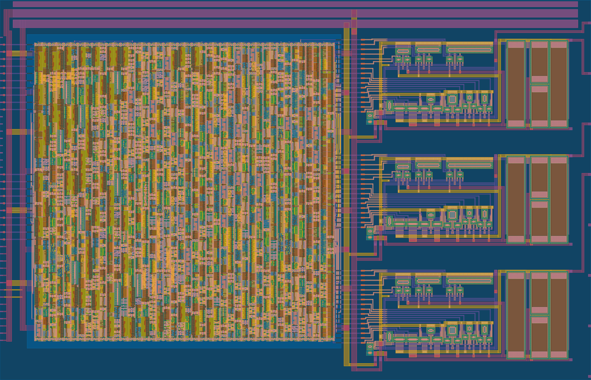
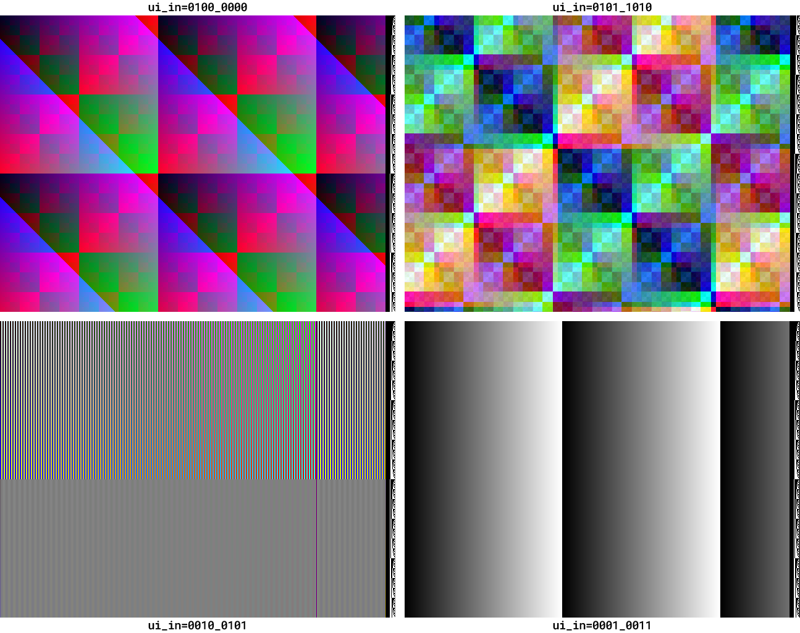

# 21 Aug 2024

| Previous journal: | Next journal: |
|-|-|
| [**0214**-2024-08-17.md](./0214-2024-08-17.md) | [**0216**-2024-08-23.md](./0216-2024-08-23.md) |

# New 3x DAC layout and simulation for tt08-vga-fun



*   I did simulations (based on tt06-grab-bag or tt-vga-fun repos):
    *   Extraction and full analog simulation:
        *   Basis:
            [0202](https://github.com/algofoogle/journal/blob/master/0202-2024-05-15.md),
            [0203](https://github.com/algofoogle/journal/blob/master/0210-2024-08-09.md)
        *   Test sim speed and output quality.
        *   Is it possible to measure internal digital colour signals too?
        *   Steps:
            *   Extraction
            *   Test setup for controller operating mode and ongoing stimulus
            *   Running the sim and capturing output, inc. interrupting/resuming
            *   Rendering output to PNG
    *   Is co-simulation worth it? Can it work, and will it be fast? May not simulate switch gates perfectly.
        *   It's orders of magnitude faster than full circuit sim, and probably accurate enough to test out my DAC layout.
    *   Verilator sim.
        *   Change sim to use actual TT08 top module (and include dummy black boxes for DAC, etc).
*   Other circuits and ideas:
    *   [0209](https://github.com/algofoogle/journal/blob/master/0209-2024-07-23.md)
    *   [0210](https://github.com/algofoogle/journal/blob/master/0210-2024-08-09.md)

# Explanation of digital block control inputs

```
Meaning of ui_in input bits at reset:
     7   Timing: 0=VGA; 1=1440x900
     6:4 Mode: 
         0: MODE_PASS  Input passes to output of all 3 DACs (greyscle)
         1: MODE_RAMP  Ramp mode (see bits 1:0)
         2: MODE_BARS  Ramp mode, but alternating bars (2 frequencies per vertical screen half)
         3: MODE_3     'rampa' output (h position, divided)
         4: MODE_XOR1  TT06 XOR pattern (fixed background of R/G, sliding diagonal B ramp)
         5: MODE_XOR2  New XOR pattern, animated
         6: MODE_XOR3  New XOR pattern, static
         7: MODE_7     (Same as MODE_3)
NOTE:
  Input bits on ui_in all get registered upon reset, locking in that mode/settings,
     thus allowing them to then be changed afterwards, to supply other control functions
     or data without changing the mode.
  In all but ungated_mode0, line debug bits are presented at the RHS of each line.
  In gated mode0, they're dimmed to match the grey_pass value.
  In any other mode, they're fully white.
  Gating is done by the 'enable_out' signal, based on 'visible' and 'ungated_mode0'.

Meaning of other bits per mode:
MODE 0: PASS
  If bit 1 is 0, we're in 'ungated_mode0' meaning ui_in passes DIRECTLY to
     all 3 DAC channels, no matter what, i.e. grey_pass with no gating, no registering.
  If bit 1 is 1, we're gated, meaning ui_in passes thru but is gated (blanked) for VGA.
  Bit 0 is RESERVED for 'registered' outputs, but NOT currently implemented.
MODE 1: RAMP
     Level ramps, at different rates on different channels...
     3:2 H-divider (by Rshift): 0=1, 1=2, 2=4, 3=8
     1:0 Select channel out: 'primary' is H (divided), 'secondary' is line, 'tertiary' is fade (frame).
         0: Red primary, green secondary, blue fade.
         1: Green primary, blue secondary, red fade.
         2: Blue primary, red secondary, green fade.
         3: All primary.
MODE 2: BARS
     Same as MODE 1, except that outputs are inverted on every other H value (when divided)
     for lines 0..255, or inverted on every other pixel for lines >= 256.
MODE 3: (unnamed, or 'rampa green')
     The internal 'rampa' ("primary" ramp) signal is output on the green channel only.
     Other channels are black (0).
MODE 4: XOR1
     XOR pattern from tt06-grab-bag, with main pattern on R/G,
     and an angled, sliding ramp on B.
     3:1 Starting line selector:
         0: Start on line 0
         1: Start on line 1
         2: Start on line 2
         3: Start on line 3
         4: Start on line 8
         5: Start on line 32
         6: Start on line 127 //NOTE: Deliberately odd.
         7: Start on line 192
MODE 5: XOR2
     New XOR pattern, animated. "Prettier" combination of R,G,B XORs all at different
     scales, moving at different rates based on current frame number.
     Starting line selector is the same as for MODE 4.
MODE 6: XOR3
     Same as MODE 5, but static, and ignores bits [3:1] (i.e. cannot select starting line).
MODE 7: (unnamed)
     Same as MODE 3.

NOTE:
  AFTER RESET, modes other than MODE 0 (including MODE 6) allow the start line to
  be reset, specifically by changing the mode bits [6:4], and the actual voffset
  that gets loaded (for the next line) uses this pattern:
  Bit  [7]   = ui_in[7]
  Bits [6:3] = ui_in[3:0]
  Bits [2:0] = (ui_in[6:4]^mode)
```

# Simulation test cases

*   BARS mode, alternating every pixel, green is primary: `ui_in` = `0010_0001`
*   As above, alternating every 2nd pixel: `0010_0101`
*   XOR2, starting on line 32: `0101_1010`
*   Ramp on all 3 channels equally ('grey' reference): `0001_0011`




# Verilator simulation

```bash
cd sim/verilator
make csr
```

Keys changed from previous Verilator sims I've done:
*   T, G, B, respectively turn off rendering of R, G, B channels (noting that 'R' key is reserved for reset)
*   F11 switches between rendering the DAC output (RGB888), and `uo_out` (RGB222) outputs.


# SPICE full-circuit simulation

This is based on [0202](./0202-2024-05-15.md):

```bash
cd mag
make tt_um_algofoogle_tt08_vga_fun.sim.spice # Takes a few minutes; file is 13MB.
# Copy out subckt line from .sim.spice file, and use for basis of sim/spice/full_spice_sim.cir `xtt` instance.
# In full_spice_sim.cir, also remove brackets [] from ports.
#NOTE: Last identifier is the name of the cell with _parax on the end: tt_um_algofoogle_tt08_vga_fun_parax
# Replace VDPWR with vcc (1.8V), VGND with 0, and VAPWR with vcca (3.3V).
make cleanfull
```

Extract TT08 pin loading circuit:
*   Exported `tt08pin.sch` in Xschem as LVS subckt
*   Put `tt08pin.spice` in `sim/spice/` and edited it to remove `GLOBAL`s and make `VAPWR` a port on the subckt, and delete internal voltage source on VAPWR.

# Notes

*   Could we delete decap (379) and fill (431) cells from .mag file before extraction?
*   'Registered' mode (intended only for mode 0 pass-thru) is NOT implemented.
*   BEWARE: Don't forget to check every signal name. I had `VGND` but this is not valid: it was meant to be `GND` but instead it just created a floating net called `VGND`, I think.


# Digital block improvements

*   If we have a spare mode (e.g. MODE_3), try an LFSR?
*   Also, spare MODE_7 could be used for XOR3 but with voffset control added
*   Implement 'registered' option for MODE 0 (PASS) -- should need 8 DFFs
*   Would it be better to do separate mode_xor2 and mode_xor3 modules, or just use mode_xor2 with a gate on `tt` for MODE_XOR3? Does it make any difference to synthesis and logic optimization?
*   Maybe MODE_3 could start with an LFSR, and otherwise swap between ALL modes every 32 lines
*   Synchronous reset -- without a synchronous reset, we could probably control the design clock/reset carefully in the initial few clocks using the RP2040.

# Before tapeout

*   Make sure body/bulk/guard-ring connections are correct for our intent.
*   Check connectivity of all vias in GDS.
*   Look for weirdness

# Next steps

*   Commit/document full circuit SIM and cosim (mixed).

# Next layout/design

*   3 different DACs:
    1.  csdac_nom with resistors
    2.  csdac_bare (no resistors): PROBLEM, requires 2 analog pins! What about just 1, snaked?
    3.  RDAC with opamp
*   Other ideas:
    *   res_xhigh_po 2k/sq instead of 320/sq
*   Switching different things in/out (pass gates, or extra loads) using spare `uio_in` pins -- e.g. put pull-up resistors in series with big transistors that can disconnect them from vcc.
