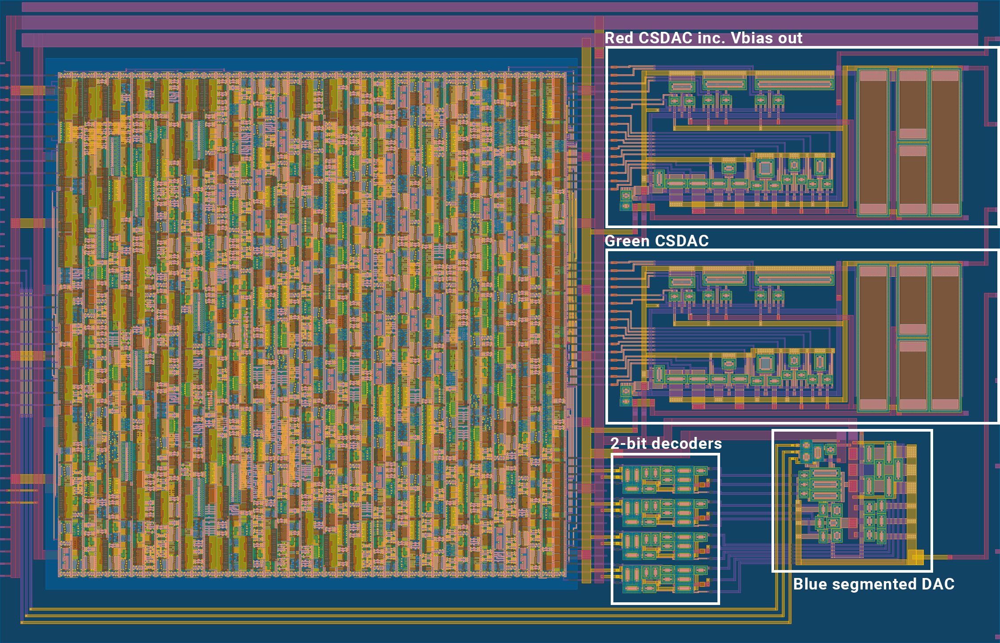

# 23 Aug 2024

| Previous journal: | Next journal: |
|-|-|
| [**0215**-2024-08-21.md](./0215-2024-08-21.md) | [**0217**-2024-09-29.md](./0217-2024-09-29.md) |

# Notes for tt08-vga-fun finalisation inc. segmented CSDAC

[tt08-vga-fun](https://github.com/algofoogle/tt08-vga-fun) was submitted as planned. I managed to design in another current-steering DAC (a segmented version) and include that for the blue channel:

In the layout above:
*   Red DAC delivers its DAC analog output on `ua[1]` and its Vbias voltage level on `ua[0]` -- it might be possible to pull this a little up or down and see what effect it has.
*   Green DAC is the same but provides only its analog output: `ua[2]`
*   Blue DAC is my more-compact attempt at a segmented current-steering DAC. It has these features:
    *   Its summed inverted current source (only) is provided on `ua[3]`. It's expected this will be pulled up by an external resistor (and different values can be tested, given it's external).
    *   Much smaller by choosing different transistor sizes, planning/arranging them differently, and being a little less careful (re coupling) where wires are routed. Lots of area saved by omitting big internal pull-up resistors.
    *   Ability to select different (roughly binary) Vbias voltages via `uio_in[7:5]`.
*   2-bit decoders do 0-3 "thermometer" outputs from 2-bit binary inputs, i.e. for each pair of bits in the full 8-bit range of the blue channel. These are probably much larger than they needed to be, but I had to design them very quickly, and I wanted to be sure they were all identical outputs.

# Rough notes

*   Current: Typically a bit under 1.5mA. Spikes to 8mA briefly; could be unstable if there aren't enough decaps
*   Estimated VbiasR: 1.338V with simulated pin & ext. measurement load

## Improvement ideas

*   :x: Harden to larger area; adds more decaps
*   :x: Put intentional decaps in
*   :white_check_mark: Bigger power straps to digital area
*   :white_check_mark: More vias for power
*   :x: GDS art
*   :x: Try using 3v3 rails

## Left-over notes/ideas/comments

*   There's some decent area to make the digital block larger (mostly width ~14um, some height ~5um): ~2000squm area
*   Push DACs closer together OR slip extra transistors & resistors (with digital block control) between DACs
*   Positive side of steering doesn't seem to be necessary; Vneg's side is enough. Could just leave out Vpos pull-up, relying on external pull-up for Vneg?
*   For characterization purposes, try placing signal routes over transistors in a csdac_tight version; see how small we can get it, and whether it will affect performance.
*   Segmented version:
    *   Positive selection logic would require: AND2, OR2.
    *   Negative selection logic would require: NAND2, NOR2, and a NOT on high bit.
    *   If we take 8 bits and go for segmented pairs, assuming Vneg only...
        *   D7+D6 => AND2,NOT,OR2 => A switch NFET on each of: 3 "64x" gates: 16/1
        *   D5+D4 => AND2,NOT,OR2 => A switch NFET on each of: 3 "16x" gates: 4/1
        *   D3+D2 => AND2,NOT,OR2 => A switch NFET on each of: 3 "4x" gates: 1/1
        *   D1+D0 => AND2,NOT,OR2 => A switch NFET on each of: 3 "1x" gates: 1/4
    *   Or to scale a little more evenly:
        *   8/1
        *   2/1
        *   1/2
        *   4/2
    *   Getting specific, these x3, plus NFET switch x3:
        *   2.0/0.15: `2+0.65*2 x 0.15+0.75*2 ~= 3.3 x 1.7` + 0.2 margin for routing: 3.7 x 2.1 (~7.8squm)
        *   0.5/0.15
        *   0.5/0.60
        *   0.5/2.40
        *   NOTE: Why switch? Keeping NFET gate high avoids capacitance differences on switching for larger loads...? Is this still an issue for the switches? Maybe not if they have very low gate Length.

# Doco updates

*   GDS image, inc. regions highlighted
*   Simulations & how
*   External pull-up
*   VbiasB control inputs
*   Pull VbiasR & resistor sweep sims
*   MC sim
