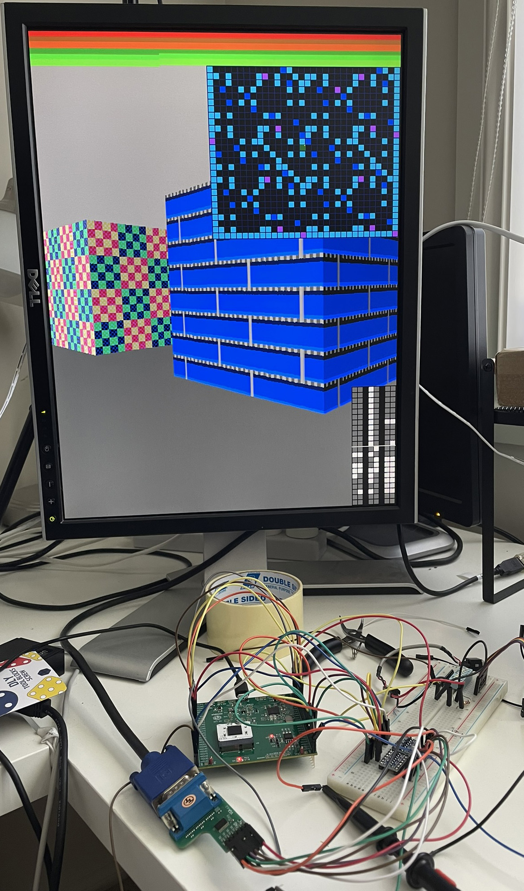
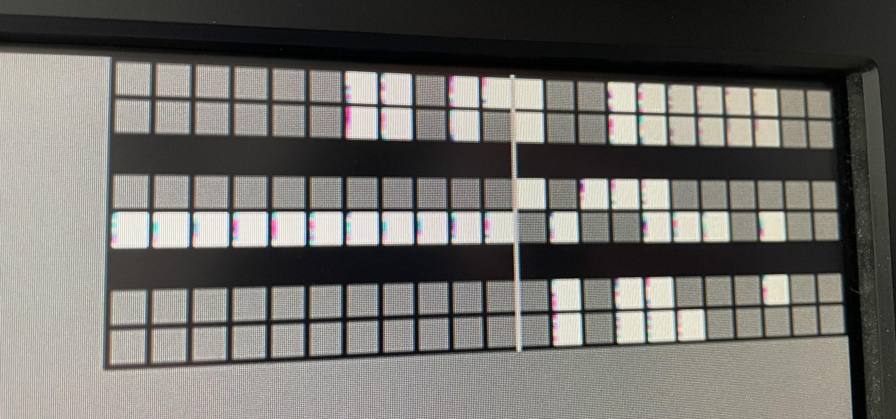

# 11 Oct 2024

| Previous journal: | Next journal: |
|-|-|
| [**0219**-2024-10-07.md](./0219-2024-10-07.md) | *Next journal TBA* |

# Raybox-zero running on GFMPW-1

Raybox-zero (top_raybox_zero_fsm, or simply "trzf") is working on GFMPW-1!



Here the GFMPW-1 chip is running at 5V in the Caravel 5V board. The Caravel RISC-V CPU is running the [trzf_test](https://github.com/algofoogle/algofoogle-multi-caravel/tree/gf180/firmware/trzf_test) firmware to enable the Caravel DLL with a 2.5x multiplier (to generate a 25MHz system clock from the 10MHz source) and then select and reset design 0 (trzf, 1st instance).

I've got basic 5V-to-3.3V level shifters for the 8 VGA signals, so they can work with a [TinyVGA board](https://github.com/mole99/tiny-vga) which is 3.3V-only.

See the [GPIO map](./0219-2024-10-07.md#gpio-maps) for essential pins...

I've tied the following inputs:
*   `gen_tex` **high**: Generated textures (instead of external texture SPI ROM).
*   `debug_vec`, `debug_map`, `debug_trace` **high**: Enable all debugging visualisations (POV vector bits at the bottom, map and trace states at the top).
*   `inc_px`, `inc_py` **high**: Enable demo animation (player sliding sideways).
*   `reg_outs_enb` **low**: Enable 'registered' VGA outputs. I think without this I sometimes see a little more flicker (or maybe that was just when it was floating).

There is some flickering going on in the POV vector debug overlay -- this fringing flickers constantly:



I'm not sure whether this is a timing issue with the chip, or (hopefully more likely) something resulting from the basic logic level shifters. If it IS a timing issue, though, it's interesting that it manifests here and not in (say) the map. I could try running this at higher and lower clock speeds. Minimum for my monitor is probably 24MHz, but max is I think around 30MHz.

NOTE: At 10MHz, the chip gets warm, but at 25MHz it gets hot! Need to try taking a measurement.

# External SPI control via RP2040

Next step is to try making an adaptation of RP2040 MicroPython code from the versions used for [TT04](https://github.com/algofoogle/tt04-raybox-zero/tree/main/demoboard) (with external SPI control) and [CI2311](https://github.com/algofoogle/raybox-zero/blob/main/game/doc/CI2311.md) (for better overall implementation).

I'll use [my RP2040 board](./0200-2024-05-01.md) again.

## Basic test

1.  Plug in the RP2040 board via USB. It has no firmare on the Flash ROM already, so it presents as a USB storage device in Windows. If it DID already have firmware, ground the USB_BOOT pin while plugging in.
2.  I'm downloading and using the [Pi Pico version of MicroPython 1.23.0](https://micropython.org/download/RPI_PICO/) for my RP2040 board.
3.  Drag the `RPI_PICO-20240602-v1.23.0.uf2` file onto the `RPI-RP2` drive to upload it and get it running.
4.  On this occasion, Windows identifies it as COM6. Use the REPL in Thonny to test MicroPython (picking COM6 in the bottom-right corner):
    ```python
    machine.freq()
    # => 125000000 or 125MHz.
    # Drop RP2040 system clock to 20MHz:
    machine.freq(int(20e6)) # 20MHz seems to be the lowest.
    # Start blinking D3 LED:
    d3 = machine.PWM(17)
    d3.freq(2)
    d3.duty_u16(32767) # 50% duty cycle
    ```
5.  Replug the board, reconnect in Thonny, and try the code above again.
6.  Connect GND of RP2040 board and Caravel board.
7.  Connect RP2040 GP1 to ASIC's `i_debug_map` (GPIO29); map overlay will probably disappear.
8.  Try MicroPython code to turn the map overlay on and off:
    ```python
    map = machine.Pin(15, machine.Pin.OUT) # GP15 is D4
    # Turn it on:
    map.value(1)
    # Turn it off:
    map.value(0)
    ```

## SPI control test

Let's try using the "registers" SPI interface:

| GFMPW-1 | RP2040 |
|-|-|
| GPIO[25]: i_reg_csb   | GP1: Software CSb |
| GPIO[26]: i_reg_sclk  | GP2: Hardware SCLK |
| GPIO[27]: i_reg_mosi  | GP3: Hardware MOSI |

This code successfully sets the floor colour to a sea green:

```python
from machine import Pin, SPI
reg_csb = Pin(1, Pin.OUT)
reg = SPI(0, baudrate=5_000_000, sck=Pin(2), mosi=Pin(3), miso=Pin(4))
reg_csb.value(1) # Disable.
reg_csb.value(0) # Start SPI transaction.
# payload += '0' * (-len(payload) % 8) # Right-pad to a multiple of 8 bits.
cmd = '0001' # CMD_FLOOR
pad = '000000' # Dummy padding. Why is this needed? Check GFMPW-1 Verilog
color = '101100' # Blue: 10, Green: 11, Red: 00
payload = '0001' + pad + color
payload = int(payload,2).to_bytes(len(payload)//8, 'bin') # Convert a bytearray.
reg.write(payload) # Send it.
reg_csb.value(1) # End transaction.
```

Note:
*   It appears that sending this bit stream via SPI will not give us what we want: `0001101100000000` (16 bits) -- It interprets the leading `0001` command correctly, but seems to discard the `101100` and then uses the remaining `000000` bits as the colour (i.e. black).
*   I suspect it would work if we sent exactly `0001101100` (10 bits) -- I guess in this implementation, once the command is interpreted, the following bits just rotate through a limited buffer? I thought instead that it would actually just process the first 10 bits as one transaction, then start another.
*   If we have to send whole bytes (typical of SPI), then we can do it this way: `0001xxxxxx101100` -- where `x` are "don't care" (can be 0 or 1) because they get discarded anyway.

# Next steps

*   Work out why the reg SPI works the way it does -- Check the Verilog.
*   Try adapting my existing raybox_game code to support this chip/interface.
