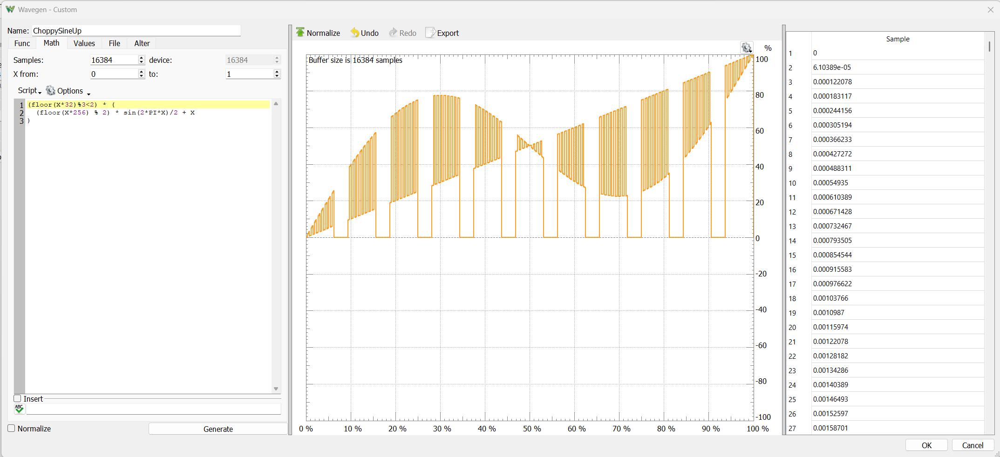
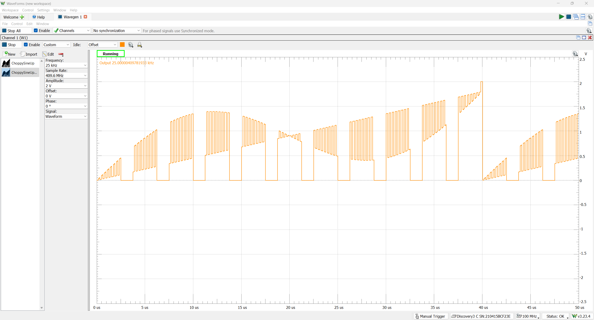
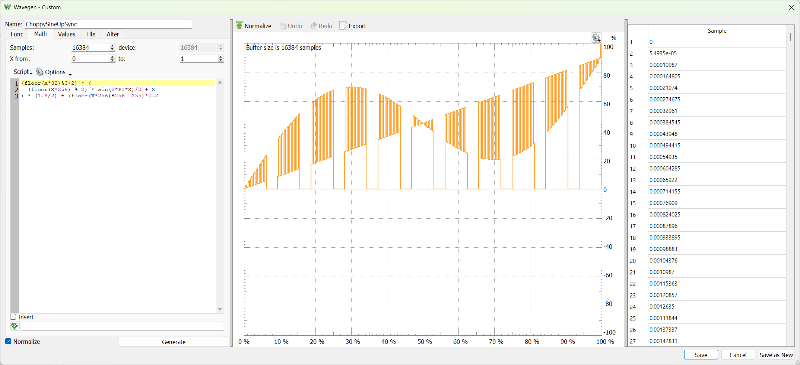
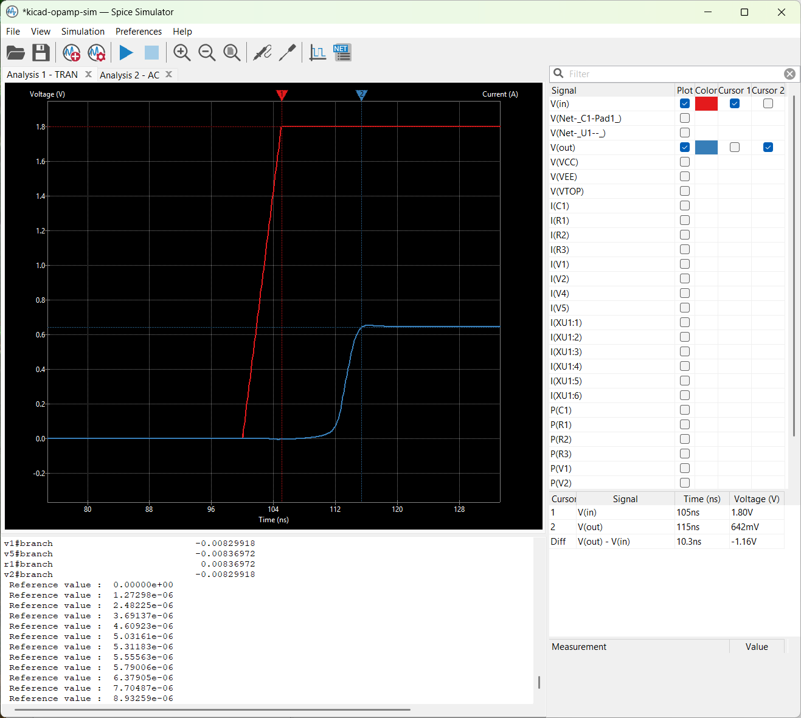

# 5 Dec 2024

| Previous journal: | Next journal: |
|-|-|
| [**0223**-2024-11-12.md](./0223-2024-11-12.md) | *Next journal TBA* |


# TODO V2

*   Create symbol for my RP2040 board (`sandpit/pcb/kicad/RP2040/rp2040_pcba_test`) showing its IOs, buttons/headers and LEDs
*   Create schematic for GFMPW-1 hookup inc. RP2040 and TinyVGA
*   Write "game" code for PC control of GFMPW-1, also TT07
*   Write RP2040 (uPython or C) code to move "smartly" between random map locations as a cooler demo
*   Design/simulate opamp & VGA connector board for TT06, later TT08
*   Update rbz repo with WB extensions, and improve register access instantiation
*   Document rbz_options
*   Document CI2409 RBZ
*   Document CI2411 RBZ variants, esp. WB
*   Test other GFMPW-1 designs
*   GFMPW-1 clocked by RP2040 -- try different clock speeds
*   Unexpected SPI overloading behaviour; doesn't stall SPI counter as it should?
    *   Compare reg SPI (over)load: https://github.com/algofoogle/algofoogle-multi-caravel/blob/gf180/verilog/rtl/raybox-zero-fsm/src/rtl/spi_registers.v
    *   Compare vec SPI (over)load
    *   Compare versions (TT04 and CI2311 work OK with both overloading??? Or maybe the don't: MicroPython SoftSPI maybe sends exact bits? Don't think so).
    *   Try a GFMPW vec SPI regular load, vs. overload
    *   Do a simulation of SPI loading & check VCD
*   Document TT08 submission for analog review
*   Try to get TT09 ring osc extraction/simulation to work


# Testing opamp circuit before TT06 arrival

*   Simulate devices that have usable SPICE models (e.g. from TI) -- Create warpper SPICE as required for multi-devices.
*   Generate high-impedance 0-1.8V analog signal from AD3:
    *   Waveform gen:
        *   Without BNC: -3dB at 9MHz
        *   With BNC: -3db at 12MHz
    *   Run it thru a 100k (or 1Meg) resistor?

```excel
(floor(X*32)%3<2) * (
  (floor(X*256) % 2) * sin(2*PI*X)/2 + X
)
```







Simulated opamp delay is about 10ns on rising edge:



...much faster on falling edge.

