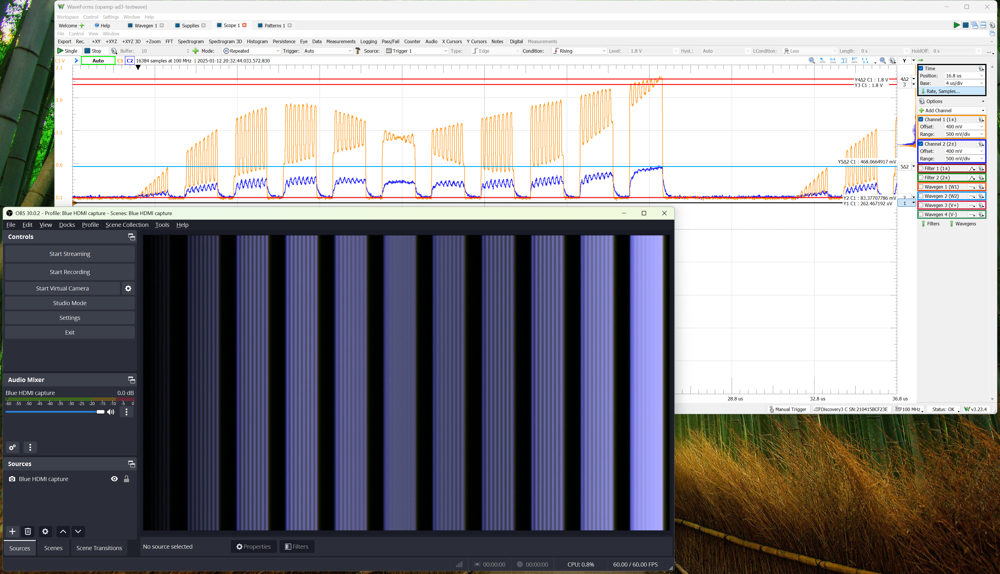

# 12 Jan 2025

| Previous journal: | Next journal: |
|-|-|
| [**0224**-2024-12-05.md](./0224-2024-12-05.md) | [**0226**-2025-02-20.md](./0226-2025-02-20.md) |

# tt06-grab-bag Analog VGA bring-up

I've got my TT06 board, and it is time to test my first analog VLSI project: [tt06-grab-bag](https://tinytapeout.com/runs/tt06/tt_um_algofoogle_tt06_grab_bag), which is an attempt to create an analog VGA driver using 3 &times; 8-bit R2R DACs and a digital PnR block. There's also a simple CMOS inverter, and a spare 4-bit DAC.

## Powering up the TT06 board

1.  Go to https://commander.tinytapeout.com/ -- I'm doing this on Windows 11 Home.
2.  Plug in the TT06 demo board via USB.
3.  All 3 power LEDs should light up, and after a few seconds the 7seg display should do a quick burst of activity (displaying the TT ROM message) before a binary counter starts -- this is the factory test design.
4.  In the Commander click 'CONNECT TO BOARD', select 'Board CDC (COM3)', and click 'Connect'.
5.  With all DIP switches off and nothing else connected to the board, 'Shuttle' should ID as `tt06`. Console should show:
    ```
    Debug log
    ttboard.boot.demoboard_detect: TT06+ demoboard with carriemoBoard in ASIC_RP_CONTROL, auto-clocking @ tt_um_factory_test (1) @ https://github.com/TinyTapeout/tt06-factory-test'>
    tt.sdk_version=2.0.0RC2
    MicroPython v1.24.0 on 2024-10-25; Raspberry Pi Pico with RP2040
    ...
    ```
6.  Version 2.0.0RC2 is known to be a bit unreliable depending on the state of DIP switches or IO connections, so we should [upgrade to the latest version](https://tinytapeout.com/guides/get-started-demoboard/#ossdk-updates), i.e. we do a typical RP2040 UF2 firmware upload of the Tiny Tapeout firmware, comprising MicroPython and the specific Tiny Tapeout SDK/config. For me, this is as follows...
7.  Go to the [firmware releases page](https://github.com/TinyTapeout/tt-micropython-firmware/releases) and download the latest UF2 file ([v2.0.3](https://github.com/TinyTapeout/tt-micropython-firmware/releases/download/v2.0.3/tt-demo-rp2040-v2.0.3.uf2) at the time of writing).
8.  In Commander, click 'RESET TO BOOTLOADER' at the bottom. Commander will disconnect, and the RPI-RP2 USB drive should appear.
9.  Drag the firmware file (e.g. `tt-demo-rp2040-v2.0.3.uf2`) into this drive; let it copy (slowly), and then after a while the drive should disappear and the board should reset and run the factory test again.
10. Reconnect with Commander and expect to see it detects the new firmware version.

## Testing the 'EFAB' demo

Just for fun, let's try "[EFAB Demo 2](https://tinytapeout.com/runs/tt06/tt_um_wokwi_395142547244224513)" that I submitted for the Efabless "[Build Your First Chip with Tiny Tapeout](https://www.youtube.com/watch?v=UVZK-kmN7wc)" webinar...

1.  In the 'Project' field search for `efab` and pick `EFAB Demo 2`.
2.  Click 'SELECT'
3.  After a brief pause it should blink the letter `F`
4.  Go to the 'INTERACT' tab
5.  Tick `ui_in`
6.  Turn on `2` and it should now blink `E`
7.  Turn on `0` and it should blink its way through `EFAb`
8.  Turn on `7` and the blinking should stop (though the dot will still blink)
9.  Untick `ui_in` and it should be possible to do the same with the DIP switches instead.

## Testing a standard digital VGA (TinyVGA) project

1.  On Command 'CONFIG' tab search for `vga`
2.  Pick '[VGA Experiments in Tennis](https://tinytapeout.com/runs/tt06/tt_um_tomkeddie_a)' and click SELECT.
3.  Go to 'INTERACT' tab and tick `ui_in`
4.  Turn on `7` (to select TinyVGA PMOD mode)
5.  Attach TinyVGA PMOD to OUTPUT header and plug in VGA cable
6.  Display comes up
7.  Explicit reset is required; game starts in a random state

## Basic digital test of tt06-grab-bag

This will just use the digital VGA outputs of tt06-grab-bag with TinyVGA and run the XORs demo, for a basic sanity check:

1.  Keep TinyVGA attached (as above).
2.  Untick `ui_in`
3.  Search for `grab` and pick `TT06 Grab Bag`
4.  Click 'SELECT'
5.  VGA monitor should sync (but should be black)
6.  Tick `ui_in` and turn on `4` and `5`
7.  Tap `R` for reset
8.  Coloured squares should appear, with a diagonal blue haze scrolling across.
9.  Turn off `5` and tap `R` again; different coloured squares pattern (based on simple ramps) and blue tint gradually increasing.

This much is already a good start; the digital PnR block works as expected, it seems.


## VGA amplifier board

This at least shows that my VGA amplifier board works, when driven by an approximation of a VGA signal generated by the Analog Discovery 3:



Note that in this case I have the CH1 (orange) signal going into the blue channel, and then from there it goes to both the red and green channels via an extra 10k series resistor; this is an attempt to see what the real TT06 output might be like (just on those 2 of 3 channels), knowing that my TT06 analog outputs have probably much lower drive current. Hence, we see the CH2 (blue line, not blue colour channel) signal is weak on the output too, and slews badly. Scope probes load this a little more, too.

