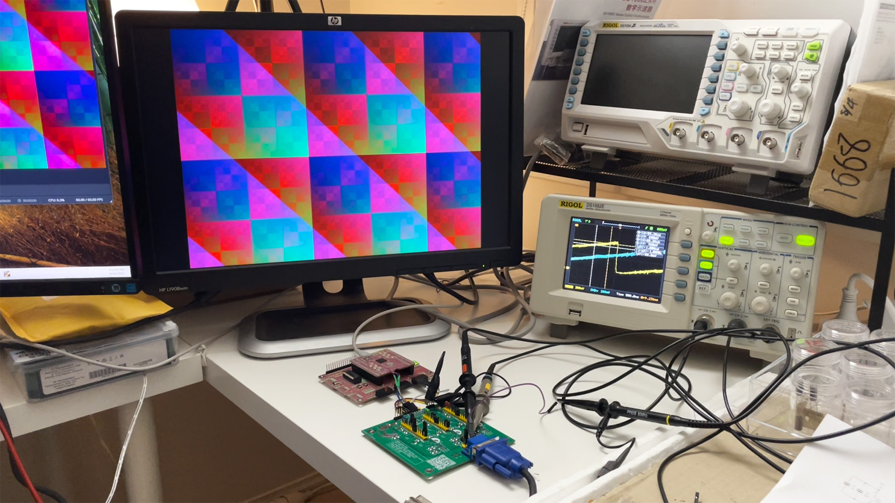
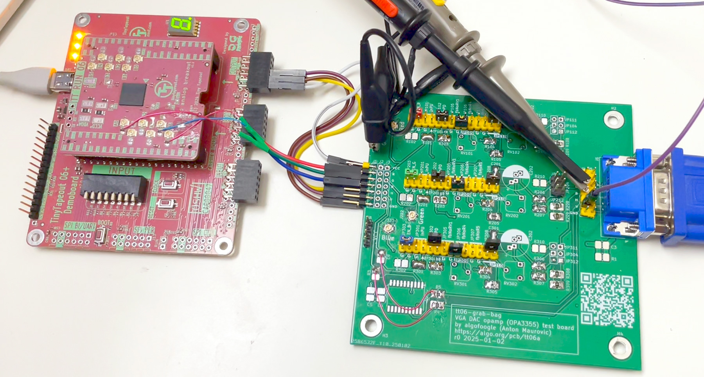
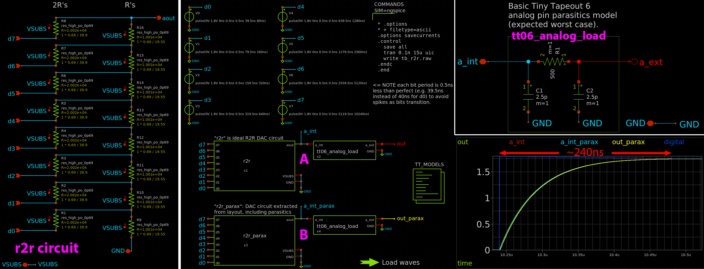
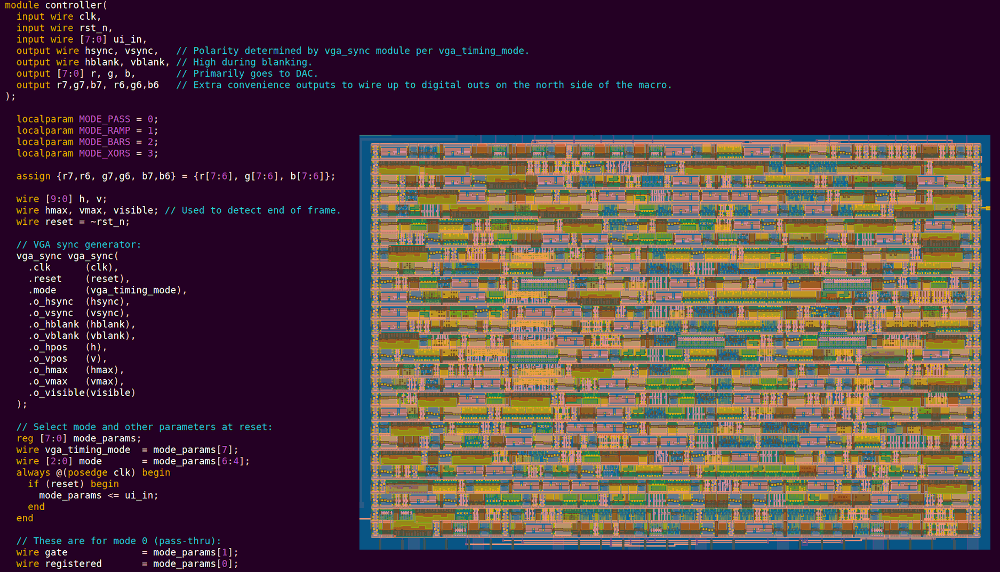
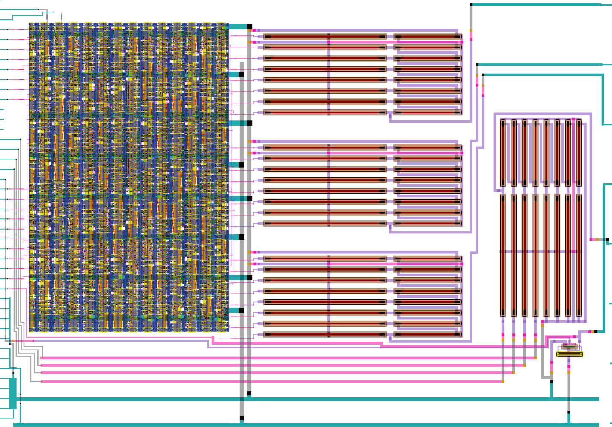
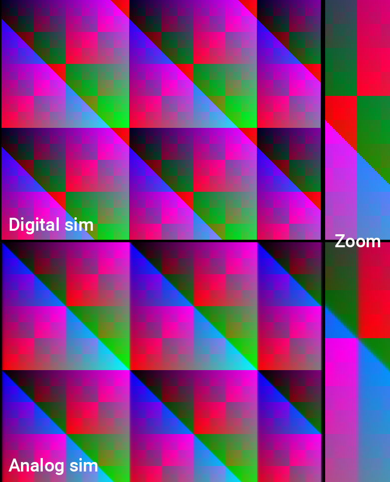
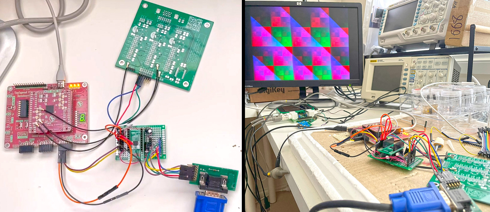
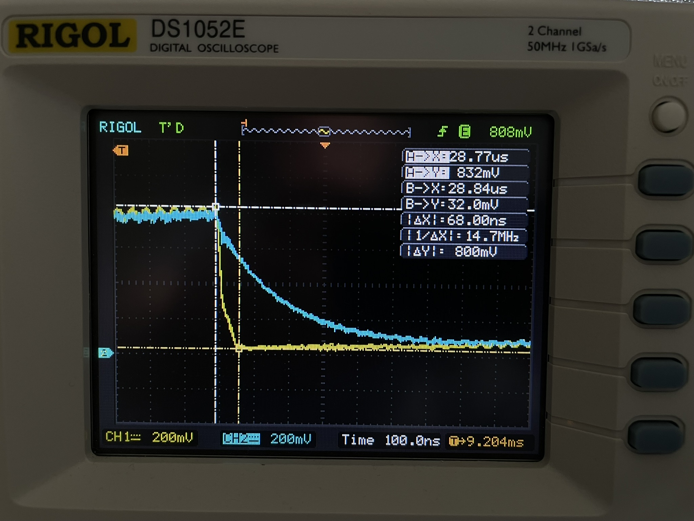
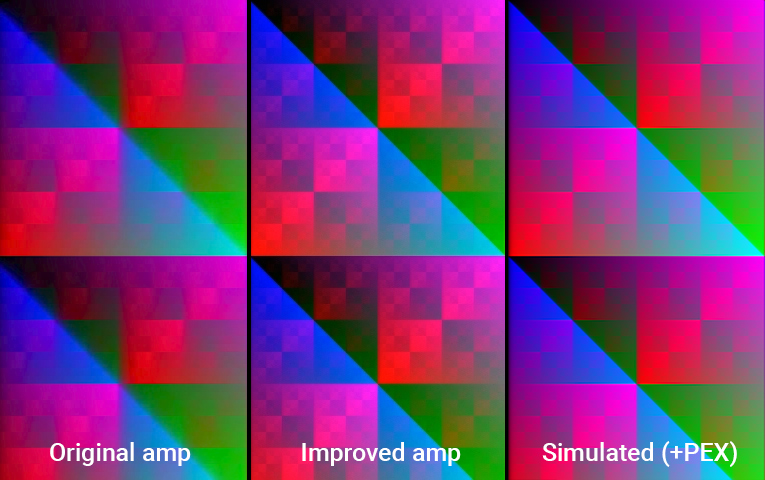

# 20 Feb 2025

| Previous journal: | Next journal: |
|-|-|
| [**0225**-2025-01-12.md](./0225-2025-01-12.md) | *Next journal TBA* |

# tt06-grab-bag Analog VGA works!

> [!NOTE]
> Watch [my video segment on Matt Venn's TT06 Bring-up Party](https://www.youtube.com/watch?v=UnpSEdZgYKs&t=3381s) if you'd like a quick overview, then come back here for more details.

Video projects on Tiny Tapeout custom ASICs (custom silicon chips) have typically been limited to digital 6-bit colour (RGB222, or 64 distinct colours). Some have gone up to 12-bit colour (RGB444, or 4096 distinct colours) but this uses a lot of the limited IO pins. I wanted to create a design that could potentially drive more like 18-bit (RGB666) or ideally 24-bit colour (RGB888, millions of colours) by using 3 analog pins only. My Tiny Tapeout 6 submission, "[TT06 Grab Bag](https://tinytapeout.com/runs/tt06/tt_um_algofoogle_tt06_grab_bag)", gets close to accomplishing that.

In April 2024 I submitted "TT06 Grab Bag" ([GitHub link](https://github.com/algofoogle/tt06-grab-bag)) -- my first analog VLSI design -- to Tiny Tapeout 6 (as part of the [Zero to ASIC Analog Course](https://www.zerotoasiccourse.com/analog/)) and after about 9 months of waiting for the fabricated chip to arrive I've been able to prove that the design works pretty well as intended: It generates high-colour-depth 640x480 VGA output by producing on-chip analog video signals.

The design implements a simple VGA driver demonstration that generates analog outputs for each of the Red, Green, and Blue channels. It does this using 3&times; RDACs (resistive DACs, i.e. using an R2R ladder). It's a mixed-signal design in that it includes a digital control block that can be directed to produce a few different test patterns as 24-bit outputs (8 bits per colour channel) and feeds them into the on-chip R2R ladders.

Due to Tiny Tapeout limitations, my project relies on external op-amps to buffer the analog outputs, and also to scale their 0-1.8V range down to 0-0.7V.

From simulation, the design was expected to be able to transition (i.e. 'slew') between maximum and minimum brightness within about 240ns (where, using a 25MHz VGA 'dot clock', 40ns is 1 pixel horizontally, so 240ns is 6 pixels horizontally). Due to a much-improved [external amp solution](#vga-amp-board) this slew rate was reduced to no worse than about 100ns (at the cost of some extra noise, but which is hard to see anyway).

## Analog schematics

I have a [testbench schematic for both the ideal and extracted layout](https://github.com/algofoogle/tt06-grab-bag/blob/main/xschem/tb_r2r.sch) (view online [here](https://xschem-viewer.com/?file=https%3A%2F%2Fgithub.com%2Falgofoogle%2Ftt06-grab-bag%2Fblob%2Fmain%2Fxschem%2Ftb_r2r.sch)).

I started with a simple 8-bit R2R DAC schematic inspired by [Matt Venn's example](https://github.com/mattvenn/tt06-analog-r2r-dac) and sized the resistors to be R=10k (instead of 22.65k), and to ensure they wouldn't typically exceed the [sky130-recommended](https://skywater-pdk.readthedocs.io/en/main/rules/device-details.html#p-poly-precision-resistors) 100&micro;A/&micro;m typical current. This means they should have lower impedance and hence can get a faster full-swing.

## Digital block

I used OpenLane to independently harden a simple [digital control block implemented in Verilog](https://github.com/algofoogle/tt06-grab-bag/blob/main/verilog/controller.v). This produced a GDS macro that I was then later able to place into the Tiny Tapeout analog template and wire up with the digital IOs, the power rails, and with my analog layout blocks.

The digital block generates all the VGA timing (including HSYNC and VSYNC) from a 25.175MHz clock source, though for simplicity I assume 25.000MHz (which is OK too) and thus 40ns per pixel. Besides doing external RGB222 output via `uo_out` to be compatible with the [Tiny VGA PMOD](https://github.com/mole99/tiny-vga), it also generates internal digital signals that are 8bpp (bits per pixel) per each of the RGB (Red, Green, Blue) colour channels that become the inputs to 3 instances of the DACs.

The specific test pattern generated by the digital block is selected by the 8 `ui_in` pins (as reset is released), and some suggested combinations (in binary, MSB to LSB) include:

*   `00010000`: Colour ramps, with red ramping per pixel, green per line, and blue per frame.
*   `00010001`: As above, but in green, blue, red order.
*   `00010010`: As above, but in blue, red, green order.
*   `00010011`: All 3 channels ramp per-pixel, producing grey ramps (good for comparing consistency between channels).
*   `00110000`: Pretty XOR patterns on red and green, with a angled gradiated pattern wiping across blue.
*   `00000000`: Pass-through: Any value subsequently presented on `ui_in` becomes the direct/live 8-bit input to all 3 DACs.

There is also [an option](https://github.com/algofoogle/tt06-grab-bag/blob/87632325585590306024284e5042265f0ab5a544/verilog/vga_sync.v#L68) (i.e. [when `ui_in[7]` is 1](https://github.com/algofoogle/tt06-grab-bag/blob/87632325585590306024284e5042265f0ab5a544/verilog/controller.v#L57)) to generate [timing compatible with a 1440x900 VGA display](https://github.com/algofoogle/tt06-grab-bag/blob/87632325585590306024284e5042265f0ab5a544/verilog/vga_sync.v#L38-L55), given a 26.6175MHz clock instead of 25MHz. This one quarter of the normal clock for this resolution but should allow a compatible monitor to expose more circuit glitches and artifacts (if there are any).

## Layout, extraction, LVS

I created my layouts in [Magic](https://opencircuitdesign.com/magic/) by exporting a suitable SPICE netlist from Xschem and then importing, to create pcells.

My first layout was actually for a basic CMOS inverter, just to prove I could get the flow right (including LVS).

Before creating the layout, I at least simulated it (see below) to make sure it behaved reasonably well.

I then created the layout of a single R2R DAC cell, and placed 3 instances of it beside the digital block's GDS, and wired everything up. I also had spare area so I included a 4th instance and just used the upper 4 bits of it connected to 4 spare digital inputs (and the 4 LSBs of that DAC connected to GND).

Amazingly, I got LVS to pass pretty quickly, which was reassuring. A Verilog black-box model was used to define all instances of the DACs and their connections, as the design's top-level "schematic" (netlist) input for LVS.

I then used Matt Venn's example Makefile to do parasitic extraction of a SPICE netlist from the layout, and I was able to simulate it (see below).

## Simulation

I did several different kinds of simulation including:
*   Simple ngspice simulation, set up via Xschem, of a single DAC driven by a ramping digital input, and with a model of the TT06 analog pin capacitive loading -- very fast. See [here](https://github.com/algofoogle/tt06-grab-bag/tree/main/xschem/simulation).
*   Simulation of the DAC layout following parasitic extraction -- fast. If it helps, see the [Make target for extracting PEX SPICE for simulation](https://github.com/algofoogle/tt06-grab-bag/blob/87632325585590306024284e5042265f0ab5a544/mag/Makefile#L23).
*   Cosimulation in ngspice, with a Verilator backend simulating the digital part and using it to stimulate 3 instances of the extracted DAC layout -- fast. Got some [introductory notes on it](https://github.com/algofoogle/journal/blob/master/0200-2024-05-01.md#cosimulation).
*   Simulation of the full layout extraction, including the entire digital block's circuit. This is extremely slow (though I did manage to speed it up a little, and there's more I could possibly do). Arguably it's the most accurate, and it was even able to expose some (expected) non-linearities. I have [notes on my initial attempts with this](https://github.com/algofoogle/journal/blob/master/0202-2024-05-15.md) and then [identified simulation glitches which I worked around](https://github.com/algofoogle/journal/blob/master/0203-2024-05-20.md) and got [some good results](https://github.com/algofoogle/journal/blob/master/0203-2024-05-20.md#rendering-results).

Note that I think my more-recent simulation commits were done in [a different repo, following 2024-05-11](https://github.com/algofoogle/tt-vga-fun/commits/main/).

Full-layout extraction and full-circuit simulation was done after the submission closed and it revealed a possible non-linearity in the DAC output: Notice that the rising lines are not perfectly straight, and this (or at least something similar) became apparent in the real chip too. I suspect this is because OpenLane sized the output buffer cells differently for certain bits going into the DACs; I should've had my own buffers on the DAC inputs.

When doing any simulations, I made sure to write to files that could then be rendered as a VGA image preview. This is easy for the purely-digital simulation with Verilator, where the signal is a pure 24-bit digital output, but I also wanted a more-realistic analog simulation:

To render a PNG file representing the VGA image produced by the analog simulation results, I wrote the data to an ngspice `.raw` file and created a [render.py](https://github.com/algofoogle/tt-vga-fun/blob/main/xschem/render.py) script to help with parsing the data and doing the rendering.

## VGA amp board

Simulation showed I should expect a slew rate of about 240ns on the analog output pins. This stands to reason as:
*   The expected TT pin load is 500R and 5pF. Impedance of DAC is ~10k. Hence, &tau; = RC = ~52ns.
*   It takes 5&tau; to get to about 99% of the target voltage, which is ~262ns.

VGA has a 75&ohm; load impedance per channel, with a voltage range of 0V (black) to 0.7V (full brightness). Tiny Tapeout can't provide enough current for this load: it would be about 9.3mA per channel, but TT's analog mux/pins can support only up to about 4mA per channel, and the whole project is limited to about 10mA anyway.

My on-chip circuit produces analog outputs that are 0-1.8V and about 10k impedance by virtue of the R2R DAC with R=10k, and so I made an external op-amp board to buffer the signal and do the level shifting. I used an OPA3355 triple video op-amp chip and followed its application notes. Though it worked, the results weren't great on this rough hand-made solution:

With lots of [great tips from Sylvain Munaut](https://discord.com/channels/1009193568256135208/1328617914588332042) I was able to make a much better board by doing the following:
*   Getting rid of U.FL/coaxial cables; they add a lot of extra capacitive load. I replaced them with simple short wires.
*   Using another OPA3355-based prototyping PCB I'd had fabbed for this project, which arrived shortly after my initial experiments.
*   Using a pull-down resistor on the op-amp input side to effectively get lower impedance and hence a faster slew rate from the ASIC (despite a lower output voltage range and hence more noise).
*   Forgetting about biasing (which I was doing to try and get around rail-to-rail limitations with the OPA3355) -- turns out it's pretty good and I don't care much about the near-0V where it bottoms out.
*   In turn, this meant I could use a simple impedance-matched feedback network to set the gain on the now-lower output range, to get it up to 0-0.7V and 75&ohm; impedance.

Note also that my scope probe introduced a lot of extra load on the input-side signals when I was trying to measure them.

In any case, after reworking the boards I had on hand, I was able to get the slews right down. This scope screenshot shows the unmodified CH2 (blue) with ~800ns slew, compared with the improved CH1 (yellow) at about ~68ns (though I was later getting closer to about 100ns):

Comparing the screen captures from the original amp board and the new amp board shows the notable improvement in quality:

## Interposer board

For a nicer and more-permanent solution with (hopefully) even better performance and no hacking of the TT06 carrier board, I created an "[interposer board](https://github.com/algofoogle/tt06-grab-bag/tree/main/pcb/tt06-vga-interposer)" (aka "sandwich board") that slots in between the TT06 carrier and TT06 demo boards, and implements the ideal op-amp circuit and provides the VGA connector directly and with a better layout.

## Misc

*   Link to the repo
*   Notes on unmatched buffer cells
