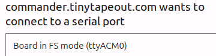
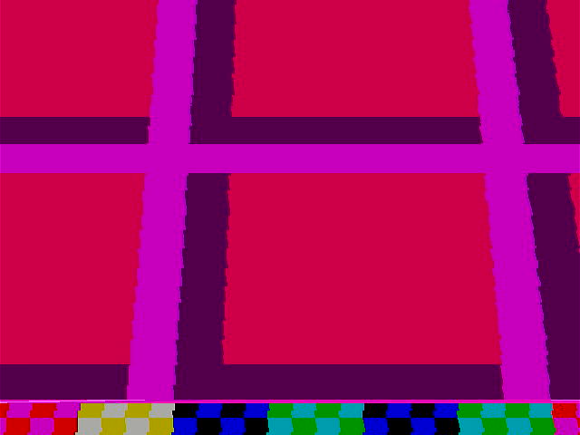
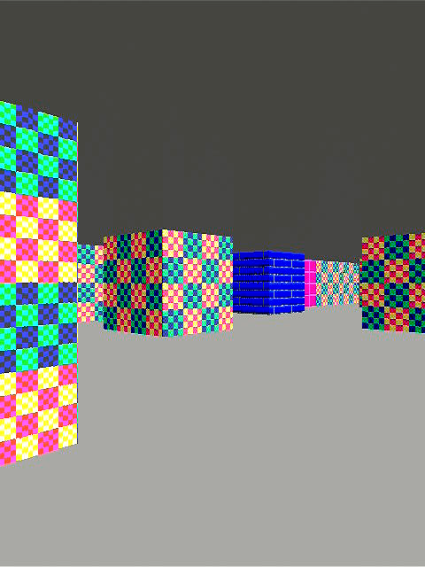
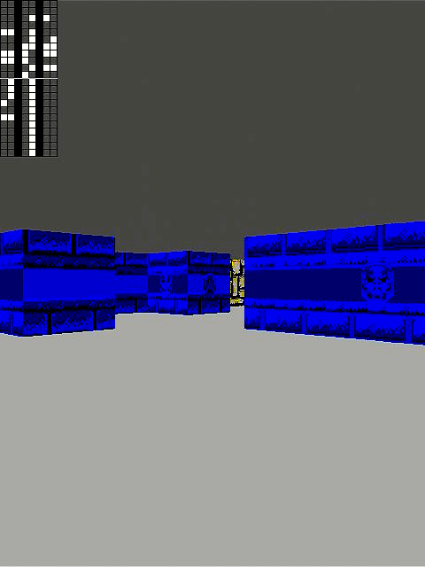
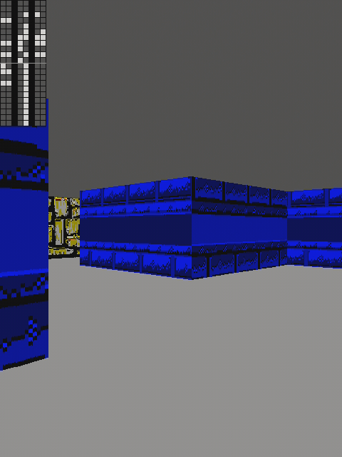

# 27 Mar 2025

| Previous journal: | Next journal: |
|-|-|
| [**0227**-2025-02-25.md](./0227-2025-02-25.md) | *Next journal TBA* |

# Testing some Tiny Tapeout 7 projects

## Background

It's been about 4 weeks since I lost my job with the shut down of Efabless, and while I've been organising everything in my lab, etc., I've decided to try testing some of the TT chips I've already got.

I spent the last week trying to get Ubuntu 24.04 working well on my Lenovo Legion 7 Pro (16IRX8, 82WR) laptop, in a dual-boot configuration with Windows 11 Home. Getting my NVIDIA-based display configuration working with 2 external monitors was a huge pain -- I'll do a write-up on the details of that later.

## Plugging in the TT07 board

I've got a stock TT07 chip and demo PCB which I'll make sure I can get working on my Ubuntu laptop.

Plugging in via USB, I see this in `sudo dmesg -T --follow`:

```
[Thu Mar 27 18:30:39 2025] usb 1-3: new full-speed USB device number 6 using xhci_hcd
[Thu Mar 27 18:30:39 2025] usb 1-3: device descriptor read/all, error -71
[Thu Mar 27 18:30:39 2025] usb 1-3: new full-speed USB device number 7 using xhci_hcd
[Thu Mar 27 18:30:39 2025] usb 1-3: device descriptor read/64, error -71
[Thu Mar 27 18:30:39 2025] usb 1-3: device descriptor read/all, error -71
[Thu Mar 27 18:30:39 2025] usb usb1-port3: attempt power cycle
[Thu Mar 27 18:30:40 2025] usb 1-3: new full-speed USB device number 8 using xhci_hcd
[Thu Mar 27 18:30:40 2025] usb 1-3: New USB device found, idVendor=2e8a, idProduct=0005, bcdDevice= 1.00
[Thu Mar 27 18:30:40 2025] usb 1-3: New USB device strings: Mfr=1, Product=2, SerialNumber=3
[Thu Mar 27 18:30:40 2025] usb 1-3: Product: Board in FS mode
[Thu Mar 27 18:30:40 2025] usb 1-3: Manufacturer: MicroPython
[Thu Mar 27 18:30:40 2025] usb 1-3: SerialNumber: de641070db6d402b
[Thu Mar 27 18:30:40 2025] cdc_acm 1-3:1.0: ttyACM0: USB ACM device
[Thu Mar 27 18:30:40 2025] usbcore: registered new interface driver cdc_acm
[Thu Mar 27 18:30:40 2025] cdc_acm: USB Abstract Control Model driver for USB modems and ISDN adapters
```

I assume that's all fine. Let's try with the TT Commander: https://commander.tinytapeout.com/

'CONNECT TO BOARD' shows:



Then:


I will upgrade, though I've heard that the MicroPython instance in the newer version(s) have issues with memory and garbage collection. Nevertheless I'll try it:

1.  Hit the 'Upgrade available' button => Downloads `tt-demo-rp2040-v2.0.4.uf2`
2.  Click 'RESET TO BOOTLOADER" at the bottom
3.  This disconnects, and Ubuntu recognises the RP2040 as a USB flash drive: `RPI-RP2` (in my case, `/dev/sda1` mounted at `/media/anton/RPI-RP2`)
4.  Drag the UF2 file to the flash drive. This seems to take a long time with no progress, so next time I'll just copy via shell.
5.  The RP2040 reboots, and the demo project starts running again.
6.  'CONNECT TO BOARD' again; seems fine. Let's find some designs to test.

Let's try [#70](https://tinytapeout.com/runs/tt07/tt_um_wokwi_399488550855755777): "My 9-year-old son made an 8-bit counter chip"

Selecting the design starts with no clock (0 Hz), and initial state (seen on 7seg LEDs) is: `10011100`. This design has no reset logic, but clicking the Commander 'Reset' button seems to do a synchronous reset (with 10 clocks), because the log shows `tt.clk_once=10` and `tt.reset_project=1`, and the output changed to: `10100110`. 'Clock once' works as expected too. A dedicated 1Hz clock works too.

Now try [#2](https://tinytapeout.com/runs/tt07/tt_um_6bitaddr): "6 bit addr"

This just needs a 6-bit input on `ui_in[5:0]`, another 6-bit input on `uio_in[5:0]`, and an extra carry bit on `ui_in[6]`, and it should give direct combinatorial outputs on `uo_out[5:0]` with carry on `uo_out[6]`.

Actually this is harder to test because it requires asserting `uio_in` too, which I don't want to do right now because I've got a PMOD plugged in.

## Trying Raybox-Zero, TT07 Edition

[tt07-raybox-zero](https://github.com/algofoogle/tt07-raybox-zero) on this chip is a resubmission of my earlier TT04 version, and the resubmission itself is documented in [0204](./0204-2024-05-25.md) and [0205](./0205-2024-05-30.md).

I already verified this earlier on my bench, but here's a record of it...

This design works with the Tiny VGA PMOD in `uo_out`, and can use a QSPI texture ROM on the bidir ports, but it's not pin-compatible with the Tiny QSPI PMOD, so I've wired it up manually (after flashing texture data to a low region of the QSPI flash ROM).

I'm testing this in a space where I don't have a VGA monitor but I'm using a VGA=>HDMI adapter, then HDMI=>USB capture.

I select design [#714](https://tinytapeout.com/runs/tt07/tt_um_algofoogle_raybox_zero): "raybox-zero TT07 edition".

I specify a 25MHz clock. Hmm, no display, or maybe clocking not working yet?


Lets set `ui_in`: `11111100`: {gen_tex, registered_outputs, inc_py, inc_px, debug, spi_disable, -, -}

Ah, it turns out `gen_tex` was needed. When disabled, the whole display was filled with white. I was expecting to see SOME texture data (as there is some on this QSPI PMOD) but given the start-up state of the design includes random values in the texture offset registers, it's probably selecting textures from an erased part of the texture memory.

Anyway, prior to reset, this is what the display looks like:



This is the capture through my VGA=>HDMI converter and "blue" HDMI=>USB capture device, so probably not ideal; compression artefacts, and possibly some mucky chroma.

OK, let's turn on inc px/py and do a reset, and it seems fine:



The next matter is textures. Turning off `ui_in[7]` (gen_tex) gives textures, but they're a bit mangled:



Prior testing revealed that this can be mitigated (to a degree) by changing the clock speed and duty cycle. ~21MHz from memory was OK, but the capture dongle I'm using loses sync below 24.25MHz.

I tried the Cam Link 4K, which at least gives a better image quality:



OBS Studio on Ubuntu doesn't like the VGA clock changing on the Cam Link; it crashes.

23.33MHz still syncs on the Cam Link.

OK, more experimentation needed to see if I can get the textures working via SPI.
