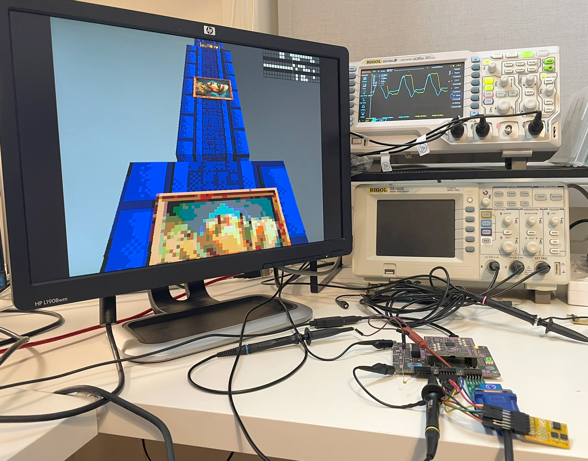
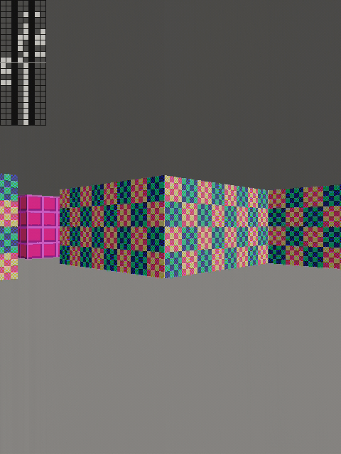
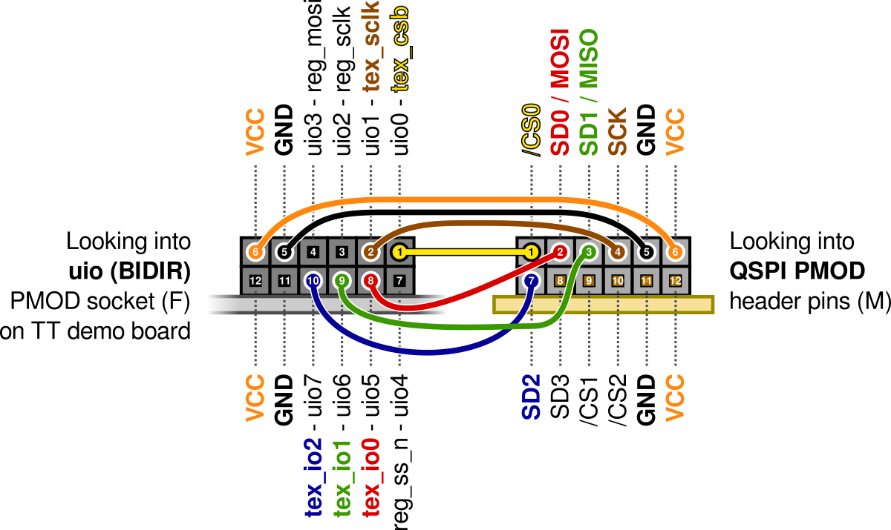
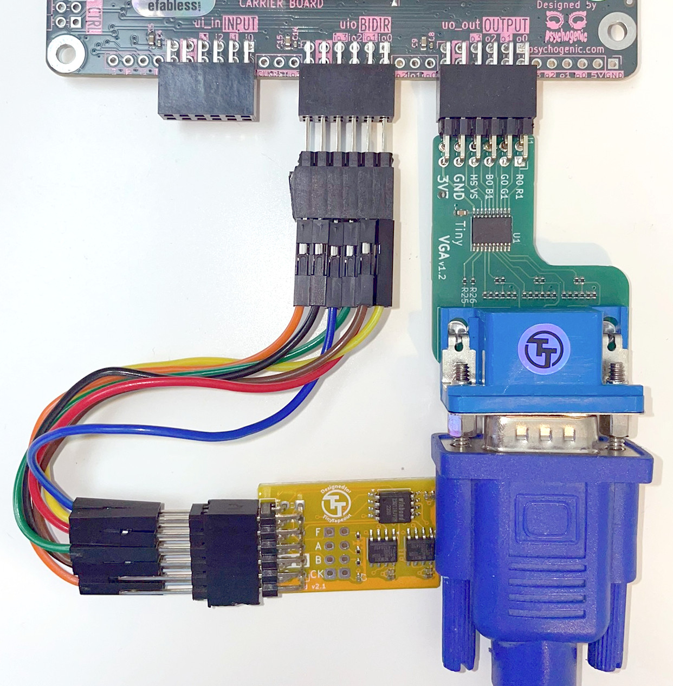
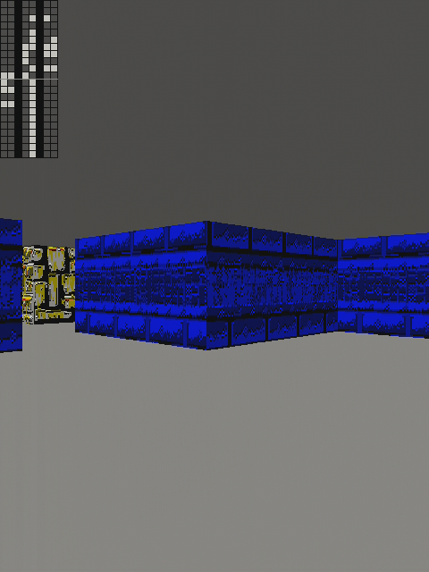
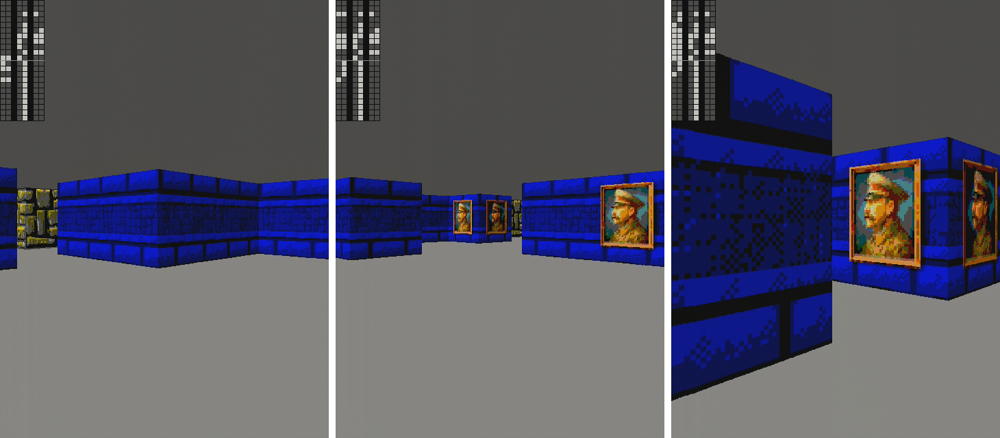
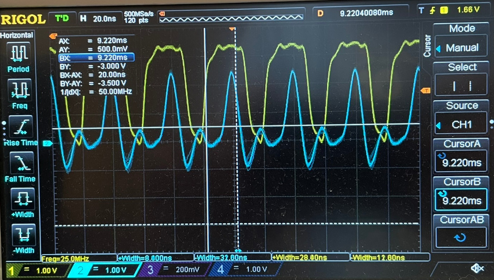
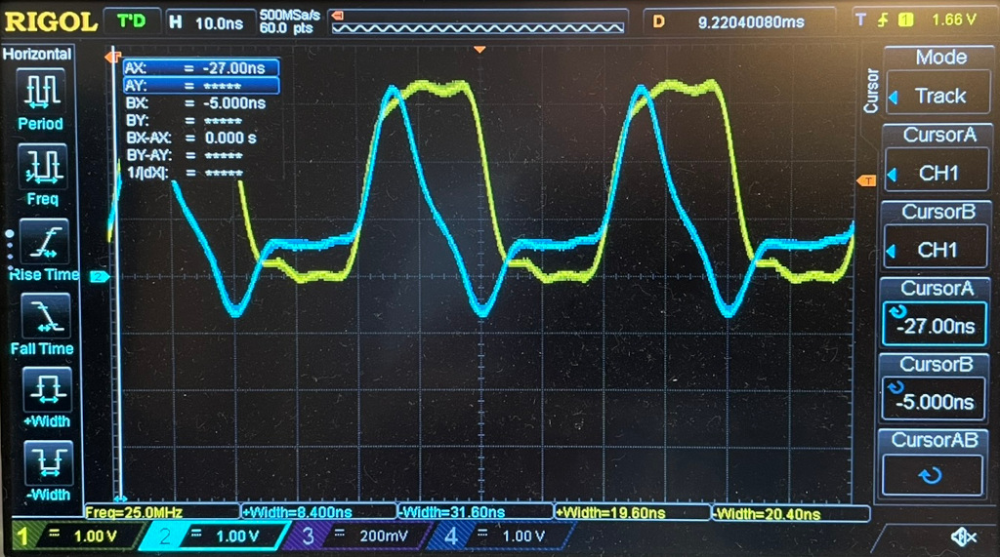

# 1 Apr 2025

| Previous journal: | Next journal: |
|-|-|
| [**0228**-2025-03-27.md](./0228-2025-03-27.md) | [**0230**-2025-04-09.md](./0230-2025-04-09.md) |

# Testing tt07-raybox-zero



Following [0228](./0228-2025-03-27.md), here are better bring-up/testing notes for tt07-raybox-zero.

## Basic bring-up

1.  Plug [Tiny VGA PMOD](https://store.tinytapeout.com/products/TinyVGA-Pmod-p678647356) into the TT07 `uo_out` port.
2.  Plug TT07 board in via USB.
3.  Open [Tiny Tapeout Commander](https://commander.tinytapeout.com) and connect to the board.
4.  Search/pick the "`raybox`" design and click 'SELECT'.
5.  Make sure clock speed is 25000000 (25MHz) and click 'SET'.
6.  Go to the 'INTERACT' tab and turn on `ui_in`, and turn on only 3 (debug overlay) and 7 (generated textures).
7.  Click 'RESET'.

This static image should appear on the VGA display (here it is rotated 90 degrees anticlockwise to make it portrait, and note the quality is reduced here by my Cam Link video capture dongle):



Turn on `ui_in` 4 (X increment) and 5 (Y increment) to see the "demo mode" where the viewer slowly moves through the 3D world:

<video controls src="https://github.com/user-attachments/assets/198a24fa-77ef-4a5f-960c-ad9361dcc720" title="0229-rbz-initial-video-nv.mp4"></video>

For the capture MP4 file, see here: [`files/0229/0229-rbz-initial-video-nv.mp4`](./files/0229/0229-rbz-initial-video-nv.mp4)


## Textures

This project supports rendering of wall textures that come from an external SPI memory (as do all raybox-zero versions after TT04). I've collected and otherwise made a few textures. Most are from Wolf3D with contentious material edited out.

The raw 1MB binary [tt07-wall-textures.bin] (in [raybox-zero's "assets" directory](https://github.com/algofoogle/raybox-zero/blob/main/assets/)) is ready to be written to an SPI Flash ROM. There is a [preview PNG of all the textures](https://github.com/algofoogle/raybox-zero/blob/main/assets/tt07-wall-textures-RGB222-PREVIEW.png). Note that it is the same 64 textures (arranged as 32 pairs: light and dark 'sides'), but repeated 4 times over with different adjustment/dithering methods. For more information on how the binary was created, see "[Generating the Texture SPI ROM binary](#generating-the-texture-spi-rom-binary)".

The TT07 demo board can be used with the "Tiny Tapeout Flasher" (similar to TT Commander) to write to the Tiny QSPI PMOD...


### Writing textures binary file to QSPI PMOD

The mole99 [QSPI PMOD](https://github.com/mole99/qspi-pmod) (for sale [here](https://store.tinytapeout.com/products/QSPI-Pmod-p716541602)) is as good as any to test external texture rendering, so the instructions below focus on that.

Do the following:

1.  Download [tt07-wall-textures.bin].
2.  Unplug and replug the TT07 demo board's USB cord.
3.  Plug in the QSPI PMOD into the `uio` ("BIDIR") PMOD socket.
4.  Go to the [Tiny Tapeout Flasher](https://tinytapeout.github.io/tinytapeout-flasher/) in your browser and 'CONNECT TO BOARD'.
5.  It'll hopefully ID the board, and the Flash ID as `ef7018`.
6.  Select the 'Custom' option and select the file you downloaded in step 1.
7.  Click 'FLASH'. For me this took about 30sec.
8.  Click 'DISCONNECT'.

[tt07-wall-textures.bin]: https://github.com/algofoogle/raybox-zero/raw/refs/heads/main/assets/tt07-wall-textures.bin

> [!CAUTION]
> Now make sure you unplug the demo board, and **unplug the QSPI PMOD**. The tt07-raybox-zero SPI pinout is non-standard, so we need to wire it up manually before testing with the design. Read on below...


### Connecting the textures ROM

The tt07-raybox-zero texture SPI pinout on the BIDIR port doesn't match existing SPI PMODs, so it needs to be manually wired (or an adapter PCB is needed; stay tuned): *Start with the QSPI PMOD **unplugged**.*

The pinout is as follows, and it compares with the following PMOD options (with "uio" pin numbering matching that of the Tiny Tapeout PMOD IOs):

| uio | Dir | tt07-raybox-zero  | [Digilent SF3] | [Tiny QSPI] | PMOD[^1] |
|----:|:---:|-------------------|----------------|-------------|----------|
|  0  | Out | **tex_csb**       | `/CS`          | `/CS0`      | 1        |
|  1  | Out | **tex_sclk**      | `io0`          | `io0`       | 2        |
|  2  | In  | "SPI2" reg_sclk   | `io1`          | `io1`       | 3        |
|  3  | In  | "SPI2" reg_mosi   | `SCLK`         | `SCK`       | 4        |
|  -  | -   | -                 | GND            | GND         | 5        |
|  -  | -   | -                 | +3.3V          | +3.3V       | 6        |
|  4  | In  | "SPI2" reg_ss_n   | NC             | `io2`       | 7        |
|  5  | I/O | **tex_io0**       | `RST`          | `io3`       | 8        |
|  6  | In  | **tex_io1**       | `io2`          | `/CS1`      | 9        |
|  7  | In  | **tex_io2**       | `io3`          | `/CS2`      | 10       |
|  -  | -   | -                 | GND            | GND         | 11       |
|  -  | -   | -                 | +3.3V          | +3.3V       | 12       |

[^1]: These are the physical "top and bottom" pin numbering of a standard 12-pin PMOD. See [an example PMOD schematic](https://digilent.com/reference/_media/reference/pmod/pmodsf3/pmodsf3_sch.pdf) for matching these pin numbers, and [compare with a PMOD pinout table](https://digilent.com/reference/pmod/pmodsf3/reference-manual#pinout_description_table).

Here's a diagram showing the QSPI PMOD wired up to the BIDIR socket in the way that tt07-raybox-zero requires:



Here's an example of it on my bench:



You can do this simply with M-F jumper wires, but I made it a "harness" (so it's easily removed/replaced) by carving up dual-row stackable header pins, [like these](https://core-electronics.com.au/stacking-2x20.html).


[Digilent SF3]: https://digilent.com/reference/pmod/pmodsf3/start?srsltid=AfmBOoqhjyl0OsmiZfWxgLfjfvlB7gaVdssy00vA05PJeieS82AZc5JX
[Tiny QSPI]: https://github.com/mole99/qspi-pmod


### Testing the textures

1.  Start with the TT07 demo board unplugged, to be safe.
2.  Correctly wire up the QSPI PMOD, as above.
3.  Plug in the TT07 demo board, and use the Commander to activate "`raybox`" and reset it (as per [the instructions at the start](#basic-bring-up)).
4.  Now turn **off** `ui_in[7]` (i.e. disable generated textures, hence selecting external textures instead).

If your chip behaves like mine, you'll see textures, but *by default* they won't quite be right:



This is more obvious if you again turn on `ui_in` 4 (X increment) and 5 (Y increment) and see the mangled "picture frame" texture:

<video controls src="https://github.com/user-attachments/assets/4a656512-b34d-4807-9b7b-cced912e289f" title="0229-rbz-badtex-video.mp4"></video>

For the capture MP4 file, see here: [`files/0229/0229-rbz-badtex-video.mp4`](./files/0229/0229-rbz-badtex-video.mp4)

The fix for this (on my chip at least) is to adjust the duty cycle of the clock going into the tt07-raybox-zero design. I do this by overclocking the demo board's RP2040 to 250MHz, allowing for extra duty cycle resolution:

1.  Go to the 'REPL' tab in the TT Commander.
2.  Paste in this line, remembering to do <kbd>Ctrl</kbd>+<kbd>Shift</kbd>+<kbd>V</kbd> to paste:
    ```python
    tt.clock_project_PWM(25_000_000, max_rp2040_freq=250_000_000, duty_u16=0xbfff)
    ```

The textures look good now:



...and again, animated:

<video controls src="https://github.com/user-attachments/assets/eff570bf-a862-4985-a85c-6c7094b28e03" title="0229-rbz-goodtex-video.mp4"></video>

Captured MP4 file: [`files/0229/0229-rbz-goodtex-video.mp4`](./files/0229/0229-rbz-goodtex-video.mp4).


# More to come...

## Where are all the other textures?

I mentioned that there are 32 textures, with 2 'sides' each, repeated 4 times over with different conversion effects.

Only 3 (technically 4) can be shown by raybox-zero at a time, but there are registers that can be used to offset the SPI address of each texture and hence access them all. This could be used for some tricky animation effects and other visual hacks. I have code which demonstrates this, but I need to port it first (see [below](#game-control-via-registers-with-spi-access)).


## "Game" control via registers (with SPI access)

I've got to port my MicroPython code from earlier raybox-zero testing. The design includes two SPI slaves (one for controlling the viewpoint, the other for some other visual effects) and I've got code which allows a host PC's keyboard and mouse to navigate around the map like a first-person-shooter game.


## Bad textures analysis

I need to do more analysis to understand the bad textures better, but here's some initial information...

The SPI `SCK` output is [generated directly by inverting the input clock](https://github.com/algofoogle/raybox-zero/blob/922aa8e901d1d3e54e35c5253b0a44d7b32f681f/src/rtl/rbzero.v#L169-L170).

`SCK` seems to lag the input clock by about 20ns, according to my measurements... I guess due to the TT mux, amongst other things?



I can get pretty good results without varying the input clock duty cycle, if I put a 10nF cap (that's what I've got on hand) between SCK and either GND or VCC. Since the `SCK` output is constantly running, maybe I can just phase-shift it a little more to be consistently good enough.




## Texture ROM format

I need to explain the format of the texture data in the SPI ROM. The short version:
*   Textures are packed 1 pixel per byte.
*   QSPI `io[2:0]` have data for channels Blue, Green, and Red respectively, while `io[3]` is not used at all.
*   Textures are stored in vertical-trace-first order (from bottom to top).
*   Bit packing for colour data, in each byte, is: `{_,b[0],g[0],r[0],_,b[1],g[1],r[1]}`
*   Texture binaries can be generated from a PNG source file [by using the texy9 utility](#generating-the-texture-spi-rom-binary).


## Generating the Texture SPI ROM binary

The main [`raybox-zero` repo](https://github.com/algofoogle/raybox-zero) has [the PNG source for textures](https://github.com/algofoogle/raybox-zero/blob/main/assets/tt07-wall-textures.png), and uses my [`texy9.py`](https://github.com/algofoogle/raybox-zero/blob/main/utils/texy9.py) utility for converting the images to RGB222 format in a variety of ways and thus building the SPI ROM binary blob...

```bash
python3 \
    texy9.py -q threshold -m 1.4 -b 20 ../assets/tt07-wall-textures.png walls-t.bin -f 2xbgr -s 110,111,96,97,46,47,50,51,52,53,0,1,2,3,4,5,10,11,54,55,14,15,16,17,80,81,8,9,12,13,66,67,68,69,32,33,34,35,38,39,6,7,98,99,100,101,86,87,88,89,74,75,76,77,84,85,112,113,20,21,18,19,64,65 \
&& python3 \
    texy9.py -q atkinson -m 1.4 -b 20 ../assets/tt07-wall-textures.png walls-a.bin -f 2xbgr -s 110,111,96,97,46,47,50,51,52,53,0,1,2,3,4,5,10,11,54,55,14,15,16,17,80,81,8,9,12,13,66,67,68,69,32,33,34,35,38,39,6,7,98,99,100,101,86,87,88,89,74,75,76,77,84,85,112,113,20,21,18,19,64,65 \
&& python3 \
    texy9.py -q atkinson -m 1.25 -b 15 --unsharp-mask --unsharp-radius 3 --unsharp-amount 0.8 ../assets/tt07-wall-textures.png walls-ae.bin -f 2xbgr -s 110,111,96,97,46,47,50,51,52,53,0,1,2,3,4,5,10,11,54,55,14,15,16,17,80,81,8,9,12,13,66,67,68,69,32,33,34,35,38,39,6,7,98,99,100,101,86,87,88,89,74,75,76,77,84,85,112,113,20,21,18,19,64,65 \
&& python3 \
    texy9.py -q ordered2x2 -m 1.4 -b 20 ../assets/tt07-wall-textures.png walls-o.bin -f 2xbgr -s 110,111,96,97,46,47,50,51,52,53,0,1,2,3,4,5,10,11,54,55,14,15,16,17,80,81,8,9,12,13,66,67,68,69,32,33,34,35,38,39,6,7,98,99,100,101,86,87,88,89,74,75,76,77,84,85,112,113,20,21,18,19,64,65 \
&& cat walls-t.bin walls-a.bin walls-ae.bin walls-o.bin > ../assets/tt07-wall-textures.bin \
&& python3 seetex.py ../assets/tt07-wall-textures.bin walls.png \
&& xdg-open walls.png
```


# Other loose notes for myself...

## Prior work

I've recently rebuilt my laptop to dual-boot with a fresh install of Windows 11 Home and Ubuntu 24.04. I backed up previous work-in-progress for my various repos: in my Windows environment (`C:\Users\Maurovics\Documents\projects`) and my big Ubuntu 22.04 VM (`~/projects/`) -- I still need to go back to these.

The original TT07 submission repo is https://github.com/algofoogle/tt07-raybox-zero and in turn it has [a specific commit (`922aa8e`) of raybox-zero](https://github.com/algofoogle/raybox-zero/tree/922aa8e901d1d3e54e35c5253b0a44d7b32f681f) as a git submodule.

Notes from the time of the submission are found in [0204](./0204-2024-05-25.md) and [0205](./0205-2024-05-30.md).

See the [list of raybox-zero silicon versions](https://github.com/algofoogle/raybox-zero/blob/main/game/doc/README.md) but note that CI2409 might not get released (due to Efabless shutdown), CI2411 almost certainly won't, and IHP0p2 was never fabricated due to a mix-up (but might get redone later).

I had previously done bring-up and full, animated PC (keyboard/mouse) control of the TT04 and CI2311 versions. Here are some existing notes/scripts (and I need to see if there's anything else that hasn't been committed/catalogued yet):
*   TT04 "[`demoboard/`](https://github.com/algofoogle/tt04-raybox-zero/tree/main/demoboard)" directory. Within this, there are wiring/setup diagrams, and:
    *   `raybox_game.py` is a script that [comes with instructions](https://github.com/algofoogle/tt04-raybox-zero/tree/main/demoboard#raybox_gamepy) to set up a controlling PC as the game keyboard/mouse input, and tries to connect directly to the TT04 demo board (to activate `tt_um_algofoogle_raybox_zero`, upload MicroPython code, and then send it motion commands in real time).
    *   `tt04-raybox-zero-example.py` is an older script that [has instructions](https://github.com/algofoogle/tt04-raybox-zero/tree/main/demoboard#tt04-raybox-zero-examplepy) for running via the Tiny Tapeout Commander REPL, to do some basic tests.
*   raybox-zero repo's "[`game/`](https://github.com/algofoogle/raybox-zero/tree/main/game)" directory:
    *   The [`tt04-raybox-zero-example.py`](https://github.com/algofoogle/raybox-zero/blob/main/game/tt04-raybox-zero-example.py) test is the same as above.
    *   There's a good [breakdown of how things work](https://github.com/algofoogle/raybox-zero/blob/main/game/doc/CI2311.md#how-it-works), but note that this assumes the CI2311 version with **specific C firmware running on the Caravel CPU**... which doesn't exist in TT07, instead meaning the TT demo board's RP2040 can do direct SPI access from MicroPython instead of needing an internal firmware LA-bus bit-bang.


## Porting raybox_game code for TT07

Considerations:
*   There are extra SPI registers
*   Some existing SPI registers expect different bit alignment from the TT04 version (e.g. floor/sky colours)
*   Bidir (uio) pins have different functions, especially given texture SPI access. *Generally*, pinouts differ in some ways
*   New TT MicroPython SDK (2.x vs 1.x) has some different conventions, e.g. re SPI pin access
*   Preference seems to be to use new microcotb convention for test benches; look into whether this should be done as a TT07 replacement of `tt04-raybox-zero-example.py` -- but note that it might not be suitable for a "raybox_game" equivalent. In fact, both are meant to be used as a realtime control, not a true "testbench".
*   UIO RP2040 config: `tt.uio_oe_pico.value = 0b00011100`


