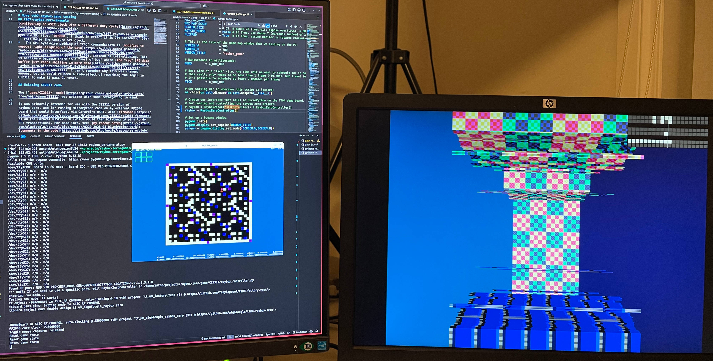

# 9 Apr 2025

| Previous journal: | Next journal: |
|-|-|
| [**0229**-2025-04-01.md](./0229-2025-04-01.md) | *Next journal TBA* |

# More tt07-raybox-zero testing

Getting my SPI tests working for the TT07 version of raybox-zero...

## tt07-raybox-zero-example

[`tt07-raybox-zero-example.py`](https://github.com/algofoogle/raybox-zero/blob/main/game/tt07-raybox-zero-example.py) is a reworked version of [`tt04-raybox-zero-example.py`](https://github.com/algofoogle/raybox-zero/blob/main/game/tt04-raybox-zero-example.py) that uses the newer Tiny Tapeout SDK (v2.0.0+) as recommended for the TT07 RP2040 (MicroPython) firmware.

To run this:
1.  Decide if you are going to do a test with external textures:
    *   If so, [write textures to a QSPI ROM](./0229-2025-04-01.md#writing-textures-binary-file-to-qspi-pmod), then [wire up the QSPI ROM](./0229-2025-04-01.md#connecting-the-textures-rom), and [do a basic textures test](./0229-2025-04-01.md#testing-the-textures).
    *   If NOT, just set up the TT07 demo board per ["Basic bring-up" in 0229](./0229-2025-04-01.md#basic-bring-up), and edit the [`tt07-raybox-zero-example.py`](https://github.com/algofoogle/raybox-zero/blob/main/game/tt07-raybox-zero-example.py) script to [change `ui_in[7]` to be 1 instead of 0](https://github.com/algofoogle/raybox-zero/blob/65ed244d9e3f8552ca4716e8722becba9e39bc66/game/tt07-raybox-zero-example.py#L41) (thus enabling internally-generated textures).
2.  Copy the contents of the [`tt07-raybox-zero-example.py`](https://github.com/algofoogle/raybox-zero/blob/main/game/tt07-raybox-zero-example.py) script.
3.  Go into the Tiny Tapeout Commander 'REPL' tab.
4.  Press <kbd>CTRL</kbd>+<kbd>E</kbd> to enter "paste mode", press <kbd>CTRL</kbd>+<kbd>Shift</kbd>+<kbd>V</kbd> to paste, then <kbd>CTRL</kbd>+<kbd>D</kbd> to execute.

It should then cycle through a few different views, before doing a full rotation, then a partial fine-grained rotation, then repeat.

Compared with the TT04 version, the main SDK-dependent difference is that IO pins are referenced/managed a little differently. So, note that the `tt04-...` version still assumes the 1.x SDK. Tiny Tapeout Commander now recommends firmware updates to 2.0.4+ if you plug in a (say) TT04 board. I need to make a version of the `tt04-...` script that detects the firmware version.

The other differences in the `tt07-...` script are:
*   Initialisation steps are a little different, and include [configuring an ASIC clock with a different duty cycle](https://github.com/algofoogle/raybox-zero/blob/65ed244d9e3f8552ca4716e8722becba9e39bc66/game/tt07-raybox-zero-example.py#L38-L39) (i.e. `0xB000`; I think in effect it is 70% instead of 50%) -- this helps the texture SPI clock.
*   The SPI byte-wise padding of "reg" commands/data is [modified to support right-aligning of the data](https://github.com/algofoogle/raybox-zero/blob/65ed244d9e3f8552ca4716e8722becba9e39bc66/game/tt07-raybox-zero-example.py#L133-L150), instead of left-aligning. This is necessary because there is a "sort of bug" where [the "reg" SPI data buffer just keeps shifting in more data](https://github.com/algofoogle/raybox-zero/blob/922aa8e901d1d3e54e35c5253b0a44d7b32f681f/src/rtl/spi_registers.v#L146-L147). I can't remember why this was changed anyway, but it could've been a side-effect of reworking the logic in CI2311 to make it pass GL tests.

## Existing TT04/CI2311 code

The [`game/CI2311/` code](https://github.com/algofoogle/raybox-zero/tree/main/game/CI2311) was written with some retargeting in mind.

It was primarily intended for use with the CI2311 version of raybox-zero, and for running MicroPython code on my external RP2040 board that would interface, via Caravel's UART, with [firmware](https://github.com/algofoogle/raybox-zero/blob/main/game/CI2311/ci2311-firmware.c) on the Caravel RISC-V CPU (which would then bit-bang LA pins to do SPI transactions). For more info, see: [my recent notes](https://github.com/algofoogle/journal/blob/master/0229-2025-04-01.md#prior-work); [comments in the code](https://github.com/algofoogle/raybox-zero/blob/65ed244d9e3f8552ca4716e8722becba9e39bc66/game/CI2311/raybox_controller.py#L1-L18); and ["How it works"](https://github.com/algofoogle/raybox-zero/blob/main/game/doc/CI2311.md#how-it-works).

The CI2311 code [is hardcoded to use](https://github.com/algofoogle/raybox-zero/blob/65ed244d9e3f8552ca4716e8722becba9e39bc66/game/CI2311/raybox_game.py#L76) the [CI2311 controller interface](https://github.com/algofoogle/raybox-zero/blob/65ed244d9e3f8552ca4716e8722becba9e39bc66/game/CI2311/raybox_controller.py#L231) (which [loads and runs the CI2311 "peripheral" on the external RP2040](https://github.com/algofoogle/raybox-zero/blob/65ed244d9e3f8552ca4716e8722becba9e39bc66/game/CI2311/raybox_controller.py#L234-L240)).

However, this code is also designed to [support the TT04 version](https://github.com/algofoogle/raybox-zero/blob/65ed244d9e3f8552ca4716e8722becba9e39bc66/game/CI2311/raybox_controller.py#L179-L205), and it works:
1.  `pip install -r game/requirements.txt`
2.  `cd game/CI2311`
3.  Edit `raybox_game.py` to instantiate `RayboxZeroController` [instead of `RayboxZeroCI2311Controller`](https://github.com/algofoogle/raybox-zero/blob/65ed244d9e3f8552ca4716e8722becba9e39bc66/game/CI2311/raybox_game.py#L76)
4.  `python3 raybox_game.py`

## Retargeting for TT07

> [!NOTE]
> When reworking this code, it would be a good idea to detect the TT RP2040 firmware version and configure things accordingly -- mostly just for better support of the TT04 version.

Here's what I plan to do:
*   Keep the code in [`game/CI2311/`](https://github.com/algofoogle/raybox-zero/tree/main/game/CI2311) but maybe rename/move it later, or provide a README that explains if it has been moved to a generic location.
*   Rename [`raybox_peripheral.py`](https://github.com/algofoogle/raybox-zero/blob/main/game/CI2311/raybox_peripheral.py) to include `_tt` and modify to support both TT04 and TT07 -- probably most code needed can come from [`tt07-raybox-zero-example.py`](https://github.com/algofoogle/raybox-zero/blob/main/game/tt07-raybox-zero-example.py)
*   Update references to TT04.
*   Try to support both TT SDK 1.x and 2.x.
*   Add support for all the additional raybox-zero registers.
