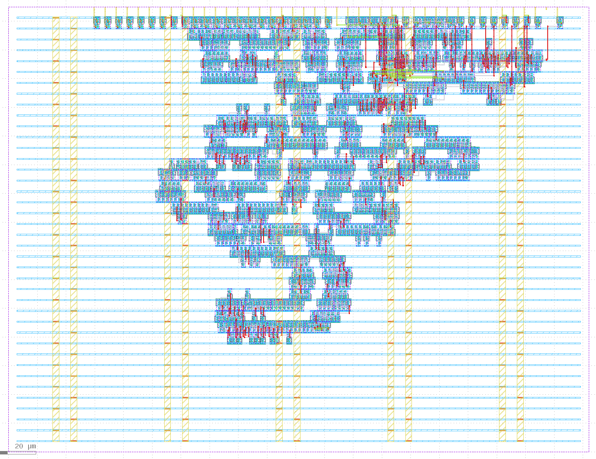
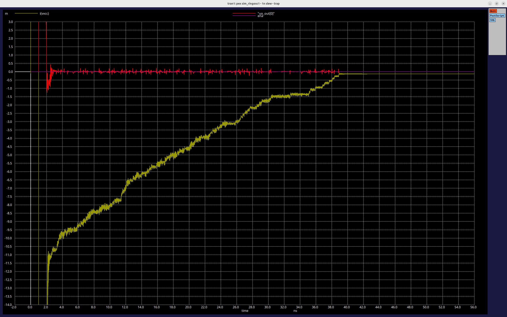
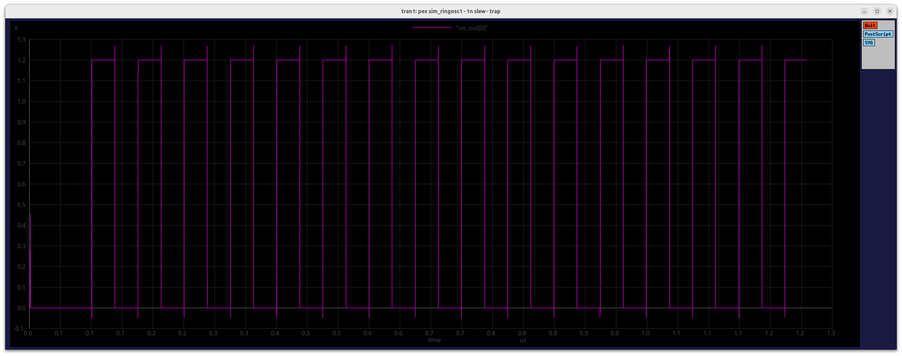

# 11 Apr 2025

| Previous journal: | Next journal: |
|-|-|
| [**0230**-2025-04-09.md](./0230-2025-04-09.md) | [**0232**-2025-09-28.md](./0232-2025-09-28.md) |

# TT06 auto demo; IHP "Antonalog" DAC & ring osc DAC + sim; TTCAD25a & RBZ update notes

> [!NOTE]
> This journal entry is less refined than my usual work. It has lots of different project updates in it that are unfinished, as a lot of stuff was going on.


# tt07-raybox-zero "game" demo

...

# Testing the new registers

*   Hold down any of 6, 7, 8, 9 keys when using mouse wheel to adjust TEXADD registers:
    *   (Or hold down 0 to adjust all of them at the same time)
    *   With no modifiers, offset 1 (1 pixel)
    *   ALT: offset 64 (1 line)
    *   SHIFT: offset 8192 (2 tiles, i.e. change wall type while retaining 'side')
    *   CTRL: offset 262,144 (1 "variant")
    *   CTRL+SHIFT: offset 1,048,576 (4 "variants", i.e. 1 "flash step")
    *   <kbd>-</kbd> to set all to 0
    *   Need a way in software to cap SPI address wrap-around?

# TT06 auto demo

I want my TT06 Grab Bag analog VGA demo to run by default at power-on. Here are the steps I went through to figure out how to set it up that way...

1.  Install "mpremote": `sudo apt install micropython-mpremote`
2.  List files on the RP2040's flash: `mpremote a0 ls`
3.  Dump `config.ini`: `mpremote a0 cat config.ini > tt06-config.ini`
4.  OK, this config file appears identical to the [standard tt-micropython-firmware version](https://github.com/TinyTapeout/tt-micropython-firmware/blob/main/src/config.ini)
5.  Directly editing `config.ini` in the firmware is possible: `EDITOR=vim mpremote a0 edit config.ini`
6.  I added this section:
    ```ini
    [tt_um_algofoogle_tt06_grab_bag]
    mode = ASIC_RP_CONTROL
    clock_frequency = 25e6
    ui_in = 0b00110000
    uio_oe_pico = 0
    ```
    ...and I changed the `project` in the `[DEFAULT]` section:
    ```ini
    #project = tt_um_factory_test
    project = tt_um_algofoogle_tt06_grab_bag
    ```
    NOTE: Don't want "`start_in_reset = yes`" because that seems to just hold the design in reset, and I think it gets reset by selection anyway.
7.  ...TBC...


# Updates to be done, projects to work on

*   Extract & sim IHP ring osc
*   Start work on IHP July project -- look at rules/preferences. Consider htfab dithering: https://github.com/htfab/ttihp0p2-demo-vgafun/blob/main/src/wrapper.v
*   Read all IHP PDK doco (not just DRC)
*   Harald's IHP analog guide
*   Testing notes and op-amp schematic for TTIHP0p3 -- make the board and send it to TT team in advance. Don't neglect the other 2 designs, also!
*   Select parts to order from DigiKey, Mouser, or LCSC
*   Verilator sim of TTIHP0p3 digital block
*   Full-circuit sim of TTIHP0p3 design -- what to do about rhigh extraction? Will it work anyway?
*   Learn layout, DRC, and LVS in KLayout
*   Talk to ChatGPT about operations that would work well with a fast ring osc instead of deep combo logic. What's the benefit? Is it speed, accuracy, or logic density?
*   Read Netgen LVS guide
*   Go thru Siliwiz tutorial: https://tinytapeout.com/siliwiz/
*   Make an IHP inverter
*   Journal updates, inc. where tt10-vga-dac-party stopped (obstructions, pinout DEF, and funky lava lamp art) & starting new job
*   PAL TV out with Analog Discovery 3


# Full-circuit simulation of Antonalog layouts

First install VSCode SPICE extension. Which one? I'm going with `xuanli.spice` (last updated 2020).

Let's start with `r2r_dac.mag`.

```bash
pushd ~/projects/antonalog--REPO/magic
pdk ihp
make r2r_dac.sim.spice
```

Seems OK; ports correctly identified and `r2r_dac.sim.spice` generated:

```spice
* NGSPICE file created from r2r_dac_parax.ext - technology: ihp-sg13g2

.subckt r2r_dac_parax IN[0] IN[1] IN[2] IN[3] IN[4] IN[5] IN[6] IN[7] OUT GND
X0 IN[3].t0 wi3 rhigh l=6u w=1u
X1 wJ5 wi5 rhigh l=6u w=1u
X2 wJ1 wJ0 rhigh l=6u w=1u
X3 wJ5 wJ6 rhigh l=6u w=1u
X4 wg0 GND.t0 rhigh l=6u w=1u
X5 wi0 wJ0 rhigh l=6u w=1u
...
R0 IN[3] IN[3].t0 5.05324
R1 GND GND.t0 5.03325
R2 IN[4] IN[4].t0 5.05324
R3 OUT.n0 OUT.t0 5.19036
R4 OUT.n0 OUT.t1 5.0005
R5 OUT OUT.n0 0.0532397
R6 IN[1] IN[1].t0 5.05324
R7 IN[0] IN[0].t0 5.05324
R8 IN[5] IN[5].t0 5.05324
R9 IN[7] IN[7].t0 5.05324
R10 IN[2] IN[2].t0 5.05324
R11 IN[6] IN[6].t0 5.05324
C0 a_n1828_n720# wi0 0.0454f
C1 a_n1828_n720# wJ0 0.13277f
C2 IN[3] wJ3 0.21494f
C3 a_1952_n720# wJ6 0.00468f
C4 wJ1 a_n1576_n720# 0.06789f
C5 a_3212_n720# wi7 0.04606f
C6 wJ3 a_440_n720# 0.13277f
C7 a_1448_n720# a_1196_n720# 0.29305f
C8 wJ2 wJ1 0.00581f
C9 wJ2 IN[2] 0.21494f
C10 wJ3 a_n316_n720# 0.00468f
C11 wi6 a_2708_n720# 0.0454f
C12 wi6 a_2456_n720# 0.0454f
C13 wi4 a_1196_n720# 0.0454f
C14 wJ6 IN[6] 0.21494f
...
C204 a_n1324_n720# GND 0.67141f $ **FLOATING
C205 a_n1576_n720# GND 0.67281f $ **FLOATING
C206 wJ1 GND 0.54094f
C207 a_n1828_n720# GND 0.67474f $ **FLOATING
C208 a_n2080_n720# GND 0.67932f $ **FLOATING
C209 wi0 GND 0.31577f
C210 wJ0 GND 0.62584f
C211 a_n2332_n720# GND 0.69982f $ **FLOATING
C212 a_n2584_n720# GND 1.12317f $ **FLOATING
C213 wg0 GND 0.42845f
.ends
```

Not sure what those `$ **FLOATING` comments are all about.

So, the model is called `r2r_dac_parax`. In simulation, it will also need an `rhigh` model.

# PEX and simulation of my TTIHP25a ring oscillator

The accepted OAS is here: https://github.com/TinyTapeout/tinytapeout-ihp-25a/blob/main/projects/tt_um_algofoogle_tt09_ring_osc/tt_um_algofoogle_tt09_ring_osc.oas

The accepted **GDS** (which we need for extraction) is here: https://github.com/TinyTapeout/tinytapeout-ihp-25a/blob/main/projects/tt_um_algofoogle_tt09_ring_osc/tt_um_algofoogle_tt09_ring_osc.gds

This is how the layout looks with decap/filler cells hidden:



Source is [here (TT copy)](https://github.com/TinyTapeout/tt09-ttihp25a-reharden/tree/main/hdl/tt_um_algofoogle_tt09_ring_osc) and [here (my original copy, as though it was for TT09 on sky130)](https://github.com/algofoogle/tt09-ring-osc). Note that the TT copy for TTIHP25a [respects the `ena` signal](https://github.com/TinyTapeout/tt09-ttihp25a-reharden/blob/cfa0e6adf57c4bb4c5f6ec924ec0cc5bfb1fdfe2/hdl/tt_um_algofoogle_tt09_ring_osc/src/project.v#L20).

NOTE: 

```bash
cd ~/projects/ihp-ring-osc-1-sim
cp ~/Downloads/tt_um_algofoogle_tt09_ring_osc.gds .
```

Create `pexgds.tcl`:

```tcl
# Parasitic EXtraction of GDS, for simulation.
# Call it like this:
#   magic -noconsole -dnull pexgds.tcl {project_name} {output_name} {rtol} {cthresh}
# For example:
#   magic -noconsole -dnull pexgds.tcl mylayout myextraction 10 0
# ...reads mylayout.gds, writes myexraction.sim.spice

set cthresh [lindex $argv $argc-1]
set rtol    [lindex $argv $argc-2]
set outname [lindex $argv $argc-3]
set project [lindex $argv $argc-4]
echo pexgds project: $project
echo pexgds outname: $outname
echo pexgds rtol: $rtol
echo pexgds cthresh: $cthresh
gds read $project.gds
load $project
flatten flat_$project
load flat_$project
select top cell
cellname delete $project
cellname rename flat_$project ${project}_pex
extract all
ext2sim labels on
ext2sim
extresist tolerance $rtol
extresist
ext2spice lvs
ext2spice cthresh $cthresh
ext2spice extresist on
ext2spice -o $outname.sim.spice
quit -noprompt
```

Helper script, `extract.sh`:

```bash
#!/bin/bash

echo "$(date): Starting"
export project=$(basename "$1" .gds)
export outfile=${2:-$project}
export rtol=${3:-10}
export cthresh=${4:-0}
echo "PEX for: $project: $1 => $outfile.sim.spice"
export MAGICRC="-rcfile $PDK_ROOT/$PDK/libs.tech/magic/$PDK.magicrc"
magic $MAGICRC -noconsole -dnull pexgds.tcl $project $outfile $rtol $cthresh
ls -al $outfile.sim.spice
echo "$(date): DONE"
```

Then:

```bash
chmod 755 extract.sh
./extract.sh tt_um_algofoogle_tt09_ring_osc.gds
```

Produces this pretty quick:

```
-rw-rw-r-- 1 anton anton 5.6M Jun  4 22:00 tt_um_algofoogle_tt09_ring_osc.sim.spice
```

Ports list (when formatted nicely):

```spice
.subckt tt_um_algofoogle_tt09_ring_osc_pex
+ VGND VPWR 
+ clk ena rst_n
+   ui_in[0]   ui_in[1]   ui_in[2]   ui_in[3]   ui_in[4]   ui_in[5]   ui_in[6]   ui_in[7]
+  uio_in[0]  uio_in[1]  uio_in[2]  uio_in[3]  uio_in[4]  uio_in[5]  uio_in[6]  uio_in[7]
+  uio_oe[0]  uio_oe[1]  uio_oe[2]  uio_oe[3]  uio_oe[4]  uio_oe[5]  uio_oe[6]  uio_oe[7]
+ uio_out[0] uio_out[1] uio_out[2] uio_out[3] uio_out[4] uio_out[5] uio_out[6] uio_out[7]
+  uo_out[0]  uo_out[1]  uo_out[2]  uo_out[3]  uo_out[4]  uo_out[5]  uo_out[6]  uo_out[7]
```

I also copied the GDS to `tt_um_algofoogle_tt09_ring_osc_trimmed.gds` and edited in KLayout:
*   Cleared most of the interior out of the decap and fill cells.
*   Renamed the top cell to `tt_um_algofoogle_tt09_ring_osc_trimmed`

The aim is to make a layout that still extracts a complete circuit, but with far less "junk" PEX so it can be simulated faster:

```bash
./extract.sh tt_um_algofoogle_tt09_ring_osc_trimmed.gds
```

Result:

```
-rw-rw-r-- 1 anton anton 2.4M Jun  4 22:26 tt_um_algofoogle_tt09_ring_osc_trimmed.sim.spice
```

Sim seems to work with 10ps step, and ring oscillates with about a 74.6ns period (~13.405MHz). Had to make sure `ena` was held low long enough; test configured for 100ns, but it looks like about 40ns is enough (actually, probably half the ring period, so about 37ns after power-up):



I think this makes sense:
*   As the circuit powers up, all of the ring's inverters are in random states...
*   ...and they start to react to their inputs, while their inputs are coming from other inverters also in random states.
*   There's a lot of switching/propagation during this time, leading to high current.
*   While `ena` is held low, the AND gate at the start of the ring holds the first inverter low (regardless of what's coming back from the end of the ring).
*   Hence, a low signal starts to propagate through the ring (which at this point is just a 'chain'), and each inverter in turn starts to stabilise. Thus, the current peters out.
*   When the whole chain is stable, switching `ena` high should allow the output high to feed back in, and then propagate normally through the ring.
*   If the initial `ena==0` state isn't present long enough, the initial randomness in the ring will flow through rapidly, and back into the first inverter, then continue mostly endlessly.

Oscillations are very regular:




## Next try: ringosc3

https://github.com/TinyTapeout/tt09-ttihp25a-reharden/blob/main/hdl/tt_um_algofoogle_tt09_ring_osc3/src/project.v

Steps:
*   Download [GDS](https://github.com/TinyTapeout/tinytapeout-ihp-25a/blob/main/projects/tt_um_algofoogle_tt09_ring_osc3/tt_um_algofoogle_tt09_ring_osc3.gds)
*   Edit to fix `tiehi` cells (copy from Antonalog `_fixed` version?)
*   Optionally edit to simplify decap/fill cells
*   `./extract.sh tt_um_algofoogle_tt09_ring_osc3_trimfix.gds`
*   Tidy up SPICE ports -- consider adding ports for other nets of interest (e.g. [y](https://github.com/TinyTapeout/tt09-ttihp25a-reharden/blob/cfa0e6adf57c4bb4c5f6ec924ec0cc5bfb1fdfe2/hdl/tt_um_algofoogle_tt09_ring_osc3/src/ring_osc.v#L66), [b0 and b1](https://github.com/TinyTapeout/tt09-ttihp25a-reharden/blob/cfa0e6adf57c4bb4c5f6ec924ec0cc5bfb1fdfe2/hdl/tt_um_algofoogle_tt09_ring_osc3/src/ring_osc.v#L57)).
*   Modify TB SPICE:
    *   Keep asserted: `ui_in[2:0]` = `0b101` ([tap #5 => 101 inverters](https://github.com/TinyTapeout/tt09-ttihp25a-reharden/blob/cfa0e6adf57c4bb4c5f6ec924ec0cc5bfb1fdfe2/hdl/tt_um_algofoogle_tt09_ring_osc3/src/ring_osc.v#L71), should be about 133MHz when activated).
    *   Hold `ena` low for maybe 20ns? As little as 4ns is probably enough. Mind you, the chain still carries out to 1001, so give it maybe 50ns to flush everything.
    *   Once it starts oscillating (on `uo_out[0]`), expect `uo_out[7:1]` to count: `uo_out[7]` should be about 133/128 => 1.04MHz
    *   NOTE: There is no reset, so the counter registers will start up random.


# tmux grid layout

```bash
tmux new-session \;   split-window -h \; split-window -h \; split-window -h \;  split-window -h \;  split-window -h \; select-layout even-horizontal \; split-window -h \; split-window -h \; split-window -h \; split-window -h \; split-window -h \; select-layout even-horizontal \; split-window -h \; select-layout tiled \;
```

# Preparing TTCAD25a submission

## Outstanding

*   Change map overlay to use RGB111 primaries.
*   Rework SPI CMD to support way more commands (thus extended TEXADDs) -- also, 1 bit can mean 'immediate' (can it be per-reg, to avoid loading them ALL immediately, or is that OK anyway?)
*   Add extra TEXADDs; each should be a light/dark pair now? That's LOTS more registers, though.
    *   shifted_wall_id and texadd references.
*   Check whether there were any innovations accompanying Wishbone reg access.
*   Edge blanking
*   Flip rendering (or configurable)
*   Doors -- NOTE: Door open/close is easy (?) because it is just a ray test with texu -- SO LONG AS texu can be known 
*   Update masthead/GitHub title card.


## OLD

*   Map rectangle blanking/outlining
*   Reconcile version of https://github.com/algofoogle/raybox-zero/commit/75661804469ab4debb86ada888d302e14894f021 -- Should it be called 1.7? Did something come after?
*   Was the local code modified?
*   Do we need to fiddle with rbz_options.v?
*   Make sure port assignment is OK -- we'd want combo SPI on ui_in, to avoid clash with Tiny QSPI. Make sure Tiny QSPI pinout is good too.
*   Prove TT-level tests can be run.
*   Make sure hardening works for TT10 GHA flow (locally).
*   WB writes code could be a basis for byte-level writes too that can coexist with SPI writes.
*   Modify port mapping behaviour so that when ui[7] (tex_pmod_type) ==0:
    *   gen_texb is forced off (so no resistor mod is needed for uio[5] -- since during texture RENDERING, io3 is floating for most of it).
    *   uio[7:6] are driven high by the design, to ensure the unused memories don't activate.
*   BACKFACE CULLING ALREADY implemented? Check that.

Extra projects:
*   Ringosc-worker with ring reset (flush, without ena)


# raybox-zero improvement ideas:

*   Load regs at reset, if a given pin is strapped
*   Angular rotation reg that calculates vectors using "slow sine" in VBLANK and writes to POV
*   Pin to select between "tradeshow" demo mode (with Controller PMOD) and advanced register/interface slave mode.
*   QSPI/QPI ROM Verilog model that works with Verilator... OR fix the `W25Q128JVxIM.v` model to have a flag for sensing in `task`s when to do a `disable` breakout.
*   Advanced map QPI ROM using octant data packing


Make WAITS configurable

Could create an effect where the underlying wall block (beneath a door) can be revealed as the door slides... and either be anchored or slide with it.

Support door pos == 64 (fully open) and maybe even negative numbers?

Support finer resolution on door slides.

Fix player-in-door-cell situation of door frame disappearing.

Make the door regs specify a 3 bit wall ID, but always treat it as 4'b1xxx -- i.e. specifying 0 is actually wall ID 8. NOTE: Should '0' (8) actually be the door frame? Need a way to enable/disable texadd via the existing 8 regs (rather than adding more).

"Narrow" door frames (i.e. only partially cover up the underlying texture). Could even use a 'pos' register to allow it to scale in/out => leading to another possible visual hack. Might also benefit from supporting a "max door" flag; maybe that's just when door_pos==255?

"Leak flip"? Right now, leak was designed to come from the bottom of the rotated screen (like water), but with a clockwise-rotated monitor it actually can only (?) come from the top?? Maybe not entirely true if using VSHIFT, but still would be good to support both.

Shorthand to just set door pos without the other two bytes of payload -- maybe shorthands for other commands, too?

Map overlay improvements:
*   Show door_pos as 'bar graph'
*   Player+facing vector dot, maybe also vplane +/-

Flexibility in door/frame textures:
*   If door reg wall ID is 0, use underlying wall cell ID, and apply TEXADD **IF** the reserved bit is set:
    *   Might work better if there's a global enable/disable for TEXADD on the map.
    *   0: "red"
    *   1-7: All other walls
    *   OR: Always add 0b10000 to the underlying wall ID, to ensure it gets a different 
*   Otherwise, if door reg wall ID is 1-7, then add 0b01000
*   What about the door frame? Any way to control which door frame we get? Maybe each door gets its own frame (so they're textured in pairs)

NEED DEFAULT DOOR PLACEMENTS FOR DEMO MODE(S)!

Need to fix map overlay rendering to make sure it matches the order of our door/wall resolver now -- in fact, map_overlay needs knowledge of wall_id_resolver.

Search for "@@@".
Also fix up all places where USE_DOORS is needed.

To support texture "flashes" (bright or otherwise tinted versions matching master's environment effects), we'd need to support maybe a 'global' TEXADD, which works for door frames too.

What's the rationale for not coupling TEXADDs between doors and their respective frames? Is that actually a good idea still?

If full 32x32 map lookup via SPI is too hard, we could still do an 8x8 bitmap (64 regs) that can be relocated, and hits within it can resolve to SPI map lookups (with the SPI state preloaded and ready for address). This can then be a moving window. Loading those 64 bits could be tricky via SPI slave, so if necessary they can be given by a specified address (in spi_reg) and then auto-read during VBLANK... maybe even with spi_regs that specify the pitch/stride within a larger map region on the SPI ROM.

SPRITES:
*   https://lodev.org/cgtutor/raycasting3.html
*   With sprites, it might be possible to do all their calculations during VBLANK, since we only need to know where their centre lines are positioned in the current camera projection (i.e. I think we use facing and vplane, but not each individual ray?) -- so long as the camera POV is known (i.e. update-ticked) at the start of VBLANK rather than the end, then we have heaps of time to do our sprite calculations:
    *   525-480 = 45 lines, so 36,000 clocks.
    *   Calculation for each sprite requires:
        *   Excluding sprites which are behind us or wildly (?) out of view
        *   Depth-sorting: Could be done using transformY (Z-depth) after camera inverse transforms
        *   Calculating current view determinant: `vplaneX*facingY-vplaneY*facingX` -- with shmul, this will take probably 3-12 clocks?
        *   Calculating the inverse determinant: reciprocal of the above determinant -- will take up to 8 clocks?
        *   Per each sprite:
            *   Calculate:
                *   a = facingY*relSpriteX
                *   b = facingX*relSpriteY
                *   tx = invDet * (a-b)
                *   c = vplaneY*relSpriteX
                *   d = vplaneX*relSpriteY
                *   ty = invDet * (d-c)
                *   Sprite height reciprocal and drawing step??
    *   NOTE: I think our current wall_tracer assumes it can start tracing early?? Could clash? Need to check.

Simple inline texture ideas:
*   TT logo
*   Foogle logo
*   Wood panelling
*   Blue bricks with: some grey, red, or brown variants; picture frame with abstract art (simple landscape)
*   Pipes
*   Window
*   Office hallway


RBZ GAME CHALLENGE:
*   Fast "make csr" sim by using Q10.10 or even Q9.9
*   Features:
    *   Go "underground" (ceiling change after walking to a wall/door)
    *   Tint via TEXADD
    *   Warped vplane (wobble/stretch/zoomFOV) inc. shooting, teleporting, death
    *   Sliding (game state momentum)
    *   Bobbing
    *   Doors that open vs. disappear vs. just create an alcove
    *   Changing floor/ceiling colours for effect
    *   Marquee
    *   Map size faking with rect+door leading to seamless relocation
    *   Multiple map patterns
