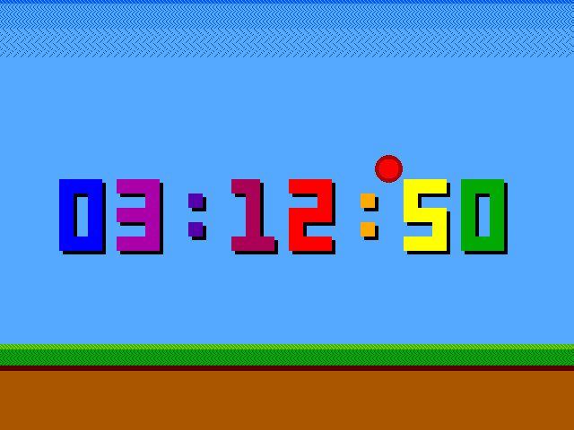
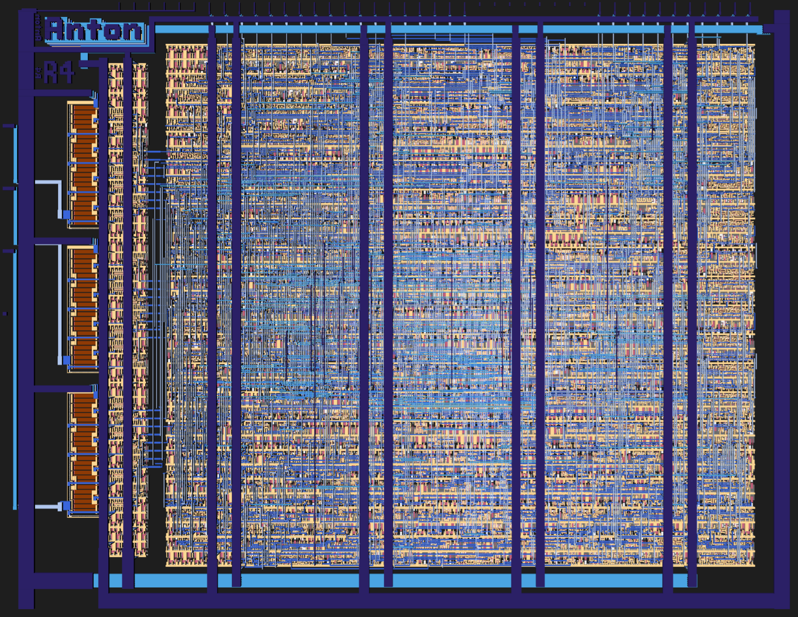
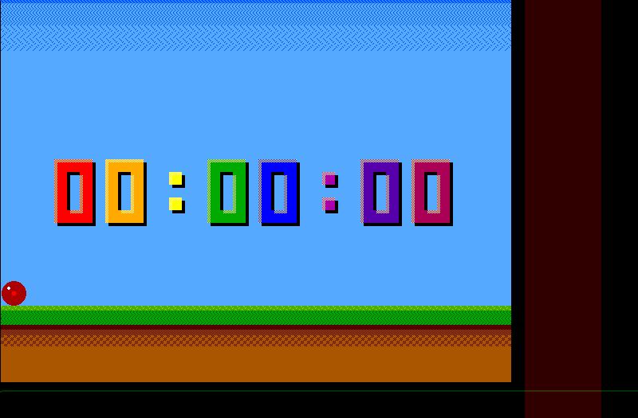
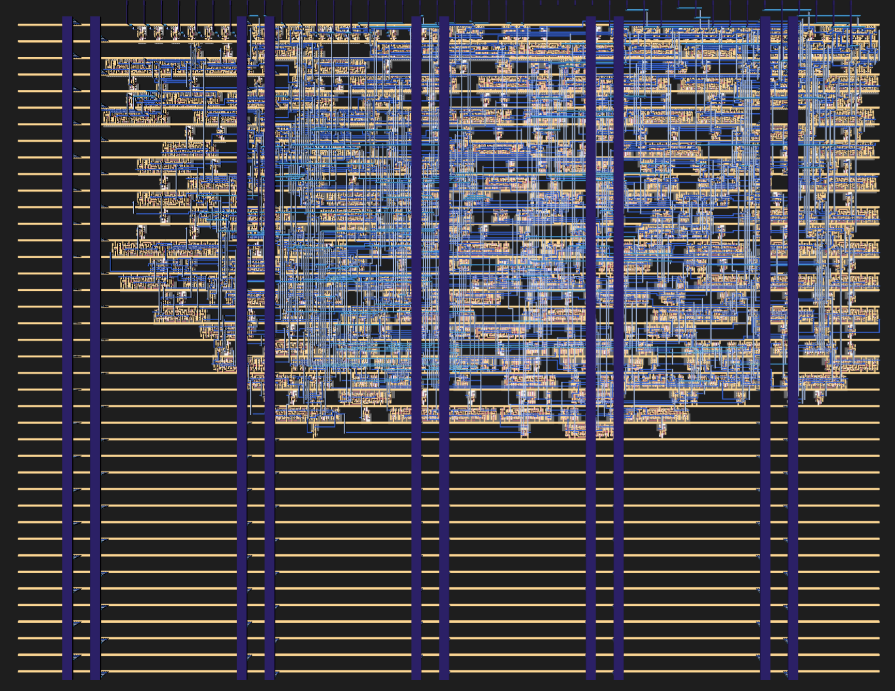

# 28 Sep 2025

| Previous journal: | Next journal: |
|-|-|
| [**0231**-2025-04-11.md](./0231-2025-04-11.md) | *Next journal TBA* |

# Tiny Tapeouts from June to September

I've missed lots of updates since the last ([0231](./0231-2025-04-11.md), which covers stuff from April 2025 to June 2025), as I've been very busy. I can't remember everything, but here's an attempt to summarise important things (some of which is already covered in my prior update)...

There was life stuff:
*   Started a new job (ASTC)
*   New baby born
*   MANY birthdays to celebrate

Then projects...

### TTCAD25a

**[ttcad25a-raybox-zero](https://github.com/algofoogle/ttcad25a-raybox-zero)** was my TTCAD25a sky130 resubmission of ttihp0p2-raybox-zero (an updated version of tt07-raybox-zero).

As I understand this was sponsored by Tim Edwards, and submitted on the Cadence sky130 shuttle run. I think it was considered somewhat experimental, and may not be released to the public.

NOTE: I did a lot more work on this and the [raybox-zero repo](https://github.com/algofoogle/raybox-zero) after submission, in particular on the `doors` branch, to work on other improvements but especially to implement sliding doors. More to come on this, later.

### TTIHP25a

**[ttihp25a-tt10-vga](https://github.com/algofoogle/ttihp25a-tt10-vga)** is "A Tiny Tapeout Verilog project based on Matt Venn's VGA Clock":

**I also had 3 other ring oscillator projects on this shuttle** which were originally intended for TT09:
*   **[tt09-ring-osc](https://github.com/algofoogle/tt09-ring-osc)** ([submission](https://github.com/TinyTapeout/tinytapeout-ihp-25a/tree/main/projects/tt_um_algofoogle_tt09_ring_osc)): Simple fixed ring oscillator made of 1001 inverters.
*   **[tt09-ring-osc2](https://github.com/algofoogle/tt09-ring-osc2)** ([submission](https://github.com/TinyTapeout/tinytapeout-ihp-25a/tree/main/projects/tt_um_algofoogle_tt09_ring_osc2)): 4 ring oscillators of different lengths, with some PWM experiments.
*   **[tt09-ring-osc3](https://github.com/algofoogle/tt09-ring-osc3)** ([submission](https://github.com/TinyTapeout/tinytapeout-ihp-25a/tree/main/projects/tt_um_algofoogle_tt09_ring_osc3)): Ring oscillator that can be tapped at different lengths for different speeds, with a counter for dividing down to different rates.

### TTIHP0p3 submissions

This was an experimental TT IHP shuttle that I had a few projects on...

**[ttihp0p3-antonalog](https://github.com/algofoogle/ttihp0p3-antonalog)**:
*   VGA test pattern generator borrowing from my TT08 design, but using R2R DACs (where R=8660) more like what I did on TT06.
*   Prior to submission I couldn't get LVS to complete due to oddities in the PDK, but I later managed to work around this and get it to pass (as I recall) by adding explicit interconnects in the `sg13g2_tiehi` cell's GDS. This has apparently been addressed in later versions of the PDK.
*   There was also an issue with `rhigh` where htamas and I were both missing an important layer (or we weren't sizing/expanding it correctly, possibly due to behaviour of Magic at the time). We managed to fix this at the last minute.

**[ttihp0p3-fun-vga-clock](https://github.com/algofoogle/ttihp0p3-fun-vga-clock)**: A prettier revision of the VGA clock I submitted on TTIHP25a:

**[ttihp0p3-ring-worker](https://github.com/algofoogle/ttihp0p3-ring-worker)**: An attempt to implement a ring oscillator that drives a "worker" that performs some sequential operation in its own time. In this case, the "worker" is just a simple counter with a few different options, to prove the concept.

### TTIHP25b

I didn't have anything on this shuttle.

