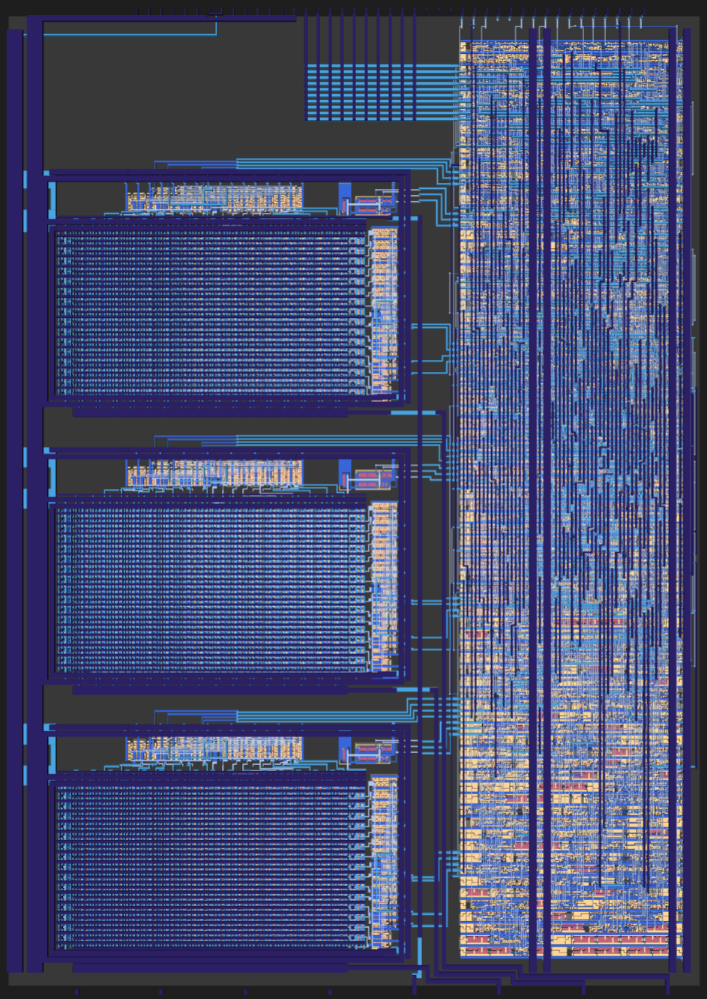
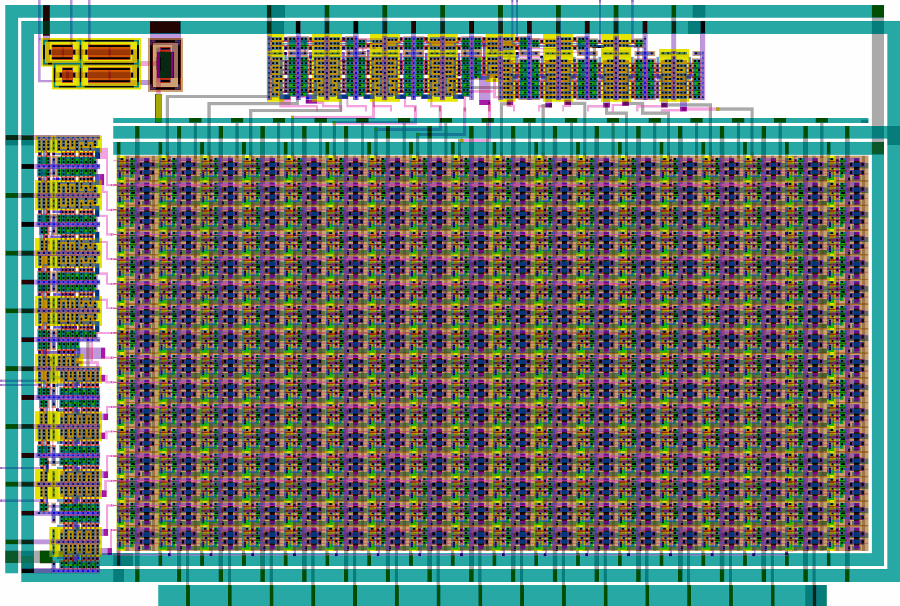

# 28 Sep 2025

| Previous journal: | Next journal: |
|-|-|
| [**0232**-2025-09-28.md](./0232-2025-09-28.md) | [**0234**-2025-11-11.md](./0234-2025-11-11.md) |

# ttsky25a-vga-matrix-dac

My submission to TTSKY25a was [ttsky25a-vga-matrix-dac](https://github.com/algofoogle/ttsky25a-vga-matrix-dac) which is a continuation of my mixed-signal experimental DAC designs that are intended to drive VGA displays.

This project uses the same digital controller Verilog as [my TT08 version](https://github.com/algofoogle/tt08-vga-fun), and a new current-switching matrix DAC design:

The aspects of this design are:
*   8-bit input code is split into two 4-bit values.
*   4 MSBs are then encoded as an active-low thermometer code, controlling activation of 16 rows.
*   4 LSBs are likewise encoded to control activation of 16 columns.
*   This controls a 16x16 matrix of "unit" current sink cells.
*   Each current sink cell has a 5V-tolerant current sink NFET and a tiny bit of digital logic that in turn switches another NFET on or off, to connect/disconnect the current sink NFET to the rest of the current sink node.
*   A "Vbias" circuit has a binary-weighted current reference (implemented with PFETs) and is controlled with a 3-bit binary code to select 1 of 8 possible reference currents that in turn yield a bias voltage that goes to all of the unit current sink cells.
*   A "dummy" cell appears as an extra column at the start and end of each row for better symmetry in fabrication, though there are no dummy rows also in this version.

The overall TT layout has 3 instances of this DAC (RGB), and the Red DAC's Vbias line is exposed externally as the `ua[3]` analog pin. To a degree, this allows it to be monitored, or influenced (but it is expected to suffer much stronger parasitics as a result).

More to come:
*   Why the DAC is designed this way (besides this just being a learning exercise).
*   Simulation.
*   Things I'd change.
*   How the layout was done (inc. current cell layering, PnR/pin config, thermo encoders using standard cells).
*   Row-change glitches and mitigation.
*   External circuit considerations.
