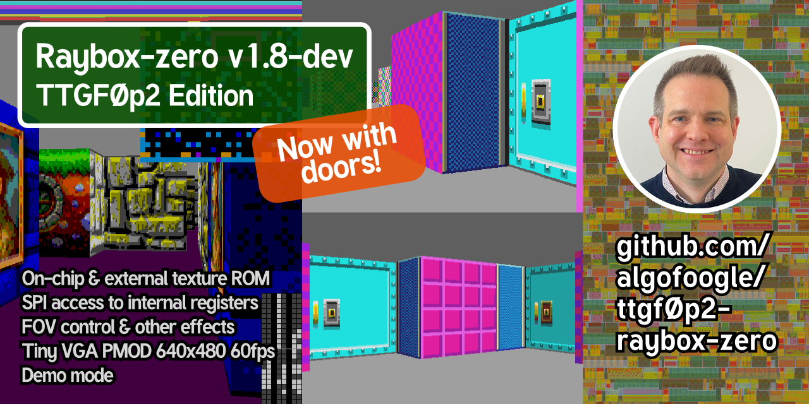
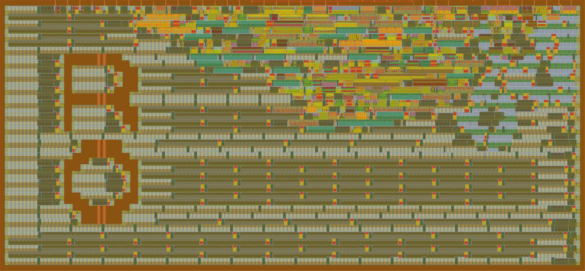

# 25 Nov 2026

| Previous journal: | Next journal: |
|-|-|
| [**0234**-2025-11-11.md](./0234-2025-11-11.md) | *Next journal TBA* |

# ttgf0p2 submissions

This is a quick note about 2 submissions I made to the experimental TTGF0p2 shuttle using the https://wafer.space gf180mcuD PDK.

This particular TT shuttle only allowed digital designs to be submitted, and they had to be generated using the LibreLane-based GitHub Actions provided by the TT team.

## raybox-zero TTGF0p2 edition

Documentation still needs to be fleshed out a bit at https://tinytapeout.com/chips/ttgf0p2/tt_um_algofoogle_raybox_zero for my [ttgf0p2-raybox-zero](https://github.com/algofoogle/ttgf0p2-raybox-zero) version of [raybox-zero](https://github.com/algofoogle/raybox-zero) (specifically the [`doors` branch](https://github.com/algofoogle/raybox-zero/tree/doors) at the time of writing).

I do have some additional work on my system that I was doing on raybox-zero at the time I had to pivot and work on this submission, but generally this version successfully implements doors with built-in door and frame textures, and [is configured](https://github.com/algofoogle/ttgf0p2-raybox-zero/blob/e970ffb25714b76fddfa19c0add7e5405de5c3a3/src/rbz_options.v) to use all typical features including external textures support, Q11.11 fixed-point maths, while also adding configurable `WAITS` to the `reciprocal_fsm` (defaults to 7 at reset, can be set with SPI [`CMD_TRCTRL`](https://github.com/algofoogle/raybox-zero/blob/68b1051df702b0be50cec0680ced8c8eb4e5bc3f/src/rtl/spi_registers.v#L151)).

Note that in order to get this to harden successfully, I had to:
*   Hack the SDC to [completely ignore timing](https://github.com/algofoogle/ttgf0p2-raybox-zero/blob/e970ffb25714b76fddfa19c0add7e5405de5c3a3/src/raybox_zero.sdc#L88) through the `reciprocal_fsm`, since its combinatorial logic is deliberately made "safe" by the configurable `WAITS`.
    *   Note that this might be the wrong way to get timing right for this purpose: It might be better to use a dedicated *synthesis* SDC file that does a false path *only* on the combinatorial part (rather than the whole sequential-logic module), and then a separate *signoff* SDC that doesn't care about this (since optimisation will cause the respective path to potentially be renamed or otherwise eliminated, leading to an STA warning or error). In addition, *or* instead, a `(* keep *)` marker might help to apply signoff STA checking to the path of interest.
*   Set up "design exploration", which I did manually by creating a bunch of `config.json` variants and getting each to harden (via separate LibreLane runs, executed in parallel) to find whichever passed (and ideally gave better results). The main (only?) parameter I varied was the density -- individual percentage points can lead to the difference between a passing or failing run, due to luck of the draw.
*   Apply a change retrospectively (per the request and advice of the TT team) to ensure antenna violations were fixed (as they were assumed to be allowed on the GF180 MPW, but it turns out they are *not*).

## Ring osc on VGA

Read more about this one: https://tinytapeout.com/chips/ttgf0p2/tt_um_algofoogle_vgaringosc

It was an attempt to create a ring oscillator that could be visualised (or at least, the effect of its "work" could be visualised) on a VGA display.

It has these basic options:
*   VGA display timing is driven by the typical `clk` source expected to be at (say) 25MHz.
*   You can set the input `vga_mode==1` in order to instead use timing that is compatible with a 1440x900 60Hz VGA display, given a 26.6175MHz clock.
*   For the "worker" that produces the pixel data of each VGA display line, it can be clocked by any of: `clk`; inverted `clk`; `altclk` (another TT input pin); a ring oscillator with variable tap points from 3 "`inv_2`" inverters up to 161; a fixed 5-stage `inv_1` ring oscillator; a fixed 5-stage `inv_4` ring oscillator.
*   Besides the on-screen effect, you should also be able to measure the selected oscillator output through div-1, div-2, div-4, and div-8 stages on `uio_out` pins 4 up to 7.

Note also that, as seen in the GDS rendering above, I also hacked in "art" (the "R" and "O") with a Python script that converts a simple pixel image to placement obstructions (that hence prevented standard cells from appearing in certain places) -- there are limitations to this, but this was good enough for me (since this TT shuttle didn't otherwise permit custom GDS).
