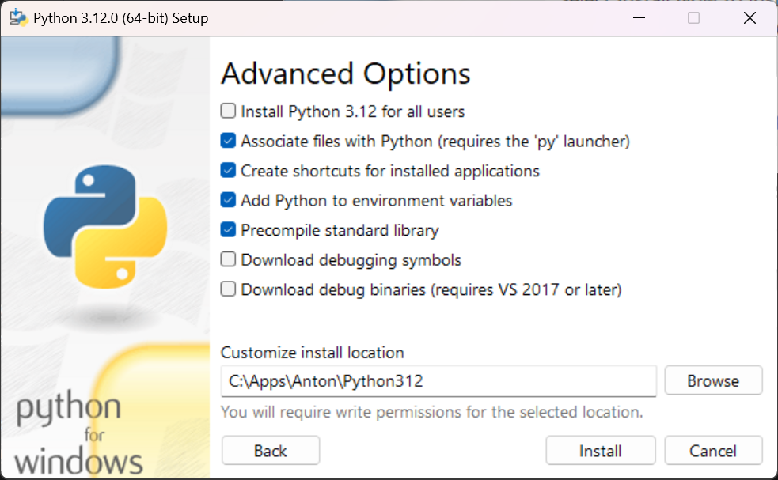
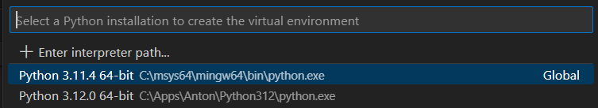
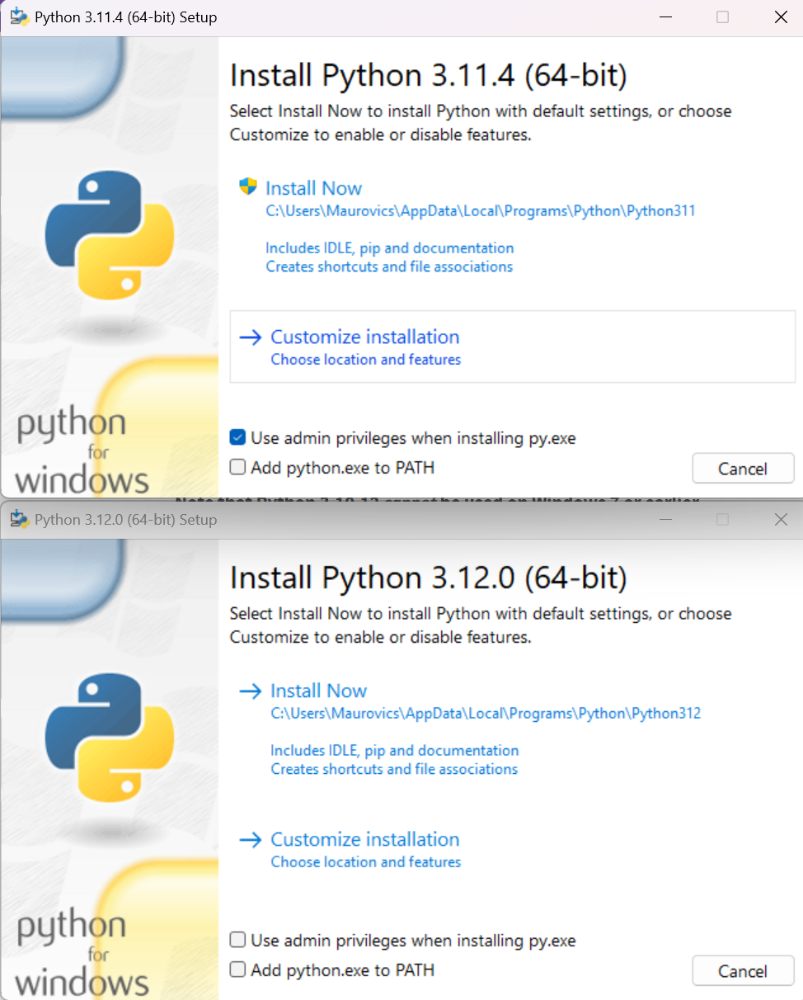

# Tip 2310A: Setting up Python on Windows with VSCode

## Steps

1.  If not installed yet, running `python` or `python3` in console opens the Microsoft Store. Ignore it.
2.  Go to https://www.python.org/downloads/windows/
3.  Check what is says is the 'Latest Python 3 Release' (for me: Python 3.12.0) and then look under 'Stable Releases' for the respective 64-bit installer download. For me, it is [this](https://www.python.org/ftp/python/3.12.0/python-3.12.0-amd64.exe).
4.  Launch the installer and tick both "Use admin privileges when installing py.exe" ([why?](#difference-between-3114-and-3120-installers)) and "Add python.exe to PATH".
5.  Click 'Customize Installation' (I want a different target path).
6.  **UNtick** 'for all users' (I want the option to have different users/configs on this PC) but tick everything else.
7.  Click 'Next', tick only the below options as shown, and change install location (`C:\Apps\Anton\Python312`):
    
    NOTE: Precompiled standard library files (or any `.pyc` bytecode file) simply [*loads* faster](https://stackoverflow.com/questions/16773362/why-is-the-running-of-pyc-files-not-faster-compared-to-py-files) (because it is already compiled), but [doesn't *run* any faster](https://docs.python.org/3/tutorial/modules.html#compiled-python-files).
8.  Click 'Install'.
9.  After it's installed, open a new console and run `py` which should drop into the Python REPL. NOTE:
    *   On Windows, CTRL+Z then ENTER to exit (CTRL+D on Linux). NOTE: You can also run `python` but not `python3`.
    *   PATH is not automatically updated within VSCode. Relaunch VSCode.
10. Go into a console (e.g. VSCode integrated terminal), then go into a folder that you want to contain a Python project, which might (for example) be a subdirectory of my `sandpit` repo.
11. Let's create a venv Python virtual environment:
    *   If you follow along with [Create a virtual environment](https://code.visualstudio.com/docs/python/python-tutorial#_create-a-virtual-environment), it applies it to the current workspace...? Actually it asks which top-level path you want to add it to in the workspace.
    *   Alternatively, you can use venv directly: `py -m venv .venv` -- but be aware that it would be a good idea to then also create `.venv/.gitignore` containing just `*`, i.e. exclude the entire `.venv` dir from your repo.
12. To activate the venv, in PowerShell run `.venv/Scripts/Activate.ps1` or in Command Prompt run `.venv/Scripts/activate.bat`
13. NOTE: If you have an existing `requirements.txt` file, maybe now is the time to run `py -m pip install -r requirements.txt`

[Getting Started with Python in VS Code]: https://code.visualstudio.com/docs/python/python-tutorial


## venv

*   venv is used for *creating* environments, e.g. `.venv/` folders with config.
*   To run venv itself: `py -m venv`
*   Within `.venv` there should be activation scripts and other executables. On Windows, these are found in `.venv/Scripts` and they include versions for Cygwin/MSYS, Command Prompt (batch file), and PowerShell. I think on Linux the subdir is `bin` instead of `Scripts`.
*   The main PowerShell activation script is `.venv/Scripts/Activate.ps1`. This can be run directly, but seems to launch on its own in an Integrated Terminal in VSCode. I think the VSCode Python extension will automatically detect when you are in a folder that belongs to a path containing a `.venv/` folder and will then run the activation script, e.g. it could be a directory where `.venv` is an immediate child, or it could be a directory where a parent directory includes a `.venv`. When it runs, hopefully `(.venv)` should add itself to the start of the shell prompt.
*   `.venv/.gitignore` automatically excludes the whole venv config from a git repo. This .gitignore might get created by the VSCode Python extension, though, as it wasn't created for me by running venv directly.

## Permission for the activation script in PowerShell

If you try to run `.venv/Scripts/Activate.ps1` (or you open a VSCode Integrated Terminal at a folder where there is a `.venv/`), you might see this warning when it tries to run the venv activation script:

```
PS C:\Users\Maurovics\Documents\projects\sandpit> & c:/Users/Maurovics/Documents/projects/sandpit/.venv/Scripts/Activate.ps1
& : File C:\Users\Maurovics\Documents\projects\sandpit\.venv\Scripts\Activate.ps1 cannot be loaded because running scripts is disabled on this system. For more information, see about_Execution_Policies at https:/go.microsoft.com/fwlink/?LinkID=135170.
At line:1 char:3
+ & c:/Users/Maurovics/Documents/projects/sandpit/.venv/Scripts/Activat ...
+   ~~~~~~~~~~~~~~~~~~~~~~~~~~~~~~~~~~~~~~~~~~~~~~~~~~~~~~~~~~~~~~~~~~~
    + CategoryInfo          : SecurityError: (:) [], PSSecurityException
    + FullyQualifiedErrorId : UnauthorizedAccess
PS C:\Users\Maurovics\Documents\projects\sandpit> 
```

It [directs you to this URL](https://go.microsoft.com/fwlink/?LinkID=135170) if you want to read it for more info. **TL;DR:** *EITHER* run this:

```ps
Set-ExecutionPolicy -Scope CurrentUser -ExecutionPolicy Unrestricted
```

*...OR* run this (which is referenced inside the Activate.ps1 script):

```ps
Set-ExecutionPolicy -Scope CurrentUser -ExecutionPolicy RemoteSigned
```

If you're in an Integrated Terminal, then relaunch it.


## Notes

*   Microsoft's [Getting Started with Python in VS Code] tutorial.
*   On Windows, `py -0` will list installed Python versions.
*   It's possible to run Python tools with `py -m`, e.g. `py -m pip --version` or `py -m venv --help` where pip might already be runnable as-is in the PATH without py, but venv might not be.
*   I already had Python 3.11.4 installed as part of MinGW64:
    
*   In VSCode, if you go to the Command Palette (CTRL+SHIFT+P) and search for 'Python: Select Interpreter', it lets you pick an interpreter per folder. You can also specify a workspace global one, which I think is just temporary for the current VSCode session...? It doesn't seem to be written anywhere. Also doesn't seem to affect integrated terminals launched... more just a VSCode local run-and-debug option?
*   [Official Python doco on setting up under Windows](https://docs.python.org/3.12/using/windows.html)


## Difference between 3.11.4 and 3.12.0 installers

Why is there a difference between the default options in the 3.11.4 and 3.12.0 installers when launched directly?



